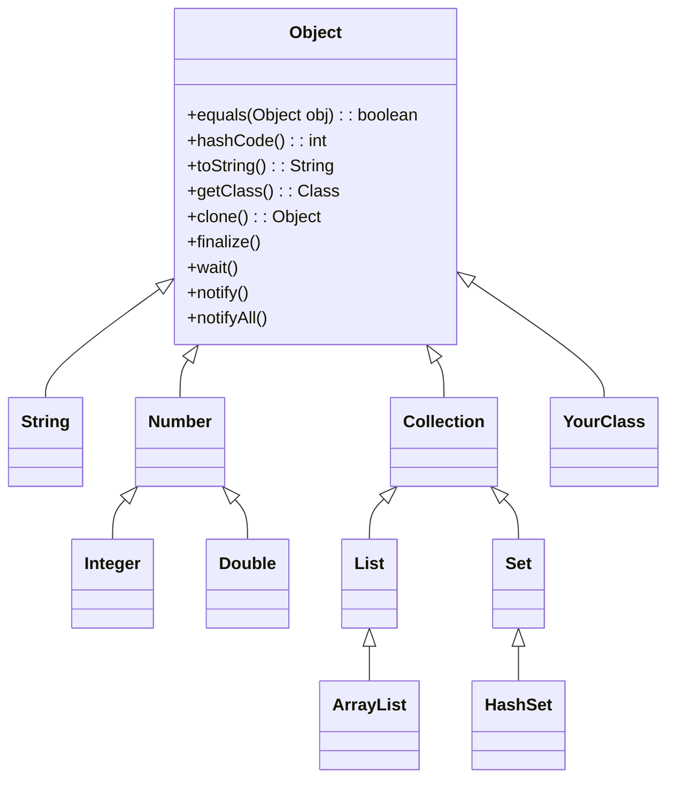

# The Java Object Class

## Introduction

In Java's object-oriented universe, one class stands above all others: the `Object` class. Located in the `java.lang` package, it serves as the ultimate parent (or superclass) of every class in Java. Whether you explicitly extend it or not, all Java classes inherit from `Object`.

This lesson explores the `Object` class, its significance in Java's inheritance hierarchy, and the essential methods that every Java object inherits. Understanding these fundamentals is crucial for mastering Java programming.

## The Root of Java's Class Hierarchy

In Java, when you create a class without explicitly extending another class, it implicitly extends the `Object` class:

```java
// The following two class declarations are equivalent
public class MyClass { }

// Same as:
public class MyClass extends Object { }
```

This automatic inheritance creates a unified type hierarchy in Java, ensuring every object shares certain fundamental behaviors.



## Key Methods of the Object Class

Let's explore the most important methods that all Java objects inherit:

### 1. equals() Method

The `equals()` method compares objects for equality. By default, it checks if two references point to the exact same object in memory.

```java
public boolean equals(Object obj)
```

**Default Implementation:**

```java
public class ObjectEqualsDemo {
    public static void main(String[] args) {
        String str1 = new String("Hello");
        String str2 = new String("Hello");
        
        // Uses default Object.equals() method
        System.out.println(str1 == str2);           // false (different objects)
        
        // Uses String's overridden equals() method
        System.out.println(str1.equals(str2));      // true (same content)
    }
}
```

**Output:**
```
false
true
```

**Custom Implementation:**

```java
public class Person {
    private String name;
    private int age;
    
    public Person(String name, int age) {
        this.name = name;
        this.age = age;
    }
    
    @Override
    public boolean equals(Object obj) {
        // Check if same reference
        if (this == obj) return true;
        
        // Check if null or different class
        if (obj == null || getClass() != obj.getClass()) return false;
        
        // Cast and compare fields
        Person person = (Person) obj;
        return age == person.age && 
               (name == null ? person.name == null : name.equals(person.name));
    }
}
```

### 2. hashCode() Method

The `hashCode()` method returns an integer hash code value for the object. This is essential for collections like `HashMap` and `HashSet`.

```java
public int hashCode()
```

**Important Rule:** If two objects are equal according to the `equals()` method, they must have the same hash code.

```java
public class HashCodeDemo {
    public static void main(String[] args) {
        String str1 = "Hello";
        String str2 = "Hello";
        
        System.out.println("str1 hashcode: " + str1.hashCode());
        System.out.println("str2 hashcode: " + str2.hashCode());
        System.out.println("Equal strings have equal hashcodes: " + (str1.hashCode() == str2.hashCode()));
    }
}
```

**Output:**
```
str1 hashcode: 69609650
str2 hashcode: 69609650
Equal strings have equal hashcodes: true
```

**Custom Implementation:**

```java
public class Person {
    private String name;
    private int age;
    
    // Constructor and other methods...
    
    @Override
    public int hashCode() {
        int result = name != null ? name.hashCode() : 0;
        result = 31 * result + age;
        return result;
    }
    
    @Override
    public boolean equals(Object obj) {
        // Implementation from previous example...
    }
}
```

### 3. toString() Method

The `toString()` method returns a string representation of the object. By default, it returns the class name followed by the object's hash code.

```java
public String toString()
```

**Default Implementation:**

```java
public class ToStringDemo {
    public static void main(String[] args) {
        Object obj = new Object();
        System.out.println(obj.toString());
        
        // Implicit toString() call
        System.out.println(obj);
    }
}
```

**Output:**
```
java.lang.Object@2a139a55
java.lang.Object@2a139a55
```

**Custom Implementation:**

```java
public class Person {
    private String name;
    private int age;
    
    public Person(String name, int age) {
        this.name = name;
        this.age = age;
    }
    
    @Override
    public String toString() {
        return "Person{name='" + name + "', age=" + age + "}";
    }
    
    public static void main(String[] args) {
        Person person = new Person("John", 30);
        System.out.println(person);  // Calls toString() implicitly
    }
}
```

**Output:**
```
Person{name='John', age=30}
```

### 4. getClass() Method

The `getClass()` method returns a `Class` object that contains metadata about the class.

```java
public final Class<?> getClass()
```

```java
public class GetClassDemo {
    public static void main(String[] args) {
        String str = "Hello";
        Class<?> strClass = str.getClass();
        
        System.out.println("Class name: " + strClass.getName());
        System.out.println("Simple name: " + strClass.getSimpleName());
        System.out.println("Package name: " + strClass.getPackageName());
    }
}
```

**Output:**
```
Class name: java.lang.String
Simple name: String
Package name: java.lang
```

### 5. clone() Method

The `clone()` method creates a copy of an object. To use it, your class must implement the `Cloneable` interface.

```java
protected Object clone() throws CloneNotSupportedException
```

```java
public class CloneDemo implements Cloneable {
    private String name;
    
    public CloneDemo(String name) {
        this.name = name;
    }
    
    public String getName() {
        return name;
    }
    
    @Override
    public Object clone() throws CloneNotSupportedException {
        return super.clone();
    }
    
    public static void main(String[] args) {
        try {
            CloneDemo original = new CloneDemo("Original");
            CloneDemo clone = (CloneDemo) original.clone();
            
            System.out.println("Original name: " + original.getName());
            System.out.println("Clone name: " + clone.getName());
        } catch (CloneNotSupportedException e) {
            e.printStackTrace();
        }
    }
}
```

**Output:**
```
Original name: Original
Clone name: Original
```

### 6. finalize() Method

The `finalize()` method was traditionally called by the garbage collector before reclaiming an object's memory. However, it's now deprecated as of Java 9 due to unpredictable behavior.

```java
protected void finalize() throws Throwable
```

### 7. Thread Synchronization Methods

The `Object` class provides methods for thread synchronization:

- `wait()`: Causes the current thread to wait until another thread invokes `notify()` or `notifyAll()`
- `notify()`: Wakes up a single thread that is waiting on this object's monitor
- `notifyAll()`: Wakes up all threads that are waiting on this object's monitor

```java
public class WaitNotifyDemo {
    public static void main(String[] args) {
        final Object lock = new Object();
        
        Thread thread1 = new Thread(() -> {
            synchronized (lock) {
                System.out.println("Thread 1 holding lock...");
                try {
                    System.out.println("Thread 1 waiting...");
                    lock.wait();
                    System.out.println("Thread 1 resumed execution");
                } catch (InterruptedException e) {
                    e.printStackTrace();
                }
            }
        });
        
        Thread thread2 = new Thread(() -> {
            try {
                // Give thread1 time to wait
                Thread.sleep(1000);
                
                synchronized (lock) {
                    System.out.println("Thread 2 acquired lock");
                    System.out.println("Thread 2 notifying waiting threads...");
                    lock.notify();
                }
            } catch (InterruptedException e) {
                e.printStackTrace();
            }
        });
        
        thread1.start();
        thread2.start();
    }
}
```

**Output:**
```
Thread 1 holding lock...
Thread 1 waiting...
Thread 2 acquired lock
Thread 2 notifying waiting threads...
Thread 1 resumed execution
```

## Best Practices

When working with the `Object` class methods, keep these guidelines in mind:

1. **Always override `equals()` and `hashCode()` together**: These methods have a contract; if two objects are equal according to `equals()`, they must have identical hash codes.

2. **Override `toString()` for meaningful debug information**: A good `toString()` implementation makes debugging much easier.

3. **Avoid overriding `finalize()`**: This method is deprecated and can cause unpredictable behavior.

4. **Use `instanceof` before casting in `equals()`**: Before casting an object in your `equals()` method, check if it's an instance of your class.

5. **Make `equals()` consistent, reflexive, symmetric, and transitive**: Follow the mathematical properties of equality.

## Real-World Application: A Custom Class with Object Methods

Let's create a `Product` class that properly implements the key `Object` methods:

```java
import java.util.Objects;

public class Product {
    private String name;
    private String category;
    private double price;
    
    public Product(String name, String category, double price) {
        this.name = name;
        this.category = category;
        this.price = price;
    }
    
    // Getters and setters
    public String getName() { return name; }
    public String getCategory() { return category; }
    public double getPrice() { return price; }
    
    @Override
    public boolean equals(Object o) {
        if (this == o) return true;
        if (o == null || getClass() != o.getClass()) return false;
        
        Product product = (Product) o;
        return Double.compare(product.price, price) == 0 &&
               Objects.equals(name, product.name) &&
               Objects.equals(category, product.category);
    }
    
    @Override
    public int hashCode() {
        return Objects.hash(name, category, price);
    }
    
    @Override
    public String toString() {
        return "Product{" +
               "name='" + name + '\'' +
               ", category='" + category + '\'' +
               ", price=" + price +
               '}';
    }
    
    @Override
    protected Product clone() {
        // Create a new instance with same values (deep copy)
        return new Product(this.name, this.category, this.price);
    }
    
    public static void main(String[] args) {
        Product p1 = new Product("Laptop", "Electronics", 999.99);
        Product p2 = new Product("Laptop", "Electronics", 999.99);
        Product p3 = new Product("Smartphone", "Electronics", 699.99);
        
        System.out.println("p1.equals(p2): " + p1.equals(p2));
        System.out.println("p1.equals(p3): " + p1.equals(p3));
        
        System.out.println("p1.hashCode(): " + p1.hashCode());
        System.out.println("p2.hashCode(): " + p2.hashCode());
        
        System.out.println("p1: " + p1);  // toString() called implicitly
        
        Product p1Clone = p1.clone();
        System.out.println("p1Clone: " + p1Clone);
    }
}
```

**Output:**
```
p1.equals(p2): true
p1.equals(p3): false
p1.hashCode(): 1267897663
p2.hashCode(): 1267897663
p1: Product{name='Laptop', category='Electronics', price=999.99}
p1Clone: Product{name='Laptop', category='Electronics', price=999.99}
```

## Object Class Methods in Collections

Understanding the `Object` class methods becomes particularly important when working with Java collections:

```java
import java.util.*;

public class ProductInventory {
    public static void main(String[] args) {
        // Create products
        Product laptop = new Product("Laptop", "Electronics", 999.99);
        Product smartphone = new Product("Smartphone", "Electronics", 699.99);
        Product duplicateLaptop = new Product("Laptop", "Electronics", 999.99);
        
        // Using a List (allows duplicates)
        List<Product> productList = new ArrayList<>();
        productList.add(laptop);
        productList.add(smartphone);
        productList.add(duplicateLaptop);
        
        System.out.println("List size: " + productList.size());  // 3 (duplicates allowed)
        
        // Using a Set (no duplicates, uses equals() and hashCode())
        Set<Product> productSet = new HashSet<>();
        productSet.add(laptop);
        productSet.add(smartphone);
        productSet.add(duplicateLaptop);  // Won't be added as it's equal to laptop
        
        System.out.println("Set size: " + productSet.size());  // 2 (no duplicates)
        
        // Using a Map with Products as keys
        Map<Product, Integer> inventory = new HashMap<>();
        inventory.put(laptop, 5);        // 5 laptops in stock
        inventory.put(smartphone, 10);   // 10 smartphones in stock
        
        // Uses equals() to find the key
        System.out.println("Laptop stock: " + inventory.get(duplicateLaptop));  // 5
    }
}
```

**Output:**
```
List size: 3
Set size: 2
Laptop stock: 5
```

## Summary

The `Object` class is the cornerstone of Java's object-oriented design. As the root of the class hierarchy, it provides essential functionality that all Java objects inherit:

- **equals()**: Determines object equality
- **hashCode()**: Generates a hash code for collection usage
- **toString()**: Creates a string representation
- **getClass()**: Provides runtime class information
- **clone()**: Creates object copies
- **wait()**, **notify()**, **notifyAll()**: Enables thread synchronization

Understanding and properly implementing these methods is crucial for effective Java programming. When developing custom classes, consider how these methods should behave to maintain consistency and expected functionality, especially when working with Java collections.

## Exercises

1. Create a custom `Car` class with `make`, `model` and `year` fields. Override `equals()`, `hashCode()`, and `toString()` methods.

2. Write a program that demonstrates the importance of proper `equals()` and `hashCode()` implementation by adding objects to a `HashSet` with and without these overrides.

3. Implement a deep clone method for a class containing reference types as fields.

4. Create a class hierarchy with at least three levels (e.g., `Vehicle` → `Car` → `ElectricCar`) and demonstrate how `getClass()` behaves differently from the `instanceof` operator.

5. Write a simple thread synchronization example using the `wait()` and `notify()` methods of the `Object` class.

## Additional Resources

- [Java API Documentation for Object](https://docs.oracle.com/en/java/javase/17/docs/api/java.base/java/lang/Object.html)
- [Effective Java by Joshua Bloch](https://www.oreilly.com/library/view/effective-java-3rd/9780134686097/) - Chapters on equals, hashCode, and toString methods
- [Oracle Tutorial on Object as a Superclass](https://docs.oracle.com/javase/tutorial/java/IandI/objectclass.html)