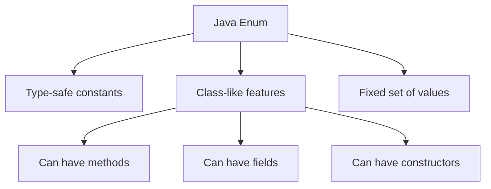

# Java Enumerations

## Introduction

Have you ever needed to represent a fixed set of constants in your Java program, such as days of the week, months, or card suits? Before Java 5, developers used static final constants for this purpose, which had several limitations. Java Enumerations (or `enum` types) were introduced in Java 5 to solve these problems by providing a type-safe way to define collections of constants.

In this lesson, you'll learn:
- What enumerations are and why they're useful
- How to create and use basic enums
- Advanced enum features like methods, fields, and constructors
- Best practices for working with enumerations
- Real-world applications of enums

## What Are Java Enumerations?

An enumeration (or `enum`) is a special type of class that represents a group of constants (unchangeable variables). Enumerations serve the purpose of representing fixed sets of values that a variable can take.



## Basic Enum Creation and Usage

Let's start with a simple example of creating and using an enum:

```java
// Define an enum for days of the week
public enum Day {
    MONDAY, TUESDAY, WEDNESDAY, THURSDAY, FRIDAY, SATURDAY, SUNDAY
}
```

Here's how to use this enum:

```java
// Using the Day enum
public class EnumDemo {
    public static void main(String[] args) {
        // Declare a Day variable
        Day today = Day.WEDNESDAY;
        
        // Use in conditional statements
        if (today == Day.WEDNESDAY) {
            System.out.println("It's midweek!");
        }
        
        // Switch with enum
        switch (today) {
            case MONDAY:
                System.out.println("Start of work week");
                break;
            case FRIDAY:
                System.out.println("End of work week");
                break;
            case SATURDAY:
            case SUNDAY:
                System.out.println("Weekend!");
                break;
            default:
                System.out.println("Midweek");
                break;
        }
    }
}
```

**Output:**
```
It's midweek!
Midweek
```

## Enum Methods and Properties

Java automatically adds some useful methods to all enums:

### Built-in Methods

- `values()` - Returns an array of all enum constants
- `valueOf(String name)` - Returns the enum constant with the specified name
- `name()` - Returns the name of the enum constant
- `ordinal()` - Returns the position of the enum constant (0-based)

```java
public class EnumMethodsDemo {
    public static void main(String[] args) {
        // Using values() to iterate through all enum constants
        System.out.println("All days of the week:");
        for (Day day : Day.values()) {
            System.out.println(day);
        }
        
        // Using valueOf()
        Day specificDay = Day.valueOf("MONDAY");
        System.out.println("Specific day: " + specificDay);
        
        // Using name() and ordinal()
        System.out.println("Name: " + Day.FRIDAY.name());
        System.out.println("Ordinal value: " + Day.FRIDAY.ordinal());
    }
}
```

**Output:**
```
All days of the week:
MONDAY
TUESDAY
WEDNESDAY
THURSDAY
FRIDAY
SATURDAY
SUNDAY
Specific day: MONDAY
Name: FRIDAY
Ordinal value: 4
```

## Adding Fields, Constructors, and Methods to Enums

Enums can be much more powerful than simple constants. They can have:
- Fields
- Constructors
- Methods

Let's expand our previous example:

```java
public enum Month {
    // Enum constants with values (calls constructor)
    JANUARY(31, "Winter"), 
    FEBRUARY(28, "Winter"),
    MARCH(31, "Spring"),
    APRIL(30, "Spring"),
    MAY(31, "Spring"),
    JUNE(30, "Summer"),
    JULY(31, "Summer"),
    AUGUST(31, "Summer"),
    SEPTEMBER(30, "Fall"),
    OCTOBER(31, "Fall"),
    NOVEMBER(30, "Fall"),
    DECEMBER(31, "Winter");
    
    // Fields
    private final int days;
    private final String season;
    
    // Constructor
    Month(int days, String season) {
        this.days = days;
        this.season = season;
    }
    
    // Getter methods
    public int getDays() {
        return days;
    }
    
    public String getSeason() {
        return season;
    }
    
    // Custom method
    public boolean isLongMonth() {
        return days == 31;
    }
}
```

Now let's use our enhanced enum:

```java
public class EnhancedEnumDemo {
    public static void main(String[] args) {
        Month myMonth = Month.APRIL;
        
        System.out.println(myMonth + " has " + myMonth.getDays() + " days");
        System.out.println(myMonth + " is in the " + myMonth.getSeason() + " season");
        
        if (myMonth.isLongMonth()) {
            System.out.println(myMonth + " is a long month");
        } else {
            System.out.println(myMonth + " is a short month");
        }
        
        // Checking which months are in winter
        System.out.println("\nWinter months:");
        for (Month month : Month.values()) {
            if (month.getSeason().equals("Winter")) {
                System.out.println(month);
            }
        }
    }
}
```

**Output:**
```
APRIL has 30 days
APRIL is in the Spring season
APRIL is a short month

Winter months:
JANUARY
FEBRUARY
DECEMBER
```

## Implementing Interfaces with Enums

Enums can also implement interfaces, which adds another dimension of flexibility:

```java
// Define an interface
interface Describable {
    String getDescription();
}

// Enum implementing the interface
public enum TrafficLight implements Describable {
    RED("Stop"), 
    YELLOW("Caution"), 
    GREEN("Go");
    
    private final String action;
    
    TrafficLight(String action) {
        this.action = action;
    }
    
    // Implementing the interface method
    @Override
    public String getDescription() {
        return name() + " means " + action;
    }
    
    // Additional method
    public boolean shouldStop() {
        return this == RED || this == YELLOW;
    }
}
```

Using the enum that implements an interface:

```java
public class TrafficLightDemo {
    public static void main(String[] args) {
        TrafficLight light = TrafficLight.YELLOW;
        
        // Using interface method
        System.out.println(light.getDescription());
        
        // Using enum method
        if (light.shouldStop()) {
            System.out.println("You should stop at this light!");
        } else {
            System.out.println("You can proceed");
        }
    }
}
```

**Output:**
```
YELLOW means Caution
You should stop at this light!
```

## EnumSet and EnumMap

Java provides special collection implementations optimized for use with enums:

### EnumSet

`EnumSet` is a specialized Set implementation for use with enum types:

```java
import java.util.EnumSet;

public class EnumSetDemo {
    public static void main(String[] args) {
        // Create an empty EnumSet
        EnumSet<Day> weekdays = EnumSet.noneOf(Day.class);
        
        // Add elements
        weekdays.add(Day.MONDAY);
        weekdays.add(Day.TUESDAY);
        weekdays.add(Day.WEDNESDAY);
        weekdays.add(Day.THURSDAY);
        weekdays.add(Day.FRIDAY);
        
        System.out.println("Weekdays: " + weekdays);
        
        // Create EnumSet with all values
        EnumSet<Day> allDays = EnumSet.allOf(Day.class);
        System.out.println("All days: " + allDays);
        
        // Create EnumSet with a range
        EnumSet<Day> weekend = EnumSet.range(Day.SATURDAY, Day.SUNDAY);
        System.out.println("Weekend: " + weekend);
    }
}
```

**Output:**
```
Weekdays: [MONDAY, TUESDAY, WEDNESDAY, THURSDAY, FRIDAY]
All days: [MONDAY, TUESDAY, WEDNESDAY, THURSDAY, FRIDAY, SATURDAY, SUNDAY]
Weekend: [SATURDAY, SUNDAY]
```

### EnumMap

`EnumMap` is a specialized Map implementation for use with enum keys:

```java
import java.util.EnumMap;

public class EnumMapDemo {
    public static void main(String[] args) {
        // Create an EnumMap
        EnumMap<Day, String> dayActivities = new EnumMap<>(Day.class);
        
        // Add elements
        dayActivities.put(Day.MONDAY, "Start the week");
        dayActivities.put(Day.WEDNESDAY, "Midweek meeting");
        dayActivities.put(Day.FRIDAY, "Plan for weekend");
        dayActivities.put(Day.SATURDAY, "Relax and have fun");
        
        // Access elements
        System.out.println("Friday's activity: " + dayActivities.get(Day.FRIDAY));
        
        // Iterate through EnumMap
        System.out.println("\nWeek plan:");
        for (Day day : Day.values()) {
            String activity = dayActivities.getOrDefault(day, "No specific plans");
            System.out.println(day + ": " + activity);
        }
    }
}
```

**Output:**
```
Friday's activity: Plan for weekend

Week plan:
MONDAY: Start the week
TUESDAY: No specific plans
WEDNESDAY: Midweek meeting
THURSDAY: No specific plans
FRIDAY: Plan for weekend
SATURDAY: Relax and have fun
SUNDAY: No specific plans
```

## Real-world Applications of Enums

### Example 1: Status Codes in an HTTP Client

```java
public enum HttpStatus {
    OK(200, "OK"),
    CREATED(201, "Created"),
    BAD_REQUEST(400, "Bad Request"),
    UNAUTHORIZED(401, "Unauthorized"),
    FORBIDDEN(403, "Forbidden"),
    NOT_FOUND(404, "Not Found"),
    INTERNAL_SERVER_ERROR(500, "Internal Server Error");
    
    private final int code;
    private final String message;
    
    HttpStatus(int code, String message) {
        this.code = code;
        this.message = message;
    }
    
    public int getCode() {
        return code;
    }
    
    public String getMessage() {
        return message;
    }
    
    // Find status by code
    public static HttpStatus findByCode(int code) {
        for (HttpStatus status : values()) {
            if (status.getCode() == code) {
                return status;
            }
        }
        throw new IllegalArgumentException("Invalid HTTP status code: " + code);
    }
}
```

Using the HTTP status enum:

```java
public class HttpClientExample {
    public static void main(String[] args) {
        // Simulate an HTTP response
        int responseCode = 404;
        
        try {
            HttpStatus status = HttpStatus.findByCode(responseCode);
            System.out.println("Received: " + status + " (" + 
                               status.getCode() + " - " + 
                               status.getMessage() + ")");
            
            // Handle different statuses
            switch (status) {
                case OK:
                    System.out.println("Request successful");
                    break;
                case NOT_FOUND:
                    System.out.println("Resource not found, check the URL");
                    break;
                case INTERNAL_SERVER_ERROR:
                    System.out.println("Server encountered an error, retry later");
                    break;
                default:
                    System.out.println("Other status code handled");
                    break;
            }
        } catch (IllegalArgumentException e) {
            System.out.println(e.getMessage());
        }
    }
}
```

**Output:**
```
Received: NOT_FOUND (404 - Not Found)
Resource not found, check the URL
```

### Example 2: State Machine with Enums

Enums can effectively represent state machines:

```java
public enum OrderStatus {
    NEW {
        @Override
        public OrderStatus next() {
            return PROCESSING;
        }
    },
    PROCESSING {
        @Override
        public OrderStatus next() {
            return SHIPPED;
        }
    },
    SHIPPED {
        @Override
        public OrderStatus next() {
            return DELIVERED;
        }
    },
    DELIVERED {
        @Override
        public OrderStatus next() {
            // Final state
            return this;
        }
    },
    CANCELLED {
        @Override
        public OrderStatus next() {
            // Terminal state
            return this;
        }
    };
    
    // Abstract method to be implemented by each constant
    public abstract OrderStatus next();
    
    // Can be cancelled only in certain states
    public boolean canCancel() {
        return this == NEW || this == PROCESSING;
    }
}
```

Let's use this state machine:

```java
public class OrderProcessingDemo {
    public static void main(String[] args) {
        // Initialize a new order
        OrderStatus status = OrderStatus.NEW;
        System.out.println("Initial status: " + status);
        
        // Process the order through its lifecycle
        System.out.println("\nProcessing order through states:");
        
        while (status != OrderStatus.DELIVERED) {
            if (status.canCancel()) {
                System.out.println("- " + status + " (Can be cancelled: Yes)");
            } else {
                System.out.println("- " + status + " (Can be cancelled: No)");
            }
            
            // Transition to next state
            status = status.next();
        }
        
        // Final state
        System.out.println("- " + status + " (Can be cancelled: No)");
        System.out.println("\nOrder processing complete!");
    }
}
```

**Output:**
```
Initial status: NEW

Processing order through states:
- NEW (Can be cancelled: Yes)
- PROCESSING (Can be cancelled: Yes)
- SHIPPED (Can be cancelled: No)
- DELIVERED (Can be cancelled: No)

Order processing complete!
```

## Best Practices for Using Enums

1. **Use enums for fixed sets** of related constants when you know all possible values at compile time.

2. **Prefer enums over integer constants** for better type safety and readability.

3. **Keep enum constants in UPPERCASE** following Java naming conventions.

4. **Consider using EnumSet and EnumMap** instead of HashSet or HashMap when working with enums for better performance.

5. **Use singleton enums** for implementing a singleton pattern:

```java
public enum Singleton {
    INSTANCE;
    
    // Add methods and fields
    private int value;
    
    public void setValue(int value) {
        this.value = value;
    }
    
    public int getValue() {
        return value;
    }
}
```

6. **Don't create unnecessarily complex enums** - if your enum starts to have too many responsibilities, consider breaking it up or using a regular class instead.

7. **Document your enums** with Javadoc comments, especially when they have methods or complex behavior.

## Summary

Java Enumerations (enums) are a powerful feature that provides type-safe constants with additional functionality. In this lesson, we covered:

- Basic enum creation and usage
- Built-in enum methods like `values()` and `valueOf()`
- Adding fields, constructors, and methods to enums
- Implementing interfaces with enums
- Using specialized collections like EnumSet and EnumMap
- Real-world applications of enums including HTTP status codes and state machines
- Best practices for working with enums

Enums strike a balance between simplicity and power - they can be as simple as a collection of constants or as complex as a class with fields and methods. When used appropriately, they can make your code more readable, maintainable, and type-safe.

## Exercises

1. Create an enum `Planet` that includes the eight planets in our solar system, with properties for mass, radius, and distance from the sun.

2. Implement a `Direction` enum (NORTH, EAST, SOUTH, WEST) with a method that returns the opposite direction.

3. Create a card game simulation using enums for Suit (HEARTS, DIAMONDS, CLUBS, SPADES) and Rank (TWO through ACE).

4. Implement a state machine using enums to model a traffic light system that cycles between RED, GREEN, and YELLOW.

5. Use EnumSet to represent days of the week when a store is open, and write a method to check if the store is open on a specific day.

## Additional Resources

- [Java Enum Documentation](https://docs.oracle.com/javase/tutorial/java/javaOO/enum.html)
- [EnumSet Documentation](https://docs.oracle.com/en/java/javase/17/docs/api/java.base/java/util/EnumSet.html)
- [EnumMap Documentation](https://docs.oracle.com/en/java/javase/17/docs/api/java.base/java/util/EnumMap.html)
- [Effective Java by Joshua Bloch](https://www.oreilly.com/library/view/effective-java-3rd/9780134686097/) - Item 34 discusses enum best practices

Happy coding with Java enums!