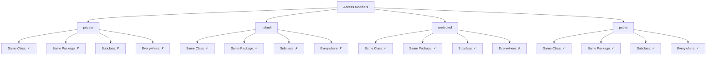

# Java Access Modifiers

Access modifiers are a fundamental concept in Java that controls the visibility and accessibility of classes, methods, variables, and constructors. Understanding access modifiers is crucial for implementing proper encapsulation and creating well-structured object-oriented programs.

## Introduction to Access Modifiers

In Java, access modifiers determine which parts of your program can access specific elements of your code. They help you implement encapsulation by hiding implementation details and exposing only what's necessary. Java provides four access levels through modifiers:

1. **Private** (`private`) - Most restrictive
2. **Default** (no modifier) - Package-level access
3. **Protected** (`protected`) - Accessible in package and subclasses
4. **Public** (`public`) - Least restrictive

Let's explore each of these modifiers in detail with examples.

## Access Modifier Types

### 1. Private Access Modifier

The `private` modifier is the most restrictive access level. When an element is marked as `private`:
- It's only accessible within the same class
- It cannot be accessed from outside the class, even in the same package
- It's commonly used for internal implementation details

#### Example of Private Access

```java
public class BankAccount {
    // Private variable - only accessible within this class
    private double balance;
    
    // Constructor
    public BankAccount(double initialBalance) {
        this.balance = initialBalance;
    }
    
    // Private method - only accessible within this class
    private void updateBalance(double amount) {
        this.balance += amount;
        System.out.println("Balance updated internally: " + this.balance);
    }
    
    // Public methods to access and modify the private variable
    public double getBalance() {
        return balance;
    }
    
    public void deposit(double amount) {
        if (amount > 0) {
            updateBalance(amount); // Can call the private method here
            System.out.println("Deposited: " + amount);
        } else {
            System.out.println("Invalid deposit amount");
        }
    }
}
```

```java
public class Main {
    public static void main(String[] args) {
        BankAccount account = new BankAccount(1000.0);
        
        // Accessing public methods
        System.out.println("Current balance: " + account.getBalance());
        account.deposit(500.0);
        
        // The following would cause compilation errors:
        // account.balance = 2000.0;  // Can't access private variable
        // account.updateBalance(500.0);  // Can't access private method
    }
}
```

**Output:**
```
Current balance: 1000.0
Balance updated internally: 1500.0
Deposited: 500.0
```

### 2. Default (Package-Private) Access Modifier

The default access modifier (when no modifier is specified) provides package-level access:
- Elements are accessible only within their package
- They are not accessible from outside the package
- Useful for components that work together within a package

#### Example of Default Access

```java
// File: package1/Calculator.java
package package1;

class Calculator {  // Note: no access modifier = default access
    int add(int a, int b) {
        return a + b;
    }
    
    int subtract(int a, int b) {
        return a - b;
    }
}
```

```java
// File: package1/MathUtil.java
package package1;

public class MathUtil {
    public static void main(String[] args) {
        // Can access Calculator since it's in the same package
        Calculator calc = new Calculator();
        System.out.println("Sum: " + calc.add(5, 3));
        System.out.println("Difference: " + calc.subtract(10, 4));
    }
}
```

```java
// File: package2/ExternalApp.java
package package2;

import package1.*;

public class ExternalApp {
    public static void main(String[] args) {
        // This would cause compilation error:
        // Calculator calc = new Calculator();  // Can't access default class from different package
        
        // But we can access public classes from package1
        // MathUtil mathUtil = new MathUtil();
    }
}
```

**Output for MathUtil:**
```
Sum: 8
Difference: 6
```

### 3. Protected Access Modifier

The `protected` modifier provides an intermediate level of access:
- Elements are accessible within the same package
- Additionally, they can be accessed by subclasses even in different packages
- Useful for elements that need to be part of the inheritance implementation

#### Example of Protected Access

```java
// File: shapes/Shape.java
package shapes;

public class Shape {
    protected String name;
    protected double area;
    
    protected void calculateArea() {
        System.out.println("Calculating area for " + name);
        // Base implementation
    }
    
    public void display() {
        System.out.println("Shape: " + name + ", Area: " + area);
    }
}
```

```java
// File: shapes/Circle.java
package shapes;

public class Circle extends Shape {
    private double radius;
    
    public Circle(double radius) {
        this.radius = radius;
        this.name = "Circle"; // Can access protected field from parent
        calculateArea(); // Can access protected method from parent
    }
    
    @Override
    protected void calculateArea() {
        this.area = Math.PI * radius * radius;
    }
}
```

```java
// File: advanced/Polygon.java
package advanced;

import shapes.Shape;

public class Polygon extends Shape {
    private int sides;
    private double sideLength;
    
    public Polygon(int sides, double sideLength) {
        this.sides = sides;
        this.sideLength = sideLength;
        this.name = "Polygon"; // Can access protected field from parent despite different package
        calculateArea(); // Can access protected method from parent
    }
    
    @Override
    protected void calculateArea() {
        // Calculation for regular polygon
        double perimeter = sides * sideLength;
        double apothem = sideLength / (2 * Math.tan(Math.PI / sides));
        this.area = (perimeter * apothem) / 2;
    }
}
```

```java
// File: Main.java
import shapes.Circle;
import shapes.Shape;
import advanced.Polygon;

public class Main {
    public static void main(String[] args) {
        Circle circle = new Circle(5.0);
        circle.display();
        
        Polygon hexagon = new Polygon(6, 4.0);
        hexagon.display();
        
        // This would cause compilation errors:
        // Shape shape = new Shape();
        // shape.name = "Generic Shape";  // Can't access protected field
        // shape.calculateArea();  // Can't access protected method
    }
}
```

**Output:**
```
Shape: Circle, Area: 78.53981633974483
Shape: Polygon, Area: 41.569219381653056
```

### 4. Public Access Modifier

The `public` modifier is the most permissive:
- Elements are accessible from anywhere in your application
- Used for classes, methods, and variables that need to be accessed from all parts of your program
- Public APIs are typically marked as public

#### Example of Public Access

```java
// File: utils/StringUtils.java
package utils;

public class StringUtils {
    public static String capitalize(String input) {
        if (input == null || input.isEmpty()) {
            return input;
        }
        return input.substring(0, 1).toUpperCase() + input.substring(1);
    }
    
    public static boolean isPalindrome(String input) {
        if (input == null) {
            return false;
        }
        
        String cleaned = input.toLowerCase().replaceAll("[\\W_]", "");
        int left = 0;
        int right = cleaned.length() - 1;
        
        while (left < right) {
            if (cleaned.charAt(left) != cleaned.charAt(right)) {
                return false;
            }
            left++;
            right--;
        }
        
        return true;
    }
}
```

```java
// File: Main.java
import utils.StringUtils;

public class Main {
    public static void main(String[] args) {
        // Can access public class and methods from anywhere
        String text = "hello world";
        System.out.println("Capitalized: " + StringUtils.capitalize(text));
        
        String palindrome = "A man, a plan, a canal, Panama";
        System.out.println("Is palindrome? " + StringUtils.isPalindrome(palindrome));
    }
}
```

**Output:**
```
Capitalized: Hello world
Is palindrome? true
```

## Visual Comparison of Access Modifiers

The following diagram shows the accessibility of different access modifiers:



## Real-World Application: Building a Library System

Let's see how access modifiers are used in a practical scenario like a library management system:

```java
// The public API of our library system
public class Library {
    private ArrayList<Book> books;
    private ArrayList<Member> members;
    
    public Library() {
        this.books = new ArrayList<>();
        this.members = new ArrayList<>();
    }
    
    public void addBook(String title, String author, String isbn) {
        books.add(new Book(title, author, isbn));
        System.out.println("Book added: " + title);
    }
    
    public void registerMember(String name, String id) {
        members.add(new Member(name, id));
        System.out.println("Member registered: " + name);
    }
    
    public boolean lendBook(String memberID, String isbn) {
        Member member = findMember(memberID);
        Book book = findBook(isbn);
        
        if (member != null && book != null && !book.isCheckedOut()) {
            book.checkOut();
            member.borrowBook(book);
            System.out.println(member.getName() + " borrowed: " + book.getTitle());
            return true;
        } else {
            System.out.println("Book lending failed!");
            return false;
        }
    }
    
    // Private helper methods - implementation details
    private Member findMember(String id) {
        for (Member m : members) {
            if (m.getId().equals(id)) {
                return m;
            }
        }
        return null;
    }
    
    private Book findBook(String isbn) {
        for (Book b : books) {
            if (b.getIsbn().equals(isbn)) {
                return b;
            }
        }
        return null;
    }
    
    // Protected methods - accessible by subclasses (e.g., SpecializedLibrary)
    protected ArrayList<Book> getBooks() {
        return new ArrayList<>(books); // Return copy to maintain encapsulation
    }
    
    protected ArrayList<Member> getMembers() {
        return new ArrayList<>(members); // Return copy to maintain encapsulation
    }
}

// Book class with a mix of access modifiers
class Book {
    private String title;
    private String author;
    private String isbn;
    private boolean checkedOut;
    
    public Book(String title, String author, String isbn) {
        this.title = title;
        this.author = author;
        this.isbn = isbn;
        this.checkedOut = false;
    }
    
    public String getTitle() {
        return title;
    }
    
    public String getAuthor() {
        return author;
    }
    
    public String getIsbn() {
        return isbn;
    }
    
    public boolean isCheckedOut() {
        return checkedOut;
    }
    
    public void checkOut() {
        this.checkedOut = true;
    }
    
    public void returnBook() {
        this.checkedOut = false;
    }
}

// Member class with encapsulated data
class Member {
    private String name;
    private String id;
    private ArrayList<Book> borrowedBooks;
    
    public Member(String name, String id) {
        this.name = name;
        this.id = id;
        this.borrowedBooks = new ArrayList<>();
    }
    
    public String getName() {
        return name;
    }
    
    public String getId() {
        return id;
    }
    
    public void borrowBook(Book book) {
        borrowedBooks.add(book);
    }
    
    public boolean returnBook(Book book) {
        boolean removed = borrowedBooks.remove(book);
        if (removed) {
            book.returnBook();
        }
        return removed;
    }
    
    public ArrayList<Book> getBorrowedBooks() {
        return new ArrayList<>(borrowedBooks); // Return copy to maintain encapsulation
    }
}
```

Usage example:

```java
public class LibraryDemo {
    public static void main(String[] args) {
        Library library = new Library();
        
        // Add books to library
        library.addBook("Java Programming", "John Smith", "1234567890");
        library.addBook("Data Structures", "Jane Doe", "0987654321");
        library.addBook("Algorithms", "Alan Turing", "5432167890");
        
        // Register members
        library.registerMember("Alice Williams", "M001");
        library.registerMember("Bob Johnson", "M002");
        
        // Lend books
        library.lendBook("M001", "1234567890");
        library.lendBook("M002", "0987654321");
        
        // Try to lend a book that's already checked out
        library.lendBook("M002", "1234567890");
    }
}
```

**Output:**
```
Book added: Java Programming
Book added: Data Structures
Book added: Algorithms
Member registered: Alice Williams
Member registered: Bob Johnson
Alice Williams borrowed: Java Programming
Bob Johnson borrowed: Data Structures
Book lending failed!
```

In this example:
- `public` methods form the API that other classes use to interact with the library
- `private` fields and methods hide the implementation details
- `protected` methods allow for extensions in subclasses without exposing internals generally
- Package-private classes (Book, Member) are accessible within the package but not from outside

## Benefits of Proper Access Modifier Usage

1. **Encapsulation**: Hide implementation details and expose only what's necessary
2. **Reduced Dependencies**: Minimize coupling between components
3. **Controlled Access**: Prevent unauthorized modifications of critical data
4. **API Design**: Clearly define what parts of your code are meant for external use
5. **Maintainability**: Change internal implementations without affecting external code

## Common Guidelines

1. Use `private` for variables to implement encapsulation
2. Use `public` for methods that need to be part of your API
3. Use `protected` for methods that subclasses might need to override
4. Use default (no modifier) for classes and methods that should only be accessible within their package
5. Favor the most restrictive access level that still allows your code to function properly

## Summary

Access modifiers in Java control the visibility and accessibility of your classes, methods, and variables. The proper use of access modifiers is essential for good encapsulation and building well-structured object-oriented programs.

- **Private**: Accessible only within the same class
- **Default (no modifier)**: Accessible within the same package
- **Protected**: Accessible within the same package and by subclasses
- **Public**: Accessible from anywhere

Understanding and correctly applying access modifiers will help you create more maintainable, secure, and well-organized Java applications.

## Exercises

1. Create a `Student` class with private fields for name, ID, and grades. Implement appropriate public methods to access and modify these fields.
2. Extend the Library example by creating a `SpecializedLibrary` subclass that adds functionality while maintaining proper encapsulation.
3. Identify and fix access modifier issues in the following code:
   ```java
   class User {
       String username;
       String password;
       
       boolean login(String inputUsername, String inputPassword) {
           return username.equals(inputUsername) && password.equals(inputPassword);
       }
   }
   ```
4. Create a package structure with classes that demonstrate all four access levels and how they interact.

## Additional Resources

- [Java Documentation on Access Control](https://docs.oracle.com/javase/tutorial/java/javaOO/accesscontrol.html)
- [Effective Java by Joshua Bloch](https://www.oreilly.com/library/view/effective-java-3rd/9780134686097/) - Chapter on Access Control
- [Java Access Modifiers Best Practices](https://www.baeldung.com/java-access-modifiers)