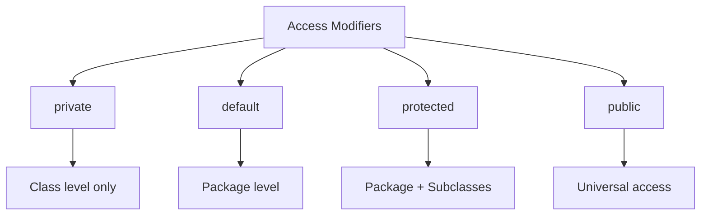

# Java Encapsulation

## Introduction

Encapsulation is one of the four fundamental concepts of Object-Oriented Programming (OOP), along with inheritance, polymorphism, and abstraction. It's the practice of keeping the internal state of an object protected from the outside world, only exposing what is necessary through well-defined interfaces.

In Java, encapsulation involves:

1. **Declaring class variables/attributes as private** - restricting direct access from outside the class
2. **Providing public getter and setter methods** - to access and update the value of private variables in a controlled way

Think of encapsulation like the capsule of medicine that wraps up ingredients safely - it bundles data and the methods operating on that data into a single unit, keeping the data safe from interference and misuse.

## Why Encapsulation Matters

Encapsulation offers several important benefits:

- **Data Hiding**: Protects data from unauthorized access
- **Flexibility**: Allows changing the internal implementation without affecting other code
- **Maintainability**: Makes code easier to maintain and reduces errors
- **Control**: Gives you control over what data can be accessed and how it can be updated

## Basic Implementation of Encapsulation

Let's look at a basic example of encapsulation:

```java
public class Student {
    // Private variables - hidden from other classes
    private String name;
    private int age;
    private String studentId;
    
    // Public getter methods - to access private variables
    public String getName() {
        return name;
    }
    
    public int getAge() {
        return age;
    }
    
    public String getStudentId() {
        return studentId;
    }
    
    // Public setter methods - to update private variables
    public void setName(String name) {
        this.name = name;
    }
    
    public void setAge(int age) {
        if (age > 0) {  // Data validation
            this.age = age;
        } else {
            System.out.println("Age cannot be negative or zero");
        }
    }
    
    public void setStudentId(String studentId) {
        this.studentId = studentId;
    }
}
```

Here's how we would use this encapsulated class:

```java
public class Main {
    public static void main(String[] args) {
        // Create a Student object
        Student student = new Student();
        
        // Setting values using setter methods
        student.setName("John Smith");
        student.setAge(20);
        student.setStudentId("JS12345");
        
        // Getting values using getter methods
        System.out.println("Student Name: " + student.getName());
        System.out.println("Student Age: " + student.getAge());
        System.out.println("Student ID: " + student.getStudentId());
        
        // Trying to set an invalid age
        student.setAge(-5);
    }
}
```

**Output:**
```
Student Name: John Smith
Student Age: 20
Student ID: JS12345
Age cannot be negative or zero
```

## Access Modifiers and Encapsulation

Java provides four access modifiers that are key to implementing encapsulation:

1. **private**: Accessible only within the class
2. **default** (no modifier): Accessible within the same package
3. **protected**: Accessible within the same package and subclasses
4. **public**: Accessible from any class

For encapsulation, we typically:
- Make instance variables **private**
- Make getter/setter methods **public**



## Real-World Example: Bank Account

Let's consider a more practical example of encapsulation - a bank account:

```java
public class BankAccount {
    // Private attributes
    private String accountNumber;
    private String accountHolderName;
    private double balance;
    private boolean isActive;
    
    // Constructor
    public BankAccount(String accountNumber, String accountHolderName) {
        this.accountNumber = accountNumber;
        this.accountHolderName = accountHolderName;
        this.balance = 0.0;
        this.isActive = true;
    }
    
    // Getters
    public String getAccountNumber() {
        // Only return last 4 digits for security
        return "xxxx-xxxx-xxxx-" + accountNumber.substring(accountNumber.length() - 4);
    }
    
    public String getAccountHolderName() {
        return accountHolderName;
    }
    
    public double getBalance() {
        return balance;
    }
    
    public boolean isActive() {
        return isActive;
    }
    
    // Setters - with business logic and validation
    public void setAccountHolderName(String accountHolderName) {
        if (accountHolderName != null && !accountHolderName.trim().isEmpty()) {
            this.accountHolderName = accountHolderName;
        }
    }
    
    // No setter for account number - it shouldn't change
    
    // Business methods that modify private state
    public void deposit(double amount) {
        if (amount > 0 && isActive) {
            this.balance += amount;
            System.out.println(amount + " deposited successfully. New balance: " + this.balance);
        } else {
            System.out.println("Invalid deposit amount or account inactive.");
        }
    }
    
    public void withdraw(double amount) {
        if (isActive && amount > 0 && amount <= balance) {
            this.balance -= amount;
            System.out.println(amount + " withdrawn successfully. New balance: " + this.balance);
        } else {
            System.out.println("Withdrawal failed: Insufficient funds or invalid amount.");
        }
    }
    
    public void deactivateAccount() {
        this.isActive = false;
        System.out.println("Account deactivated.");
    }
}
```

Here's how you might use this encapsulated `BankAccount` class:

```java
public class BankDemo {
    public static void main(String[] args) {
        // Create a new bank account
        BankAccount account = new BankAccount("1234567890123456", "Alice Johnson");
        
        // Display account info
        System.out.println("Account Holder: " + account.getAccountHolderName());
        System.out.println("Account Number: " + account.getAccountNumber());
        System.out.println("Current Balance: $" + account.getBalance());
        
        // Perform transactions
        account.deposit(1000);
        account.withdraw(300);
        account.withdraw(2000); // Will fail
        
        // Update account holder name
        account.setAccountHolderName("Alice Smith-Johnson");
        System.out.println("Updated Account Holder: " + account.getAccountHolderName());
        
        // Deactivate account
        account.deactivateAccount();
        account.deposit(500); // Will fail as account is inactive
    }
}
```

**Output:**
```
Account Holder: Alice Johnson
Account Number: xxxx-xxxx-xxxx-3456
Current Balance: $0.0
1000.0 deposited successfully. New balance: 1000.0
300.0 withdrawn successfully. New balance: 700.0
Withdrawal failed: Insufficient funds or invalid amount.
Updated Account Holder: Alice Smith-Johnson
Account deactivated.
Invalid deposit amount or account inactive.
```

## Benefits of Encapsulation in the Bank Account Example

Our `BankAccount` class demonstrates several encapsulation benefits:

1. **Data Protection**: Private variables cannot be directly accessed by outside code
2. **Controlled Access**: Account balance can only be modified through `deposit()` and `withdraw()` methods
3. **Business Logic Enforcement**: We validate amounts before updating balances
4. **Data Validation**: We ensure valid values are provided (e.g., deposit amounts must be positive)
5. **Flexibility**: We can change the internal storage or handling of data without affecting users of our class
6. **Security**: We mask most of the account number when returning it via getter

## Encapsulation Best Practices

1. **Always make instance variables private** when possible
2. **Provide getters only for variables that should be readable** from outside
3. **Provide setters only for variables that should be modifiable** from outside
4. **Add validation logic to setter methods** to ensure data integrity
5. **Use meaningful method names** for operations that modify the object state
6. **Consider using constructor parameters** for required initial values

## Advanced Encapsulation Techniques

### Read-Only Properties

Sometimes you want properties that can be read but not modified:

```java
public class ImmutablePoint {
    private final int x;
    private final int y;
    
    public ImmutablePoint(int x, int y) {
        this.x = x;
        this.y = y;
    }
    
    // Only getters, no setters
    public int getX() {
        return x;
    }
    
    public int getY() {
        return y;
    }
    
    // Operations return new objects rather than modify existing ones
    public ImmutablePoint translate(int dx, int dy) {
        return new ImmutablePoint(this.x + dx, this.y + dy);
    }
}
```

### Write-Only Properties

In some security-sensitive applications, you might want write-only properties:

```java
public class User {
    private String username;
    private String passwordHash;
    
    // Getter for username
    public String getUsername() {
        return username;
    }
    
    public void setUsername(String username) {
        this.username = username;
    }
    
    // No getter for password, only a setter that hashes it
    public void setPassword(String password) {
        this.passwordHash = hashPassword(password);
    }
    
    // Method to authenticate without exposing the password hash
    public boolean authenticate(String password) {
        return hashPassword(password).equals(this.passwordHash);
    }
    
    private String hashPassword(String password) {
        // In real code, use a secure hashing algorithm
        return "hashed_" + password;
    }
}
```

## Summary

Encapsulation is a core principle in Java that involves bundling data and methods that operate on that data into a single unit (class), and restricting direct access to some of the object's components. The main techniques for implementing encapsulation are:

1. Declaring instance variables as private
2. Providing public getter and setter methods for controlled access
3. Implementing validation logic within setters
4. Exposing only what's necessary via the public API

Benefits of encapsulation include:
- Improved data security
- Better code maintainability
- Flexibility to change implementation
- Reduced coupling between different parts of an application

By following encapsulation principles, you create Java programs that are more robust, secure, and easier to maintain over time.

## Exercises

1. Create an encapsulated `Product` class with private fields for `id`, `name`, `price`, and `stock`. Implement appropriate getters and setters.

2. Enhance the `Product` class with a business method `sell(int quantity)` that decreases the stock if available and returns a boolean indicating if the sale was successful.

3. Create an encapsulated `Employee` class with salary-related calculations and appropriate data validations.

4. Implement a `CreditCard` class that encapsulates the card number (showing only last 4 digits), expiration date, and provides secure methods for making payments.

## Additional Resources

- [Java Documentation on Access Control](https://docs.oracle.com/javase/tutorial/java/javaOO/accesscontrol.html)
- [Oracle's Java Tutorials on Classes and Objects](https://docs.oracle.com/javase/tutorial/java/javaOO/index.html)
- Book: "Effective Java" by Joshua Bloch - Chapter on Classes and Interfaces
- Book: "Clean Code" by Robert C. Martin - Chapter on Objects and Data Structures

Mastering encapsulation is a key step in becoming proficient in Java object-oriented programming. As you build more complex applications, you'll find that proper encapsulation leads to cleaner, more maintainable, and more secure code.