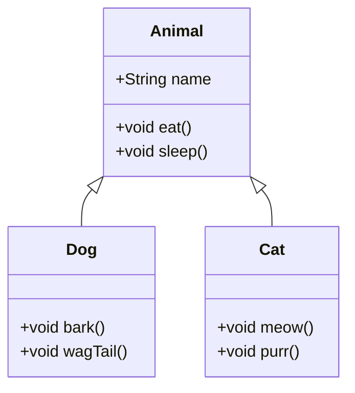

# Java Inheritance

## Introduction

Inheritance is one of the four fundamental principles of Object-Oriented Programming (OOP), alongside encapsulation, abstraction, and polymorphism. In Java, inheritance allows a class to inherit attributes and methods from another class, enabling code reusability and establishing a hierarchical relationship between classes.

Think of inheritance as a parent-child relationship: a child class (subclass) inherits traits from a parent class (superclass), just as children inherit characteristics from their parents in real life. This mechanism lets you build upon existing code while adding specialized features to derived classes.

## Understanding Inheritance in Java

In Java, inheritance is implemented using the `extends` keyword. The class that inherits attributes and methods is called a subclass (or derived class, child class), while the class whose properties and methods are inherited is called a superclass (or base class, parent class).



### Basic Syntax

```java
class SuperClass {
    // fields and methods
}

class SubClass extends SuperClass {
    // additional fields and methods
    // can also override superclass methods
}
```

## Types of Inheritance in Java

Java supports different types of inheritance:

1. **Single Inheritance**: A subclass inherits from only one superclass
2. **Multilevel Inheritance**: A class inherits from a subclass, forming a chain
3. **Hierarchical Inheritance**: Multiple classes inherit from a single superclass

Java does not support multiple inheritance directly (where a class inherits from more than one class), but it can be achieved through interfaces.

### Example of Single Inheritance

Let's create a simple example showing a `Vehicle` superclass and a `Car` subclass:

```java
class Vehicle {
    protected String brand = "Ford";    // Vehicle attribute
    
    public void honk() {                // Vehicle method
        System.out.println("Tuut, tuut!");
    }
}

class Car extends Vehicle {
    private String modelName = "Mustang";    // Car attribute
    
    public static void main(String[] args) {
        // Create a Car object
        Car myCar = new Car();
        
        // Call the honk() method from the Vehicle class
        myCar.honk();
        
        // Display the value of brand from Vehicle and modelName from Car
        System.out.println(myCar.brand + " " + myCar.modelName);
    }
}
```

**Output:**
```
Tuut, tuut!
Ford Mustang
```

In this example:
- `Car` inherits the `brand` attribute and the `honk()` method from `Vehicle`
- `Car` has its own `modelName` attribute
- `myCar` can access both its own attributes and the ones inherited from `Vehicle`

## The `super` Keyword

The `super` keyword in Java refers to the superclass (parent) objects. It is used to:

1. Call superclass methods
2. Call superclass constructor
3. Access superclass fields (if needed)

### Calling Superclass Methods

```java
class Animal {
    public void eat() {
        System.out.println("Animal is eating...");
    }
}

class Dog extends Animal {
    public void eat() {
        System.out.println("Dog is eating dog food...");
    }
    
    public void eatAndRest() {
        super.eat();    // Calls the eat() method from the Animal class
        eat();          // Calls the eat() method from the Dog class
        System.out.println("Dog is now resting...");
    }
}

public class SuperMethodExample {
    public static void main(String[] args) {
        Dog myDog = new Dog();
        myDog.eatAndRest();
    }
}
```

**Output:**
```
Animal is eating...
Dog is eating dog food...
Dog is now resting...
```

### Calling Superclass Constructor

When a subclass is instantiated, a constructor of its superclass is called implicitly or explicitly to initialize the superclass portion of the object.

```java
class Person {
    private String name;
    private int age;
    
    public Person(String name, int age) {
        this.name = name;
        this.age = age;
    }
    
    public void displayInfo() {
        System.out.println("Name: " + name);
        System.out.println("Age: " + age);
    }
}

class Student extends Person {
    private String studentId;
    private String major;
    
    public Student(String name, int age, String studentId, String major) {
        super(name, age);  // Calls the constructor of the superclass Person
        this.studentId = studentId;
        this.major = major;
    }
    
    @Override
    public void displayInfo() {
        super.displayInfo();  // Calls the displayInfo() method from Person
        System.out.println("Student ID: " + studentId);
        System.out.println("Major: " + major);
    }
}

public class SuperConstructorExample {
    public static void main(String[] args) {
        Student student = new Student("John Doe", 20, "S12345", "Computer Science");
        student.displayInfo();
    }
}
```

**Output:**
```
Name: John Doe
Age: 20
Student ID: S12345
Major: Computer Science
```

## Method Overriding

Method overriding occurs when a subclass provides a specific implementation of a method that is already defined in its parent class. It is one of the ways Java implements runtime polymorphism.

### Rules for Method Overriding

1. The method in the subclass must have the same name as in the superclass
2. The method must have the same parameter list
3. The return type must be the same or a subtype of the return type declared in the superclass
4. The access level cannot be more restrictive than the overridden method's access level
5. The method can only throw exceptions that are declared in the throws clause of the superclass method, or exceptions that are subclasses of the declared exceptions

### Method Overriding Example

```java
class Shape {
    public double calculateArea() {
        return 0;  // Default implementation
    }
    
    public void display() {
        System.out.println("This is a shape");
    }
}

class Rectangle extends Shape {
    private double length;
    private double width;
    
    public Rectangle(double length, double width) {
        this.length = length;
        this.width = width;
    }
    
    @Override
    public double calculateArea() {
        return length * width;  // Specific implementation for Rectangle
    }
    
    @Override
    public void display() {
        System.out.println("This is a rectangle with area: " + calculateArea());
    }
}

class Circle extends Shape {
    private double radius;
    
    public Circle(double radius) {
        this.radius = radius;
    }
    
    @Override
    public double calculateArea() {
        return Math.PI * radius * radius;  // Specific implementation for Circle
    }
    
    @Override
    public void display() {
        System.out.println("This is a circle with area: " + calculateArea());
    }
}

public class OverrideExample {
    public static void main(String[] args) {
        Shape shape = new Shape();
        Rectangle rectangle = new Rectangle(5, 4);
        Circle circle = new Circle(3);
        
        shape.display();
        rectangle.display();
        circle.display();
    }
}
```

**Output:**
```
This is a shape
This is a rectangle with area: 20.0
This is a circle with area: 28.274333882308138
```

## The `final` Keyword in Inheritance

The `final` keyword can be used in several contexts related to inheritance:

1. **Final Class**: A class declared as `final` cannot be extended (subclassed)
2. **Final Method**: A method declared as `final` cannot be overridden by subclasses
3. **Final Variable**: A variable declared as `final` cannot be changed after it's initialized

### Example of Final Class and Method

```java
final class FinalClass {
    // This class cannot be extended
    public void display() {
        System.out.println("This is a final class");
    }
}

class ParentClass {
    final public void finalMethod() {
        // This method cannot be overridden
        System.out.println("This is a final method");
    }
    
    public void normalMethod() {
        System.out.println("This is a normal method");
    }
}

class ChildClass extends ParentClass {
    // Cannot override finalMethod()
    
    @Override
    public void normalMethod() {
        System.out.println("This is an overridden method");
    }
}

public class FinalExample {
    public static void main(String[] args) {
        ChildClass child = new ChildClass();
        child.finalMethod();    // Calls method from ParentClass
        child.normalMethod();   // Calls overridden method
    }
}
```

**Output:**
```
This is a final method
This is an overridden method
```

## Real-World Example: Banking System

Let's implement a simplified banking system demonstrating inheritance concepts:

```java
// Base Account class
class BankAccount {
    protected String accountNumber;
    protected String accountHolderName;
    protected double balance;
    
    public BankAccount(String accountNumber, String accountHolderName, double initialBalance) {
        this.accountNumber = accountNumber;
        this.accountHolderName = accountHolderName;
        this.balance = initialBalance;
    }
    
    public void deposit(double amount) {
        if(amount > 0) {
            balance += amount;
            System.out.println("Deposited: $" + amount);
        } else {
            System.out.println("Invalid deposit amount");
        }
    }
    
    public void withdraw(double amount) {
        if(amount > 0 && amount <= balance) {
            balance -= amount;
            System.out.println("Withdrawn: $" + amount);
        } else {
            System.out.println("Invalid withdrawal amount or insufficient funds");
        }
    }
    
    public void displayInfo() {
        System.out.println("Account Number: " + accountNumber);
        System.out.println("Account Holder: " + accountHolderName);
        System.out.println("Current Balance: $" + balance);
    }
    
    public double getBalance() {
        return balance;
    }
}

// Savings Account - a type of Bank Account
class SavingsAccount extends BankAccount {
    private double interestRate;
    
    public SavingsAccount(String accountNumber, String accountHolderName, 
                         double initialBalance, double interestRate) {
        super(accountNumber, accountHolderName, initialBalance);
        this.interestRate = interestRate;
    }
    
    public void addInterest() {
        double interest = balance * interestRate / 100;
        balance += interest;
        System.out.println("Interest added: $" + interest);
    }
    
    @Override
    public void displayInfo() {
        super.displayInfo();
        System.out.println("Account Type: Savings");
        System.out.println("Interest Rate: " + interestRate + "%");
    }
}

// Current Account - another type of Bank Account
class CurrentAccount extends BankAccount {
    private double overdraftLimit;
    
    public CurrentAccount(String accountNumber, String accountHolderName, 
                         double initialBalance, double overdraftLimit) {
        super(accountNumber, accountHolderName, initialBalance);
        this.overdraftLimit = overdraftLimit;
    }
    
    @Override
    public void withdraw(double amount) {
        if(amount > 0 && amount <= (balance + overdraftLimit)) {
            balance -= amount;
            System.out.println("Withdrawn: $" + amount);
        } else {
            System.out.println("Invalid withdrawal amount or exceeds overdraft limit");
        }
    }
    
    @Override
    public void displayInfo() {
        super.displayInfo();
        System.out.println("Account Type: Current");
        System.out.println("Overdraft Limit: $" + overdraftLimit);
    }
}

public class BankingSystemExample {
    public static void main(String[] args) {
        System.out.println("=== SAVINGS ACCOUNT ===");
        SavingsAccount savings = new SavingsAccount("SA123", "John Doe", 1000.0, 2.5);
        savings.displayInfo();
        savings.deposit(500.0);
        savings.addInterest();
        savings.displayInfo();
        
        System.out.println("\n=== CURRENT ACCOUNT ===");
        CurrentAccount current = new CurrentAccount("CA456", "Jane Smith", 2000.0, 1000.0);
        current.displayInfo();
        current.withdraw(2500.0);  // This would use overdraft
        current.displayInfo();
    }
}
```

**Output:**
```
=== SAVINGS ACCOUNT ===
Account Number: SA123
Account Holder: John Doe
Current Balance: $1000.0
Account Type: Savings
Interest Rate: 2.5%
Deposited: $500.0
Interest added: $37.5
Account Number: SA123
Account Holder: John Doe
Current Balance: $1537.5
Account Type: Savings
Interest Rate: 2.5%

=== CURRENT ACCOUNT ===
Account Number: CA456
Account Holder: Jane Smith
Current Balance: $2000.0
Account Type: Current
Overdraft Limit: $1000.0
Withdrawn: $2500.0
Account Number: CA456
Account Holder: Jane Smith
Current Balance: $-500.0
Account Type: Current
Overdraft Limit: $1000.0
```

In this example:
1. `BankAccount` is the superclass with common banking operations
2. `SavingsAccount` extends `BankAccount` and adds interest calculation
3. `CurrentAccount` extends `BankAccount` and overrides the withdrawal method to allow overdrafts
4. Both subclasses override the `displayInfo()` method to show specific information

## When to Use Inheritance

Inheritance should be used when there is a clear "is-a" relationship between classes. For example:

- A Car is a Vehicle
- A Savings Account is a Bank Account
- A Rectangle is a Shape

However, inheritance shouldn't be used just to share code. If there's no logical "is-a" relationship, consider using composition instead (the "has-a" relationship).

## Best Practices

1. Follow the **Liskov Substitution Principle**: Objects of a superclass should be replaceable with objects of its subclasses without affecting program correctness
2. Keep your inheritance hierarchies shallow (not too many levels deep)
3. Use the `@Override` annotation when overriding methods for better code clarity
4. Design for inheritance or prohibit it (using `final`) - avoid "in-between" states
5. Document the requirements for overriding any method
6. Consider alternatives like composition when appropriate

## Summary

Java inheritance is a powerful mechanism that allows classes to inherit properties and behaviors from other classes, promoting code reuse and establishing a logical relationship between classes. Key concepts include:

- Inheritance is implemented using the `extends` keyword
- A subclass inherits all non-private members from its superclass
- The `super` keyword is used to call superclass methods and constructors
- Method overriding allows subclasses to provide specialized implementations
- The `final` keyword can prevent inheritance or method overriding

Inheritance is a cornerstone of object-oriented programming, but it should be used judiciously, following the "is-a" relationship principle and considering alternatives like composition when appropriate.

## Exercise Ideas

1. Create a `Person` superclass with attributes like name, age, and address, then create `Student` and `Employee` subclasses with additional attributes and methods
2. Implement a shape hierarchy with a `Shape` superclass and various shapes as subclasses, each with its own area and perimeter calculation
3. Design a simple game with different character types inheriting from a base `GameCharacter` class
4. Create a library management system with different types of publications inheriting from a common `Publication` class
5. Implement a vehicle rental system with different vehicle types that extend a `Vehicle` base class

## Additional Resources

- [Oracle's Java Tutorials: Inheritance](https://docs.oracle.com/javase/tutorial/java/IandI/subclasses.html)
- [Java Documentation on Object-Oriented Programming Concepts](https://docs.oracle.com/javase/tutorial/java/concepts/index.html)
- [Effective Java by Joshua Bloch](https://www.oreilly.com/library/view/effective-java-3rd/9780134686097/) - Especially the chapter on inheritance
- [Head First Java](https://www.oreilly.com/library/view/head-first-java/9781492091646/) - Excellent for beginners learning OOP concepts