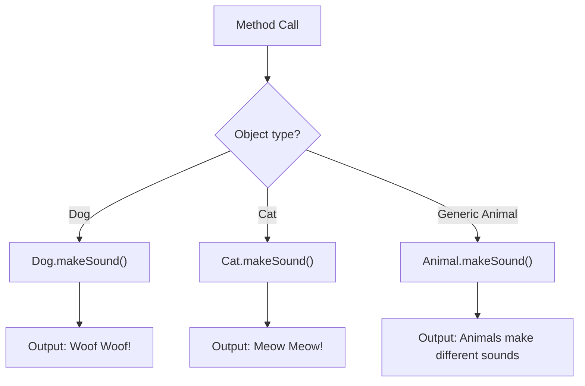

# Java Polymorphism

## Introduction

Polymorphism is one of the four fundamental principles of object-oriented programming (OOP) along with encapsulation, inheritance, and abstraction. The word "polymorphism" comes from Greek, meaning "many forms." In Java, polymorphism allows objects to behave differently based on their actual runtime type, not just their declared type.

In simpler terms, polymorphism enables a single action to be performed in different ways. It allows methods to do different things based on the object it is acting upon, even though the method name remains the same.

## Types of Polymorphism in Java

Java supports two types of polymorphism:

1. **Compile-time Polymorphism** (Static Binding)
2. **Run-time Polymorphism** (Dynamic Binding)

Let's explore each type in detail.

### Compile-time Polymorphism

Compile-time polymorphism, also known as static polymorphism, is achieved through **method overloading**. This occurs when multiple methods in the same class have the same name but different parameters.

#### Method Overloading Example

```java
public class Calculator {
    // Method with two int parameters
    public int add(int a, int b) {
        return a + b;
    }
    
    // Method with three int parameters
    public int add(int a, int b, int c) {
        return a + b + c;
    }
    
    // Method with two double parameters
    public double add(double a, double b) {
        return a + b;
    }
}

public class Main {
    public static void main(String[] args) {
        Calculator calc = new Calculator();
        
        // Calling the first add method
        System.out.println("Sum of 5 and 10: " + calc.add(5, 10)); // Output: 15
        
        // Calling the second add method
        System.out.println("Sum of 5, 10, and 15: " + calc.add(5, 10, 15)); // Output: 30
        
        // Calling the third add method
        System.out.println("Sum of 5.5 and 10.5: " + calc.add(5.5, 10.5)); // Output: 16.0
    }
}
```

In this example, the `add` method is overloaded with different parameter lists. The Java compiler determines which method to call based on the arguments provided.

### Run-time Polymorphism

Run-time polymorphism, or dynamic polymorphism, is achieved through **method overriding**. This happens when a subclass provides a specific implementation of a method that is already defined in its parent class.

#### Method Overriding Example

```java
// Parent class
class Animal {
    public void makeSound() {
        System.out.println("Animals make different sounds");
    }
}

// Child class
class Dog extends Animal {
    @Override
    public void makeSound() {
        System.out.println("Dog barks: Woof Woof!");
    }
}

// Child class
class Cat extends Animal {
    @Override
    public void makeSound() {
        System.out.println("Cat meows: Meow Meow!");
    }
}

public class Main {
    public static void main(String[] args) {
        // Creating objects
        Animal myAnimal = new Animal();
        Animal myDog = new Dog();
        Animal myCat = new Cat();
        
        // Calling makeSound() method
        myAnimal.makeSound(); // Output: Animals make different sounds
        myDog.makeSound();    // Output: Dog barks: Woof Woof!
        myCat.makeSound();    // Output: Cat meows: Meow Meow!
    }
}
```

In this example, notice how the objects `myDog` and `myCat` are declared as type `Animal` but instantiated as `Dog` and `Cat` respectively. When we call the `makeSound()` method on these objects, Java executes the method specific to the object's actual type, not its declared type. This decision happens at runtime, which is why it's called runtime polymorphism.

## How Java Determines Which Method to Execute

Here's a visualization of how Java resolves method calls at runtime:



## Polymorphism with Interfaces

Interfaces provide another way to implement polymorphism in Java. By defining a common interface, different classes can implement the same method in different ways.

```java
// Common interface
interface Shape {
    double calculateArea();
}

// Implementing classes
class Circle implements Shape {
    private double radius;
    
    public Circle(double radius) {
        this.radius = radius;
    }
    
    @Override
    public double calculateArea() {
        return Math.PI * radius * radius;
    }
}

class Rectangle implements Shape {
    private double width;
    private double height;
    
    public Rectangle(double width, double height) {
        this.width = width;
        this.height = height;
    }
    
    @Override
    public double calculateArea() {
        return width * height;
    }
}

public class Main {
    public static void main(String[] args) {
        Shape circle = new Circle(5);
        Shape rectangle = new Rectangle(4, 6);
        
        System.out.println("Area of circle: " + circle.calculateArea()); 
        // Output: Area of circle: 78.53981633974483
        
        System.out.println("Area of rectangle: " + rectangle.calculateArea()); 
        // Output: Area of rectangle: 24.0
    }
}
```

In this example, both `Circle` and `Rectangle` classes implement the `Shape` interface and provide their own implementation of the `calculateArea()` method.

## Real-world Application: Polymorphism in GUI Programming

One practical application of polymorphism is in graphical user interface (GUI) programming. Consider a drawing application that allows users to draw different shapes:

```java
// Base class for all shapes
abstract class GraphicObject {
    int x, y;
    
    // These methods need to be implemented by subclasses
    abstract void draw();
    abstract void resize();
    
    // Common method for all shapes
    public void moveTo(int newX, int newY) {
        System.out.println("Moving from " + x + "," + y + " to " + newX + "," + newY);
        this.x = newX;
        this.y = newY;
    }
}

class Circle extends GraphicObject {
    @Override
    void draw() {
        System.out.println("Drawing a Circle at (" + x + "," + y + ")");
    }
    
    @Override
    void resize() {
        System.out.println("Resizing Circle");
    }
}

class Rectangle extends GraphicObject {
    @Override
    void draw() {
        System.out.println("Drawing a Rectangle at (" + x + "," + y + ")");
    }
    
    @Override
    void resize() {
        System.out.println("Resizing Rectangle");
    }
}

public class DrawingApp {
    public static void main(String[] args) {
        // Create an array of GraphicObject
        GraphicObject[] shapes = new GraphicObject[2];
        shapes[0] = new Circle();
        shapes[1] = new Rectangle();
        
        // Set initial positions
        shapes[0].x = 10;
        shapes[0].y = 10;
        shapes[1].x = 20;
        shapes[1].y = 20;
        
        // Draw all shapes
        for (GraphicObject shape : shapes) {
            shape.draw();
        }
        
        // Move all shapes
        for (GraphicObject shape : shapes) {
            shape.moveTo(shape.x + 5, shape.y + 5);
        }
        
        // Redraw all shapes
        for (GraphicObject shape : shapes) {
            shape.draw();
        }
    }
}
```

Output:
```
Drawing a Circle at (10,10)
Drawing a Rectangle at (20,20)
Moving from 10,10 to 15,15
Moving from 20,20 to 25,25
Drawing a Circle at (15,15)
Drawing a Rectangle at (25,25)
```

In this example, the drawing application doesn't need to know the specific type of shape it's working with. It simply calls the appropriate methods on each object, and polymorphism takes care of executing the correct implementation.

## Benefits of Polymorphism

1. **Code Reusability**: Polymorphism promotes code reuse by allowing the same method to work with different types of objects.

2. **Flexibility**: It provides flexibility to perform different operations based on the type of object, without needing to know the exact type at compile time.

3. **Extensibility**: New classes can be added with minimal changes to existing code, making the system more extensible.

4. **Simplicity**: It simplifies code by allowing you to treat different objects uniformly when they share a common interface or parent class.

## Common Pitfalls and Best Practices

### Pitfalls

1. **Overusing inheritance**: Deep inheritance hierarchies can make code harder to understand and maintain.

2. **Confusion with overloading vs. overriding**: Remember that overloading is compile-time polymorphism (same method name, different parameters), while overriding is runtime polymorphism (same method signature in parent and child classes).

### Best Practices

1. **Use the @Override annotation**: Always use the `@Override` annotation when overriding methods to catch errors at compile time.

2. **Prefer interfaces over implementation inheritance**: When possible, use interface inheritance rather than class inheritance for more flexibility.

3. **Program to interfaces**: Declare variables using interface types rather than implementation types.

```java
// Good practice
List<String> names = new ArrayList<>();

// Less flexible
ArrayList<String> names = new ArrayList<>();
```

4. **Keep hierarchies shallow**: Try to limit inheritance to 2-3 levels for better maintainability.

## Summary

Polymorphism is a powerful concept in Java and object-oriented programming that allows objects of different classes to be treated as objects of a common superclass. The two main types of polymorphism in Java are:

1. **Compile-time polymorphism**: Achieved through method overloading
2. **Run-time polymorphism**: Achieved through method overriding

Polymorphism enhances code flexibility, reusability, and maintainability. It's extensively used in frameworks, libraries, and applications to create more adaptable and extensible systems.

## Exercises

1. Create a `Vehicle` class with a method `speedUp()`. Then create subclasses `Car` and `Bicycle` that override this method with specific implementations.

2. Implement a simple calculator program that demonstrates method overloading.

3. Create an interface `Payable` with a method `calculatePay()`. Implement this interface in classes `Employee` and `Invoice` with different implementations.

4. Extend the drawing application example by adding more shapes (e.g., Triangle, Hexagon) and adding a color property to each shape.

## Additional Resources

- [Oracle Java Tutorials: Inheritance and Polymorphism](https://docs.oracle.com/javase/tutorial/java/IandI/polymorphism.html)
- [Java Design Patterns](https://java-design-patterns.com/) - Many design patterns rely on polymorphism
- [Effective Java by Joshua Bloch](https://www.oreilly.com/library/view/effective-java-3rd/9780134686097/) - Contains excellent advice on inheritance and polymorphism

Happy coding!