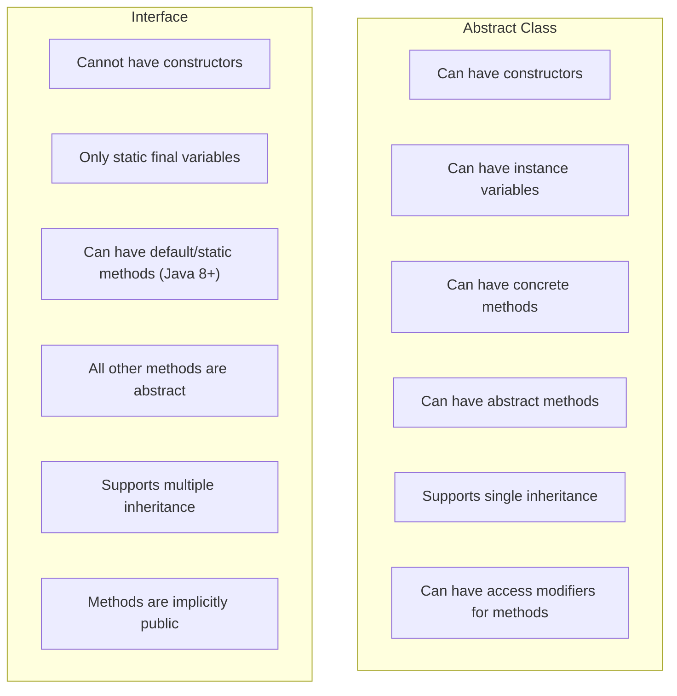

# Java Abstraction

## Introduction

Abstraction is one of the four fundamental principles of Object-Oriented Programming (OOP), alongside encapsulation, inheritance, and polymorphism. In Java, abstraction is the process of hiding the complex implementation details of a system and showing only the necessary features to the user.

Think of abstraction like driving a car - you just need to know how to use the steering wheel, pedals, and gears to drive it. You don't need to understand how the engine works internally. That's abstraction in real life!

In this tutorial, we'll explore:
- What abstraction is and why it's important
- How to implement abstraction using abstract classes
- How to implement abstraction using interfaces
- Practical examples of abstraction

## What is Abstraction?

Abstraction focuses on **what** an object does rather than **how** it does it. It provides a simplified view of an object by exposing only relevant details while hiding unnecessary implementation details.

### Benefits of Abstraction

- **Simplifies complexity**: Users interact with simple interfaces without worrying about background processes
- **Enhances security**: Implementation details are hidden
- **Enables code reusability**: Abstract components can be reused in different contexts
- **Facilitates maintenance**: Changes to implementation don't affect the abstraction usage

## Implementing Abstraction in Java

Java provides two primary ways to achieve abstraction:

1. Abstract classes
2. Interfaces

Let's explore each method in detail.

### Abstract Classes

An abstract class is a class that cannot be instantiated on its own and may contain abstract methods (methods without a body). It serves as a blueprint for other classes.

#### Key Characteristics of Abstract Classes:

- Declared with the `abstract` keyword
- Can have abstract and concrete methods (methods with implementation)
- Can have instance variables
- Can have constructors
- Can provide some implementation

#### Example: Abstract Class in Java

```java
// Abstract class
abstract class Animal {
    // Regular attribute
    protected String name;
    
    // Constructor
    public Animal(String name) {
        this.name = name;
    }
    
    // Regular method with implementation
    public void sleep() {
        System.out.println(name + " is sleeping");
    }
    
    // Abstract method (no implementation)
    abstract void makeSound();
}

// Concrete class extending abstract class
class Dog extends Animal {
    public Dog(String name) {
        super(name);
    }
    
    // Implementation of abstract method
    @Override
    void makeSound() {
        System.out.println(name + " says: Woof woof!");
    }
}

// Concrete class extending abstract class
class Cat extends Animal {
    public Cat(String name) {
        super(name);
    }
    
    // Implementation of abstract method
    @Override
    void makeSound() {
        System.out.println(name + " says: Meow meow!");
    }
}

// Main class
public class AbstractionDemo {
    public static void main(String[] args) {
        // Animal animal = new Animal("Generic Animal"); // Error: Cannot instantiate abstract class
        
        Dog dog = new Dog("Buddy");
        Cat cat = new Cat("Whiskers");
        
        dog.makeSound(); // Outputs: Buddy says: Woof woof!
        dog.sleep();     // Outputs: Buddy is sleeping
        
        cat.makeSound(); // Outputs: Whiskers says: Meow meow!
        cat.sleep();     // Outputs: Whiskers is sleeping
    }
}
```

In this example:
- `Animal` is an abstract class with one abstract method `makeSound()`
- `Dog` and `Cat` are concrete classes that extend `Animal` and implement the abstract method
- We cannot create an instance of `Animal` directly, but we can create instances of its concrete subclasses

### Interfaces

An interface is a completely abstract type that contains only abstract method declarations (method signatures without implementations) and constants.

#### Key Characteristics of Interfaces:

- All methods are implicitly abstract and public
- All variables are implicitly public, static, and final
- A class can implement multiple interfaces (unlike inheritance, where a class can extend only one class)
- Default and static methods with implementations are allowed since Java 8

#### Example: Interface in Java

```java
// Interface
interface Shape {
    // Constants
    double PI = 3.14; // implicitly public, static and final
    
    // Abstract methods (implicitly public and abstract)
    double calculateArea();
    double calculatePerimeter();
    
    // Default method (added in Java 8)
    default void display() {
        System.out.println("This is a shape");
    }
}

// Class implementing the interface
class Circle implements Shape {
    private double radius;
    
    public Circle(double radius) {
        this.radius = radius;
    }
    
    @Override
    public double calculateArea() {
        return PI * radius * radius;
    }
    
    @Override
    public double calculatePerimeter() {
        return 2 * PI * radius;
    }
    
    // Override default method (optional)
    @Override
    public void display() {
        System.out.println("This is a circle with radius: " + radius);
    }
}

// Another class implementing the interface
class Rectangle implements Shape {
    private double length;
    private double width;
    
    public Rectangle(double length, double width) {
        this.length = length;
        this.width = width;
    }
    
    @Override
    public double calculateArea() {
        return length * width;
    }
    
    @Override
    public double calculatePerimeter() {
        return 2 * (length + width);
    }
    
    @Override
    public void display() {
        System.out.println("This is a rectangle with length: " + length + " and width: " + width);
    }
}

// Main class
public class InterfaceDemo {
    public static void main(String[] args) {
        Circle circle = new Circle(5);
        Rectangle rectangle = new Rectangle(4, 5);
        
        System.out.println("Circle Area: " + circle.calculateArea());         // Outputs: Circle Area: 78.5
        System.out.println("Circle Perimeter: " + circle.calculatePerimeter()); // Outputs: Circle Perimeter: 31.4
        circle.display();                                                     // Outputs: This is a circle with radius: 5.0
        
        System.out.println("Rectangle Area: " + rectangle.calculateArea());         // Outputs: Rectangle Area: 20.0
        System.out.println("Rectangle Perimeter: " + rectangle.calculatePerimeter()); // Outputs: Rectangle Perimeter: 18.0
        rectangle.display();                                                       // Outputs: This is a rectangle with length: 4.0 and width: 5.0
    }
}
```

In this example:
- `Shape` is an interface with two abstract methods and one default method
- `Circle` and `Rectangle` are classes that implement the interface
- Each implementing class provides its own implementation of the abstract methods

## Abstract Class vs. Interface

Here's a comparison between abstract classes and interfaces:



## Real-World Example: Banking System

Let's implement a simple banking system using abstraction:

```java
// Abstract class
abstract class BankAccount {
    protected String accountNumber;
    protected double balance;
    protected String accountHolder;
    
    public BankAccount(String accountNumber, String accountHolder, double initialBalance) {
        this.accountNumber = accountNumber;
        this.accountHolder = accountHolder;
        this.balance = initialBalance;
    }
    
    // Common functionality
    public void deposit(double amount) {
        if (amount > 0) {
            balance += amount;
            System.out.println("Deposited: $" + amount);
            displayBalance();
        } else {
            System.out.println("Invalid deposit amount");
        }
    }
    
    public void displayBalance() {
        System.out.println("Current Balance: $" + balance);
    }
    
    public String getAccountDetails() {
        return "Account Holder: " + accountHolder + "\nAccount Number: " + accountNumber;
    }
    
    // Abstract methods that subclasses must implement
    abstract void withdraw(double amount);
    abstract void calculateInterest();
}

// Savings Account
class SavingsAccount extends BankAccount {
    private double interestRate;
    
    public SavingsAccount(String accountNumber, String accountHolder, double initialBalance, double interestRate) {
        super(accountNumber, accountHolder, initialBalance);
        this.interestRate = interestRate;
    }
    
    @Override
    void withdraw(double amount) {
        // Savings account specific withdrawal logic
        double minimumBalance = 100; // Minimum balance requirement
        
        if (amount > 0 && (balance - amount) >= minimumBalance) {
            balance -= amount;
            System.out.println("Withdrawn: $" + amount);
            displayBalance();
        } else {
            System.out.println("Insufficient funds or below minimum balance requirement");
        }
    }
    
    @Override
    void calculateInterest() {
        double interest = balance * interestRate / 100;
        balance += interest;
        System.out.println("Interest added: $" + interest);
        displayBalance();
    }
}

// Current Account
class CurrentAccount extends BankAccount {
    private double overdraftLimit;
    
    public CurrentAccount(String accountNumber, String accountHolder, double initialBalance, double overdraftLimit) {
        super(accountNumber, accountHolder, initialBalance);
        this.overdraftLimit = overdraftLimit;
    }
    
    @Override
    void withdraw(double amount) {
        // Current account specific withdrawal logic with overdraft
        if (amount > 0 && (balance + overdraftLimit) >= amount) {
            balance -= amount;
            System.out.println("Withdrawn: $" + amount);
            displayBalance();
        } else {
            System.out.println("Exceeds overdraft limit");
        }
    }
    
    @Override
    void calculateInterest() {
        // Current accounts typically don't earn interest
        System.out.println("No interest for current accounts");
    }
}

// Main class to demonstrate banking system
public class BankingSystem {
    public static void main(String[] args) {
        // BankAccount account = new BankAccount("123", "John", 1000); // Error: Cannot instantiate abstract class
        
        SavingsAccount savingsAccount = new SavingsAccount("S12345", "John Doe", 1000, 3.5);
        CurrentAccount currentAccount = new CurrentAccount("C67890", "Jane Smith", 2000, 500);
        
        System.out.println("==== Savings Account ====");
        System.out.println(savingsAccount.getAccountDetails());
        savingsAccount.deposit(500);
        savingsAccount.withdraw(200);
        savingsAccount.calculateInterest();
        
        System.out.println("\n==== Current Account ====");
        System.out.println(currentAccount.getAccountDetails());
        currentAccount.deposit(1000);
        currentAccount.withdraw(2500); // Using overdraft
        currentAccount.calculateInterest();
    }
}
```

**Output:**
```
==== Savings Account ====
Account Holder: John Doe
Account Number: S12345
Deposited: $500.0
Current Balance: $1500.0
Withdrawn: $200.0
Current Balance: $1300.0
Interest added: $45.5
Current Balance: $1345.5

==== Current Account ====
Account Holder: Jane Smith
Account Number: C67890
Deposited: $1000.0
Current Balance: $3000.0
Withdrawn: $2500.0
Current Balance: $500.0
No interest for current accounts
```

This example demonstrates:
- The `BankAccount` abstract class defines the common structure and behavior
- Specific account types (Savings and Current) implement the abstract methods according to their specific rules
- Users of these classes don't need to know the internal implementation details

## When to Use Abstraction

Use abstraction when:

1. You want to hide complex implementation details
2. You need to define a common interface for a group of related classes
3. You want to ensure certain methods are implemented by subclasses
4. You need to create a template for a group of classes

## Summary

Abstraction is a fundamental OOP concept that allows you to:

- Hide complex implementation details
- Focus on what an object does rather than how it does it
- Create reusable and maintainable code
- Implement through abstract classes and interfaces

In Java, you can achieve abstraction through:
- **Abstract classes**: When you need partial implementation and want to share code among closely related classes
- **Interfaces**: When you want to define a contract for unrelated classes to follow

Understanding and applying abstraction effectively will help you design more modular, maintainable, and scalable Java applications.

## Practice Exercises

1. Create an abstract `Employee` class with abstract methods like `calculateSalary()` and concrete methods like `displayDetails()`. Then create concrete classes like `FullTimeEmployee` and `PartTimeEmployee`.

2. Design a simple media player system with an interface called `MediaPlayer` that has methods like `play()`, `pause()`, and `stop()`. Then implement this interface in classes like `AudioPlayer` and `VideoPlayer`.

3. Create an abstract `Vehicle` class with abstract methods `startEngine()` and `stopEngine()`. Implement concrete subclasses for different types of vehicles like `Car`, `Motorcycle`, and `Truck`.

## Additional Resources

- [Oracle Java Documentation on Abstract Methods and Classes](https://docs.oracle.com/javase/tutorial/java/IandI/abstract.html)
- [Oracle Java Documentation on Interfaces](https://docs.oracle.com/javase/tutorial/java/IandI/createinterface.html)
- [Java Abstract Class vs Interface: What's the Difference?](https://www.baeldung.com/java-abstract-class-vs-interface)

Happy coding! 😊