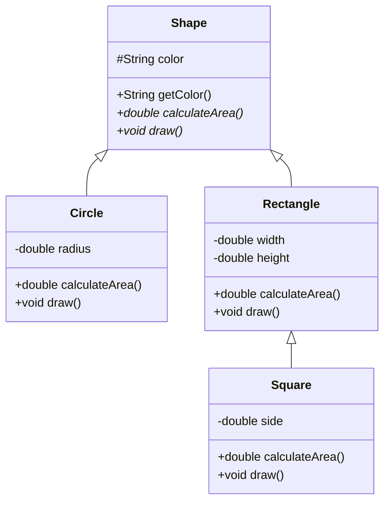

# Java Abstract Classes

## Introduction

When designing object-oriented systems in Java, sometimes you need to create a class that defines a concept but doesn't provide complete implementation details. This is where **abstract classes** come into play. Abstract classes serve as blueprints for other classes, defining common structures and behaviors while leaving specific implementations to their subclasses.

Think of an abstract class as a partially completed blueprint - it outlines the general structure but leaves some details for others to fill in. In Java, abstract classes bridge the gap between regular classes and interfaces, combining features from both.

## Understanding Abstract Classes

### What is an Abstract Class?

An abstract class is a class that:

- Is declared with the `abstract` keyword
- Cannot be instantiated (you cannot create objects directly from it)
- May contain abstract methods (methods without implementation)
- May also contain concrete methods (with implementation)
- Must be extended by subclasses that provide implementations for abstract methods

### Abstract Classes vs. Regular Classes

| Abstract Classes | Regular Classes |
|------------------|-----------------|
| Cannot be instantiated | Can be instantiated |
| May contain abstract methods | All methods must have implementations |
| Created to be extended | Can be final (preventing extension) |
| Can have constructors | Can have constructors |

### Abstract Classes vs. Interfaces

| Abstract Classes | Interfaces |
|------------------|-----------|
| Can have concrete methods | Before Java 8, only abstract methods; now can have default and static methods |
| Can have instance variables | Variables are public static final by default |
| Can have constructors | Cannot have constructors |
| Can provide partial implementation | Typically provide no implementation (except default methods) |
| A class can extend only one abstract class | A class can implement multiple interfaces |

## Creating Abstract Classes in Java

Let's see how to define an abstract class in Java:

```java
public abstract class Shape {
    // Instance variable
    protected String color;
    
    // Constructor
    public Shape(String color) {
        this.color = color;
    }
    
    // Concrete method
    public String getColor() {
        return color;
    }
    
    // Abstract method - no implementation
    public abstract double calculateArea();
    
    // Abstract method
    public abstract void draw();
}
```

In this example:
- `Shape` is an abstract class that cannot be instantiated
- It has a concrete method `getColor()` with implementation
- It has abstract methods `calculateArea()` and `draw()` without implementation

## Creating Concrete Subclasses

To use an abstract class, you need to create concrete subclasses that extend it and implement all its abstract methods:

```java
public class Circle extends Shape {
    private double radius;
    
    public Circle(String color, double radius) {
        super(color);  // Call to parent constructor
        this.radius = radius;
    }
    
    @Override
    public double calculateArea() {
        return Math.PI * radius * radius;
    }
    
    @Override
    public void draw() {
        System.out.println("Drawing a " + color + " circle with radius " + radius);
    }
}

public class Rectangle extends Shape {
    private double width;
    private double height;
    
    public Rectangle(String color, double width, double height) {
        super(color);
        this.width = width;
        this.height = height;
    }
    
    @Override
    public double calculateArea() {
        return width * height;
    }
    
    @Override
    public void draw() {
        System.out.println("Drawing a " + color + " rectangle with dimensions " + 
                           width + "x" + height);
    }
}
```

## Using Abstract Classes

Now let's see how to use these classes:

```java
public class AbstractClassDemo {
    public static void main(String[] args) {
        // Shape shape = new Shape("Red");  // Error: Cannot instantiate abstract class
        
        Shape circle = new Circle("Blue", 5.0);
        Shape rectangle = new Rectangle("Yellow", 4.0, 6.0);
        
        // Using methods from the abstract class
        System.out.println("Circle color: " + circle.getColor());
        
        // Using implemented abstract methods
        System.out.println("Circle area: " + circle.calculateArea());
        circle.draw();
        
        System.out.println("Rectangle area: " + rectangle.calculateArea());
        rectangle.draw();
    }
}
```

**Output:**
```
Circle color: Blue
Circle area: 78.53981633974483
Drawing a Blue circle with radius 5.0
Rectangle area: 24.0
Drawing a Yellow rectangle with dimensions 4.0x6.0
```

## Abstract Class Hierarchy

Abstract classes are particularly useful for creating hierarchies of objects. Let's visualize a simple class hierarchy:



This diagram shows how different concrete classes inherit from the abstract `Shape` class and provide their own implementations.

## Real-World Example: Document Processing System

Let's explore a more practical example where abstract classes truly shine. Imagine we're building a document processing system that handles different types of documents:

```java
public abstract class Document {
    protected String title;
    protected String author;
    protected String content;
    
    public Document(String title, String author, String content) {
        this.title = title;
        this.author = author;
        this.content = content;
    }
    
    // Getters and setters
    public String getTitle() { return title; }
    public String getAuthor() { return author; }
    public String getContent() { return content; }
    
    // Common functionality
    public void showInfo() {
        System.out.println("Document: " + title + " by " + author);
    }
    
    // Abstract methods to be implemented by specific document types
    public abstract void render();
    public abstract boolean canSign();
    public abstract String getFileExtension();
}

// PDF Document
public class PDFDocument extends Document {
    private int securityLevel;
    
    public PDFDocument(String title, String author, String content, int securityLevel) {
        super(title, author, content);
        this.securityLevel = securityLevel;
    }
    
    @Override
    public void render() {
        System.out.println("Rendering PDF content for: " + title);
        // PDF specific rendering code
    }
    
    @Override
    public boolean canSign() {
        return securityLevel >= 2; // Only secure PDFs can be signed
    }
    
    @Override
    public String getFileExtension() {
        return ".pdf";
    }
}

// Word Document
public class WordDocument extends Document {
    private boolean trackChanges;
    
    public WordDocument(String title, String author, String content, boolean trackChanges) {
        super(title, author, content);
        this.trackChanges = trackChanges;
    }
    
    @Override
    public void render() {
        System.out.println("Rendering Word document for: " + title);
        if (trackChanges) {
            System.out.println("(Track changes enabled)");
        }
        // Word specific rendering code
    }
    
    @Override
    public boolean canSign() {
        return true; // All Word documents can be signed
    }
    
    @Override
    public String getFileExtension() {
        return ".docx";
    }
    
    // Additional method specific to Word documents
    public void trackRevisions(boolean enable) {
        this.trackChanges = enable;
        System.out.println(enable ? "Tracking enabled" : "Tracking disabled");
    }
}
```

Now let's see how to use this document system:

```java
public class DocumentProcessingSystem {
    public static void main(String[] args) {
        Document[] documents = new Document[2];
        documents[0] = new PDFDocument("Annual Report", "Finance Team", "Financial data...", 3);
        documents[1] = new WordDocument("Meeting Minutes", "Secretary", "Topics discussed...", true);
        
        // Process all documents
        for (Document doc : documents) {
            System.out.println("\nProcessing: " + doc.getTitle());
            doc.showInfo();
            doc.render();
            
            System.out.println("Can be signed: " + (doc.canSign() ? "Yes" : "No"));
            System.out.println("File extension: " + doc.getFileExtension());
            
            // Access specific functionality if it's a Word document
            if (doc instanceof WordDocument) {
                WordDocument wordDoc = (WordDocument) doc;
                wordDoc.trackRevisions(false);
            }
        }
    }
}
```

**Output:**
```
Processing: Annual Report
Document: Annual Report by Finance Team
Rendering PDF content for: Annual Report
Can be signed: Yes
File extension: .pdf

Processing: Meeting Minutes
Document: Meeting Minutes by Secretary
Rendering Word document for: Meeting Minutes
(Track changes enabled)
Can be signed: Yes
File extension: .docx
Tracking disabled
```

This example shows how abstract classes allow us to:
1. Define common properties and behaviors (title, author, showInfo())
2. Enforce implementation of specific behaviors (render(), canSign())
3. Allow each document type to have its unique implementations and additional functionality
4. Process different document types polymorphically

## When to Use Abstract Classes

Abstract classes are ideal in the following scenarios:

1. **Class Hierarchy**: When building a class hierarchy where common functionality needs to be shared
2. **Partial Implementation**: When you want to provide some implementation while leaving other parts to be filled by subclasses
3. **Force Implementation**: When you want to force subclasses to implement certain methods
4. **Shared State**: When subclasses need to share state (instance variables) and behavior

## Best Practices

1. **Name Abstract Classes Meaningfully**: Choose names that reflect their role (e.g., `AbstractRepository`, `BaseController`)
2. **Consider Future Additions**: Design abstract classes with future subclasses in mind
3. **Don't Over-abstract**: Only make methods abstract if they truly need different implementations
4. **Use Interfaces Together**: Combine abstract classes with interfaces for maximum flexibility
5. **Keep the Hierarchy Simple**: Avoid deep inheritance hierarchies that are hard to understand
6. **Document Purpose**: Clearly document the purpose of abstract methods and expected behavior

## Summary

Abstract classes in Java provide a powerful way to:

- Create partially implemented classes that serve as templates
- Define required behaviors that subclasses must implement
- Share common code among related classes
- Establish a clear class hierarchy with inheritance

They strike a balance between the strict contracts of interfaces and the full implementation of concrete classes, making them an essential tool in object-oriented design.

## Exercises

1. Create an abstract `Vehicle` class with properties like `make`, `model`, and `year`. Add abstract methods `startEngine()` and `stopEngine()`. Then create concrete classes `Car` and `Motorcycle` that extend this class.

2. Design a banking system with an abstract `Account` class and concrete subclasses like `SavingsAccount` and `CheckingAccount`. Include abstract methods for `withdraw()` and `deposit()`.

3. Create an abstract `Employee` class and implement subclasses like `Manager`, `Developer`, and `Salesperson`. Include abstract methods for calculating salaries and benefits.

## Additional Resources

- [Oracle's Java Documentation on Abstract Classes](https://docs.oracle.com/javase/tutorial/java/IandI/abstract.html)
- [Java Abstract Classes vs. Interfaces](https://www.baeldung.com/java-abstract-class-vs-interface)
- [Design Patterns: When to use abstract classes vs interfaces](https://www.digitalocean.com/community/tutorials/abstract-class-vs-interface-java)
- Book: "Effective Java" by Joshua Bloch - Chapter on Classes and Interfaces