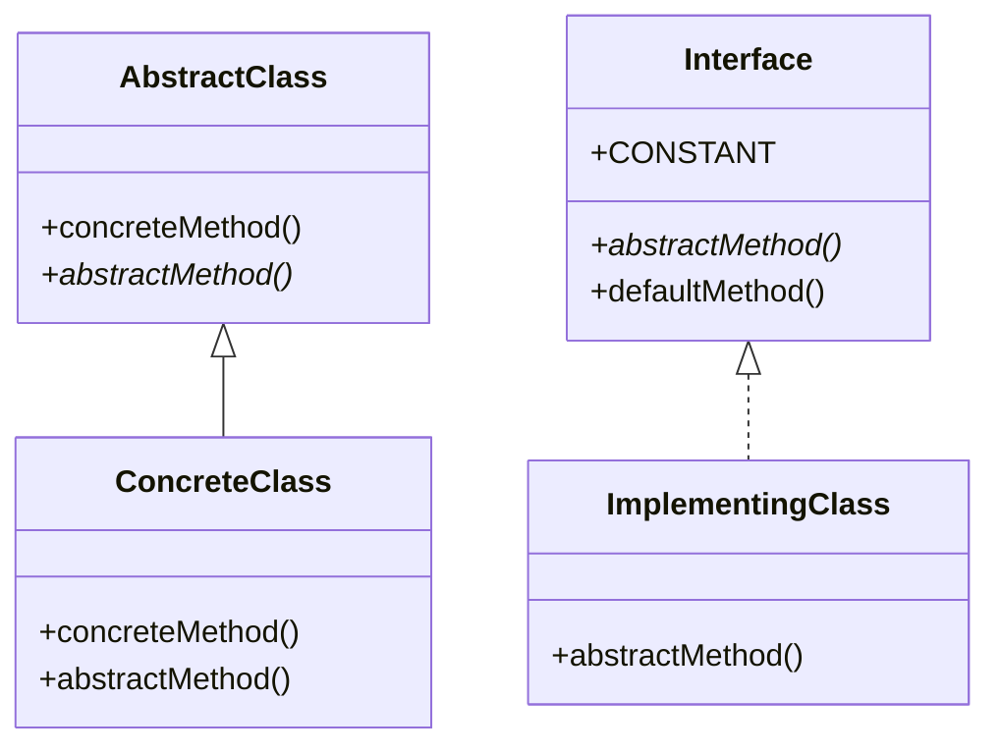

# Java Interfaces

## Introduction

In Java object-oriented programming, an interface defines a contract that classes can implement. Interfaces are a fundamental building block in Java that help achieve abstraction and polymorphism - two core principles of object-oriented programming.

An interface is like a blueprint that specifies what a class must do, without specifying how it should do it. When a class implements an interface, it promises to provide implementations for all the methods declared in that interface.

In this tutorial, we'll explore Java interfaces in detail, understand how they work, and learn their practical applications in real-world programming scenarios.

## What is a Java Interface?

A Java interface is a reference type, similar to a class, that contains a collection of abstract methods (methods without implementation). An interface can also contain constants, default methods, static methods, and nested types.

### Key Characteristics of Interfaces

- All methods in an interface are implicitly `public` and `abstract` (prior to Java 8)
- An interface cannot be instantiated
- A class can implement multiple interfaces (unlike inheritance, where a class can extend only one class)
- Interfaces can extend other interfaces

## Creating an Interface

Here's the basic syntax for defining an interface in Java:

```java
public interface InterfaceName {
    // Constant declarations
    // Method declarations
    // Default methods
    // Static methods
}
```

Let's create a simple interface for a shape:

```java
public interface Shape {
    // Constants
    double PI = 3.14159; // Implicitly public, static, and final
    
    // Abstract methods
    double calculateArea(); // Implicitly public and abstract
    double calculatePerimeter();
}
```

## Implementing an Interface

To implement an interface, a class uses the `implements` keyword. The implementing class must provide implementations for all the abstract methods defined in the interface.

```java
public class Circle implements Shape {
    private double radius;
    
    public Circle(double radius) {
        this.radius = radius;
    }
    
    @Override
    public double calculateArea() {
        return PI * radius * radius;
    }
    
    @Override
    public double calculatePerimeter() {
        return 2 * PI * radius;
    }
}
```

Let's see how to use this implementation:

```java
public class ShapeDemo {
    public static void main(String[] args) {
        Shape circle = new Circle(5.0);
        
        System.out.println("Circle area: " + circle.calculateArea());
        System.out.println("Circle perimeter: " + circle.calculatePerimeter());
    }
}
```

**Output:**
```
Circle area: 78.53975
Circle perimeter: 31.4159
```

## Multiple Interface Implementation

A class can implement multiple interfaces, which is one of the key advantages over inheritance. This allows for greater flexibility in class design.

```java
public interface Drawable {
    void draw();
}

public class Rectangle implements Shape, Drawable {
    private double length;
    private double width;
    
    public Rectangle(double length, double width) {
        this.length = length;
        this.width = width;
    }
    
    @Override
    public double calculateArea() {
        return length * width;
    }
    
    @Override
    public double calculatePerimeter() {
        return 2 * (length + width);
    }
    
    @Override
    public void draw() {
        System.out.println("Drawing a rectangle");
    }
}
```

## Interface Evolution in Java

Java 8 introduced significant enhancements to interfaces:

### Default Methods

Default methods have an implementation within the interface. This feature was added to enable interface evolution without breaking existing implementations.

```java
public interface Vehicle {
    void accelerate();
    void brake();
    
    // Default method
    default void honk() {
        System.out.println("Beep beep!");
    }
}
```

### Static Methods

Static methods in interfaces are similar to static methods in classes. They belong to the interface rather than to the implementing classes.

```java
public interface MathOperations {
    double add(double a, double b);
    double subtract(double a, double b);
    
    // Static method
    static double multiply(double a, double b) {
        return a * b;
    }
}
```

### Using Default and Static Methods

```java
public class Car implements Vehicle {
    @Override
    public void accelerate() {
        System.out.println("Car is accelerating");
    }
    
    @Override
    public void brake() {
        System.out.println("Car is braking");
    }
    
    public static void main(String[] args) {
        Car car = new Car();
        car.accelerate();
        car.brake();
        car.honk(); // Using default method
    }
}
```

**Output:**
```
Car is accelerating
Car is braking
Beep beep!
```

## Functional Interfaces

A functional interface is an interface with exactly one abstract method. They are the basis for lambda expressions in Java 8 and later.

```java
@FunctionalInterface
public interface Greeting {
    void greet(String name);
}
```

Using a functional interface with a lambda expression:

```java
public class FunctionalInterfaceDemo {
    public static void main(String[] args) {
        // Implementation using a lambda expression
        Greeting greeting = (name) -> System.out.println("Hello, " + name + "!");
        
        greeting.greet("Java Programmer");
    }
}
```

**Output:**
```
Hello, Java Programmer!
```

## Interface vs. Abstract Class

To better understand interfaces, it's helpful to compare them with abstract classes:



| Feature                             | Interface                                                                | Abstract Class                              |
|-------------------------------------|--------------------------------------------------------------------------|---------------------------------------------|
| Multiple implementation/inheritance | A class can implement multiple interfaces                                | A class can extend only one abstract class  |
| State                               | Contains only constants (public static final)                            | Can have instance variables                 |
| Constructor                         | Cannot have constructors                                                 | Can have constructors                       |
| Method implementation               | Prior to Java 8: No implementations, Java 8+: Default and static methods | Can have both abstract and concrete methods |
| Access modifiers                    | All methods are implicitly public                                        | Can use any access modifier                 |

## Practical Applications of Interfaces

### 1. Creating Pluggable Architecture

Interfaces allow you to create systems where components can be swapped out without changing the core code.

```java
public interface DatabaseConnector {
    void connect();
    void executeQuery(String query);
    void disconnect();
}

public class MySQLConnector implements DatabaseConnector {
    @Override
    public void connect() {
        System.out.println("Connecting to MySQL database");
    }
    
    @Override
    public void executeQuery(String query) {
        System.out.println("Executing query on MySQL: " + query);
    }
    
    @Override
    public void disconnect() {
        System.out.println("Disconnecting from MySQL database");
    }
}

public class PostgreSQLConnector implements DatabaseConnector {
    @Override
    public void connect() {
        System.out.println("Connecting to PostgreSQL database");
    }
    
    @Override
    public void executeQuery(String query) {
        System.out.println("Executing query on PostgreSQL: " + query);
    }
    
    @Override
    public void disconnect() {
        System.out.println("Disconnecting from PostgreSQL database");
    }
}
```

Using the database connectors:

```java
public class DatabaseApp {
    public static void main(String[] args) {
        // Can easily switch between database implementations
        DatabaseConnector db = new MySQLConnector();
        // DatabaseConnector db = new PostgreSQLConnector();
        
        db.connect();
        db.executeQuery("SELECT * FROM users");
        db.disconnect();
    }
}
```

### 2. Achieving Polymorphism

Interfaces are crucial for polymorphism in Java:

```java
public interface PaymentProcessor {
    boolean processPayment(double amount);
}

public class CreditCardProcessor implements PaymentProcessor {
    @Override
    public boolean processPayment(double amount) {
        System.out.println("Processing $" + amount + " via Credit Card");
        // Credit card processing logic
        return true;
    }
}

public class PayPalProcessor implements PaymentProcessor {
    @Override
    public boolean processPayment(double amount) {
        System.out.println("Processing $" + amount + " via PayPal");
        // PayPal processing logic
        return true;
    }
}

public class CheckoutService {
    private PaymentProcessor paymentProcessor;
    
    public CheckoutService(PaymentProcessor paymentProcessor) {
        this.paymentProcessor = paymentProcessor;
    }
    
    public void checkout(double amount) {
        if (paymentProcessor.processPayment(amount)) {
            System.out.println("Payment successful!");
        } else {
            System.out.println("Payment failed!");
        }
    }
    
    public static void main(String[] args) {
        // Using credit card
        CheckoutService creditCardCheckout = new CheckoutService(new CreditCardProcessor());
        creditCardCheckout.checkout(100.50);
        
        // Using PayPal
        CheckoutService payPalCheckout = new CheckoutService(new PayPalProcessor());
        payPalCheckout.checkout(100.50);
    }
}
```

**Output:**
```
Processing $100.5 via Credit Card
Payment successful!
Processing $100.5 via PayPal
Payment successful!
```

## Interface Inheritance

Interfaces can extend other interfaces:

```java
public interface Animal {
    void eat();
    void sleep();
}

public interface Pet extends Animal {
    void play();
    void groom();
}

public class Dog implements Pet {
    @Override
    public void eat() {
        System.out.println("Dog is eating");
    }
    
    @Override
    public void sleep() {
        System.out.println("Dog is sleeping");
    }
    
    @Override
    public void play() {
        System.out.println("Dog is playing fetch");
    }
    
    @Override
    public void groom() {
        System.out.println("Dog is being groomed");
    }
}
```

## Best Practices for Using Interfaces

1. **Design for change**: Use interfaces to define types that might have different implementations now or in the future
2. **Keep interfaces focused**: Follow the Interface Segregation Principle (ISP) - create small, specific interfaces rather than large, general ones
3. **Favor composition over inheritance**: Use interfaces to compose behavior rather than relying solely on class inheritance
4. **Document your interfaces**: Include clear documentation on how implementations should behave
5. **Be cautious with default methods**: Use them sparingly and mainly for backward compatibility

## Summary

Java interfaces are a powerful tool for creating clean, maintainable code:

- They define a contract that implementing classes must follow
- They enable abstraction by hiding implementation details
- They facilitate polymorphism by allowing different implementations
- They permit a form of multiple inheritance in Java
- With Java 8 and later, interfaces can include default and static methods

Interfaces help to separate what a class does from how it does it, which is a fundamental principle in good object-oriented design. By using interfaces effectively, you can create more flexible, extensible, and maintainable Java applications.

## Exercise Challenges

1. Create a `Sortable` interface with a `sort()` method, and implement it in both `BubbleSort` and `QuickSort` classes
2. Design a music player system using interfaces like `Playable`, `Pausable`, and `Stoppable`
3. Implement a `Logger` interface with multiple implementations (`ConsoleLogger`, `FileLogger`, `DatabaseLogger`)
4. Create a `Calculator` interface with default methods for basic operations and implement it in a `ScientificCalculator` class
5. Design a simple game with a `GameCharacter` interface and various character classes implementing it

## Additional Resources

- [Java Documentation on Interfaces](https://docs.oracle.com/javase/tutorial/java/IandI/createinterface.html)
- [Design Patterns using Interfaces](https://refactoring.guru/design-patterns/java)
- [Effective Java by Joshua Bloch](https://www.oreilly.com/library/view/effective-java-3rd/9780134686097/)