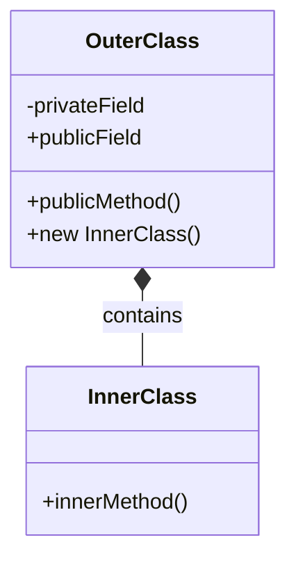

```jsx
---
title: Java Inner Classes
description: Learn about inner classes in Java, their types, usage patterns, and practical applications in object-oriented programming.

---

# Java Inner Classes

## Introduction

Inner classes are a special feature of Java that allows you to define a class within another class. They represent a powerful concept in object-oriented programming that enhances encapsulation, promotes better organization of code, and provides a way to logically group classes that are only used in one place.

In this tutorial, we'll explore the different types of inner classes in Java, understand their syntax, and learn about their practical applications through examples.

## What are Inner Classes?

An inner class is a class that is defined within another class. The inner class exists within the context of its enclosing (outer) class and has access to all members of the outer class, including private members.



There are four types of inner classes in Java:

1. **Regular Inner Classes** (Non-static nested classes)
2. **Static Nested Classes**
3. **Local Inner Classes** (defined inside a method)
4. **Anonymous Inner Classes** (without a name)

Let's explore each of these types in detail.

## Regular Inner Classes

A regular inner class is defined inside the body of another class but outside of any method. It has access to all members (fields and methods) of the outer class, even if they are declared private.

### Syntax and Basic Example

```java
class OuterClass {
    private int outerField = 10;
    
    // Inner class
    class InnerClass {
        void display() {
            // Can access private members of the outer class
            System.out.println("Outer field value: " + outerField);
        }
    }
    
    // Method to access inner class
    void accessInner() {
        InnerClass inner = new InnerClass();
        inner.display();
    }
}

public class Main {
    public static void main(String[] args) {
        // Creating an instance of outer class
        OuterClass outer = new OuterClass();
        
        // Accessing the inner class method through outer class
        outer.accessInner(); // Output: Outer field value: 10
        
        // Creating an instance of inner class directly
        OuterClass.InnerClass innerObj = outer.new InnerClass();
        innerObj.display(); // Output: Outer field value: 10
    }
}
```

### Key Points About Regular Inner Classes

1. An inner class instance is always associated with an instance of the outer class.
2. The inner class can access all members of the outer class, including private members.
3. To create an instance of an inner class outside the outer class, you need an instance of the outer class.
4. The inner class cannot have static members unless they are compile-time constants.

## Static Nested Classes

A static nested class is a class that is defined as a static member of another class. Unlike regular inner classes, a static nested class doesn't have access to the instance members of the outer class.

### Syntax and Basic Example

```java
class OuterClass {
    private static int staticOuterField = 10;
    private int instanceOuterField = 20;
    
    // Static nested class
    static class StaticNestedClass {
        void display() {
            // Can access only static members of the outer class
            System.out.println("Static outer field: " + staticOuterField);
            
            // Cannot access instance members directly
            // System.out.println(instanceOuterField); // This would cause a compile-time error
        }
    }
}

public class Main {
    public static void main(String[] args) {
        // Creating an instance of static nested class
        // No need for an outer class instance
        OuterClass.StaticNestedClass nestedObj = new OuterClass.StaticNestedClass();
        nestedObj.display(); // Output: Static outer field: 10
    }
}
```

### Key Points About Static Nested Classes

1. A static nested class doesn't need an instance of the outer class to be created.
2. It cannot access non-static (instance) members of the outer class directly.
3. It behaves like a top-level class that has been nested for packaging convenience.
4. It can contain both static and non-static members.

## Local Inner Classes

A local inner class is defined within a method or a block of code. It's only visible and accessible within the scope where it's defined.

### Syntax and Basic Example

```java
class OuterClass {
    private int outerField = 10;
    
    void method() {
        final int localVariable = 20; // Effectively final
        
        // Local inner class
        class LocalInnerClass {
            void display() {
                System.out.println("Outer field: " + outerField);
                System.out.println("Local variable: " + localVariable);
            }
        }
        
        // Create instance of local inner class
        LocalInnerClass local = new LocalInnerClass();
        local.display();
    }
}

public class Main {
    public static void main(String[] args) {
        OuterClass outer = new OuterClass();
        outer.method();
        /*
        Output:
        Outer field: 10
        Local variable: 20
        */
    }
}
```

### Key Points About Local Inner Classes

1. Local inner classes are not members of the outer class; they're defined within a method.
2. They can access all members of the enclosing class and local variables that are effectively final.
3. They cannot have access modifiers since they're not members of the outer class.
4. Local inner classes cannot be declared as static.

## Anonymous Inner Classes

An anonymous inner class is a local inner class without a name. It's declared and instantiated in a single expression using the `new` keyword.

### Syntax and Basic Example

```java
interface Greeting {
    void greet();
}

public class Main {
    public static void main(String[] args) {
        // Anonymous inner class implementing the Greeting interface
        Greeting englishGreeting = new Greeting() {
            @Override
            public void greet() {
                System.out.println("Hello!");
            }
        };
        
        englishGreeting.greet(); // Output: Hello!
        
        // Another anonymous inner class
        Greeting spanishGreeting = new Greeting() {
            @Override
            public void greet() {
                System.out.println("¡Hola!");
            }
        };
        
        spanishGreeting.greet(); // Output: ¡Hola!
    }
}
```

### Key Points About Anonymous Inner Classes

1. They are defined and instantiated at the same time.
2. They can implement an interface or extend a class.
3. They are primarily used when you need to use a class only once.
4. They can access effectively final local variables and all members of the enclosing class.

## Practical Applications of Inner Classes

Now that we understand the different types of inner classes, let's look at some practical applications:

### 1. Implementing Event Handlers

Anonymous inner classes are often used for implementing event handlers in GUI applications.

```java
import javax.swing.*;
import java.awt.event.*;

public class ButtonClickExample {
    public static void main(String[] args) {
        JFrame frame = new JFrame("Button Click Example");
        JButton button = new JButton("Click Me");
        
        // Anonymous inner class as an event handler
        button.addActionListener(new ActionListener() {
            @Override
            public void actionPerformed(ActionEvent e) {
                System.out.println("Button was clicked!");
            }
        });
        
        frame.add(button);
        frame.setSize(300, 200);
        frame.setDefaultCloseOperation(JFrame.EXIT_ON_CLOSE);
        frame.setVisible(true);
    }
}
```

### 2. Data Structures Implementation

Inner classes can be used to implement nodes for data structures like linked lists or trees.

```java
public class LinkedList {
    private Node head;
    
    // Inner class representing a node in the linked list
    private class Node {
        private int data;
        private Node next;
        
        public Node(int data) {
            this.data = data;
            this.next = null;
        }
    }
    
    // Add a new element to the list
    public void add(int data) {
        Node newNode = new Node(data);
        
        if (head == null) {
            head = newNode;
            return;
        }
        
        Node current = head;
        while (current.next != null) {
            current = current.next;
        }
        current.next = newNode;
    }
    
    // Display all elements in the list
    public void display() {
        Node current = head;
        while (current != null) {
            System.out.print(current.data + " -> ");
            current = current.next;
        }
        System.out.println("null");
    }
    
    public static void main(String[] args) {
        LinkedList list = new LinkedList();
        list.add(10);
        list.add(20);
        list.add(30);
        
        list.display(); // Output: 10 -> 20 -> 30 -> null
    }
}
```

### 3. Builder Pattern

Inner classes are often used in design patterns like the Builder pattern.

```java
public class Computer {
    // Required parameters
    private final String cpu;
    private final String ram;
    
    // Optional parameters
    private final String storage;
    private final String graphicsCard;
    
    private Computer(Builder builder) {
        this.cpu = builder.cpu;
        this.ram = builder.ram;
        this.storage = builder.storage;
        this.graphicsCard = builder.graphicsCard;
    }
    
    // Static inner class as a builder
    public static class Builder {
        // Required parameters
        private final String cpu;
        private final String ram;
        
        // Optional parameters
        private String storage;
        private String graphicsCard;
        
        public Builder(String cpu, String ram) {
            this.cpu = cpu;
            this.ram = ram;
        }
        
        public Builder storage(String storage) {
            this.storage = storage;
            return this;
        }
        
        public Builder graphicsCard(String graphicsCard) {
            this.graphicsCard = graphicsCard;
            return this;
        }
        
        public Computer build() {
            return new Computer(this);
        }
    }
    
    @Override
    public String toString() {
        StringBuilder sb = new StringBuilder();
        sb.append("Computer Specifications:\n");
        sb.append("CPU: ").append(cpu).append("\n");
        sb.append("RAM: ").append(ram).append("\n");
        
        if (storage != null) {
            sb.append("Storage: ").append(storage).append("\n");
        }
        
        if (graphicsCard != null) {
            sb.append("Graphics Card: ").append(graphicsCard);
        }
        
        return sb.toString();
    }
    
    public static void main(String[] args) {
        Computer computer = new Computer.Builder("Intel i7", "16GB")
                                .storage("1TB SSD")
                                .graphicsCard("NVIDIA RTX 3080")
                                .build();
        
        System.out.println(computer);
        /*
        Output:
        Computer Specifications:
        CPU: Intel i7
        RAM: 16GB
        Storage: 1TB SSD
        Graphics Card: NVIDIA RTX 3080
        */
    }
}
```

## When to Use Inner Classes

Inner classes are useful in the following scenarios:

1. **Logical Grouping**: When a class is only useful to one other class.
2. **Encapsulation**: To hide implementation details from other classes.
3. **Readability and Maintainability**: When code is more readable with inner classes.
4. **Access to Enclosing Instance State**: When a class needs access to private members of the outer class.
5. **Avoiding Name Conflicts**: To avoid name conflicts with classes in the same package.

## Summary

In this tutorial, we've explored Java inner classes, which are classes defined within other classes. We've covered:

- **Regular inner classes**: Non-static classes associated with an instance of the outer class.
- **Static nested classes**: Static classes that belong to their outer class.
- **Local inner classes**: Classes defined within methods.
- **Anonymous inner classes**: Unnamed classes defined at the point of instantiation.

Inner classes enhance Java's object-oriented programming capabilities by providing better encapsulation, organization, and more flexible code structures. They allow logical grouping of classes and enable access to the outer class's members, making them ideal for specific design patterns and scenarios.

## Exercises

1. Create a regular inner class that represents a Car's Engine, with the Engine having access to the Car's private fields.
2. Implement a static nested class that represents a configuration for an application.
3. Use a local inner class to process a list of strings within a method.
4. Create an anonymous inner class that implements the Runnable interface.
5. Design a simple text editor application that uses an inner class to manage document content.

## Additional Resources

- [Oracle Documentation on Nested Classes](https://docs.oracle.com/javase/tutorial/java/javaOO/nested.html)
- [Java Inner Classes - GeeksforGeeks](https://www.geeksforgeeks.org/inner-class-java/)
- [Inner Classes in Java - Baeldung](https://www.baeldung.com/java-inner-classes)
```