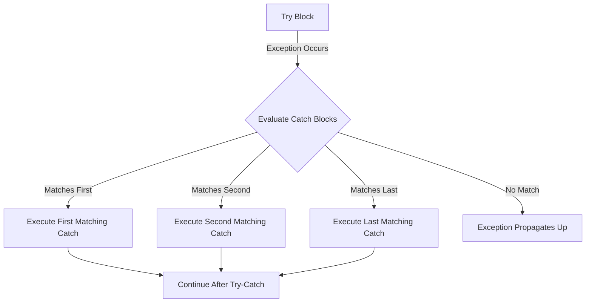

# Java Try Catch

## Introduction

When programs execute, they can encounter unexpected situations like missing files, network failures, or invalid user input. In Java, these situations are represented as **exceptions**. Without proper handling, exceptions can cause your program to crash abruptly. This is where the `try-catch` mechanism comes in.

Java's try-catch blocks allow you to:
- Anticipate potential errors
- Handle them gracefully
- Keep your program running even when problems occur

In this tutorial, you'll learn how to implement exception handling in Java using try-catch blocks, allowing you to write more robust and fault-tolerant applications.

## Understanding Try-Catch Blocks

### Basic Syntax

The try-catch block has a simple structure:

```java
try {
    // Code that might throw an exception
} catch (ExceptionType e) {
    // Code to handle the exception
}
```

Here's how it works:
1. The **try block** contains code that might cause an exception
2. The **catch block** contains code that handles the exception if it occurs

### A Simple Example

Let's start with a basic example - dividing by zero:

```java
public class DivisionExample {
    public static void main(String[] args) {
        try {
            int result = 10 / 0; // This will throw an ArithmeticException
            System.out.println("Result: " + result); // This won't execute
        } catch (ArithmeticException e) {
            System.out.println("Error occurred: Cannot divide by zero");
            System.out.println("Exception message: " + e.getMessage());
        }
        System.out.println("Program continues execution...");
    }
}
```

**Output:**
```
Error occurred: Cannot divide by zero
Exception message: / by zero
Program continues execution...
```

In this example:
- The code attempts to divide 10 by 0
- Java throws an `ArithmeticException`
- The catch block catches this exception and executes its code
- The program continues running instead of crashing

## Multiple Catch Blocks

A single try block can have multiple catch blocks to handle different types of exceptions.

```java
public class MultipleCatchExample {
    public static void main(String[] args) {
        try {
            int[] numbers = {1, 2, 3};
            int result = numbers[5] / 0; // Two potential exceptions here
        } catch (ArrayIndexOutOfBoundsException e) {
            System.out.println("Array error: Tried to access an element that doesn't exist");
        } catch (ArithmeticException e) {
            System.out.println("Arithmetic error: Cannot divide by zero");
        } catch (Exception e) {
            System.out.println("Generic error: " + e.getMessage());
        }
        System.out.println("Program continues execution...");
    }
}
```

**Output:**
```
Array error: Tried to access an element that doesn't exist
Program continues execution...
```

### Important Note on Catch Order

Catch blocks are evaluated in order. Always place more specific exception types before more general ones. If you put `Exception` (which is a parent class) first, it would catch all exceptions, and more specific catches would never execute.



## The Finally Block

Sometimes you need to execute cleanup code regardless of whether an exception occurred. This is where the `finally` block comes in.

```java
public class FinallyExample {
    public static void main(String[] args) {
        try {
            System.out.println("Opening a file");
            // Code that might throw an exception
            int result = 10 / 0;
        } catch (ArithmeticException e) {
            System.out.println("Error: " + e.getMessage());
        } finally {
            System.out.println("Closing the file - this runs no matter what");
        }
    }
}
```

**Output:**
```
Opening a file
Error: / by zero
Closing the file - this runs no matter what
```

The finally block is perfect for:
- Closing files
- Closing database connections
- Releasing network resources
- Any cleanup operations that must happen

## Real-World Example: File Processing

Let's see a practical example of try-catch with file handling:

```java
import java.io.BufferedReader;
import java.io.FileReader;
import java.io.IOException;

public class FileProcessingExample {
    public static void main(String[] args) {
        BufferedReader reader = null;
        
        try {
            reader = new BufferedReader(new FileReader("data.txt"));
            String line;
            while ((line = reader.readLine()) != null) {
                System.out.println(line);
            }
        } catch (IOException e) {
            System.out.println("Error reading the file: " + e.getMessage());
        } finally {
            try {
                if (reader != null) {
                    reader.close();
                }
            } catch (IOException e) {
                System.out.println("Error closing the file: " + e.getMessage());
            }
        }
    }
}
```

If the file "data.txt" doesn't exist, you'll see:

**Output:**
```
Error reading the file: data.txt (No such file or directory)
```

This example demonstrates:
1. Opening a file (which might not exist)
2. Catching file-related errors
3. Ensuring the file is closed in the finally block

## Try-With-Resources (Java 7+)

Since Java 7, there's a cleaner way to handle resources like files, called "try-with-resources":

```java
import java.io.BufferedReader;
import java.io.FileReader;
import java.io.IOException;

public class TryWithResourcesExample {
    public static void main(String[] args) {
        try (BufferedReader reader = new BufferedReader(new FileReader("data.txt"))) {
            String line;
            while ((line = reader.readLine()) != null) {
                System.out.println(line);
            }
        } catch (IOException e) {
            System.out.println("Error reading the file: " + e.getMessage());
        }
        // No need for finally - the resource is automatically closed
    }
}
```

This approach automatically closes resources defined in the try parentheses, making your code cleaner and less error-prone.

## Common Exception Types

Here are some common exceptions you might handle:

| Exception Type | When It Occurs |
|----------------|----------------|
| `NullPointerException` | When you try to use an object reference that's null |
| `ArrayIndexOutOfBoundsException` | When you try to access an array element that doesn't exist |
| `NumberFormatException` | When you try to convert a string to a number, but it's not valid |
| `IOException` | When an I/O operation fails (e.g., file not found) |
| `SQLException` | When a database operation fails |

## Best Practices for Try-Catch

1. **Don't catch exceptions you can't handle** - If you can't do anything useful in a catch block, consider letting the exception propagate.

2. **Catch specific exceptions** - Always catch the most specific exception possible rather than using the generic `Exception` class.

3. **Don't ignore exceptions** - Never have empty catch blocks. At minimum, log the exception.

   ```java
   // BAD:
   try {
       // risky code
   } catch (Exception e) {
       // Empty catch - don't do this!
   }
   
   // GOOD:
   try {
       // risky code
   } catch (IOException e) {
       System.err.println("File error: " + e.getMessage());
       // Or use a logging framework
   }
   ```

4. **Keep try blocks small** - Include only the code that might throw the exception you're trying to catch.

5. **Use finally or try-with-resources** - Always clean up resources properly.

## Summary

In this tutorial, you learned how to:
- Use try-catch blocks to handle exceptions
- Work with multiple catch blocks for different exception types
- Use the finally block for cleanup operations
- Implement try-with-resources for automatic resource management
- Follow best practices for exception handling

Exception handling is a critical skill for writing robust Java applications. With try-catch blocks, your programs can gracefully handle errors instead of crashing, providing a better experience for users.

## Exercises

1. Write a program that asks the user to enter two numbers and handles potential `InputMismatchException` and `ArithmeticException` when dividing them.

2. Create a program that reads a file and catches appropriate exceptions. Use try-with-resources.

3. Write code that demonstrates nesting try-catch blocks (a try-catch inside another try block).

4. Implement a calculator program that handles different types of errors with appropriate exception handling.

## Additional Resources

- [Oracle's Java Exception Handling Tutorial](https://docs.oracle.com/javase/tutorial/essential/exceptions/)
- [Java Exception Handling - Best Practices](https://www.baeldung.com/java-exceptions-best-practices)
- [Try-with-resources in Java](https://www.baeldung.com/java-try-with-resources)

Remember that effective exception handling is about finding the right balance between robustness and code readability. As you practice, you'll develop an intuition for when and how to apply these techniques.