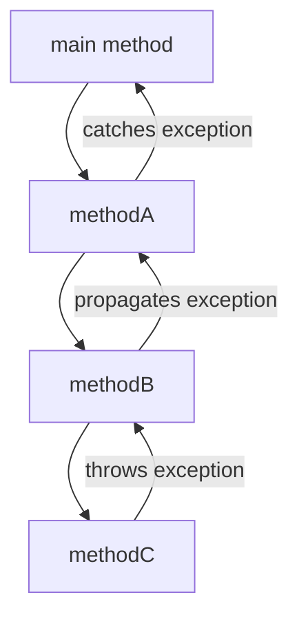

# Java Throw & Throws

Exception handling is a crucial aspect of writing robust Java applications. Two important keywords in Java's exception handling mechanism are `throw` and `throws`. These keywords serve different purposes but work together to help manage exceptions effectively.

## Introduction to Throw and Throws

In Java, exceptions represent unexpected events that disrupt the normal flow of program execution. The `throw` keyword is used to explicitly generate an exception, while the `throws` keyword declares which exceptions a method might throw to its caller.

Let's understand the fundamental differences:

| Keyword | Purpose | Used With | Effect |
|---------|---------|-----------|--------|
| `throw` | To explicitly throw an exception | An exception object | Triggers an exception |
| `throws` | To declare exceptions | Method signature | Warns that method might throw exceptions |

## The `throw` Keyword

The `throw` keyword allows you to manually throw an exception. This is useful when you detect an error condition in your code and want to signal it to the calling code.

### Basic Syntax

```java
throw exceptionObject;
```

### Simple Example

```java
public class ThrowExample {
    public static void main(String[] args) {
        try {
            // Throwing an exception explicitly
            throw new IllegalArgumentException("This is a demonstration of throw keyword");
        } catch (IllegalArgumentException e) {
            System.out.println("Caught exception: " + e.getMessage());
        }
    }
}
```

**Output**:
```
Caught exception: This is a demonstration of throw keyword
```

### When to Use `throw`

1. **Validation failures**: When input parameters don't meet requirements
2. **Business logic violations**: When business rules are broken
3. **State errors**: When an operation cannot be performed due to the current state of an object

### Example: Input Validation

```java
public class AgeValidator {
    public static void validateAge(int age) {
        if (age < 0) {
            throw new IllegalArgumentException("Age cannot be negative");
        } else if (age > 120) {
            throw new IllegalArgumentException("Age seems unrealistic");
        }
        
        System.out.println("Age " + age + " is valid");
    }
    
    public static void main(String[] args) {
        try {
            validateAge(25);  // Valid age
            validateAge(-5);  // This will throw an exception
        } catch (IllegalArgumentException e) {
            System.out.println("Validation error: " + e.getMessage());
        }
        
        System.out.println("Program continues...");
    }
}
```

**Output**:
```
Age 25 is valid
Validation error: Age cannot be negative
Program continues...
```

## The `throws` Keyword

The `throws` keyword appears in a method's signature and indicates that the method might throw certain exceptions that the caller should handle.

### Basic Syntax

```java
returnType methodName(parameters) throws ExceptionType1, ExceptionType2, ... {
    // Method body
}
```

### Simple Example

```java
import java.io.FileNotFoundException;
import java.io.FileReader;

public class ThrowsExample {
    // Declaring that this method might throw a FileNotFoundException
    public static void readFile(String fileName) throws FileNotFoundException {
        FileReader reader = new FileReader(fileName);
        // File operations...
    }
    
    public static void main(String[] args) {
        try {
            // Calling a method that declares it might throw an exception
            readFile("nonexistent.txt");
        } catch (FileNotFoundException e) {
            System.out.println("File not found: " + e.getMessage());
        }
    }
}
```

**Output**:
```
File not found: nonexistent.txt (No such file or directory)
```

### When to Use `throws`

1. **When you can't or don't want to handle an exception**: Pass the responsibility to the caller
2. **For checked exceptions**: Java requires you to either catch checked exceptions or declare them with `throws`
3. **To document method behavior**: It informs users about potential exceptions

## Exception Propagation

When an exception is thrown but not caught within a method, it gets propagated up the call stack until it's either caught or reaches the main method.



### Example of Exception Propagation

```java
public class ExceptionPropagation {
    public static void methodC() throws ArithmeticException {
        System.out.println("In methodC");
        // This will throw an ArithmeticException
        int result = 10 / 0;
    }
    
    public static void methodB() throws ArithmeticException {
        System.out.println("In methodB");
        methodC();
        System.out.println("methodB completed"); // This won't execute
    }
    
    public static void methodA() {
        System.out.println("In methodA");
        try {
            methodB();
        } catch (ArithmeticException e) {
            System.out.println("Caught exception in methodA: " + e.getMessage());
        }
        System.out.println("methodA completed");
    }
    
    public static void main(String[] args) {
        methodA();
        System.out.println("Program completed");
    }
}
```

**Output**:
```
In methodA
In methodB
In methodC
Caught exception in methodA: / by zero
methodA completed
Program completed
```

## Custom Exceptions

Creating custom exceptions using `throw` and `throws` allows you to define application-specific error conditions.

### Creating a Custom Exception

```java
// Custom exception class
class InsufficientFundsException extends Exception {
    private double amount;
    
    public InsufficientFundsException(double amount) {
        super("Insufficient funds: shortage of $" + amount);
        this.amount = amount;
    }
    
    public double getAmount() {
        return amount;
    }
}

// Usage of custom exception
public class BankAccount {
    private String accountNumber;
    private double balance;
    
    public BankAccount(String accountNumber, double initialBalance) {
        this.accountNumber = accountNumber;
        this.balance = initialBalance;
    }
    
    public void withdraw(double amount) throws InsufficientFundsException {
        if (amount > balance) {
            double shortageAmount = amount - balance;
            throw new InsufficientFundsException(shortageAmount);
        }
        
        balance -= amount;
        System.out.println("Withdrawal successful. New balance: $" + balance);
    }
    
    public static void main(String[] args) {
        BankAccount account = new BankAccount("123456", 500);
        
        try {
            account.withdraw(300);  // Successful withdrawal
            account.withdraw(300);  // Will throw InsufficientFundsException
        } catch (InsufficientFundsException e) {
            System.out.println("Transaction failed: " + e.getMessage());
            System.out.println("You are short by $" + e.getAmount());
        }
    }
}
```

**Output**:
```
Withdrawal successful. New balance: $200.0
Transaction failed: Insufficient funds: shortage of $100.0
You are short by $100.0
```

## Best Practices

1. **Be specific with exceptions**: Throw the most specific exception that applies to the situation.
2. **Document exceptions**: Clearly document which exceptions your method throws and under what conditions.
3. **Don't swallow exceptions**: Avoid empty catch blocks that hide exceptions without handling them.
4. **Use checked exceptions for recoverable conditions**: If the caller can reasonably recover from the exception.
5. **Use unchecked exceptions for programming errors**: For conditions that reflect bugs or unrecoverable states.

### Example: Good Exception Handling Pattern

```java
/**
 * Processes a file with user data
 * @param filePath the path to the file
 * @throws FileNotFoundException if the file doesn't exist
 * @throws IOException if there's an error reading the file
 * @throws InvalidDataException if the file contains invalid data
 */
public void processUserFile(String filePath) throws FileNotFoundException, IOException, InvalidDataException {
    File file = new File(filePath);
    
    if (!file.exists()) {
        throw new FileNotFoundException("The file " + filePath + " does not exist");
    }
    
    try (BufferedReader reader = new BufferedReader(new FileReader(file))) {
        String line;
        while ((line = reader.readLine()) != null) {
            if (!isValidUserData(line)) {
                throw new InvalidDataException("Invalid data found: " + line);
            }
            // Process the valid data...
        }
    }
}
```

## Throw vs. Throws: Common Mistakes

### Mistake 1: Confusing `throw` and `throws`

```java
// INCORRECT
public void incorrectMethod() throw new Exception(); // Won't compile

// CORRECT
public void correctMethod() throws Exception {
    throw new Exception();
}
```

### Mistake 2: Only Declaring Exceptions in `throws` Without Actually Throwing Them

```java
// BAD PRACTICE: Declares exceptions that are never thrown
public void badMethod() throws IOException, SQLException {
    // Method doesn't throw these exceptions
    System.out.println("This method doesn't throw anything");
}
```

### Mistake 3: Catching Exception Too Early

```java
// BAD PRACTICE: Catching and handling exceptions at too low a level
public void readFile(String fileName) {
    try {
        FileReader reader = new FileReader(fileName);
        // Process file...
    } catch (FileNotFoundException e) {
        // Handling here might prevent proper handling at higher level
        System.out.println("File not found");
    }
}

// BETTER APPROACH: Allow exception to propagate to appropriate handler
public void readFile(String fileName) throws FileNotFoundException {
    FileReader reader = new FileReader(fileName);
    // Process file...
}
```

## Real-World Application: File Processing System

Let's build a simple file processing system that demonstrates proper use of `throw` and `throws`:

```java
import java.io.*;
import java.util.ArrayList;
import java.util.List;

// Custom exceptions
class FileProcessingException extends Exception {
    public FileProcessingException(String message) {
        super(message);
    }
    
    public FileProcessingException(String message, Throwable cause) {
        super(message, cause);
    }
}

class InvalidDataFormatException extends FileProcessingException {
    public InvalidDataFormatException(String message) {
        super(message);
    }
}

// File processor
public class DataFileProcessor {
    /**
     * Processes a data file and returns the extracted data
     * @param filePath path to the data file
     * @return List of processed data lines
     * @throws FileProcessingException if any processing error occurs
     */
    public List<String> processDataFile(String filePath) throws FileProcessingException {
        List<String> processedData = new ArrayList<>();
        
        try (BufferedReader reader = new BufferedReader(new FileReader(filePath))) {
            String line;
            int lineNumber = 0;
            
            while ((line = reader.readLine()) != null) {
                lineNumber++;
                
                // Skip empty lines
                if (line.trim().isEmpty()) {
                    continue;
                }
                
                // Validate data format
                if (!line.contains(",")) {
                    throw new InvalidDataFormatException(
                        "Line " + lineNumber + " has invalid format. Expected comma-separated values."
                    );
                }
                
                // Process data (in this example, simply trim and add to list)
                processedData.add(line.trim());
            }
            
            return processedData;
            
        } catch (FileNotFoundException e) {
            throw new FileProcessingException("The file " + filePath + " was not found", e);
        } catch (IOException e) {
            throw new FileProcessingException("Error reading the file: " + e.getMessage(), e);
        }
    }
    
    public static void main(String[] args) {
        DataFileProcessor processor = new DataFileProcessor();
        
        try {
            // Process a file
            List<String> data = processor.processDataFile("sample_data.txt");
            System.out.println("Successfully processed " + data.size() + " data entries.");
            
            // Try to process a non-existent file
            processor.processDataFile("nonexistent.txt");
            
        } catch (FileProcessingException e) {
            System.out.println("File processing error: " + e.getMessage());
            
            // Print the original cause if available
            if (e.getCause() != null) {
                System.out.println("Caused by: " + e.getCause().getClass().getSimpleName() + 
                                   " - " + e.getCause().getMessage());
            }
        }
    }
}
```

In this real-world example, we:
1. Created custom exceptions that extend from a base exception
2. Used `throw` to signal specific error conditions
3. Used `throws` to declare which exceptions the method might throw
4. Caught low-level exceptions and wrapped them into more meaningful application-specific exceptions
5. Provided additional context information in the exceptions

## Summary

Understanding `throw` and `throws` is essential for effective exception handling in Java:

- **`throw`** is used to explicitly throw an exception in your code when an error condition is detected.
- **`throws`** declares which exceptions a method might throw, warning callers that they need to handle those exceptions.

Together, these keywords enable you to:
- Create more robust applications
- Make error handling more predictable
- Add clear semantics to your error conditions
- Properly separate error detection from error handling

## Additional Resources

- [Oracle Java Documentation: Exceptions](https://docs.oracle.com/javase/tutorial/essential/exceptions/index.html)
- [Java Exception Handling Best Practices](https://www.oracle.com/technical-resources/articles/java/javadoc-tool.html)
- [Effective Java by Joshua Bloch](https://www.oreilly.com/library/view/effective-java-3rd/9780134686097/) - Chapter on Exceptions

## Exercises

1. Create a custom exception called `PasswordTooWeakException` and use it in a password validation method.
2. Implement a division calculator that uses `throw` to handle division by zero and other invalid inputs.
3. Create a method chain with three levels, where an exception is thrown at the deepest level and caught at the top level.
4. Implement a file parser that reads a CSV file and throws appropriate exceptions for different error conditions.
5. Enhance the BankAccount example to include additional operations like deposit, transfer, and balance inquiry with proper exception handling.