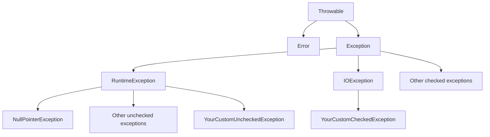

# Java Custom Exceptions

When working with Java applications, you often need to handle errors and exceptional situations. While Java provides many built-in exception classes, sometimes you need to create your own custom exceptions to better represent specific error conditions in your application. This guide will walk you through the process of creating and using custom exceptions in Java.

## Introduction to Custom Exceptions

In Java, exceptions are objects that represent exceptional conditions that occur during the execution of a program. The Java standard library includes many exception classes for common error conditions like `NullPointerException`, `ArrayIndexOutOfBoundsException`, and `IOException`. However, these built-in exceptions might not always effectively communicate the specific problems that can occur in your application.

Custom exceptions allow you to:

1. Create more descriptive exception types that are specific to your application's domain
2. Provide more meaningful error messages to users and developers
3. Handle application-specific error conditions more elegantly
4. Improve the readability and maintainability of your code

## Creating Custom Exceptions

Creating a custom exception in Java is straightforward. You typically extend either the `Exception` class (for checked exceptions) or the `RuntimeException` class (for unchecked exceptions).

### Basic Structure of a Custom Exception

Here's the basic structure of a custom exception:

```java
public class MyCustomException extends Exception {
    // Constructors
    public MyCustomException() {
        super();
    }
    
    public MyCustomException(String message) {
        super(message);
    }
    
    public MyCustomException(String message, Throwable cause) {
        super(message, cause);
    }
    
    public MyCustomException(Throwable cause) {
        super(cause);
    }
}
```

### Checked vs. Unchecked Custom Exceptions

The choice between creating a checked or unchecked custom exception depends on your specific needs:

- **Checked Exceptions**: Extend `Exception`. The compiler forces you to handle them using try-catch blocks or declare them in the method signature with `throws`.
- **Unchecked Exceptions**: Extend `RuntimeException`. They don't need to be explicitly caught or declared.



## Example 1: Creating a Simple Custom Exception

Let's create a simple custom exception for a banking application:

```java
// Custom checked exception
public class InsufficientFundsException extends Exception {
    private double amount;
    
    public InsufficientFundsException(double amount) {
        super("Insufficient funds: You need additional $" + amount);
        this.amount = amount;
    }
    
    public double getAmount() {
        return amount;
    }
}
```

Now, let's use this exception in a `BankAccount` class:

```java
public class BankAccount {
    private String accountNumber;
    private double balance;
    
    public BankAccount(String accountNumber, double initialBalance) {
        this.accountNumber = accountNumber;
        this.balance = initialBalance;
    }
    
    public void withdraw(double amount) throws InsufficientFundsException {
        if (amount <= 0) {
            throw new IllegalArgumentException("Withdrawal amount must be positive");
        }
        
        if (balance < amount) {
            double shortfall = amount - balance;
            throw new InsufficientFundsException(shortfall);
        }
        
        balance -= amount;
        System.out.println("Withdrawal successful. New balance: $" + balance);
    }
    
    // Other methods...
}
```

Here's how to use these classes:

```java
public class BankingDemo {
    public static void main(String[] args) {
        BankAccount account = new BankAccount("123456", 1000);
        
        try {
            account.withdraw(1500);
        } catch (InsufficientFundsException e) {
            System.out.println("Error: " + e.getMessage());
            System.out.println("You need additional $" + e.getAmount());
        }
    }
}
```

**Output:**
```
Error: Insufficient funds: You need additional $500.0
You need additional $500.0
```

## Example 2: Custom Unchecked Exception

Let's create a custom unchecked exception by extending `RuntimeException`:

```java
public class UserNotFoundException extends RuntimeException {
    private String userId;
    
    public UserNotFoundException(String userId) {
        super("User not found with ID: " + userId);
        this.userId = userId;
    }
    
    public String getUserId() {
        return userId;
    }
}
```

Using the custom unchecked exception in a user management system:

```java
import java.util.HashMap;
import java.util.Map;

public class UserService {
    private Map<String, User> users = new HashMap<>();
    
    public void addUser(User user) {
        users.put(user.getId(), user);
    }
    
    public User getUser(String userId) {
        User user = users.get(userId);
        
        if (user == null) {
            throw new UserNotFoundException(userId);
        }
        
        return user;
    }
}

class User {
    private String id;
    private String name;
    
    public User(String id, String name) {
        this.id = id;
        this.name = name;
    }
    
    public String getId() {
        return id;
    }
    
    public String getName() {
        return name;
    }
}
```

Usage example:

```java
public class UserServiceDemo {
    public static void main(String[] args) {
        UserService service = new UserService();
        service.addUser(new User("1", "Alice"));
        
        try {
            // This will work
            User alice = service.getUser("1");
            System.out.println("Found user: " + alice.getName());
            
            // This will throw UserNotFoundException
            User bob = service.getUser("2");
        } catch (UserNotFoundException e) {
            System.out.println(e.getMessage());
            System.out.println("Missing user ID: " + e.getUserId());
        }
    }
}
```

**Output:**
```
Found user: Alice
User not found with ID: 2
Missing user ID: 2
```

## Best Practices for Custom Exceptions

When creating and using custom exceptions, follow these best practices:

1. **Naming Convention**: Name your exception classes with the 'Exception' suffix.
   ```java
   public class ResourceNotFoundException extends Exception { }
   ```

2. **Provide Constructors**: Include multiple constructors like the standard exceptions:
   - A no-argument constructor
   - A constructor that takes a message
   - A constructor that takes a message and a cause
   - A constructor that takes just a cause

3. **Include Relevant Information**: Store any relevant information that might help diagnose the problem.
   ```java
   public class DatabaseConnectionException extends Exception {
       private String serverName;
       private int port;
       
       // Constructor, getters, etc.
   }
   ```

4. **Documentation**: Add JavaDoc comments to explain when this exception is thrown.

5. **Choose Appropriately**: Use checked exceptions for recoverable conditions and unchecked exceptions for programming errors.

6. **Exception Hierarchy**: Create an exception hierarchy if it makes sense for your application.
   ```java
   // Base exception
   public class ServiceException extends Exception { }
   
   // More specific exceptions
   public class DatabaseServiceException extends ServiceException { }
   public class NetworkServiceException extends ServiceException { }
   ```

## Example 3: Creating an Exception Hierarchy

Let's create a hierarchy of exceptions for a file processing application:

```java
// Base exception
public class FileProcessingException extends Exception {
    public FileProcessingException() {
        super();
    }
    
    public FileProcessingException(String message) {
        super(message);
    }
    
    public FileProcessingException(String message, Throwable cause) {
        super(message, cause);
    }
}

// More specific exceptions
public class FileFormatException extends FileProcessingException {
    private String expectedFormat;
    
    public FileFormatException(String message, String expectedFormat) {
        super(message);
        this.expectedFormat = expectedFormat;
    }
    
    public String getExpectedFormat() {
        return expectedFormat;
    }
}

public class FileSizeLimitExceededException extends FileProcessingException {
    private long maxSize;
    private long actualSize;
    
    public FileSizeLimitExceededException(long maxSize, long actualSize) {
        super("File size exceeds limit: " + actualSize + " bytes (max: " + maxSize + " bytes)");
        this.maxSize = maxSize;
        this.actualSize = actualSize;
    }
    
    public long getMaxSize() {
        return maxSize;
    }
    
    public long getActualSize() {
        return actualSize;
    }
}
```

Usage example:

```java
public class FileProcessor {
    private static final long MAX_FILE_SIZE = 1024 * 1024; // 1MB
    
    public void processFile(String filePath) throws FileProcessingException {
        File file = new File(filePath);
        
        // Check if file exists
        if (!file.exists()) {
            throw new FileProcessingException("File not found: " + filePath);
        }
        
        // Check file size
        if (file.length() > MAX_FILE_SIZE) {
            throw new FileSizeLimitExceededException(MAX_FILE_SIZE, file.length());
        }
        
        // Check file format
        if (!filePath.endsWith(".txt")) {
            throw new FileFormatException("Invalid file format", "txt");
        }
        
        // Process the file
        System.out.println("Processing file: " + filePath);
    }
}
```

Client code:

```java
public class FileProcessingDemo {
    public static void main(String[] args) {
        FileProcessor processor = new FileProcessor();
        
        try {
            processor.processFile("data.csv");
        } catch (FileSizeLimitExceededException e) {
            System.out.println("Error: " + e.getMessage());
            System.out.println("Maximum allowed size: " + e.getMaxSize() + " bytes");
        } catch (FileFormatException e) {
            System.out.println("Error: " + e.getMessage());
            System.out.println("Expected format: " + e.getExpectedFormat());
        } catch (FileProcessingException e) {
            System.out.println("Error processing file: " + e.getMessage());
        }
    }
}
```

**Output:**
```
Error: Invalid file format
Expected format: txt
```

## Real-World Applications of Custom Exceptions

Custom exceptions are particularly useful in the following scenarios:

1. **APIs and Libraries**: When creating APIs for others to use, custom exceptions help communicate specific error conditions to the API users.

2. **Domain-Specific Applications**: Applications in domains like finance, healthcare, or e-commerce often have specific requirements for error handling.

3. **Microservices**: Each microservice might have its own set of custom exceptions to handle service-specific error conditions.

4. **Multi-Layer Applications**: Custom exceptions can help with propagating errors between layers of an application, providing more context as they move up the stack.

## Summary

Custom exceptions in Java provide a way to represent application-specific error conditions more clearly. By creating your own exception classes, you can:

- Provide more meaningful error messages
- Include additional error-related data
- Create exception hierarchies to reflect the relationships between different error types
- Make your code more readable and maintainable

Remember to follow best practices when creating custom exceptions, and choose wisely between checked and unchecked exceptions based on whether the error is recoverable and whether client code should be forced to handle it.

## Exercises

1. Create a custom exception `EmailValidationException` that includes information about what validation rule was violated.

2. Build a simple library management system with custom exceptions for `BookNotFoundException`, `BookAlreadyBorrowedException`, and `BorrowLimitExceededException`.

3. Create an exception hierarchy for a banking application, with a base exception `BankingException` and specific exceptions like `InsufficientFundsException`, `AccountNotFoundException`, and `TransactionLimitExceededException`.

## Additional Resources

- [Java Documentation on Exceptions](https://docs.oracle.com/en/java/javase/17/docs/api/java.base/java/lang/Exception.html)
- [Oracle's Java Tutorials: Exceptions](https://docs.oracle.com/javase/tutorial/essential/exceptions/index.html)
- [Effective Java by Joshua Bloch](https://www.oreilly.com/library/view/effective-java-3rd/9780134686097/) - Item 72: Favor the use of standard exceptions

Happy coding!