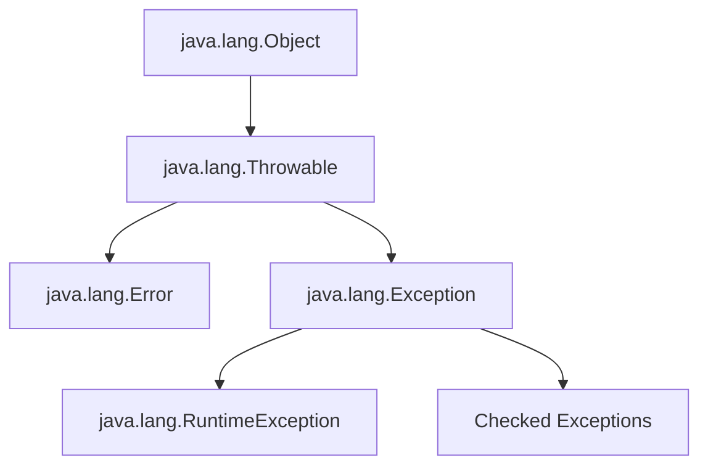

# Java Exception Hierarchy

## Introduction

When you're developing Java applications, encountering errors is inevitable. Java provides a robust mechanism for handling such errors through its exception handling framework. At the heart of this framework lies the **Java Exception Hierarchy**—a well-organized structure of classes that represent different types of exceptional conditions.

Understanding this hierarchy is crucial for effective error handling in your Java programs. It helps you identify what can go wrong, how to catch specific types of errors, and how to design your own custom exceptions when needed.

In this guide, we'll explore the Java exception hierarchy from top to bottom, understand its structure, and learn how to leverage it in your code.

## The Foundation: Throwable Class

At the root of Java's exception hierarchy is the `Throwable` class. This class is the superclass of all errors and exceptions in Java.



The `Throwable` class provides several methods that are inherited by all exceptions:

- `getMessage()` - Returns a detailed message about the exception
- `printStackTrace()` - Prints the stack trace to the standard error stream
- `getStackTrace()` - Returns the stack trace as an array of StackTraceElement objects
- `toString()` - Returns a short description of the Throwable

Here's a simple example showing how to use these methods:

```java
try {
    // Some code that might throw an exception
    int[] arr = new int[5];
    arr[10] = 50;  // This will throw an ArrayIndexOutOfBoundsException
} catch (Throwable t) {
    System.out.println("Message: " + t.getMessage());
    System.out.println("ToString: " + t.toString());
    t.printStackTrace();
}
```

Output:
```
Message: Index 10 out of bounds for length 5
ToString: java.lang.ArrayIndexOutOfBoundsException: Index 10 out of bounds for length 5
java.lang.ArrayIndexOutOfBoundsException: Index 10 out of bounds for length 5
    at ExceptionExample.main(ExceptionExample.java:5)
```

## The Two Main Branches: Error and Exception

The `Throwable` class has two direct subclasses: `Error` and `Exception`. These represent two fundamentally different categories of problems.

### Error Class

The `Error` class represents serious problems that a reasonable application should not try to catch. These are typically external to the application and are usually irrecoverable.

Common examples of `Error` subclasses include:

- `OutOfMemoryError` - Thrown when the JVM runs out of memory
- `StackOverflowError` - Thrown when a method calls itself too many times (infinite recursion)
- `NoClassDefFoundError` - Thrown when a required class definition cannot be found

Example of an `Error`:

```java
public class ErrorExample {
    public static void main(String[] args) {
        recursiveMethod(1);
    }
    
    // This will eventually cause a StackOverflowError
    public static void recursiveMethod(int i) {
        System.out.println("Recursive call: " + i);
        recursiveMethod(i + 1);
    }
}
```

Output (truncated):
```
Recursive call: 1
Recursive call: 2
...
Recursive call: 11418
Exception in thread "main" java.lang.StackOverflowError
```

Generally, you don't need to handle `Error` instances in your try-catch blocks, as they indicate conditions that your application usually cannot recover from.

### Exception Class

The `Exception` class represents conditions that a reasonable application might want to catch and handle. This is the class that most of your exception handling will focus on.

The `Exception` class is further divided into two main categories:

1. **Checked Exceptions** - Exceptions that extend directly from `Exception`
2. **Unchecked Exceptions** - Exceptions that extend from `RuntimeException` (which itself extends from `Exception`)

## Checked vs. Unchecked Exceptions

Understanding the distinction between checked and unchecked exceptions is crucial for Java programming.

### Checked Exceptions

Checked exceptions are exceptions that the Java compiler forces you to either catch (using try-catch) or declare (using throws) in your method signature. They represent conditions that a well-written application should anticipate and recover from.

Common checked exceptions include:

- `IOException` - For input/output operations
- `SQLException` - For database access operations
- `ClassNotFoundException` - When a class is not found
- `FileNotFoundException` - When a file is not found

Example of handling a checked exception:

```java
import java.io.File;
import java.io.FileNotFoundException;
import java.util.Scanner;

public class CheckedExceptionExample {
    public static void main(String[] args) {
        try {
            // This might throw a FileNotFoundException
            Scanner scanner = new Scanner(new File("nonexistent-file.txt"));
            while (scanner.hasNextLine()) {
                System.out.println(scanner.nextLine());
            }
            scanner.close();
        } catch (FileNotFoundException e) {
            System.out.println("The file was not found: " + e.getMessage());
        }
    }
}
```

Output:
```
The file was not found: nonexistent-file.txt (No such file or directory)
```

Alternatively, you can declare that your method throws the exception:

```java
import java.io.File;
import java.io.FileNotFoundException;
import java.util.Scanner;

public class CheckedExceptionExample {
    // Method declares that it throws FileNotFoundException
    public static void readFile(String fileName) throws FileNotFoundException {
        Scanner scanner = new Scanner(new File(fileName));
        while (scanner.hasNextLine()) {
            System.out.println(scanner.nextLine());
        }
        scanner.close();
    }
    
    public static void main(String[] args) {
        try {
            readFile("nonexistent-file.txt");
        } catch (FileNotFoundException e) {
            System.out.println("The file was not found: " + e.getMessage());
        }
    }
}
```

### Unchecked Exceptions (RuntimeExceptions)

Unchecked exceptions are those that extend from `RuntimeException`. The compiler doesn't force you to handle these exceptions, but they can still occur during program execution.

These exceptions usually represent programming errors, such as logic errors or improper use of an API.

Common unchecked exceptions include:

- `NullPointerException` - When you try to access methods or fields of a null object
- `ArrayIndexOutOfBoundsException` - When you try to access an array with an invalid index
- `ArithmeticException` - For arithmetic errors like division by zero
- `IllegalArgumentException` - When a method receives an illegal or inappropriate argument

Example of an unchecked exception:

```java
public class UncheckedExceptionExample {
    public static void main(String[] args) {
        // This will throw an ArithmeticException
        int result = divide(10, 0);
        System.out.println(result);  // This line will not be executed
    }
    
    public static int divide(int a, int b) {
        return a / b;  // This will throw ArithmeticException when b is 0
    }
}
```

Output:
```
Exception in thread "main" java.lang.ArithmeticException: / by zero
    at UncheckedExceptionExample.divide(UncheckedExceptionExample.java:9)
    at UncheckedExceptionExample.main(UncheckedExceptionExample.java:4)
```

To handle this exception:

```java
public class UncheckedExceptionExample {
    public static void main(String[] args) {
        try {
            int result = divide(10, 0);
            System.out.println(result);
        } catch (ArithmeticException e) {
            System.out.println("Cannot divide by zero: " + e.getMessage());
        }
    }
    
    public static int divide(int a, int b) {
        return a / b;
    }
}
```

Output:
```
Cannot divide by zero: / by zero
```

## Common Exceptions in the Hierarchy

Let's look at some common exceptions you'll encounter in Java programming:

### Common Checked Exceptions

1. **IOException**
   - Signals that an I/O exception of some sort has occurred
   - Subclasses include `FileNotFoundException`, `SocketException`, etc.

2. **SQLException**
   - An exception that provides information on a database access error
   - Important for JDBC programming

3. **ClassNotFoundException**
   - Thrown when an application tries to load a class through its string name using methods like `Class.forName()` but no definition for the class can be found

### Common Unchecked Exceptions (RuntimeExceptions)

1. **NullPointerException**
   - Thrown when an application attempts to use null where an object is required

2. **ArrayIndexOutOfBoundsException**
   - Thrown when an attempt is made to access an array element with an index that is negative or greater than or equal to the array's length

3. **IllegalArgumentException**
   - Thrown to indicate that a method has been passed an illegal or inappropriate argument

4. **NumberFormatException** (subclass of IllegalArgumentException)
   - Thrown when an attempt is made to convert a string to a numeric type but the string doesn't have the appropriate format

## Creating Custom Exceptions

Sometimes the standard exceptions don't adequately describe the error condition in your application. In such cases, you can create your own custom exceptions.

### Creating a Custom Checked Exception

```java
// Custom checked exception
public class InsufficientFundsException extends Exception {
    private double amount;
    
    public InsufficientFundsException(double amount) {
        super("Insufficient funds: You need additional $" + amount);
        this.amount = amount;
    }
    
    public double getAmount() {
        return amount;
    }
}
```

### Creating a Custom Unchecked Exception

```java
// Custom unchecked exception
public class InvalidProductException extends RuntimeException {
    private String productId;
    
    public InvalidProductException(String productId) {
        super("Invalid product ID: " + productId);
        this.productId = productId;
    }
    
    public String getProductId() {
        return productId;
    }
}
```

### Using Custom Exceptions in a Real-World Example

Here's a banking application example that uses custom exceptions:

```java
public class BankAccount {
    private String accountNumber;
    private double balance;
    
    public BankAccount(String accountNumber, double initialBalance) {
        this.accountNumber = accountNumber;
        this.balance = initialBalance;
    }
    
    public void deposit(double amount) throws IllegalArgumentException {
        if (amount <= 0) {
            throw new IllegalArgumentException("Deposit amount must be positive");
        }
        balance += amount;
    }
    
    public void withdraw(double amount) throws InsufficientFundsException, IllegalArgumentException {
        if (amount <= 0) {
            throw new IllegalArgumentException("Withdrawal amount must be positive");
        }
        
        if (amount > balance) {
            double shortfall = amount - balance;
            throw new InsufficientFundsException(shortfall);
        }
        
        balance -= amount;
    }
    
    public double getBalance() {
        return balance;
    }
    
    public String getAccountNumber() {
        return accountNumber;
    }
}

// Usage
public class BankDemo {
    public static void main(String[] args) {
        BankAccount account = new BankAccount("123456", 1000.0);
        
        try {
            System.out.println("Initial balance: $" + account.getBalance());
            
            account.deposit(500.0);
            System.out.println("After deposit: $" + account.getBalance());
            
            account.withdraw(800.0);
            System.out.println("After withdrawal: $" + account.getBalance());
            
            // This will throw InsufficientFundsException
            account.withdraw(1000.0);
        } catch (InsufficientFundsException e) {
            System.out.println(e.getMessage());
            System.out.println("You need additional $" + e.getAmount() + " to complete this withdrawal.");
        } catch (IllegalArgumentException e) {
            System.out.println("Invalid transaction: " + e.getMessage());
        }
    }
}
```

Output:
```
Initial balance: $1000.0
After deposit: $1500.0
After withdrawal: $700.0
Insufficient funds: You need additional $300.0
You need additional $300.0 to complete this withdrawal.
```

## The "throws" Clause and Exception Propagation

When a method is likely to throw a checked exception, but you don't want to handle it in that method, you can declare that the method throws the exception using the `throws` clause. This is known as exception propagation.

```java
public void readFile(String fileName) throws FileNotFoundException {
    // This method doesn't handle FileNotFoundException
    // It propagates it up to the calling method
    Scanner scanner = new Scanner(new File(fileName));
    // ...
}

public void processFile() {
    try {
        readFile("someFile.txt");
        // Process the file
    } catch (FileNotFoundException e) {
        // Handle the exception here
        System.out.println("File not found: " + e.getMessage());
    }
}
```

Exception propagation allows for separation of concerns. The method that detects the exception doesn't have to handle it if it's not the appropriate place to do so.

## Multi-catch and Try-with-resources

Java 7 introduced two important features for exception handling: multi-catch blocks and try-with-resources.

### Multi-catch Blocks

When multiple catch blocks have the same handling code, you can combine them:

```java
try {
    // Code that may throw exceptions
} catch (IOException | SQLException e) {
    // Handle both IOException and SQLException the same way
    System.out.println("Error: " + e.getMessage());
}
```

### Try-with-resources

This feature automatically closes resources that implement the `AutoCloseable` interface:

```java
// Before Java 7
BufferedReader reader = null;
try {
    reader = new BufferedReader(new FileReader("file.txt"));
    String line = reader.readLine();
    System.out.println(line);
} catch (IOException e) {
    System.out.println("Error: " + e.getMessage());
} finally {
    try {
        if (reader != null) {
            reader.close();
        }
    } catch (IOException e) {
        e.printStackTrace();
    }
}

// With try-with-resources (Java 7+)
try (BufferedReader reader = new BufferedReader(new FileReader("file.txt"))) {
    String line = reader.readLine();
    System.out.println(line);
} catch (IOException e) {
    System.out.println("Error: " + e.getMessage());
}
```

The try-with-resources approach is cleaner and less error-prone as it automatically handles proper resource closing, even when exceptions occur.

## Best Practices for Working with Java Exceptions

1. **Be specific with exceptions**: Catch the most specific exception possible rather than catching general exceptions like `Exception`.

2. **Don't catch exceptions you can't handle**: If you can't do anything about an exception, let it propagate up.

3. **Always provide meaningful error messages**: Make your exception messages clear and informative.

4. **Use finally blocks or try-with-resources for cleanup**: Ensure resources are properly closed.

5. **Log exceptions properly**: Use a logging framework to record exceptions.

6. **Don't ignore exceptions**: Never have empty catch blocks.

7. **Use checked exceptions for recoverable conditions**: If the caller can reasonably be expected to recover from an exception, make it a checked exception.

8. **Use runtime exceptions for programming errors**: If the exception represents a programming error, make it an unchecked exception.

## Summary

The Java exception hierarchy is a well-designed system for handling errors in Java programs:

- The `Throwable` class is the root of all exceptions and errors
- `Error` represents serious problems that programs should not try to handle
- `Exception` represents conditions that programs might want to handle
  - Checked exceptions (direct subclasses of Exception) must be handled or declared
  - Unchecked exceptions (subclasses of RuntimeException) don't need to be explicitly handled

Understanding this hierarchy allows you to:
- Write more robust code by anticipating and handling potential exceptions
- Design your own custom exceptions when needed
- Follow best practices for exception handling in Java

By properly utilizing Java's exception handling mechanisms, you can make your applications more resilient, debuggable, and maintainable.

## Additional Resources and Exercises

### Additional Resources
- [Oracle's Java Tutorial on Exceptions](https://docs.oracle.com/javase/tutorial/essential/exceptions/)
- [Java Exception Handling Best Practices](https://www.baeldung.com/java-exceptions-best-practices)

### Practice Exercises

1. **Exception Identification**
   Create a program that attempts various operations (division by zero, accessing null objects, array out of bounds, etc.) and identify what exceptions are thrown.

2. **Custom Exception Hierarchy**
   Design a custom exception hierarchy for a library management system. Include exceptions for situations like:
   - BookNotFoundException
   - UserNotAuthorizedException
   - BookAlreadyBorrowedException

3. **Exception Handling in a Real Application**
   Create a simple file processing application that reads data from a file, processes it, and writes results to another file. Implement proper exception handling for all potential issues.

4. **Try-with-resources Practice**
   Convert existing code that uses traditional try-catch-finally blocks to use try-with-resources where appropriate.

5. **Multi-catch Implementation**
   Find scenarios in your code where you can simplify multiple catch blocks using the multi-catch feature.

By understanding the Java exception hierarchy and following best practices, you'll be able to write more robust and maintainable code.