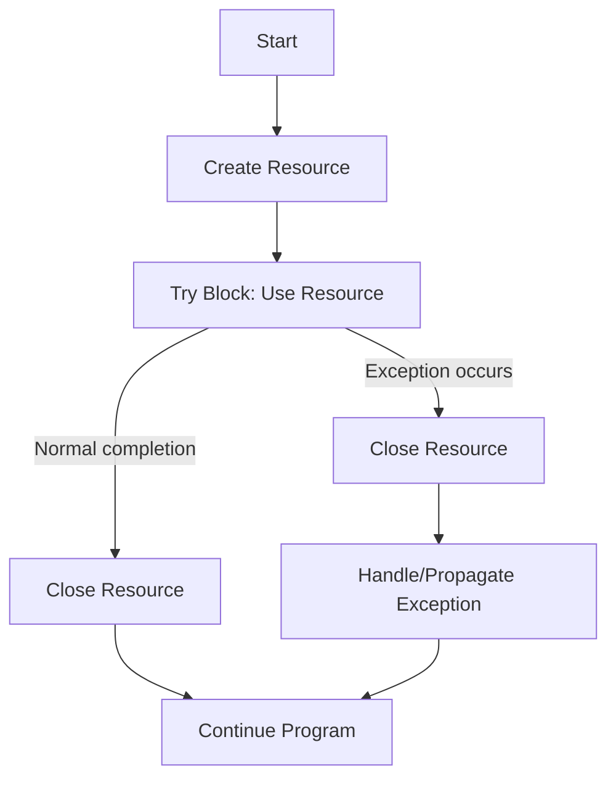

# Java Try-with-Resources

When working with external resources like files, database connections, or network connections in Java, proper resource management is crucial. Before Java 7, developers had to manually close these resources using `finally` blocks, which was error-prone and verbose. Enter the **try-with-resources** statement, a cleaner and more reliable approach to resource management.

## What is Try-with-Resources?

Try-with-resources is a language construct introduced in Java 7 that automatically manages resources that need to be closed after use. It ensures that each resource is closed at the end of the statement, regardless of whether the try block completes normally or due to an exception.

The key to this feature is the `AutoCloseable` interface. Any resource that implements this interface can be used with the try-with-resources statement.

## Basic Syntax

```java
try (ResourceType resource = new ResourceType()) {
    // Use the resource
} catch (Exception e) {
    // Handle exceptions
}
```

The resources declared in the parentheses after the `try` keyword are automatically closed when the try block exits, either normally or due to an exception.

## Simple Example: File Handling

Let's compare the traditional approach with try-with-resources for reading a file:

### Before Try-with-Resources (Java 6 and earlier)

```java
BufferedReader reader = null;
try {
    reader = new BufferedReader(new FileReader("example.txt"));
    String line;
    while ((line = reader.readLine()) != null) {
        System.out.println(line);
    }
} catch (IOException e) {
    System.err.println("Error reading file: " + e.getMessage());
} finally {
    try {
        if (reader != null) {
            reader.close();
        }
    } catch (IOException e) {
        System.err.println("Error closing reader: " + e.getMessage());
    }
}
```

### With Try-with-Resources (Java 7 and later)

```java
try (BufferedReader reader = new BufferedReader(new FileReader("example.txt"))) {
    String line;
    while ((line = reader.readLine()) != null) {
        System.out.println(line);
    }
} catch (IOException e) {
    System.err.println("Error reading file: " + e.getMessage());
}
```

Notice how much cleaner and more concise the second approach is. The `BufferedReader` will be automatically closed when the try block exits, even if an exception occurs.

## Multiple Resources

You can declare multiple resources in a try-with-resources statement by separating them with semicolons:

```java
try (FileInputStream input = new FileInputStream("input.txt");
     FileOutputStream output = new FileOutputStream("output.txt")) {
    
    // Read from input and write to output
    byte[] buffer = new byte[1024];
    int bytesRead;
    
    while ((bytesRead = input.read(buffer)) != -1) {
        output.write(buffer, 0, bytesRead);
    }
    
    System.out.println("File copied successfully!");
    
} catch (IOException e) {
    System.err.println("Error copying file: " + e.getMessage());
}
```

The resources are closed in reverse order of their declaration. In the example above, `output` would be closed before `input`.

## Creating Your Own AutoCloseable Resources

You can create your own custom resources that work with try-with-resources by implementing the `AutoCloseable` interface:

```java
public class DatabaseConnection implements AutoCloseable {
    private final String connectionString;
    
    public DatabaseConnection(String connectionString) {
        this.connectionString = connectionString;
        System.out.println("Opening connection to: " + connectionString);
        // Code to actually open connection would go here
    }
    
    public void executeQuery(String query) {
        System.out.println("Executing query: " + query);
        // Actual query execution code would go here
    }
    
    @Override
    public void close() throws Exception {
        System.out.println("Closing connection to: " + connectionString);
        // Code to close connection would go here
    }
}
```

Using our custom resource:

```java
public class DatabaseExample {
    public static void main(String[] args) {
        try (DatabaseConnection connection = new DatabaseConnection("jdbc:mydb://localhost")) {
            connection.executeQuery("SELECT * FROM users");
        } catch (Exception e) {
            System.err.println("Database error: " + e.getMessage());
        }
        System.out.println("Program continues...");
    }
}
```

Output:
```
Opening connection to: jdbc:mydb://localhost
Executing query: SELECT * FROM users
Closing connection to: jdbc:mydb://localhost
Program continues...
```

## Exception Handling in Try-with-Resources

The try-with-resources statement handles exceptions intelligently:

1. **Primary Exception**: The exception thrown from the try block
2. **Suppressed Exceptions**: Exceptions thrown when closing resources

If an exception occurs in the try block, and another exception occurs when closing a resource, the second exception is "suppressed" and attached to the primary exception. You can access these suppressed exceptions using the `getSuppressed()` method.

```java
public class ExceptionExample {
    public static void main(String[] args) {
        try (ProblemResource resource = new ProblemResource()) {
            System.out.println("Using the resource");
            throw new RuntimeException("Primary exception");
        } catch (Exception e) {
            System.out.println("Caught: " + e.getMessage());
            
            // Get suppressed exceptions
            Throwable[] suppressed = e.getSuppressed();
            for (Throwable t : suppressed) {
                System.out.println("Suppressed: " + t.getMessage());
            }
        }
    }
}

class ProblemResource implements AutoCloseable {
    @Override
    public void close() throws Exception {
        throw new Exception("Exception during close()");
    }
}
```

Output:
```
Using the resource
Caught: Primary exception
Suppressed: Exception during close()
```

## Resource Declaration Outside Try Block

Starting from Java 9, you can use resources declared before the try-with-resources statement, as long as they're marked `final` or are effectively final:

```java
// Java 9+ feature
public void processFile(String path) throws IOException {
    final BufferedReader reader = new BufferedReader(new FileReader(path));
    try (reader) { // Using a resource declared outside the try-with-resources
        String line;
        while ((line = reader.readLine()) != null) {
            System.out.println(line);
        }
    }
}
```

## Real-World Example: JDBC Database Access

Here's a practical example using JDBC to query a database:

```java
public List<User> getUsersFromDatabase() {
    List<User> users = new ArrayList<>();
    
    try (Connection connection = DriverManager.getConnection(DB_URL, USERNAME, PASSWORD);
         PreparedStatement statement = connection.prepareStatement("SELECT id, name, email FROM users");
         ResultSet resultSet = statement.executeQuery()) {
        
        while (resultSet.next()) {
            User user = new User(
                resultSet.getInt("id"),
                resultSet.getString("name"),
                resultSet.getString("email")
            );
            users.add(user);
        }
        
    } catch (SQLException e) {
        logger.error("Database error", e);
    }
    
    return users;
}
```

In this example, all three resources (Connection, PreparedStatement, and ResultSet) will be automatically closed in reverse order when the try block exits.

## Resource Management Flow

The following diagram illustrates how try-with-resources manages resource lifecycle:



## Best Practices for Try-with-Resources

1. **Always use try-with-resources** when dealing with resources that need to be closed.
2. **Implement `AutoCloseable`** for your custom resource classes.
3. **Close resources in the right order** by declaring them in the appropriate sequence (resources are closed in reverse order of declaration).
4. **Keep the try block focused** on operations that need the resource.
5. **Avoid resource leaks** by ensuring all resources implement `AutoCloseable` correctly.
6. **Handle suppressed exceptions** when necessary.

## Summary

Try-with-resources is a powerful Java feature that simplifies resource management and helps prevent resource leaks. By automatically closing resources when they are no longer needed, it eliminates the boilerplate code of traditional `finally` blocks and makes your code more robust and readable.

The main benefits of try-with-resources are:

- Automatic resource cleanup, even when exceptions occur
- Cleaner and more concise code
- Proper handling of exceptions during resource closing
- Support for multiple resources

Next time you work with files, database connections, network sockets, or any other closeable resources, remember to leverage the try-with-resources statement to write safer and more maintainable Java code.

## Additional Resources

- [Oracle's Java Documentation on Try-with-Resources](https://docs.oracle.com/javase/tutorial/essential/exceptions/tryResourceClose.html)
- [AutoCloseable Interface Javadoc](https://docs.oracle.com/en/java/javase/17/docs/api/java.base/java/lang/AutoCloseable.html)

## Exercises

1. Write a program that copies the contents of one file to another using try-with-resources.
2. Create a custom `AutoCloseable` resource called `Timer` that records and outputs the time elapsed between creation and closing.
3. Write a program that demonstrates suppressed exceptions by creating a resource that throws an exception when closed.
4. Modify the JDBC example to include transaction management (commit/rollback) using try-with-resources.
5. Compare the performance of try-with-resources versus traditional resource management for a large number of operations.