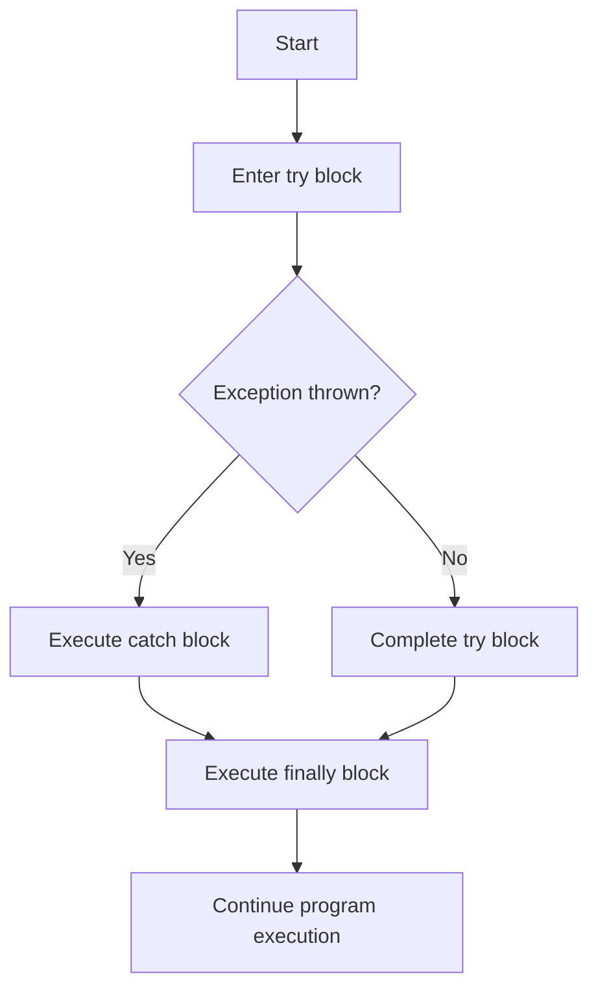

```yaml
---
title: "Java Finally Block"
description: "Learn how to use the finally block in Java exception handling to execute code that must run regardless of whether an exception occurs or not."

---
```

# Java Finally Block

## Introduction

Exception handling is a critical aspect of writing robust Java applications. While `try` and `catch` blocks handle exceptions when they occur, Java provides another important component called the `finally` block. The `finally` block contains code that **always executes** regardless of whether an exception occurs or not.

In this tutorial, you'll learn:
- What the `finally` block is and why it's important
- How to use the `finally` block with try-catch statements
- Common use cases for the `finally` block
- Best practices and potential pitfalls

## What is the Finally Block?

The `finally` block follows a `try` block or a `try-catch` block and contains code that will be executed regardless of whether an exception is thrown or caught. This makes it perfect for cleanup operations that should happen no matter what.

Here's the basic syntax:

```java
try {
    // Code that might throw an exception
} catch (ExceptionType e) {
    // Code to handle the exception
} finally {
    // Code that always executes
}
```

You can also use a `finally` block without a `catch` block:

```java
try {
    // Code that might throw an exception
} finally {
    // Code that always executes
}
```

## Why Use the Finally Block?

The `finally` block serves several important purposes:

1. **Resource cleanup**: Releasing resources like file handles, database connections, or network sockets
2. **State consistency**: Ensuring your program's state remains consistent regardless of exceptions
3. **Code reuse**: Avoiding duplicate cleanup code in both the `try` and `catch` blocks

## Basic Example of Using Finally

Let's start with a simple example to understand how the `finally` block works:

```java
public class FinallyDemo {
    public static void main(String[] args) {
        try {
            System.out.println("Inside try block");
            int result = 10 / 0; // This will throw ArithmeticException
            System.out.println("This won't be printed");
        } catch (ArithmeticException e) {
            System.out.println("Exception caught: " + e.getMessage());
        } finally {
            System.out.println("Finally block always executes");
        }
        
        System.out.println("After try-catch-finally");
    }
}
```

**Output:**
```
Inside try block
Exception caught: / by zero
Finally block always executes
After try-catch-finally
```

As you can see, even though an exception occurred, the `finally` block still executed before the program continued.

## Finally Block Without Catch

You can use a `finally` block without a `catch` block when you want to ensure certain code executes but don't want to handle the exception in the current method:

```java
public class FinallyWithoutCatch {
    public static void main(String[] args) {
        try {
            riskyOperation();
        } finally {
            System.out.println("Cleanup code in finally block");
        }
    }
    
    public static void riskyOperation() throws RuntimeException {
        throw new RuntimeException("Something went wrong!");
    }
}
```

**Output:**
```
Cleanup code in finally block
Exception in thread "main" java.lang.RuntimeException: Something went wrong!
    at FinallyWithoutCatch.riskyOperation(FinallyWithoutCatch.java:10)
    at FinallyWithoutCatch.main(FinallyWithoutCatch.java:4)
```

Notice how the `finally` block executed before the exception propagated up the call stack.

## Common Use Case: Resource Management

One of the most common uses of the `finally` block is for resource management. Here's an example with file handling:

```java
import java.io.FileReader;
import java.io.IOException;

public class FileResourceExample {
    public static void main(String[] args) {
        FileReader reader = null;
        try {
            reader = new FileReader("example.txt");
            // Read from the file...
            char[] buffer = new char[1024];
            reader.read(buffer);
            System.out.println("File content: " + new String(buffer));
        } catch (IOException e) {
            System.out.println("Error reading file: " + e.getMessage());
        } finally {
            // Close the file in the finally block to ensure it happens
            // even if an exception occurs
            try {
                if (reader != null) {
                    reader.close();
                    System.out.println("FileReader closed successfully");
                }
            } catch (IOException e) {
                System.out.println("Error closing file: " + e.getMessage());
            }
        }
    }
}
```

In the example above, the `finally` block ensures that the file is closed regardless of whether the file was read successfully or an exception occurred.

## Modern Alternative: Try-with-Resources

Since Java 7, you can use the try-with-resources statement for automatic resource management, which often eliminates the need for explicit `finally` blocks:

```java
import java.io.FileReader;
import java.io.IOException;

public class TryWithResourcesExample {
    public static void main(String[] args) {
        try (FileReader reader = new FileReader("example.txt")) {
            // Read from the file...
            char[] buffer = new char[1024];
            reader.read(buffer);
            System.out.println("File content: " + new String(buffer));
        } catch (IOException e) {
            System.out.println("Error reading file: " + e.getMessage());
        }
        // No finally block needed - resources are automatically closed
    }
}
```

The try-with-resources statement automatically calls `close()` on resources that implement the `AutoCloseable` interface, making your code cleaner and less error-prone.

## Control Flow with Finally

The `finally` block affects the control flow in your program in some important ways:

```java
public class FinallyReturnExample {
    public static void main(String[] args) {
        int result = getValue();
        System.out.println("Result: " + result);
    }
    
    public static int getValue() {
        try {
            return 1; // This return statement is reached
        } finally {
            System.out.println("Finally executes before the method returns");
            // Note: adding a return statement here would override the previous return!
        }
    }
}
```

**Output:**
```
Finally executes before the method returns
Result: 1
```

As demonstrated, the `finally` block executes even when a return statement is encountered in the `try` block. This behavior is important to understand to avoid unexpected results.

## Finally Block and Exceptions

If an exception is thrown within the `finally` block, it will override any exception thrown in the `try` or `catch` blocks:

```java
public class FinallyExceptionExample {
    public static void main(String[] args) {
        try {
            exceptionTest();
        } catch (Exception e) {
            System.out.println("Caught exception: " + e.getMessage());
        }
    }
    
    public static void exceptionTest() throws Exception {
        try {
            System.out.println("In try block");
            throw new Exception("Exception from try block");
        } catch (Exception e) {
            System.out.println("In catch block");
            throw new Exception("Exception from catch block");
        } finally {
            System.out.println("In finally block");
            throw new Exception("Exception from finally block");
        }
    }
}
```

**Output:**
```
In try block
In catch block
In finally block
Caught exception: Exception from finally block
```

Notice that only the exception from the `finally` block is propagated, while the exceptions from the `try` and `catch` blocks are suppressed.

## When Finally Doesn't Execute

There are a few rare situations where the `finally` block doesn't execute:

1. If the JVM exits during execution of the `try` or `catch` block (e.g., by calling `System.exit()`)
2. If the thread executing the `try` or `catch` block is interrupted or killed
3. If an error occurs that crashes the JVM

Example with `System.exit()`:

```java
public class FinallyNotExecutingExample {
    public static void main(String[] args) {
        try {
            System.out.println("Inside try block");
            System.exit(0); // JVM will exit, finally won't execute
        } finally {
            System.out.println("This won't be printed");
        }
    }
}
```

**Output:**
```
Inside try block
```

## Best Practices for Using Finally Blocks

1. **Keep finally blocks short and focused** on resource cleanup and state management
2. **Avoid throwing exceptions** from within `finally` blocks when possible
3. **Don't use control flow statements** like `return`, `continue`, or `break` in `finally` blocks
4. **Consider using try-with-resources** instead of explicit `finally` blocks when dealing with closeable resources
5. **Don't perform complex operations** in `finally` blocks that might fail

## Flow of Execution (Visualization)



## Summary

The `finally` block is a powerful feature in Java's exception handling mechanism that ensures certain code always executes, regardless of exceptions. Key points to remember:

- The `finally` block executes whether an exception is thrown or not
- It executes even if there's a `return` statement in the `try` or `catch` blocks
- It's commonly used for resource cleanup and maintaining state consistency
- For resource management, the try-with-resources statement is often a better alternative
- Exceptions in the `finally` block override exceptions in `try` or `catch` blocks

By mastering the `finally` block, you can write more robust Java applications with proper resource management and error handling.

## Exercises

1. Write a program that uses a `finally` block to ensure a file is always closed, even if an exception occurs during reading.
2. Modify the program above to use the try-with-resources statement instead.
3. Create a program that demonstrates how a `finally` block executes even when a method returns from within a `try` block.
4. Write a program that shows how exceptions in a `finally` block override exceptions from `try` and `catch` blocks.

## Additional Resources

- [Java Documentation on Exceptions](https://docs.oracle.com/javase/tutorial/essential/exceptions/finally.html)
- [Java Exception Handling Best Practices](https://www.oracle.com/technical-resources/articles/java/javadoc-tool.html)
- [Try-with-resources Statement](https://docs.oracle.com/javase/tutorial/essential/exceptions/tryResourceClose.html)