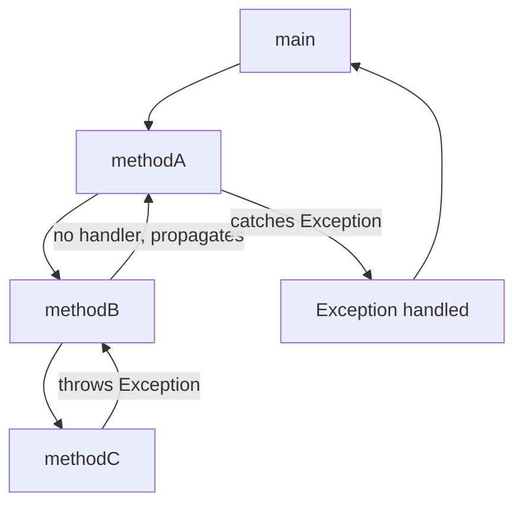

# Java Exception Propagation

When you're building Java applications, understanding how exceptions flow through your program is crucial. This concept, known as **exception propagation**, is a fundamental part of Java's exception handling mechanism that helps you create robust and reliable software.

## What is Exception Propagation?

Exception propagation is the process by which an exception travels through the call stack when it's thrown but not caught. When an exception occurs in a method, if the method doesn't handle it, the exception "propagates" up to the calling method. This process continues up the call stack until the exception is either caught and handled or reaches the top of the stack, causing the program to terminate.

## How Exception Propagation Works in Java

Let's visualize the exception propagation process:



In this flow:
1. `main()` calls `methodA()`
2. `methodA()` calls `methodB()`
3. `methodB()` calls `methodC()`
4. `methodC()` throws an exception
5. Since `methodC()` doesn't handle the exception, it propagates up to `methodB()`
6. `methodB()` catches and handles the exception
7. Execution returns to `main()` normally

### Basic Example of Exception Propagation

Let's see a simple example:

```java
public class ExceptionPropagationDemo {
    public static void main(String[] args) {
        try {
            System.out.println("Calling method1()");
            method1();
            System.out.println("Back from method1()"); // This won't execute if exception occurs
        } catch (Exception e) {
            System.out.println("Exception caught in main: " + e.getMessage());
        }
        System.out.println("Program continues...");
    }

    static void method1() {
        System.out.println("In method1, calling method2()");
        method2();
        System.out.println("Back from method2()"); // This won't execute if exception occurs
    }

    static void method2() {
        System.out.println("In method2, calling method3()");
        method3();
        System.out.println("Back from method3()"); // This won't execute if exception occurs
    }

    static void method3() {
        System.out.println("In method3, throwing exception");
        throw new RuntimeException("Exception from method3");
    }
}
```

**Output:**
```
Calling method1()
In method1, calling method2()
In method2, calling method3()
In method3, throwing exception
Exception caught in main: Exception from method3
Program continues...
```

Notice how:
1. The exception is thrown in `method3()`
2. It propagates through `method2()` and `method1()`
3. Finally, it's caught in the `main()` method
4. The statements after the exception in each method don't execute
5. After handling the exception, the program continues

## Checked vs. Unchecked Exception Propagation

Java has two types of exceptions, and they propagate differently:

### Unchecked Exception Propagation

**Unchecked exceptions** (subclasses of `RuntimeException` or `Error`) are automatically propagated up the call stack without requiring explicit declaration.

```java
public class UncheckedPropagationDemo {
    public static void main(String[] args) {
        try {
            method1();
        } catch (RuntimeException e) {
            System.out.println("Caught in main: " + e.getMessage());
        }
    }

    // Note: No throws clause needed
    static void method1() {
        method2();
    }

    // No throws clause needed
    static void method2() {
        throw new NullPointerException("Something was null!");
    }
}
```

**Output:**
```
Caught in main: Something was null!
```

### Checked Exception Propagation

**Checked exceptions** (subclasses of `Exception` but not `RuntimeException`) must be either:
1. Caught within the method, or
2. Declared in the method's `throws` clause

```java
import java.io.IOException;

public class CheckedPropagationDemo {
    public static void main(String[] args) {
        try {
            method1();
        } catch (IOException e) {
            System.out.println("Caught in main: " + e.getMessage());
        }
    }

    // Must declare the exception in throws clause
    static void method1() throws IOException {
        method2();
    }

    // Must declare the exception in throws clause
    static void method2() throws IOException {
        throw new IOException("IO problem occurred");
    }
}
```

**Output:**
```
Caught in main: IO problem occurred
```

## The Call Stack and Exception Trace

When an exception propagates, Java keeps track of the method call sequence in what's called a **stack trace**. This trace is extremely helpful for debugging.

```java
public class StackTraceDemo {
    public static void main(String[] args) {
        try {
            alpha();
        } catch (Exception e) {
            System.out.println("Exception message: " + e.getMessage());
            System.out.println("\nStack trace:");
            e.printStackTrace();
        }
    }

    static void alpha() {
        beta();
    }

    static void beta() {
        gamma();
    }

    static void gamma() {
        delta();
    }

    static void delta() {
        throw new RuntimeException("Something went wrong in delta");
    }
}
```

**Output:**
```
Exception message: Something went wrong in delta

Stack trace:
java.lang.RuntimeException: Something went wrong in delta
	at StackTraceDemo.delta(StackTraceDemo.java:26)
	at StackTraceDemo.gamma(StackTraceDemo.java:22)
	at StackTraceDemo.beta(StackTraceDemo.java:18)
	at StackTraceDemo.alpha(StackTraceDemo.java:14)
	at StackTraceDemo.main(StackTraceDemo.java:5)
```

The stack trace reads from bottom to top in terms of execution flow:
1. `main()` called `alpha()`
2. `alpha()` called `beta()`
3. `beta()` called `gamma()`
4. `gamma()` called `delta()`
5. `delta()` threw the exception

## Catching Exceptions at Different Levels

You can catch and handle exceptions at different levels in your call stack:

```java
public class MultilevelHandlingDemo {
    public static void main(String[] args) {
        try {
            first();
        } catch (Exception e) {
            System.out.println("Final safety net in main: " + e.getMessage());
        }
        System.out.println("Program completes successfully");
    }

    static void first() {
        try {
            second();
        } catch (ArithmeticException e) {
            System.out.println("Arithmetic error caught in first(): " + e.getMessage());
            // Handle arithmetic exceptions here, let others propagate
        }
        System.out.println("first() completes");
    }

    static void second() {
        try {
            third();
        } catch (NullPointerException e) {
            System.out.println("Null pointer caught in second(): " + e.getMessage());
            // Handle only NullPointerException here
        }
        System.out.println("second() completes");
    }

    static void third() {
        // Let's create three different exception scenarios
        int scenario = 2; // Change this to 1, 2, or 3 to test different paths
        
        if (scenario == 1) {
            // This will be caught in first()
            throw new ArithmeticException("Division by zero");
        } else if (scenario == 2) {
            // This will be caught in second()
            throw new NullPointerException("Null reference");
        } else {
            // This will propagate to main()
            throw new IllegalArgumentException("Invalid argument");
        }
    }
}
```

Depending on the scenario value, the output will be:

**Scenario 1 output:**
```
Arithmetic error caught in first(): Division by zero
first() completes
Program completes successfully
```

**Scenario 2 output:**
```
Null pointer caught in second(): Null reference
second() completes
first() completes
Program completes successfully
```

**Scenario 3 output:**
```
Final safety net in main: Invalid argument
Program completes successfully
```

## Real-World Application Example

Let's look at a practical example involving file operations, which often require exception handling:

```java
import java.io.*;

public class FileProcessingExample {
    public static void main(String[] args) {
        try {
            String content = readFileContents("data.txt");
            processData(content);
            System.out.println("File processing completed successfully.");
        } catch (FileNotFoundException e) {
            System.out.println("Error: Could not find the specified file.");
            System.out.println("Please check if the file exists and the path is correct.");
        } catch (IOException e) {
            System.out.println("Error: An I/O problem occurred while reading the file.");
            System.out.println("Technical details: " + e.getMessage());
        } catch (DataFormatException e) {
            System.out.println("Error: The file's data is not in the expected format.");
            System.out.println("Details: " + e.getMessage());
            System.out.println("Line: " + e.getLineNumber());
        }
    }

    static String readFileContents(String filename) throws IOException {
        StringBuilder content = new StringBuilder();
        
        try (BufferedReader reader = new BufferedReader(new FileReader(filename))) {
            String line;
            while ((line = reader.readLine()) != null) {
                content.append(line).append("\n");
            }
        }
        // The IOException can propagate up to the caller
        
        return content.toString();
    }

    static void processData(String content) throws DataFormatException {
        String[] lines = content.split("\n");
        int lineNumber = 1;
        
        for (String line : lines) {
            if (line.trim().isEmpty()) {
                continue;
            }
            
            if (!line.contains(",")) {
                throw new DataFormatException("Missing comma separator", lineNumber);
            }
            
            // Process the data...
            lineNumber++;
        }
    }

    // Custom checked exception
    static class DataFormatException extends Exception {
        private final int lineNumber;
        
        public DataFormatException(String message, int lineNumber) {
            super(message);
            this.lineNumber = lineNumber;
        }
        
        public int getLineNumber() {
            return lineNumber;
        }
    }
}
```

In this example:
1. `readFileContents()` may throw `IOException`, but doesn't handle it internally—allowing it to propagate
2. `processData()` may throw a custom `DataFormatException` which also propagates
3. `main()` handles all potential exceptions at different levels of specificity
4. This provides appropriate error messages for each type of problem

## Best Practices for Exception Propagation

To effectively use exception propagation in your programs:

1. **Handle exceptions at the appropriate level**:
   - Handle exceptions where you have enough context to take a meaningful recovery action
   - Don't catch exceptions if you don't know what to do with them

2. **Don't catch and rethrow the same exception** without adding value:
   ```java
   // Bad practice
   try {
       methodThatThrows();
   } catch (IOException e) {
       throw e; // Pointless!
   }
   ```

3. **Use exception wrapping** when crossing architectural boundaries:
   ```java
   try {
       // Technical implementation details...
   } catch (SQLException e) {
       throw new ServiceException("Database error occurred", e);
   }
   ```

4. **Always include the original exception as the cause** when wrapping:
   ```java
   throw new ApplicationException("Failed to process request", originalException);
   ```

5. **Don't 'swallow' exceptions** without handling them:
   ```java
   // Very bad practice!
   try {
       riskyOperation();
   } catch (Exception e) {
       // Empty catch block
   }
   ```

6. **Use finally blocks** or try-with-resources for cleanup:
   ```java
   try {
       Connection conn = getConnection();
       // Use connection
   } finally {
       conn.close(); // Always executes, even if an exception occurs
   }
   ```

## Summary

Exception propagation is a powerful mechanism in Java that allows exceptions to travel up the call stack until they're properly handled. Understanding how this works helps you:

- Design cleaner, more robust exception handling strategies
- Debug problems more effectively by interpreting stack traces
- Structure your application to handle errors at the appropriate level
- Create more resilient code that can recover gracefully from errors

By mastering exception propagation, you'll be able to write Java applications that respond appropriately to errors rather than crashing unexpectedly.

## Exercises

To solidify your understanding:

1. Create a program with a call stack of four methods deep. Make the deepest method throw different types of exceptions, and catch them at different levels.

2. Write a program that demonstrates the difference between checked and unchecked exception propagation.

3. Create a custom exception hierarchy for a banking application, and show how exceptions might propagate through different layers (UI, service, data access).

4. Modify a program to use exception wrapping to convert low-level technical exceptions to higher-level application exceptions.

## Additional Resources

- [Oracle Java Documentation: Exceptions](https://docs.oracle.com/javase/tutorial/essential/exceptions/index.html)
- [The Java™ Tutorials: Catching and Handling Exceptions](https://docs.oracle.com/javase/tutorial/essential/exceptions/handling.html)
- [Effective Java by Joshua Bloch](https://www.oreilly.com/library/view/effective-java-3rd/9780134686097/) - Item 70: Use checked exceptions for recoverable conditions and runtime exceptions for programming errors