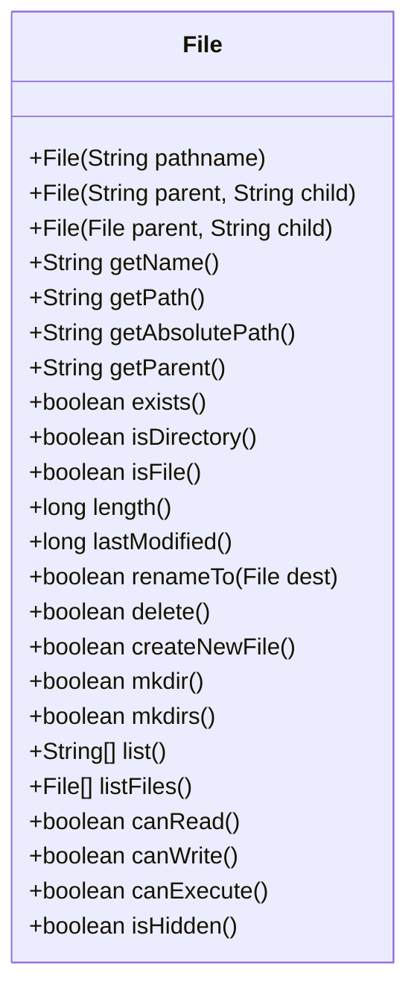

# Java File Class

## Introduction

The `File` class is a fundamental component of Java's file handling system. Located in the `java.io` package, it serves as an abstract representation of file and directory pathnames on your computer. Unlike what its name might suggest, the `File` class doesn't directly handle reading or writing file content. Instead, it provides methods to examine and manipulate file system objects.

In this tutorial, we'll explore how to use the `File` class to:
- Create new files and directories
- Check file properties (existence, readability, size, etc.)
- Navigate directory structures
- Rename and delete files
- List directory contents

## Getting Started with the File Class

### Creating a File Object

To work with files in Java, you first need to create a `File` object that represents the file or directory path:

```java
import java.io.File;

public class FileDemo {
    public static void main(String[] args) {
        // Create a File object representing a file
        File myFile = new File("example.txt");
        
        // Create a File object with absolute path
        File anotherFile = new File("C:/Users/username/Documents/sample.txt");
        
        // Create a File object representing a directory
        File myDirectory = new File("myDocuments");
    }
}
```

It's important to understand that creating a `File` object doesn't actually create a file on your disk - it only creates a representation of the path in memory.

## Common File Operations

### Checking If a File or Directory Exists

Before performing operations on files, it's good practice to check if they exist:

```java
import java.io.File;

public class FileExistDemo {
    public static void main(String[] args) {
        File file = new File("example.txt");
        
        if (file.exists()) {
            System.out.println("File exists!");
        } else {
            System.out.println("File does not exist.");
        }
    }
}
```

**Output (if file doesn't exist):**
```
File does not exist.
```

### Creating a New File

To create an actual file on your file system:

```java
import java.io.File;
import java.io.IOException;

public class FileCreateDemo {
    public static void main(String[] args) {
        try {
            File file = new File("newfile.txt");
            
            if (file.createNewFile()) {
                System.out.println("File created successfully: " + file.getName());
            } else {
                System.out.println("File already exists.");
            }
        } catch (IOException e) {
            System.out.println("An error occurred.");
            e.printStackTrace();
        }
    }
}
```

**Output (first run):**
```
File created successfully: newfile.txt
```

**Output (subsequent runs):**
```
File already exists.
```

### Creating a Directory

Creating directories is straightforward with the `mkdir()` method:

```java
import java.io.File;

public class DirectoryCreateDemo {
    public static void main(String[] args) {
        File directory = new File("myNewFolder");
        
        if (directory.mkdir()) {
            System.out.println("Directory created successfully!");
        } else {
            System.out.println("Failed to create directory or it already exists.");
        }
        
        // Create multiple nested directories
        File nestedDirs = new File("parent/child/grandchild");
        if (nestedDirs.mkdirs()) { // Note the 's' in mkdirs()
            System.out.println("Nested directories created successfully!");
        } else {
            System.out.println("Failed to create nested directories.");
        }
    }
}
```

## Getting File Information

The `File` class offers several methods to retrieve file information:

```java
import java.io.File;
import java.text.SimpleDateFormat;
import java.util.Date;

public class FileInfoDemo {
    public static void main(String[] args) {
        File file = new File("example.txt");
        
        if (file.exists()) {
            System.out.println("File Name: " + file.getName());
            System.out.println("Absolute Path: " + file.getAbsolutePath());
            System.out.println("Size in bytes: " + file.length());
            System.out.println("Can Read: " + file.canRead());
            System.out.println("Can Write: " + file.canWrite());
            System.out.println("Can Execute: " + file.canExecute());
            System.out.println("Is File: " + file.isFile());
            System.out.println("Is Directory: " + file.isDirectory());
            System.out.println("Is Hidden: " + file.isHidden());
            
            // Format the last modified time
            SimpleDateFormat sdf = new SimpleDateFormat("MM/dd/yyyy HH:mm:ss");
            System.out.println("Last Modified: " + sdf.format(new Date(file.lastModified())));
        } else {
            System.out.println("File does not exist.");
        }
    }
}
```

**Output (example):**
```
File Name: example.txt
Absolute Path: C:\Users\username\projects\example.txt
Size in bytes: 1024
Can Read: true
Can Write: true
Can Execute: false
Is File: true
Is Directory: false
Is Hidden: false
Last Modified: 05/15/2023 14:30:45
```

## Listing Directory Contents

You can list all files and directories within a directory using the `list()` or `listFiles()` methods:

```java
import java.io.File;

public class DirectoryListDemo {
    public static void main(String[] args) {
        File directory = new File(".");  // Current directory
        
        System.out.println("Files and directories in " + directory.getAbsolutePath() + ":");
        
        // List names of files and directories
        String[] contents = directory.list();
        if (contents != null) {
            for (String item : contents) {
                System.out.println(item);
            }
        }
        
        System.out.println("\nDetailed listing:");
        
        // Get File objects for more information
        File[] files = directory.listFiles();
        if (files != null) {
            for (File file : files) {
                System.out.printf("%-30s %-10s %10d bytes\n", 
                    file.getName(), 
                    (file.isDirectory() ? "<DIR>" : "<FILE>"),
                    file.length());
            }
        }
    }
}
```

**Output (example):**
```
Files and directories in C:\Users\username\projects:
example.txt
myNewFolder
src
pom.xml
README.md

Detailed listing:
example.txt                   <FILE>       1024 bytes
myNewFolder                   <DIR>           0 bytes
src                           <DIR>           0 bytes
pom.xml                       <FILE>        512 bytes
README.md                     <FILE>        256 bytes
```

## Filtering Files

You can use the `FileFilter` or `FilenameFilter` interfaces to filter files based on certain criteria:

```java
import java.io.File;
import java.io.FilenameFilter;

public class FileFilterDemo {
    public static void main(String[] args) {
        File directory = new File(".");
        
        // List only .txt files
        FilenameFilter textFilter = new FilenameFilter() {
            @Override
            public boolean accept(File dir, String name) {
                return name.toLowerCase().endsWith(".txt");
            }
        };
        
        System.out.println("Text files in directory:");
        String[] textFiles = directory.list(textFilter);
        
        if (textFiles != null) {
            for (String file : textFiles) {
                System.out.println(file);
            }
        }
        
        // With lambda expression (Java 8+)
        System.out.println("\nJava files in directory:");
        File[] javaFiles = directory.listFiles((dir, name) -> name.toLowerCase().endsWith(".java"));
        
        if (javaFiles != null) {
            for (File file : javaFiles) {
                System.out.println(file.getName());
            }
        }
    }
}
```

## Renaming and Moving Files

To rename or move a file, use the `renameTo()` method:

```java
import java.io.File;

public class FileRenameDemo {
    public static void main(String[] args) {
        File oldFile = new File("oldname.txt");
        File newFile = new File("newname.txt");
        
        // First, make sure oldFile exists
        if (!oldFile.exists()) {
            try {
                oldFile.createNewFile();
                System.out.println("Created file: " + oldFile.getName());
            } catch (Exception e) {
                e.printStackTrace();
                return;
            }
        }
        
        // Rename the file
        if (oldFile.renameTo(newFile)) {
            System.out.println("File renamed successfully!");
        } else {
            System.out.println("Failed to rename the file.");
            System.out.println("This could be due to:");
            System.out.println("- The target file already exists");
            System.out.println("- The file is in use");
            System.out.println("- You lack permissions");
        }
    }
}
```

## Deleting Files and Directories

To delete files or directories:

```java
import java.io.File;

public class FileDeleteDemo {
    public static void main(String[] args) {
        // Delete a file
        File fileToDelete = new File("unwanted.txt");
        
        if (fileToDelete.exists()) {
            if (fileToDelete.delete()) {
                System.out.println("File deleted successfully.");
            } else {
                System.out.println("Failed to delete the file.");
            }
        } else {
            System.out.println("File does not exist.");
        }
        
        // Delete a directory
        File directoryToDelete = new File("emptyFolder");
        
        if (directoryToDelete.exists()) {
            if (directoryToDelete.delete()) {
                System.out.println("Directory deleted successfully.");
            } else {
                System.out.println("Failed to delete directory. Is it empty?");
            }
        } else {
            System.out.println("Directory does not exist.");
        }
    }
}
```

Note that the `delete()` method only works on empty directories. For non-empty directories, you must first delete all contents recursively.

## Real-World Example: File Management Utility

Let's create a simple file management utility that demonstrates various `File` class operations:

```java
import java.io.File;
import java.io.IOException;
import java.text.SimpleDateFormat;
import java.util.Date;
import java.util.Scanner;

public class FileManagerDemo {
    private static final Scanner scanner = new Scanner(System.in);
    
    public static void main(String[] args) {
        boolean running = true;
        
        System.out.println("==== File Manager ====");
        
        while (running) {
            printMenu();
            int choice = getIntInput("Enter your choice: ");
            
            switch (choice) {
                case 1:
                    listFiles();
                    break;
                case 2:
                    createFile();
                    break;
                case 3:
                    createDirectory();
                    break;
                case 4:
                    deleteFileOrDirectory();
                    break;
                case 5:
                    getFileInfo();
                    break;
                case 6:
                    searchFiles();
                    break;
                case 0:
                    running = false;
                    System.out.println("Thank you for using File Manager!");
                    break;
                default:
                    System.out.println("Invalid choice. Please try again.");
            }
            
            System.out.println(); // Add a blank line for readability
        }
        
        scanner.close();
    }
    
    private static void printMenu() {
        System.out.println("1. List files and directories");
        System.out.println("2. Create a new file");
        System.out.println("3. Create a new directory");
        System.out.println("4. Delete a file or directory");
        System.out.println("5. Get file information");
        System.out.println("6. Search files");
        System.out.println("0. Exit");
    }
    
    private static void listFiles() {
        String path = getStringInput("Enter directory path (or . for current): ");
        File directory = new File(path);
        
        if (!directory.exists() || !directory.isDirectory()) {
            System.out.println("Invalid directory path!");
            return;
        }
        
        System.out.println("Contents of directory: " + directory.getAbsolutePath());
        System.out.printf("%-30s %-10s %10s %20s\n", "Name", "Type", "Size", "Last Modified");
        System.out.println("-".repeat(70));
        
        File[] files = directory.listFiles();
        if (files != null) {
            SimpleDateFormat sdf = new SimpleDateFormat("yyyy-MM-dd HH:mm:ss");
            for (File file : files) {
                System.out.printf("%-30s %-10s %10d %20s\n",
                    file.getName(),
                    file.isDirectory() ? "Directory" : "File",
                    file.length(),
                    sdf.format(new Date(file.lastModified())));
            }
            System.out.println("-".repeat(70));
            System.out.printf("Total: %d items\n", files.length);
        }
    }
    
    private static void createFile() {
        String fileName = getStringInput("Enter file name: ");
        File file = new File(fileName);
        
        try {
            if (file.createNewFile()) {
                System.out.println("File created successfully: " + file.getAbsolutePath());
            } else {
                System.out.println("Failed to create file. It may already exist.");
            }
        } catch (IOException e) {
            System.out.println("Error creating file: " + e.getMessage());
        }
    }
    
    private static void createDirectory() {
        String dirName = getStringInput("Enter directory name: ");
        File dir = new File(dirName);
        
        if (dir.mkdir()) {
            System.out.println("Directory created successfully: " + dir.getAbsolutePath());
        } else {
            System.out.println("Failed to create directory. It may already exist or the path is invalid.");
        }
    }
    
    private static void deleteFileOrDirectory() {
        String path = getStringInput("Enter path to delete: ");
        File fileOrDir = new File(path);
        
        if (!fileOrDir.exists()) {
            System.out.println("Path does not exist!");
            return;
        }
        
        String confirmation = getStringInput("Are you sure you want to delete this? (y/n): ");
        if (confirmation.toLowerCase().startsWith("y")) {
            if (fileOrDir.delete()) {
                System.out.println("Deleted successfully.");
            } else {
                System.out.println("Deletion failed. If it's a directory, make sure it's empty.");
            }
        } else {
            System.out.println("Deletion cancelled.");
        }
    }
    
    private static void getFileInfo() {
        String path = getStringInput("Enter file path: ");
        File file = new File(path);
        
        if (!file.exists()) {
            System.out.println("File does not exist!");
            return;
        }
        
        SimpleDateFormat sdf = new SimpleDateFormat("yyyy-MM-dd HH:mm:ss");
        System.out.println("File Information:");
        System.out.println("-".repeat(40));
        System.out.println("Name: " + file.getName());
        System.out.println("Path: " + file.getAbsolutePath());
        System.out.println("Parent: " + file.getParent());
        System.out.println("Type: " + (file.isDirectory() ? "Directory" : "File"));
        System.out.println("Size: " + file.length() + " bytes");
        System.out.println("Last Modified: " + sdf.format(new Date(file.lastModified())));
        System.out.println("Hidden: " + file.isHidden());
        System.out.println("Readable: " + file.canRead());
        System.out.println("Writable: " + file.canWrite());
        System.out.println("Executable: " + file.canExecute());
    }
    
    private static void searchFiles() {
        final String directory = getStringInput("Enter directory to search in: ");
        final String searchTerm = getStringInput("Enter search term: ");
        
        File dir = new File(directory);
        if (!dir.exists() || !dir.isDirectory()) {
            System.out.println("Invalid directory!");
            return;
        }
        
        System.out.println("Search results:");
        int count = searchInDirectory(dir, searchTerm);
        System.out.println("Found " + count + " matches.");
    }
    
    private static int searchInDirectory(File directory, String searchTerm) {
        int count = 0;
        File[] files = directory.listFiles();
        
        if (files != null) {
            for (File file : files) {
                if (file.getName().toLowerCase().contains(searchTerm.toLowerCase())) {
                    System.out.println(file.getAbsolutePath());
                    count++;
                }
            }
        }
        
        return count;
    }
    
    private static String getStringInput(String prompt) {
        System.out.print(prompt);
        return scanner.nextLine();
    }
    
    private static int getIntInput(String prompt) {
        while (true) {
            try {
                System.out.print(prompt);
                int value = Integer.parseInt(scanner.nextLine());
                return value;
            } catch (NumberFormatException e) {
                System.out.println("Please enter a valid number.");
            }
        }
    }
}
```

This interactive file manager demonstrates many practical uses of the `File` class and provides a real-world example of working with files in Java.

## File Class Structure

Here's a visualization of some key methods in the `File` class:



## Limitations of File Class

While the `File` class is very useful, it has some limitations:

1. **Error Handling**: The `File` class methods often return boolean values rather than providing detailed error information
2. **Symbolic Links**: Limited support for symbolic links
3. **File Attributes**: Cannot access advanced file attributes
4. **File Operations**: No atomic operations for file operations

For these reasons, Java 7 introduced the new `java.nio.file` package with the `Path` and `Files` classes, which address many of these limitations. We'll cover those in future tutorials.

## Summary

The `File` class is an essential tool for Java developers who need to work with the file system. In this tutorial, we've covered:

- Creating `File` objects and understanding their purpose
- Basic operations like checking file existence, creating files/directories
- Getting and displaying file information
- Listing directory contents and filtering files
- Renaming, moving, and deleting files
- Creating a practical file management utility

The `File` class serves as a great introduction to file handling in Java, providing a solid foundation for more complex file operations.

## Practice Exercises

1. Write a program that counts the total number of files and directories in a given directory, including its subdirectories.
2. Create a program that finds duplicate files in a directory based on file sizes and names.
3. Implement a simple backup utility that copies all files from one directory to another, preserving the directory structure.
4. Write a program that monitors a directory for changes (new files, deleted files, modified files) and logs these changes.
5. Create a file organizer that sorts files in a directory into subdirectories based on file extensions (e.g., all .jpg files go to an "Images" folder).

## Additional Resources

- [Java Documentation on File Class](https://docs.oracle.com/en/java/javase/17/docs/api/java.base/java/io/File.html)
- [Oracle Java Tutorials: File I/O](https://docs.oracle.com/javase/tutorial/essential/io/fileio.html)
- For more advanced file operations, look into the `java.nio.file` package, which provides more powerful file handling capabilities in modern Java applications.