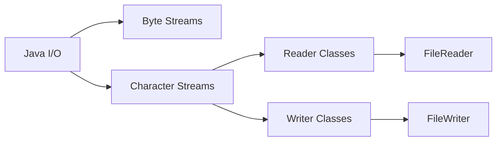

# Java FileReader and FileWriter

## Introduction

In Java programming, working with files is an essential skill. When it comes to reading from and writing to text files, Java provides dedicated classes: `FileReader` and `FileWriter`. These classes are character-oriented stream classes that make it easy to handle text data.

In this tutorial, you'll learn how to:
- Read text from files using `FileReader`
- Write text to files using `FileWriter`
- Handle exceptions during file operations
- Implement common file handling patterns

Let's explore how these classes can help you manage text data in your Java applications!

## Understanding Character Streams

Before diving into `FileReader` and `FileWriter`, it's important to understand character streams in Java.



- **Byte Streams**: Handle raw binary data (bytes)
- **Character Streams**: Handle text data (characters)

`FileReader` and `FileWriter` are character streams that:
- Automatically handle character encoding
- Process text one character at a time
- Are ideal for text files (not binary files like images)

## Using FileReader to Read Text Files

The `FileReader` class allows you to read character data from files. It reads bytes from a file and converts them to characters using the system's default character encoding.

### Basic Syntax

Here's the basic pattern for using `FileReader`:

```java
try (FileReader reader = new FileReader("path/to/file.txt")) {
    // Read operations
} catch (IOException e) {
    e.printStackTrace();
}
```

### Reading Characters One by One

Let's look at a simple example that reads a text file character by character:

```java
import java.io.FileReader;
import java.io.IOException;

public class FileReaderExample {
    public static void main(String[] args) {
        try (FileReader reader = new FileReader("sample.txt")) {
            int character;
            // Read characters until the end of file
            while ((character = reader.read()) != -1) {
                System.out.print((char) character);
            }
        } catch (IOException e) {
            System.out.println("An error occurred while reading the file: " + e.getMessage());
        }
    }
}
```

Assuming `sample.txt` contains:
```
Hello, 
This is a sample text file.
Welcome to Java file handling!
```

Output:
```
Hello, 
This is a sample text file.
Welcome to Java file handling!
```

### Reading Multiple Characters at Once

A more efficient approach is to read blocks of characters at a time:

```java
import java.io.FileReader;
import java.io.IOException;

public class FileReaderBufferExample {
    public static void main(String[] args) {
        try (FileReader reader = new FileReader("sample.txt")) {
            char[] buffer = new char[1024]; // Buffer to store characters
            int charsRead;
            
            // Read up to 1024 characters at a time
            while ((charsRead = reader.read(buffer)) != -1) {
                // Convert the read characters to a string and print
                System.out.print(new String(buffer, 0, charsRead));
            }
        } catch (IOException e) {
            System.out.println("An error occurred: " + e.getMessage());
        }
    }
}
```

This approach is more efficient because it reduces the number of method calls to read data.

## Using FileWriter to Write Text Files

The `FileWriter` class allows you to write character data to files. It converts characters to bytes using the default character encoding and writes them to the file.

### Basic Syntax

Here's the basic pattern for using `FileWriter`:

```java
try (FileWriter writer = new FileWriter("path/to/file.txt")) {
    // Write operations
} catch (IOException e) {
    e.printStackTrace();
}
```

### Writing Text to a File

Let's create a simple example that writes text to a file:

```java
import java.io.FileWriter;
import java.io.IOException;

public class FileWriterExample {
    public static void main(String[] args) {
        try (FileWriter writer = new FileWriter("output.txt")) {
            writer.write("Hello, this is a test file.\n");
            writer.write("Writing to files in Java is easy!\n");
            writer.write("End of file.");
            System.out.println("Data written to file successfully!");
        } catch (IOException e) {
            System.out.println("An error occurred while writing to the file: " + e.getMessage());
        }
    }
}
```

After running this code, the file `output.txt` will be created (or overwritten if it already exists) with the following content:

```
Hello, this is a test file.
Writing to files in Java is easy!
End of file.
```

### Appending to Existing Files

By default, `FileWriter` overwrites the existing file. To append data to an existing file, use the append parameter in the constructor:

```java
import java.io.FileWriter;
import java.io.IOException;

public class FileWriterAppendExample {
    public static void main(String[] args) {
        try (FileWriter writer = new FileWriter("output.txt", true)) {  // true enables append mode
            writer.write("\nThis line is appended to the file.");
            System.out.println("Data appended to file successfully!");
        } catch (IOException e) {
            System.out.println("An error occurred while appending to the file: " + e.getMessage());
        }
    }
}
```

Now `output.txt` will contain:

```
Hello, this is a test file.
Writing to files in Java is easy!
End of file.
This line is appended to the file.
```

## Handling Exceptions in File Operations

File operations can fail for various reasons, such as:
- The file doesn't exist (when reading)
- No permission to access the file
- Disk space issues (when writing)

Always use proper exception handling with file operations. The try-with-resources statement (used in the examples above) is recommended because it automatically closes the resources, even if an exception occurs.

## Practical Examples

Let's explore some practical examples of using `FileReader` and `FileWriter` together.

### Example 1: Copy Text File Contents

This program copies the contents from one text file to another:

```java
import java.io.FileReader;
import java.io.FileWriter;
import java.io.IOException;

public class FileCopyExample {
    public static void main(String[] args) {
        try (FileReader reader = new FileReader("source.txt");
             FileWriter writer = new FileWriter("destination.txt")) {
            
            char[] buffer = new char[1024];
            int charsRead;
            
            while ((charsRead = reader.read(buffer)) != -1) {
                writer.write(buffer, 0, charsRead);
            }
            
            System.out.println("File copied successfully!");
        } catch (IOException e) {
            System.out.println("An error occurred: " + e.getMessage());
        }
    }
}
```

### Example 2: Word Count Program

This program counts words, lines, and characters in a text file:

```java
import java.io.FileReader;
import java.io.IOException;

public class WordCountExample {
    public static void main(String[] args) {
        int charCount = 0;
        int wordCount = 0;
        int lineCount = 0;
        
        try (FileReader reader = new FileReader("sample.txt")) {
            int character;
            boolean isWord = false;
            
            while ((character = reader.read()) != -1) {
                charCount++;
                
                // Check for new line
                if (character == '\n') {
                    lineCount++;
                }
                
                // Check for word
                if (Character.isWhitespace(character)) {
                    isWord = false;
                } else if (!isWord) {
                    isWord = true;
                    wordCount++;
                }
            }
            
            // Count the last line if file doesn't end with a newline
            if (charCount > 0 && lineCount == 0) {
                lineCount = 1;
            }
            
            System.out.println("Characters: " + charCount);
            System.out.println("Words: " + wordCount);
            System.out.println("Lines: " + lineCount);
            
        } catch (IOException e) {
            System.out.println("An error occurred: " + e.getMessage());
        }
    }
}
```

### Example 3: Log File Creator

This program demonstrates how to create and append to a log file:

```java
import java.io.FileWriter;
import java.io.IOException;
import java.time.LocalDateTime;
import java.time.format.DateTimeFormatter;

public class LogFileExample {
    public static void main(String[] args) {
        try {
            log("Application started");
            // Simulate some application events
            Thread.sleep(1000);
            log("Processing data");
            Thread.sleep(1000);
            log("Application finished");
        } catch (InterruptedException e) {
            log("Application interrupted: " + e.getMessage());
        }
    }
    
    public static void log(String message) {
        try (FileWriter writer = new FileWriter("application.log", true)) {
            LocalDateTime now = LocalDateTime.now();
            String timestamp = now.format(DateTimeFormatter.ofPattern("yyyy-MM-dd HH:mm:ss"));
            writer.write(timestamp + " - " + message + "\n");
        } catch (IOException e) {
            System.err.println("Failed to write to log file: " + e.getMessage());
        }
    }
}
```

This creates a log file with timestamps for each entry:

```
2023-10-20 14:25:30 - Application started
2023-10-20 14:25:31 - Processing data
2023-10-20 14:25:32 - Application finished
```

## Limitations and Best Practices

While `FileReader` and `FileWriter` are useful for simple file operations, they have some limitations:

1. **Character Encoding**: They use the system's default character encoding. For specific encodings, use `InputStreamReader` and `OutputStreamWriter` with `FileInputStream` and `FileOutputStream`.

2. **Performance**: For better performance with large files, wrap them with `BufferedReader` and `BufferedWriter`.

3. **Error Handling**: Always use try-with-resources statements to ensure resources are properly closed.

4. **Binary Files**: These classes are not suitable for binary files. Use `FileInputStream` and `FileOutputStream` instead.

## Enhanced File Operations with BufferedReader and BufferedWriter

For better performance, especially when dealing with larger files, combine `FileReader` and `FileWriter` with buffered classes:

```java
import java.io.*;

public class BufferedFileExample {
    public static void main(String[] args) {
        try (BufferedReader reader = new BufferedReader(new FileReader("input.txt"));
             BufferedWriter writer = new BufferedWriter(new FileWriter("output.txt"))) {
            
            String line;
            while ((line = reader.readLine()) != null) {
                writer.write(line);
                writer.newLine(); // Add a line separator
            }
            
            System.out.println("File processing completed.");
        } catch (IOException e) {
            System.out.println("An error occurred: " + e.getMessage());
        }
    }
}
```

The buffered classes improve performance by:
- Reading/writing chunks of characters at a time
- Reducing the number of actual I/O operations
- Providing additional convenient methods like `readLine()`

## Summary

In this tutorial, you've learned:

✅ How to read text files using `FileReader`  
✅ How to write text files using `FileWriter`  
✅ How to handle exceptions in file operations  
✅ How to implement practical file handling applications  
✅ When to use buffered streams for better performance  

`FileReader` and `FileWriter` provide a straightforward way to handle text files in Java, making them perfect for beginners. As your applications grow in complexity, you can build on these fundamentals to implement more sophisticated file handling capabilities.

## Exercises

To practice your file handling skills, try these exercises:

1. Create a program that reads a text file and counts the occurrence of each unique word.
2. Write a program that merges the contents of two text files into a third file.
3. Create a simple note-taking application that can create, read, and append to text files.
4. Write a program that converts a text file to uppercase and saves it as a new file.
5. Create a search program that finds all lines in a text file containing a specific word or phrase.

## Additional Resources

- [Java Documentation: FileReader](https://docs.oracle.com/en/java/javase/17/docs/api/java.base/java/io/FileReader.html)
- [Java Documentation: FileWriter](https://docs.oracle.com/en/java/javase/17/docs/api/java.base/java/io/FileWriter.html)
- [Java Documentation: BufferedReader](https://docs.oracle.com/en/java/javase/17/docs/api/java.base/java/io/BufferedReader.html)
- [Java Documentation: BufferedWriter](https://docs.oracle.com/en/java/javase/17/docs/api/java.base/java/io/BufferedWriter.html)