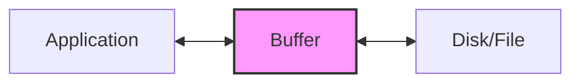

# Java BufferedReader and BufferedWriter

In Java file handling, efficiency matters when reading from or writing to files, especially when dealing with large files. Java's `BufferedReader` and `BufferedWriter` classes provide this efficiency through buffering mechanisms that reduce the number of actual I/O operations.

## Introduction to Buffered I/O

When performing input/output operations, accessing the disk directly for each read or write operation can be costly in terms of performance. Buffering solves this by reading or writing data in larger chunks (buffers), reducing the frequency of actual physical I/O operations.



Java's `BufferedReader` and `BufferedWriter` wrap around existing Reader and Writer objects, adding buffering capabilities to make your file operations more efficient.

## BufferedReader

`BufferedReader` reads text from a character input stream, buffering characters to provide efficient reading of characters, arrays, and lines.

### Creating a BufferedReader

There are several ways to create a `BufferedReader`:

```java
// From a FileReader (for reading character files)
BufferedReader reader = new BufferedReader(new FileReader("path/to/file.txt"));

// With a specified buffer size
BufferedReader reader = new BufferedReader(new FileReader("path/to/file.txt"), 8192);

// From an InputStreamReader (for reading bytes and converting to characters)
BufferedReader reader = new BufferedReader(
    new InputStreamReader(new FileInputStream("path/to/file.txt"), "UTF-8")
);
```

### Reading with BufferedReader

`BufferedReader` provides several methods for reading data:

#### Reading a Single Line

```java
String line = reader.readLine(); // Returns null at the end of the file
```

#### Reading All Lines of a File

```java
public class ReadFileExample {
    public static void main(String[] args) {
        try (BufferedReader reader = new BufferedReader(new FileReader("sample.txt"))) {
            String line;
            while ((line = reader.readLine()) != null) {
                System.out.println(line);
            }
        } catch (IOException e) {
            e.printStackTrace();
        }
    }
}
```

**Input file (sample.txt)**:
```
Hello, this is a sample text file.
It contains multiple lines.
We're using BufferedReader to read it.
```

**Output**:
```
Hello, this is a sample text file.
It contains multiple lines.
We're using BufferedReader to read it.
```

#### Reading Character by Character

```java
public class ReadCharByCharExample {
    public static void main(String[] args) {
        try (BufferedReader reader = new BufferedReader(new FileReader("sample.txt"))) {
            int character;
            while ((character = reader.read()) != -1) {
                System.out.print((char) character);
            }
        } catch (IOException e) {
            e.printStackTrace();
        }
    }
}
```

## BufferedWriter

`BufferedWriter` writes text to a character output stream, buffering characters to provide efficient writing of characters, arrays, and strings.

### Creating a BufferedWriter

```java
// From a FileWriter
BufferedWriter writer = new BufferedWriter(new FileWriter("path/to/file.txt"));

// With specified buffer size
BufferedWriter writer = new BufferedWriter(new FileWriter("path/to/file.txt"), 8192);

// With character encoding
BufferedWriter writer = new BufferedWriter(
    new OutputStreamWriter(new FileOutputStream("path/to/file.txt"), "UTF-8")
);
```

### Writing with BufferedWriter

`BufferedWriter` provides methods for writing data:

#### Writing Strings

```java
public class WriteFileExample {
    public static void main(String[] args) {
        try (BufferedWriter writer = new BufferedWriter(new FileWriter("output.txt"))) {
            writer.write("Hello, this is written using BufferedWriter.");
            writer.newLine(); // Adds a platform-specific line separator
            writer.write("It's more efficient for writing large amounts of text.");
        } catch (IOException e) {
            e.printStackTrace();
        }
    }
}
```

**Output file (output.txt)**:
```
Hello, this is written using BufferedWriter.
It's more efficient for writing large amounts of text.
```

#### The newLine() Method

The `newLine()` method inserts a line separator that is platform-specific (e.g., "\n" for Unix/Linux, "\r\n" for Windows).

```java
writer.write("First line");
writer.newLine();
writer.write("Second line");
```

#### The flush() Method

Calling `flush()` forces any buffered output to be written immediately:

```java
writer.write("This text will be buffered");
writer.flush(); // Forces the buffer to be written to the file
```

## Properly Closing Resources

It's crucial to close your readers and writers to release system resources. The best practice is to use try-with-resources which automatically closes resources:

```java
try (BufferedReader reader = new BufferedReader(new FileReader("input.txt"));
     BufferedWriter writer = new BufferedWriter(new FileWriter("output.txt"))) {
    
    String line;
    while ((line = reader.readLine()) != null) {
        writer.write(line);
        writer.newLine();
    }
} catch (IOException e) {
    e.printStackTrace();
}
```

## Practical Examples

### Example 1: Copying a File

```java
public class FileCopyExample {
    public static void main(String[] args) {
        try (BufferedReader reader = new BufferedReader(new FileReader("source.txt"));
             BufferedWriter writer = new BufferedWriter(new FileWriter("destination.txt"))) {
            
            String line;
            while ((line = reader.readLine()) != null) {
                writer.write(line);
                writer.newLine();
            }
            System.out.println("File copied successfully!");
            
        } catch (IOException e) {
            e.printStackTrace();
        }
    }
}
```

### Example 2: Reading and Processing CSV Data

```java
public class CSVProcessingExample {
    public static void main(String[] args) {
        try (BufferedReader reader = new BufferedReader(new FileReader("data.csv"))) {
            String line;
            // Skip header
            reader.readLine();
            
            while ((line = reader.readLine()) != null) {
                String[] fields = line.split(",");
                // Process each field
                System.out.println("Name: " + fields[0] + ", Age: " + fields[1] + ", City: " + fields[2]);
            }
        } catch (IOException e) {
            e.printStackTrace();
        }
    }
}
```

**Input file (data.csv)**:
```
Name,Age,City
John,28,New York
Alice,24,Boston
Bob,32,Chicago
```

**Output**:
```
Name: John, Age: 28, City: New York
Name: Alice, Age: 24, City: Boston
Name: Bob, Age: 32, City: Chicago
```

### Example 3: Creating a Log File Analyzer

```java
public class LogFileAnalyzer {
    public static void main(String[] args) {
        try (BufferedReader reader = new BufferedReader(new FileReader("server.log"));
             BufferedWriter writer = new BufferedWriter(new FileWriter("errors.log"))) {
            
            String line;
            int errorCount = 0;
            
            while ((line = reader.readLine()) != null) {
                if (line.contains("ERROR")) {
                    writer.write(line);
                    writer.newLine();
                    errorCount++;
                }
            }
            
            System.out.println("Found " + errorCount + " error entries.");
            System.out.println("Error logs extracted to errors.log");
            
        } catch (IOException e) {
            e.printStackTrace();
        }
    }
}
```

## Performance Considerations

1. **Buffer Size**: The default buffer is usually 8KB, but you can specify a different size based on your needs:
   ```java
   BufferedReader reader = new BufferedReader(new FileReader("file.txt"), 16384); // 16KB buffer
   ```

2. **Character Encoding**: Always specify the character encoding when dealing with text files that might contain non-ASCII characters:
   ```java
   BufferedReader reader = new BufferedReader(
       new InputStreamReader(new FileInputStream("file.txt"), "UTF-8")
   );
   ```

3. **Memory Usage**: While buffering improves performance, it does consume more memory. For extremely large files, consider using stream processing or chunking.

## BufferedReader vs FileReader/FileWriter

| Feature | BufferedReader/BufferedWriter | FileReader/FileWriter |
|---------|------------------------------|----------------------|
| Performance | Higher (uses buffers) | Lower (no buffers) |
| Memory Usage | Higher (maintains buffer) | Lower |
| Line Reading | Has readLine() method | No direct line reading |
| Platform-independent line separators | Has newLine() method | Must manually add "\n" or "\r\n" |

## When to Use BufferedReader and BufferedWriter

Use BufferedReader and BufferedWriter when:
- Reading or writing large amounts of text
- Reading text line by line
- Performance is a concern
- You need platform-independent line separators

## Summary

`BufferedReader` and `BufferedWriter` provide efficient mechanisms for reading and writing character data through buffering. They wrap around existing Reader and Writer objects, enhancing their performance by reducing the number of actual I/O operations.

Key points to remember:
- They improve performance through buffering
- `BufferedReader.readLine()` makes reading lines of text easy
- `BufferedWriter.newLine()` adds platform-specific line separators
- Always close your readers and writers properly (use try-with-resources)
- They're ideal for text file processing tasks

## Practice Exercises

1. Create a program that counts the number of words, lines, and characters in a text file.
2. Write a program that merges multiple text files into a single file.
3. Create a simple text file search tool that finds and displays lines containing a specific keyword.
4. Build a CSV to JSON converter using BufferedReader and BufferedWriter.
5. Implement a program that reads a large log file and generates a summary report of different types of log entries.

## Additional Resources

- [Java BufferedReader Documentation](https://docs.oracle.com/en/java/javase/11/docs/api/java.base/java/io/BufferedReader.html)
- [Java BufferedWriter Documentation](https://docs.oracle.com/en/java/javase/11/docs/api/java.base/java/io/BufferedWriter.html)
- [Java I/O Tutorial](https://docs.oracle.com/javase/tutorial/essential/io/index.html)