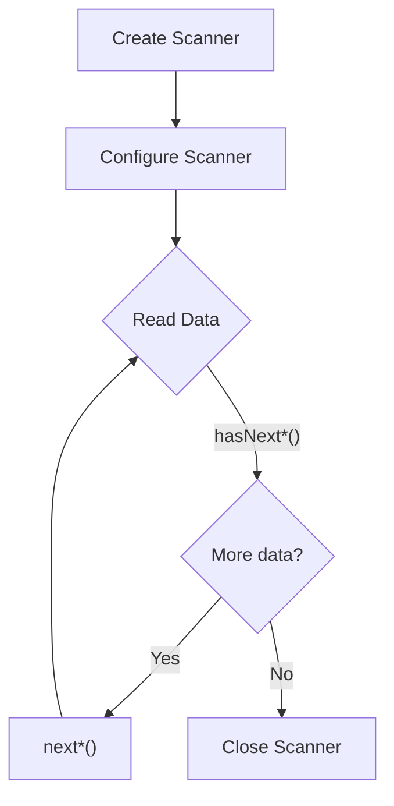

# Java Scanner Class

## Introduction

The `Scanner` class is one of Java's most versatile tools for parsing input data. Located in the `java.util` package, it provides methods to read input from various sources such as files, input streams, and strings. For beginners learning Java file handling, the Scanner class offers a convenient way to read and process data.

Whether you need to process user input from the console, read data from a file, or parse a string, the Scanner class provides a simple and effective solution. In this tutorial, we'll explore how to use the Scanner class for different input scenarios.

## Getting Started with Scanner

### Basic Usage

To use the Scanner class, you first need to import it from the `java.util` package:

```java
import java.util.Scanner;
```

Then, you create a Scanner object by specifying the input source:

```java
// Create a Scanner that reads from the standard input (keyboard)
Scanner scanner = new Scanner(System.in);
```

### Scanner Methods

The Scanner class provides various methods to read different types of data:

| Method | Description |
|--------|-------------|
| `next()` | Reads the next token as a String |
| `nextLine()` | Reads the entire line as a String |
| `nextInt()` | Reads the next token as an int |
| `nextDouble()` | Reads the next token as a double |
| `nextBoolean()` | Reads the next token as a boolean |
| `hasNext()` | Returns true if there's another token in the input |
| `hasNextLine()` | Returns true if there's another line in the input |
| `hasNextInt()` | Returns true if the next token can be read as an int |

## Reading User Input

One of the most common uses of the Scanner class is to read user input from the console.

```java
import java.util.Scanner;

public class UserInputExample {
    public static void main(String[] args) {
        // Create a Scanner object to read from standard input
        Scanner scanner = new Scanner(System.in);
        
        // Prompt and read the user's name
        System.out.print("Enter your name: ");
        String name = scanner.nextLine();
        
        // Prompt and read the user's age
        System.out.print("Enter your age: ");
        int age = scanner.nextInt();
        
        // Display the information
        System.out.println("Hello, " + name + "! You are " + age + " years old.");
        
        // Close the scanner
        scanner.close();
    }
}
```

**Output:**
```
Enter your name: John Doe
Enter your age: 25
Hello, John Doe! You are 25 years old.
```

### Important Note About `nextLine()`

When using `nextInt()`, `nextDouble()`, etc. followed by `nextLine()`, you may encounter an issue where `nextLine()` seems to be skipped. This happens because these methods don't consume the newline character, and the subsequent `nextLine()` consumes it immediately. To fix this, add an extra `nextLine()` call after `nextInt()`:

```java
int age = scanner.nextInt();
scanner.nextLine(); // Consume the leftover newline
String address = scanner.nextLine(); // Now this works as expected
```

## Reading from Files

The Scanner class is particularly useful for reading data from files.

```java
import java.io.File;
import java.io.FileNotFoundException;
import java.util.Scanner;

public class FileReadingExample {
    public static void main(String[] args) {
        try {
            // Create a File object
            File file = new File("sample.txt");
            
            // Create a Scanner for the file
            Scanner fileScanner = new Scanner(file);
            
            // Read the file line by line
            int lineNumber = 1;
            while (fileScanner.hasNextLine()) {
                String line = fileScanner.nextLine();
                System.out.println("Line " + lineNumber + ": " + line);
                lineNumber++;
            }
            
            // Close the scanner
            fileScanner.close();
            
        } catch (FileNotFoundException e) {
            System.out.println("File not found: " + e.getMessage());
        }
    }
}
```

Assume `sample.txt` contains:
```
Hello, this is a sample file.
It has multiple lines of text.
We can read it using Scanner.
```

**Output:**
```
Line 1: Hello, this is a sample file.
Line 2: It has multiple lines of text.
Line 3: We can read it using Scanner.
```

## Parsing Data from Strings

Scanner can also parse data from strings, which is useful when you have text data to process:

```java
import java.util.Scanner;

public class StringParsingExample {
    public static void main(String[] args) {
        // A CSV-like string
        String data = "John,25,New York\nSarah,30,Los Angeles\nMike,22,Chicago";
        
        // Create a Scanner to parse the string
        Scanner scanner = new Scanner(data);
        
        // Set the delimiter to parse by newlines
        scanner.useDelimiter("\n");
        
        System.out.println("Name\tAge\tCity");
        System.out.println("--------------------");
        
        // Process each line
        while (scanner.hasNext()) {
            String line = scanner.next();
            
            // Create another scanner to parse each field
            Scanner lineScanner = new Scanner(line);
            lineScanner.useDelimiter(",");
            
            String name = lineScanner.next();
            int age = lineScanner.nextInt();
            String city = lineScanner.next();
            
            System.out.println(name + "\t" + age + "\t" + city);
            
            lineScanner.close();
        }
        
        // Close the main scanner
        scanner.close();
    }
}
```

**Output:**
```
Name    Age    City
--------------------
John    25     New York
Sarah   30     Los Angeles
Mike    22     Chicago
```

## Scanner with Custom Delimiters

The Scanner class allows you to specify a custom delimiter for parsing tokens:

```java
import java.util.Scanner;

public class DelimiterExample {
    public static void main(String[] args) {
        // A string with semicolon-separated values
        String data = "apple;banana;cherry;date";
        
        // Create a Scanner with semicolon as delimiter
        Scanner scanner = new Scanner(data);
        scanner.useDelimiter(";");
        
        // Print all tokens
        while (scanner.hasNext()) {
            System.out.println("Fruit: " + scanner.next());
        }
        
        scanner.close();
    }
}
```

**Output:**
```
Fruit: apple
Fruit: banana
Fruit: cherry
Fruit: date
```

## Reading Different Data Types

Scanner can read various data types directly, which is very convenient:

```java
import java.util.Scanner;

public class DataTypesExample {
    public static void main(String[] args) {
        String input = "42 3.14 true Hello";
        
        Scanner scanner = new Scanner(input);
        
        // Read different data types
        int intValue = scanner.nextInt();
        double doubleValue = scanner.nextDouble();
        boolean booleanValue = scanner.nextBoolean();
        String stringValue = scanner.next();
        
        System.out.println("Integer: " + intValue);
        System.out.println("Double: " + doubleValue);
        System.out.println("Boolean: " + booleanValue);
        System.out.println("String: " + stringValue);
        
        scanner.close();
    }
}
```

**Output:**
```
Integer: 42
Double: 3.14
Boolean: true
String: Hello
```

## Real-World Application: CSV File Processor

Here's a practical example showing how to use Scanner to process a CSV file:

```java
import java.io.File;
import java.io.FileNotFoundException;
import java.util.ArrayList;
import java.util.List;
import java.util.Scanner;

class Product {
    private String name;
    private double price;
    private int quantity;
    
    public Product(String name, double price, int quantity) {
        this.name = name;
        this.price = price;
        this.quantity = quantity;
    }
    
    public String getName() { return name; }
    public double getPrice() { return price; }
    public int getQuantity() { return quantity; }
    public double getTotalValue() { return price * quantity; }
    
    @Override
    public String toString() {
        return name + " - $" + price + " x " + quantity + " = $" + getTotalValue();
    }
}

public class CSVProcessor {
    public static void main(String[] args) {
        List<Product> inventory = new ArrayList<>();
        
        try {
            File file = new File("inventory.csv");
            Scanner fileScanner = new Scanner(file);
            
            // Skip the header line
            if (fileScanner.hasNextLine()) {
                fileScanner.nextLine();
            }
            
            // Process each line
            while (fileScanner.hasNextLine()) {
                String line = fileScanner.nextLine();
                Scanner lineScanner = new Scanner(line);
                lineScanner.useDelimiter(",");
                
                String name = lineScanner.next();
                double price = lineScanner.nextDouble();
                int quantity = lineScanner.nextInt();
                
                inventory.add(new Product(name, price, quantity));
                
                lineScanner.close();
            }
            
            fileScanner.close();
            
            // Display all products and calculate total inventory value
            double totalValue = 0.0;
            System.out.println("Inventory List:");
            System.out.println("---------------");
            
            for (Product product : inventory) {
                System.out.println(product);
                totalValue += product.getTotalValue();
            }
            
            System.out.println("---------------");
            System.out.printf("Total Inventory Value: $%.2f%n", totalValue);
            
        } catch (FileNotFoundException e) {
            System.out.println("Error: Could not find inventory file.");
            e.printStackTrace();
        }
    }
}
```

Assuming `inventory.csv` contains:

```
Product,Price,Quantity
Laptop,999.99,5
Smartphone,499.95,10
Tablet,299.50,8
Headphones,89.99,15
```

**Output:**
```
Inventory List:
---------------
Laptop - $999.99 x 5 = $4999.95
Smartphone - $499.95 x 10 = $4999.5
Tablet - $299.5 x 8 = $2396.0
Headphones - $89.99 x 15 = $1349.85
---------------
Total Inventory Value: $13745.30
```

## Scanner Lifecycle

Understanding the lifecycle of a Scanner object is important:



1. **Create**: Instantiate the Scanner with an input source.
2. **Configure**: Set delimiters or locales if needed.
3. **Read**: Use methods like `hasNext()` to check for data and `next()` to read it.
4. **Close**: Call `close()` to release resources when done.

It's important to close Scanner objects, especially when working with files or external resources, to prevent resource leaks.

## Best Practices

1. **Always close your Scanner** after using it to free up system resources:
   ```java
   scanner.close();
   ```

2. **Handle exceptions properly** when working with files:
   ```java
   try {
       Scanner fileScanner = new Scanner(new File("filename.txt"));
       // Use the scanner...
       fileScanner.close();
   } catch (FileNotFoundException e) {
       System.err.println("Error: " + e.getMessage());
   }
   ```

3. **Be careful with mixed calls** to `nextInt()`, `nextDouble()`, and `nextLine()`. Always use an extra `nextLine()` to consume the newline character if necessary.

4. **Use appropriate methods** to verify input availability:
   ```java
   if (scanner.hasNextInt()) {
       int value = scanner.nextInt();
   } else {
       System.out.println("Invalid input!");
       scanner.next(); // Skip the invalid token
   }
   ```

5. **Consider using try-with-resources** to automatically close the Scanner:
   ```java
   try (Scanner scanner = new Scanner(new File("filename.txt"))) {
       // Use the scanner...
   } catch (FileNotFoundException e) {
       System.err.println("Error: " + e.getMessage());
   }
   ```

## Summary

The Java Scanner class is a powerful and versatile tool for reading and parsing input data from various sources. It provides methods to read different data types directly, supports custom delimiters, and works with files, user input, and strings.

In this tutorial, we explored:
- Basic usage of the Scanner class
- Reading user input from the console
- Reading from files
- Parsing strings with custom delimiters
- Reading different data types
- A practical example of processing CSV files
- Best practices for using Scanner

The Scanner class significantly simplifies input handling in Java applications, making it easier to focus on your application's core functionality.

## Exercises

1. Create a program that asks the user for their name, age, and favorite programming language, then displays a customized greeting.

2. Write a program that reads a text file and counts the number of words, lines, and characters.

3. Create a simple calculator that reads two numbers and an operation (like +, -, *, /) from the user, then performs the calculation.

4. Write a program that reads a CSV file containing student names and scores, then calculates and displays the average score.

5. Create a program that reads a string of space-separated integers and finds the minimum, maximum, and average values.

## Additional Resources

- [Java Scanner Class Documentation](https://docs.oracle.com/en/java/javase/17/docs/api/java.base/java/util/Scanner.html)
- [Java File I/O Tutorial](https://docs.oracle.com/javase/tutorial/essential/io/index.html)
- [Java Exception Handling](https://docs.oracle.com/javase/tutorial/essential/exceptions/index.html)