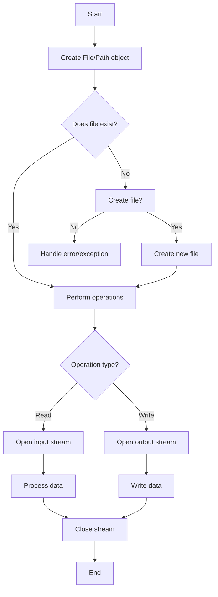

# Java File Operations

Working with files is a fundamental skill for any programmer. In Java, file operations allow you to create, read, write, delete, and manipulate files on your computer's file system. This guide will walk you through the essential file operations in Java with practical examples.

## Introduction to File Operations in Java

File operations refer to actions that can be performed on files, such as:
- Creating new files
- Reading data from existing files
- Writing data to files
- Copying and moving files
- Deleting files
- Checking file properties (size, permissions, etc.)

Java provides several classes and methods to handle these operations through the `java.io` and `java.nio` packages. In this tutorial, we'll focus on the most common file operations using both traditional (`java.io`) and modern (`java.nio`) approaches.

## File Representation in Java

### Using the File Class (java.io)

The `File` class in the `java.io` package is the traditional way to represent files and directories in Java.

```java
import java.io.File;

public class FileExample {
    public static void main(String[] args) {
        // Creating a File object
        File file = new File("example.txt");
        
        // Check if file exists
        boolean exists = file.exists();
        System.out.println("File exists: " + exists);
    }
}
```

Output (if the file doesn't exist):
```
File exists: false
```

### Using the Path Interface (java.nio)

The modern `java.nio.file` package introduced in Java 7 provides more powerful and flexible ways to work with files through the `Path` interface.

```java
import java.nio.file.Path;
import java.nio.file.Paths;
import java.nio.file.Files;

public class PathExample {
    public static void main(String[] args) {
        // Creating a Path object
        Path path = Paths.get("example.txt");
        
        // Check if file exists
        boolean exists = Files.exists(path);
        System.out.println("File exists: " + exists);
    }
}
```

Output (if the file doesn't exist):
```
File exists: false
```

## Basic File Operations

### Creating Files

#### Using java.io.File

```java
import java.io.File;
import java.io.IOException;

public class CreateFileExample {
    public static void main(String[] args) {
        File file = new File("myfile.txt");
        
        try {
            boolean created = file.createNewFile();
            if (created) {
                System.out.println("File created successfully!");
            } else {
                System.out.println("File already exists.");
            }
        } catch (IOException e) {
            System.out.println("An error occurred: " + e.getMessage());
            e.printStackTrace();
        }
    }
}
```

Output (first run):
```
File created successfully!
```

Output (second run):
```
File already exists.
```

#### Using java.nio.file

```java
import java.nio.file.Files;
import java.nio.file.Path;
import java.nio.file.Paths;
import java.io.IOException;

public class CreateFileNIOExample {
    public static void main(String[] args) {
        Path path = Paths.get("myfile_nio.txt");
        
        try {
            Files.createFile(path);
            System.out.println("File created successfully!");
        } catch (IOException e) {
            System.out.println("An error occurred: " + e.getMessage());
            e.printStackTrace();
        }
    }
}
```

Output (if file doesn't exist):
```
File created successfully!
```

### Checking File Properties

You can check various properties of a file such as:

```java
import java.io.File;

public class FilePropertiesExample {
    public static void main(String[] args) {
        File file = new File("example.txt");
        
        if (file.exists()) {
            System.out.println("File name: " + file.getName());
            System.out.println("Absolute path: " + file.getAbsolutePath());
            System.out.println("File size: " + file.length() + " bytes");
            System.out.println("Can read: " + file.canRead());
            System.out.println("Can write: " + file.canWrite());
            System.out.println("Is directory: " + file.isDirectory());
            System.out.println("Is hidden: " + file.isHidden());
            System.out.println("Last modified: " + new java.util.Date(file.lastModified()));
        } else {
            System.out.println("File does not exist.");
        }
    }
}
```

Output (assuming the file exists):
```
File name: example.txt
Absolute path: C:\path\to\example.txt
File size: 1024 bytes
Can read: true
Can write: true
Is directory: false
Is hidden: false
Last modified: Mon Oct 17 10:45:23 EDT 2023
```

## Reading and Writing Files

### Writing to Files

#### Using FileWriter (Character Streams)

```java
import java.io.FileWriter;
import java.io.IOException;

public class FileWriterExample {
    public static void main(String[] args) {
        try (FileWriter writer = new FileWriter("output.txt")) {
            writer.write("Hello, World!\n");
            writer.write("This is a test file.\n");
            writer.write("Writing to a file in Java is easy!");
            
            System.out.println("Successfully wrote to the file.");
        } catch (IOException e) {
            System.out.println("An error occurred:");
            e.printStackTrace();
        }
    }
}
```

Output:
```
Successfully wrote to the file.
```

The `output.txt` file now contains:
```
Hello, World!
This is a test file.
Writing to a file in Java is easy!
```

#### Using BufferedWriter (For Better Performance)

```java
import java.io.BufferedWriter;
import java.io.FileWriter;
import java.io.IOException;

public class BufferedWriterExample {
    public static void main(String[] args) {
        try (BufferedWriter writer = new BufferedWriter(new FileWriter("buffered_output.txt"))) {
            writer.write("This is written using BufferedWriter");
            writer.newLine(); // adds a platform-independent newline
            writer.write("It's more efficient for larger files");
            
            System.out.println("Successfully wrote to the file with BufferedWriter.");
        } catch (IOException e) {
            System.out.println("An error occurred:");
            e.printStackTrace();
        }
    }
}
```

Output:
```
Successfully wrote to the file with BufferedWriter.
```

#### Using Files.write (NIO)

```java
import java.nio.file.Files;
import java.nio.file.Paths;
import java.nio.file.StandardOpenOption;
import java.io.IOException;
import java.util.List;
import java.util.Arrays;

public class NIOWriteExample {
    public static void main(String[] args) {
        try {
            // Write a single string
            Files.writeString(Paths.get("nio_output.txt"), 
                             "Writing with NIO is concise!\n");
            
            // Write multiple lines
            List<String> lines = Arrays.asList(
                "First line", 
                "Second line", 
                "Third line"
            );
            
            Files.write(Paths.get("nio_lines.txt"), lines);
            
            System.out.println("Successfully wrote files using NIO.");
        } catch (IOException e) {
            System.out.println("An error occurred:");
            e.printStackTrace();
        }
    }
}
```

Output:
```
Successfully wrote files using NIO.
```

### Reading from Files

#### Using FileReader and BufferedReader

```java
import java.io.BufferedReader;
import java.io.FileReader;
import java.io.IOException;

public class FileReadExample {
    public static void main(String[] args) {
        try (BufferedReader reader = new BufferedReader(new FileReader("output.txt"))) {
            String line;
            System.out.println("Contents of output.txt:");
            while ((line = reader.readLine()) != null) {
                System.out.println(line);
            }
        } catch (IOException e) {
            System.out.println("An error occurred while reading the file:");
            e.printStackTrace();
        }
    }
}
```

Output:
```
Contents of output.txt:
Hello, World!
This is a test file.
Writing to a file in Java is easy!
```

#### Using Files.readAllLines (NIO)

```java
import java.nio.file.Files;
import java.nio.file.Paths;
import java.io.IOException;
import java.util.List;

public class NIOReadExample {
    public static void main(String[] args) {
        try {
            // Read all lines at once
            List<String> lines = Files.readAllLines(Paths.get("nio_lines.txt"));
            
            System.out.println("Contents of nio_lines.txt:");
            for (String line : lines) {
                System.out.println(line);
            }
            
            // Read entire file as a single string
            String content = Files.readString(Paths.get("nio_output.txt"));
            System.out.println("\nContents of nio_output.txt:");
            System.out.println(content);
            
        } catch (IOException e) {
            System.out.println("An error occurred:");
            e.printStackTrace();
        }
    }
}
```

Output:
```
Contents of nio_lines.txt:
First line
Second line
Third line

Contents of nio_output.txt:
Writing with NIO is concise!
```

## Advanced File Operations

### Copying Files

```java
import java.nio.file.Files;
import java.nio.file.Path;
import java.nio.file.Paths;
import java.nio.file.StandardCopyOption;
import java.io.IOException;

public class CopyFileExample {
    public static void main(String[] args) {
        Path source = Paths.get("source.txt");
        Path target = Paths.get("destination.txt");
        
        try {
            // First create a source file
            Files.writeString(source, "This file will be copied");
            
            // Copy the file, replacing if it exists
            Files.copy(source, target, StandardCopyOption.REPLACE_EXISTING);
            System.out.println("File copied successfully!");
            
            // Read the content of target file to verify
            String content = Files.readString(target);
            System.out.println("Content of copied file: " + content);
            
        } catch (IOException e) {
            System.out.println("An error occurred during file copy:");
            e.printStackTrace();
        }
    }
}
```

Output:
```
File copied successfully!
Content of copied file: This file will be copied
```

### Moving/Renaming Files

```java
import java.nio.file.Files;
import java.nio.file.Path;
import java.nio.file.Paths;
import java.nio.file.StandardCopyOption;
import java.io.IOException;

public class MoveFileExample {
    public static void main(String[] args) {
        Path source = Paths.get("original.txt");
        Path target = Paths.get("renamed.txt");
        
        try {
            // First create source file
            Files.writeString(source, "This file will be moved/renamed");
            
            // Move/rename the file
            Files.move(source, target, StandardCopyOption.REPLACE_EXISTING);
            System.out.println("File moved/renamed successfully!");
            
            // Verify original doesn't exist
            System.out.println("Original file exists: " + Files.exists(source));
            // Verify new file exists
            System.out.println("New file exists: " + Files.exists(target));
            
        } catch (IOException e) {
            System.out.println("An error occurred during move operation:");
            e.printStackTrace();
        }
    }
}
```

Output:
```
File moved/renamed successfully!
Original file exists: false
New file exists: true
```

### Deleting Files

```java
import java.nio.file.Files;
import java.nio.file.Path;
import java.nio.file.Paths;
import java.io.IOException;

public class DeleteFileExample {
    public static void main(String[] args) {
        Path path = Paths.get("to_delete.txt");
        
        try {
            // Create a file first
            Files.writeString(path, "This file will be deleted");
            System.out.println("File exists before deletion: " + Files.exists(path));
            
            // Delete the file
            Files.delete(path);
            System.out.println("File deleted successfully!");
            System.out.println("File exists after deletion: " + Files.exists(path));
            
        } catch (IOException e) {
            System.out.println("An error occurred during deletion:");
            e.printStackTrace();
        }
    }
}
```

Output:
```
File exists before deletion: true
File deleted successfully!
File exists after deletion: false
```

## Working with Directories

### Creating Directories

```java
import java.nio.file.Files;
import java.nio.file.Path;
import java.nio.file.Paths;
import java.io.IOException;

public class DirectoryExample {
    public static void main(String[] args) {
        Path dirPath = Paths.get("my_directory");
        
        try {
            // Create directory
            Files.createDirectory(dirPath);
            System.out.println("Directory created: " + dirPath);
            
            // Create nested directories
            Path nestedPath = Paths.get("parent/child/grandchild");
            Files.createDirectories(nestedPath);
            System.out.println("Nested directories created: " + nestedPath);
            
        } catch (IOException e) {
            System.out.println("An error occurred:");
            e.printStackTrace();
        }
    }
}
```

Output:
```
Directory created: my_directory
Nested directories created: parent/child/grandchild
```

### Listing Directory Contents

```java
import java.nio.file.Files;
import java.nio.file.Path;
import java.nio.file.Paths;
import java.io.IOException;
import java.util.stream.Stream;

public class ListDirectoryExample {
    public static void main(String[] args) {
        Path dirPath = Paths.get(".");  // Current directory
        
        try {
            System.out.println("Contents of current directory:");
            
            try (Stream<Path> paths = Files.list(dirPath)) {
                paths.forEach(path -> {
                    String type = Files.isDirectory(path) ? "Directory" : "File";
                    System.out.printf("%-10s: %s%n", type, path.getFileName());
                });
            }
        } catch (IOException e) {
            System.out.println("An error occurred while listing directory:");
            e.printStackTrace();
        }
    }
}
```

Output (example, your output will vary):
```
Contents of current directory:
Directory : my_directory
File      : example.txt
File      : nio_lines.txt
File      : nio_output.txt
Directory : parent
```

## Real-World Application: Simple Log File Analyzer

Here's a practical example that reads a log file, analyzes its contents, and generates a report:

```java
import java.nio.file.Files;
import java.nio.file.Paths;
import java.io.IOException;
import java.util.HashMap;
import java.util.List;
import java.util.Map;
import java.util.regex.Matcher;
import java.util.regex.Pattern;

public class LogAnalyzer {
    public static void main(String[] args) {
        // Create a sample log file first
        try {
            List<String> logLines = List.of(
                "2023-10-16 10:15:32 ERROR Failed to connect to database",
                "2023-10-16 10:16:01 INFO User admin logged in",
                "2023-10-16 10:17:22 WARNING High memory usage detected",
                "2023-10-16 10:18:45 ERROR Database query timeout",
                "2023-10-16 10:19:30 INFO Request processed successfully",
                "2023-10-16 10:20:11 ERROR NullPointerException in UserService",
                "2023-10-16 10:21:05 INFO New user registered: john_doe",
                "2023-10-16 10:22:17 WARNING Disk usage above 80%"
            );
            
            Path logFile = Paths.get("application.log");
            Files.write(logFile, logLines);
            
            // Now analyze the log file
            Map<String, Integer> logLevelCount = new HashMap<>();
            Pattern pattern = Pattern.compile("\\d{4}-\\d{2}-\\d{2} \\d{2}:\\d{2}:\\d{2} (\\w+)");
            
            List<String> lines = Files.readAllLines(logFile);
            
            for (String line : lines) {
                Matcher matcher = pattern.matcher(line);
                if (matcher.find()) {
                    String logLevel = matcher.group(1);
                    logLevelCount.put(logLevel, logLevelCount.getOrDefault(logLevel, 0) + 1);
                }
            }
            
            // Write analysis report to a new file
            Path reportFile = Paths.get("log_analysis.txt");
            StringBuilder report = new StringBuilder();
            report.append("Log Analysis Report\n");
            report.append("==================\n\n");
            report.append("Total log entries: ").append(lines.size()).append("\n\n");
            report.append("Breakdown by log level:\n");
            
            for (Map.Entry<String, Integer> entry : logLevelCount.entrySet()) {
                report.append(String.format("%-10s: %d entries (%.1f%%)\n", 
                    entry.getKey(),
                    entry.getValue(),
                    (double) entry.getValue() / lines.size() * 100));
            }
            
            Files.writeString(reportFile, report.toString());
            
            System.out.println("Log analysis completed. Report generated in log_analysis.txt");
            System.out.println("\nReport preview:");
            System.out.println("---------------");
            System.out.println(report.toString());
            
        } catch (IOException e) {
            System.out.println("An error occurred:");
            e.printStackTrace();
        }
    }
}
```

Output:
```
Log analysis completed. Report generated in log_analysis.txt

Report preview:
---------------
Log Analysis Report
==================

Total log entries: 8

Breakdown by log level:
INFO      : 3 entries (37.5%)
ERROR     : 3 entries (37.5%)
WARNING   : 2 entries (25.0%)
```

## The File Handling Workflow

Here's a visualization of the general file handling process in Java:



## Summary

In this guide, we've covered the essential file operations in Java:

1. **File Representation**:
   - Using the traditional `File` class from `java.io`
   - Using the modern `Path` interface from `java.nio.file`

2. **Basic File Operations**:
   - Creating files
   - Checking file properties
   - Reading from files
   - Writing to files

3. **Advanced File Operations**:
   - Copying files
   - Moving/renaming files
   - Deleting files
   - Working with directories

4. **Real-World Application**:
   - Implementing a simple log analyzer

Understanding file operations is crucial for many programming tasks, from configuration management to data processing and logging. The examples in this guide provide a solid foundation for working with files in Java applications.

## Additional Resources and Exercises

### Additional Resources
- [Oracle's Java Tutorial on File I/O](https://docs.oracle.com/javase/tutorial/essential/io/index.html)
- [Java NIO Documentation](https://docs.oracle.com/javase/8/docs/api/java/nio/file/package-summary.html)

### Exercises

1. **File Copy Program**: Write a program that copies all files from one directory to another. Include options to filter by file extension.

2. **CSV Parser**: Create a program that reads a CSV file, processes its contents, and writes the results to a new file.

3. **File Search Utility**: Implement a program that searches for files containing specific text within a directory structure.

4. **File Watcher**: Build a simple application that monitors a directory for changes and logs when files are added, modified, or deleted.

5. **Configuration File Manager**: Develop a class that reads properties from a configuration file, allows modifications, and saves the changes back to the file.

By completing these exercises, you'll gain hands-on experience with file operations in Java and be well-equipped to handle file-related tasks in your projects.