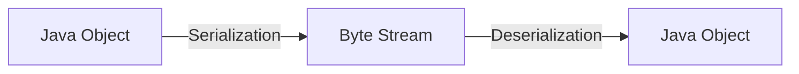

# Java Serialization

## Introduction

Java Serialization is a mechanism that enables you to convert an object into a stream of bytes, which can then be saved to a file, database, or transmitted over a network. Later, these bytes can be deserialized back into a live object with the same state as when it was serialized. 

Serialization plays a crucial role in Java applications for:
- Persisting objects between program executions
- Sending objects across a network in distributed applications
- Storing application state
- Implementing caching mechanisms

In this tutorial, we'll explore how serialization works in Java and how you can use it effectively in your applications.

## Understanding Serialization

Serialization is the process of converting an object's state into a byte stream, while deserialization is the opposite process of recreating objects from this byte stream.



### The Serializable Interface

For an object to be serialized, its class must implement the `java.io.Serializable` interface. This is a marker interface (it has no methods) that tells the JVM that the class can be serialized.

```java
import java.io.Serializable;

public class Student implements Serializable {
    // Class fields and methods
}
```

## Basic Serialization and Deserialization

Let's create a simple example of serializing and deserializing a `Student` object.

### Step 1: Create a Serializable Class

```java
import java.io.Serializable;

public class Student implements Serializable {
    // This is the version ID which helps ensure that the same class is used during serialization and deserialization
    private static final long serialVersionUID = 1L;
    
    private String name;
    private int id;
    private int age;
    
    public Student(String name, int id, int age) {
        this.name = name;
        this.id = id;
        this.age = age;
    }
    
    @Override
    public String toString() {
        return "Student [name=" + name + ", id=" + id + ", age=" + age + "]";
    }
}
```

### Step 2: Serialize an Object to a File

```java
import java.io.*;

public class SerializationDemo {
    public static void main(String[] args) {
        Student student = new Student("John Doe", 101, 20);
        
        try {
            // Create file output stream
            FileOutputStream fileOut = new FileOutputStream("student.ser");
            
            // Create object output stream
            ObjectOutputStream out = new ObjectOutputStream(fileOut);
            
            // Serialize the object
            out.writeObject(student);
            
            // Close streams
            out.close();
            fileOut.close();
            
            System.out.println("Student object has been serialized");
            System.out.println("Original Student: " + student);
            
        } catch (IOException e) {
            e.printStackTrace();
        }
    }
}
```

**Output:**
```
Student object has been serialized
Original Student: Student [name=John Doe, id=101, age=20]
```

### Step 3: Deserialize an Object from a File

```java
import java.io.*;

public class DeserializationDemo {
    public static void main(String[] args) {
        try {
            // Create file input stream
            FileInputStream fileIn = new FileInputStream("student.ser");
            
            // Create object input stream
            ObjectInputStream in = new ObjectInputStream(fileIn);
            
            // Deserialize the object
            Student student = (Student) in.readObject();
            
            // Close streams
            in.close();
            fileIn.close();
            
            System.out.println("Student object has been deserialized");
            System.out.println("Deserialized Student: " + student);
            
        } catch (IOException | ClassNotFoundException e) {
            e.printStackTrace();
        }
    }
}
```

**Output:**
```
Student object has been deserialized
Deserialized Student: Student [name=John Doe, id=101, age=20]
```

## Advanced Serialization Concepts

### Transient Fields

Sometimes you may want to exclude certain fields from being serialized. You can mark these fields with the `transient` keyword. When an object is deserialized, transient fields will be initialized with their default values (null for objects, 0 for numeric types, false for boolean).

```java
public class Student implements Serializable {
    private static final long serialVersionUID = 1L;
    
    private String name;
    private int id;
    private int age;
    private transient String temporaryData; // This field will not be serialized
    
    // ... constructors and methods
}
```

### Custom Serialization

If you need more control over the serialization process, you can implement your own methods:

```java
import java.io.*;

public class Course implements Serializable {
    private static final long serialVersionUID = 1L;
    
    private String name;
    private String instructor;
    private transient String sensitiveData;
    
    public Course(String name, String instructor, String sensitiveData) {
        this.name = name;
        this.instructor = instructor;
        this.sensitiveData = sensitiveData;
    }
    
    // Custom serialization method
    private void writeObject(ObjectOutputStream out) throws IOException {
        out.defaultWriteObject(); // Call the default serialization mechanism
        
        // Write custom encrypted version of sensitive data
        if (sensitiveData != null) {
            out.writeObject(encrypt(sensitiveData));
        } else {
            out.writeObject(null);
        }
    }
    
    // Custom deserialization method
    private void readObject(ObjectInputStream in) throws IOException, ClassNotFoundException {
        in.defaultReadObject(); // Call the default deserialization mechanism
        
        // Read and decrypt the sensitive data
        String encryptedData = (String) in.readObject();
        if (encryptedData != null) {
            this.sensitiveData = decrypt(encryptedData);
        }
    }
    
    // Simple encryption and decryption methods (for demonstration)
    private String encrypt(String data) {
        return "ENCRYPTED:" + data;
    }
    
    private String decrypt(String data) {
        return data.substring(10); // Remove "ENCRYPTED:" prefix
    }
    
    @Override
    public String toString() {
        return "Course [name=" + name + ", instructor=" + instructor + 
               ", sensitiveData=" + sensitiveData + "]";
    }
}
```

### Serialization with Inheritance

When serializing a class that extends another class:
- If the parent class is serializable, all inherited fields will be serialized automatically.
- If the parent class is not serializable, the child class needs to handle the initialization of inherited fields.

```java
// Non-serializable parent class
class Person {
    protected String name;
    protected int age;
    
    public Person() {
        // Default constructor needed for serialization of child classes
    }
    
    public Person(String name, int age) {
        this.name = name;
        this.age = age;
    }
}

// Serializable child class
class Student extends Person implements Serializable {
    private static final long serialVersionUID = 1L;
    
    private int studentId;
    
    public Student(String name, int age, int studentId) {
        super(name, age);
        this.studentId = studentId;
    }
    
    // Custom serialization to handle non-serializable parent
    private void writeObject(ObjectOutputStream out) throws IOException {
        out.defaultWriteObject();
        // Manually serialize parent class fields
        out.writeObject(name);
        out.writeInt(age);
    }
    
    // Custom deserialization to handle non-serializable parent
    private void readObject(ObjectInputStream in) throws IOException, ClassNotFoundException {
        in.defaultReadObject();
        // Manually deserialize parent class fields
        name = (String) in.readObject();
        age = in.readInt();
    }
    
    @Override
    public String toString() {
        return "Student [name=" + name + ", age=" + age + ", studentId=" + studentId + "]";
    }
}
```

## Practical Example: Saving Game State

Let's create a practical example showing how serialization can be used to save and load a game state:

```java
import java.io.*;
import java.util.ArrayList;
import java.util.List;

// Game character class
class GameCharacter implements Serializable {
    private static final long serialVersionUID = 1L;
    
    private String name;
    private int level;
    private int health;
    private List<String> inventory;
    
    public GameCharacter(String name) {
        this.name = name;
        this.level = 1;
        this.health = 100;
        this.inventory = new ArrayList<>();
    }
    
    public void levelUp() {
        this.level++;
        this.health += 20;
    }
    
    public void addItem(String item) {
        inventory.add(item);
    }
    
    @Override
    public String toString() {
        return "GameCharacter [name=" + name + ", level=" + level + 
               ", health=" + health + ", inventory=" + inventory + "]";
    }
}

// Game state class
class GameState implements Serializable {
    private static final long serialVersionUID = 1L;
    
    private GameCharacter player;
    private int currentScore;
    private String currentLevel;
    private long playTimeMillis;
    
    public GameState(GameCharacter player) {
        this.player = player;
        this.currentScore = 0;
        this.currentLevel = "Level 1";
        this.playTimeMillis = 0;
    }
    
    public void update(int score, String level, long additionalTime) {
        this.currentScore += score;
        this.currentLevel = level;
        this.playTimeMillis += additionalTime;
    }
    
    @Override
    public String toString() {
        return "GameState [\n  player=" + player + 
               ",\n  currentScore=" + currentScore + 
               ",\n  currentLevel=" + currentLevel + 
               ",\n  playTimeMillis=" + playTimeMillis + "\n]";
    }
}

// Game class with save/load functionality
public class GameSaveDemo {
    public static void main(String[] args) {
        // Create initial game state
        GameCharacter hero = new GameCharacter("Hero");
        hero.addItem("Sword");
        hero.addItem("Shield");
        
        GameState initialState = new GameState(hero);
        System.out.println("=== Initial Game State ===");
        System.out.println(initialState);
        
        // Save the game
        saveGame(initialState, "save1.dat");
        
        // Continue playing (modify the state)
        hero.levelUp();
        hero.addItem("Potion");
        initialState.update(500, "Level 2", 3600000); // 1 hour of play time
        
        System.out.println("\n=== Updated Game State ===");
        System.out.println(initialState);
        
        // Load the saved game (restoring the initial state)
        GameState loadedState = loadGame("save1.dat");
        
        System.out.println("\n=== Loaded Game State ===");
        System.out.println(loadedState);
    }
    
    // Save game state to file
    public static void saveGame(GameState state, String fileName) {
        try (ObjectOutputStream out = new ObjectOutputStream(new FileOutputStream(fileName))) {
            out.writeObject(state);
            System.out.println("\nGame saved successfully to " + fileName);
        } catch (IOException e) {
            System.out.println("Error saving game: " + e.getMessage());
        }
    }
    
    // Load game state from file
    public static GameState loadGame(String fileName) {
        try (ObjectInputStream in = new ObjectInputStream(new FileInputStream(fileName))) {
            GameState state = (GameState) in.readObject();
            System.out.println("\nGame loaded successfully from " + fileName);
            return state;
        } catch (IOException | ClassNotFoundException e) {
            System.out.println("Error loading game: " + e.getMessage());
            return null;
        }
    }
}
```

**Output:**
```
=== Initial Game State ===
GameState [
  player=GameCharacter [name=Hero, level=1, health=100, inventory=[Sword, Shield]],
  currentScore=0,
  currentLevel=Level 1,
  playTimeMillis=0
]

Game saved successfully to save1.dat

=== Updated Game State ===
GameState [
  player=GameCharacter [name=Hero, level=2, health=120, inventory=[Sword, Shield, Potion]],
  currentScore=500,
  currentLevel=Level 2,
  playTimeMillis=3600000
]

Game loaded successfully from save1.dat

=== Loaded Game State ===
GameState [
  player=GameCharacter [name=Hero, level=1, health=100, inventory=[Sword, Shield]],
  currentScore=0,
  currentLevel=Level 1,
  playTimeMillis=0
]
```

## Best Practices and Considerations

### 1. Always Include serialVersionUID

```java
private static final long serialVersionUID = 1L;
```

This unique identifier helps ensure compatibility between different versions of your class. If you don't define it explicitly, Java generates one based on class details, which can change when you modify your class.

### 2. Be Cautious with Complex Object Graphs

When serializing an object that references other objects, all referenced objects must also be serializable, creating a cascading effect.

### 3. Security Considerations

Serialization can introduce security vulnerabilities. Be careful when deserializing objects from untrusted sources.

### 4. Performance Impact

Serialization can be resource-intensive for large objects. Consider alternatives like JSON or XML for web applications.

### 5. Handle Non-Serializable Fields

Use `transient` for fields that shouldn't be serialized or implement custom serialization methods.

## Summary

Java Serialization is a powerful feature that allows you to convert objects to byte streams and back again. This enables you to:

- Save application state to files for later retrieval
- Send objects across networks in distributed applications
- Implement caching mechanisms
- Create deep copies of objects

While powerful, serialization comes with considerations around versioning, security, and performance. Understanding these aspects is crucial for effectively using serialization in your applications.

## Additional Resources

- [Java Documentation on Serialization](https://docs.oracle.com/javase/tutorial/jndi/objects/serial.html)
- [Serialization Best Practices](https://www.oracle.com/technical-resources/articles/java/serializationapi.html)

## Exercises

1. **Basic Serialization**: Create a `Library` class containing a list of `Book` objects. Implement serialization to save and load the library state.

2. **Transient Fields**: Modify the `Student` class to include sensitive information like a password or SSN that shouldn't be serialized.

3. **Custom Serialization**: Create a `BankAccount` class with custom serialization that encrypts the account balance during serialization.

4. **Versioning**: Create two versions of a class and experiment with serialization compatibility between them.

5. **Inheritance**: Create a serializable class that extends a non-serializable parent and handle the serialization appropriately.