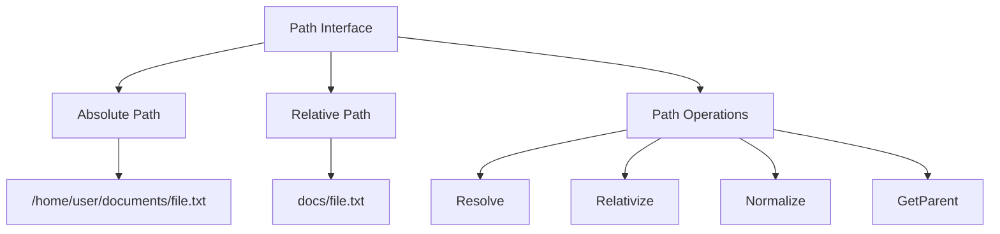

# Java Path Files

## Introduction

In modern Java development, working with files and directories requires a solid understanding of paths. The `Path` interface, introduced in Java 7 as part of the NIO.2 (New I/O) API, provides a powerful and flexible way to work with file locations in the file system. This interface, along with the helper class `Paths`, allows developers to manipulate file paths, navigate directory structures, and perform file operations in a more intuitive and platform-independent manner.

In this tutorial, we'll explore the Java `Path` interface, understand how to create and manipulate file paths, and learn about common operations you can perform with paths in your Java applications.

## What is a Path?

A `Path` represents a location in a file system. It may point to a file or a directory, and it can be absolute (starting from the root of the file system) or relative (starting from some other reference point). Unlike the older `File` class, `Path` is an interface that provides more flexibility and functionality when working with file system locations.



## Creating Path Objects

The most common way to create a `Path` object is by using the `Paths.get()` method. Let's look at some examples:

```java
import java.nio.file.Path;
import java.nio.file.Paths;

public class PathCreationExample {
    public static void main(String[] args) {
        // Creating a path using a single string
        Path path1 = Paths.get("/home/user/documents/file.txt");
        System.out.println("Path1: " + path1);

        // Creating a path using multiple strings
        Path path2 = Paths.get("/home", "user", "documents", "file.txt");
        System.out.println("Path2: " + path2);

        // Creating a relative path
        Path path3 = Paths.get("documents", "file.txt");
        System.out.println("Path3: " + path3);
        
        // Creating a path from a URI
        Path path4 = Paths.get(URI.create("file:///home/user/documents/file.txt"));
        System.out.println("Path4: " + path4);
    }
}
```

Output:
```
Path1: /home/user/documents/file.txt
Path2: /home/user/documents/file.txt
Path3: documents/file.txt
Path4: /home/user/documents/file.txt
```

## Path Information Methods

The `Path` interface provides several methods to retrieve information about the path:

```java
import java.nio.file.Path;
import java.nio.file.Paths;

public class PathInfoExample {
    public static void main(String[] args) {
        Path path = Paths.get("/home/user/documents/file.txt");

        // Get filename
        System.out.println("Filename: " + path.getFileName());

        // Get parent directory
        System.out.println("Parent: " + path.getParent());

        // Get root
        System.out.println("Root: " + path.getRoot());

        // Number of name elements
        System.out.println("Name count: " + path.getNameCount());

        // Get specific name element
        System.out.println("First name element: " + path.getName(0));
        System.out.println("Last name element: " + path.getName(path.getNameCount() - 1));

        // Iterate through path elements
        System.out.println("Path elements:");
        for (Path element : path) {
            System.out.println("  " + element);
        }
        
        // Check if absolute
        System.out.println("Is absolute: " + path.isAbsolute());
        
        // Convert relative to absolute
        Path relativePath = Paths.get("documents/file.txt");
        System.out.println("Absolute path: " + relativePath.toAbsolutePath());
    }
}
```

Output:
```
Filename: file.txt
Parent: /home/user/documents
Root: /
Name count: 4
First name element: home
Last name element: file.txt
Path elements:
  home
  user
  documents
  file.txt
Is absolute: true
Absolute path: /current/working/directory/documents/file.txt
```

## Path Operations

### Path Normalization

Path normalization removes redundancies such as `.` and `..` references:

```java
import java.nio.file.Path;
import java.nio.file.Paths;

public class PathNormalizationExample {
    public static void main(String[] args) {
        // Path with redundant elements
        Path path = Paths.get("/home/./user/../user/documents/");
        
        // Normalize the path
        Path normalizedPath = path.normalize();
        
        System.out.println("Original path: " + path);
        System.out.println("Normalized path: " + normalizedPath);
    }
}
```

Output:
```
Original path: /home/./user/../user/documents
Normalized path: /home/user/documents
```

### Resolving Paths

You can combine paths using the `resolve()` method:

```java
import java.nio.file.Path;
import java.nio.file.Paths;

public class PathResolveExample {
    public static void main(String[] args) {
        Path basePath = Paths.get("/home/user");
        
        // Resolve with relative path
        Path resolvedPath1 = basePath.resolve("documents/file.txt");
        System.out.println("Resolved path 1: " + resolvedPath1);
        
        // Resolve with absolute path (ignores base path)
        Path resolvedPath2 = basePath.resolve("/etc/config.txt");
        System.out.println("Resolved path 2: " + resolvedPath2);
        
        // Resolve sibling (replace the last name element)
        Path filePath = Paths.get("/home/user/file1.txt");
        Path siblingPath = filePath.resolveSibling("file2.txt");
        System.out.println("Sibling path: " + siblingPath);
    }
}
```

Output:
```
Resolved path 1: /home/user/documents/file.txt
Resolved path 2: /etc/config.txt
Sibling path: /home/user/file2.txt
```

### Relativizing Paths

The `relativize()` method creates a relative path between two paths:

```java
import java.nio.file.Path;
import java.nio.file.Paths;

public class PathRelativizeExample {
    public static void main(String[] args) {
        Path path1 = Paths.get("/home/user/documents");
        Path path2 = Paths.get("/home/user/documents/file.txt");
        
        // Find the relative path from path1 to path2
        Path relativePath1 = path1.relativize(path2);
        System.out.println("Relative path from documents to file.txt: " + relativePath1);
        
        // Find the relative path from path2 to path1
        Path relativePath2 = path2.relativize(path1);
        System.out.println("Relative path from file.txt to documents: " + relativePath2);
        
        // Another example with more complex paths
        Path path3 = Paths.get("/home/user/photos");
        Path relativePath3 = path1.relativize(path3);
        System.out.println("Relative path from documents to photos: " + relativePath3);
    }
}
```

Output:
```
Relative path from documents to file.txt: file.txt
Relative path from file.txt to documents: ..
Relative path from documents to photos: ../photos
```

## Converting Between Path and Other Types

You can convert between `Path` objects and other representations like `File`, `URI`, or strings:

```java
import java.io.File;
import java.net.URI;
import java.nio.file.Path;
import java.nio.file.Paths;

public class PathConversionExample {
    public static void main(String[] args) {
        Path path = Paths.get("/home/user/documents/file.txt");
        
        // Convert to File
        File file = path.toFile();
        System.out.println("File path: " + file.getPath());
        
        // Convert to URI
        URI uri = path.toUri();
        System.out.println("URI: " + uri);
        
        // Convert to absolute path
        Path absolutePath = path.toAbsolutePath();
        System.out.println("Absolute path: " + absolutePath);
        
        // Convert to real path (resolves symbolic links)
        try {
            Path realPath = path.toRealPath();
            System.out.println("Real path: " + realPath);
        } catch (Exception e) {
            System.out.println("Could not determine real path: " + e.getMessage());
        }
        
        // Convert from File to Path
        File anotherFile = new File("/tmp/temp.txt");
        Path anotherPath = anotherFile.toPath();
        System.out.println("Path from File: " + anotherPath);
    }
}
```

## Real-World Examples

### Example 1: Creating a Directory Structure

Let's create a directory structure for a project:

```java
import java.io.IOException;
import java.nio.file.Files;
import java.nio.file.Path;
import java.nio.file.Paths;

public class ProjectDirectoryExample {
    public static void main(String[] args) {
        try {
            // Base project directory
            Path projectDir = Paths.get("my-project");
            
            // Create project directory structure
            Path srcDir = projectDir.resolve("src");
            Path mainDir = srcDir.resolve("main");
            Path testDir = srcDir.resolve("test");
            Path resourcesDir = mainDir.resolve("resources");
            Path javaDir = mainDir.resolve("java");
            
            // Create all directories
            Files.createDirectories(javaDir);
            Files.createDirectories(resourcesDir);
            Files.createDirectories(testDir);
            
            // Create files
            Files.writeString(projectDir.resolve("README.md"), "# My Project\nA sample project");
            Files.writeString(javaDir.resolve("Main.java"), "public class Main {\n    public static void main(String[] args) {\n        System.out.println(\"Hello, World!\");\n    }\n}");
            
            System.out.println("Project structure created successfully!");
            
            // Print the directory tree
            Files.walk(projectDir, 3).forEach(p -> {
                System.out.println(projectDir.relativize(p));
            });
            
        } catch (IOException e) {
            System.err.println("Error creating project structure: " + e.getMessage());
        }
    }
}
```

### Example 2: Finding Files with Specific Extension

```java
import java.io.IOException;
import java.nio.file.*;
import java.util.List;
import java.util.stream.Collectors;
import java.util.stream.Stream;

public class FindFilesExample {
    public static void main(String[] args) {
        try {
            Path directoryPath = Paths.get("src");
            
            // Find all Java files in the directory and its subdirectories
            List<Path> javaFiles;
            try (Stream<Path> paths = Files.walk(directoryPath)) {
                javaFiles = paths
                    .filter(Files::isRegularFile)
                    .filter(p -> p.toString().endsWith(".java"))
                    .collect(Collectors.toList());
            }
            
            System.out.println("Found " + javaFiles.size() + " Java files:");
            for (Path javaFile : javaFiles) {
                System.out.println("  " + directoryPath.relativize(javaFile));
            }
            
        } catch (IOException e) {
            System.err.println("Error searching files: " + e.getMessage());
        }
    }
}
```

### Example 3: Watching a Directory for Changes

```java
import java.io.IOException;
import java.nio.file.*;

public class DirectoryWatcherExample {
    public static void main(String[] args) {
        try {
            Path directory = Paths.get("watched-folder");
            
            // Create directory if it doesn't exist
            if (!Files.exists(directory)) {
                Files.createDirectory(directory);
                System.out.println("Created directory: " + directory);
            }
            
            // Get the directory watch service
            WatchService watchService = FileSystems.getDefault().newWatchService();
            
            // Register for events
            directory.register(
                watchService, 
                StandardWatchEventKinds.ENTRY_CREATE, 
                StandardWatchEventKinds.ENTRY_MODIFY, 
                StandardWatchEventKinds.ENTRY_DELETE
            );
            
            System.out.println("Watching directory: " + directory);
            System.out.println("Try creating, modifying, or deleting files in this directory...");
            
            // Process events
            while (true) {
                WatchKey key = watchService.take(); // Blocks until events occur
                
                for (WatchEvent<?> event : key.pollEvents()) {
                    WatchEvent.Kind<?> kind = event.kind();
                    
                    // Get the filename for the event
                    @SuppressWarnings("unchecked")
                    Path filename = ((WatchEvent<Path>) event).context();
                    Path fullPath = directory.resolve(filename);
                    
                    if (kind == StandardWatchEventKinds.OVERFLOW) {
                        System.out.println("Event overflow occurred");
                        continue;
                    }
                    
                    System.out.println(kind + " - " + fullPath);
                }
                
                // Reset the key to receive further events
                boolean valid = key.reset();
                if (!valid) {
                    System.out.println("Directory is no longer accessible. Exiting.");
                    break;
                }
            }
            
        } catch (IOException | InterruptedException e) {
            System.err.println("Error watching directory: " + e.getMessage());
        }
    }
}
```

## Summary

In this tutorial, we've explored the Java `Path` interface and its associated methods for file path manipulation. We've covered:

- Creating `Path` objects using the `Paths.get()` method
- Retrieving information about paths (filename, parent, root)
- Normalizing paths to remove redundancies
- Resolving and relativizing paths
- Converting between `Path` objects and other types
- Real-world applications of `Path` in directory creation, file searching, and directory monitoring

The `Path` interface provides a modern and flexible way to work with file paths in Java applications. By understanding and using these APIs effectively, you can write more maintainable and platform-independent code for file system operations.

## Additional Resources

- [Java Path (Official Oracle Documentation)](https://docs.oracle.com/javase/8/docs/api/java/nio/file/Path.html)
- [Java NIO.2 File System API](https://docs.oracle.com/javase/tutorial/essential/io/fileio.html)

## Exercises

1. Write a program that lists all files in a directory and its subdirectories, showing their relative paths from the starting directory.

2. Create a utility class with a method that takes a string representing a file path and returns a normalized version of the path.

3. Write a program that copies all files from one directory to another, preserving the directory structure.

4. Implement a simple file search utility that allows users to search for files by name or extension within a specified directory.

5. Create a program that monitors a specific directory for new text files and automatically counts the number of lines, words, and characters in each new file.