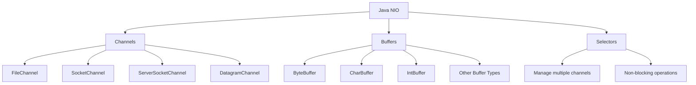

# Java NIO Package

## Introduction

The Java NIO (New Input/Output) package was introduced in Java 1.4 to provide a more efficient and flexible way of handling I/O operations compared to the traditional I/O mechanisms. While standard I/O operations are stream-oriented and blocking, NIO operations are buffer-oriented and can operate in non-blocking mode, making them more suitable for applications that require high performance.

In this tutorial, we'll explore the Java NIO package and understand how it can be used for efficient file operations.

## Key Components of Java NIO

The Java NIO package consists of three core components:



1. **Channels**: Transport mechanisms for data between buffers and sources/destinations
2. **Buffers**: Containers for data that is being processed
3. **Selectors**: Allow a single thread to monitor multiple channels for events

Let's dive deeper into each component.

## Buffers

A Buffer is an object that holds data to be written to or read from. It acts as a container for a fixed amount of data of a specific primitive type. NIO provides buffer classes for all primitive types except boolean.

Here's an example of creating and using a ByteBuffer:

```java
import java.nio.ByteBuffer;

public class BufferExample {
    public static void main(String[] args) {
        // Create a ByteBuffer with a capacity of 10
        ByteBuffer buffer = ByteBuffer.allocate(10);
        
        // Write data to the buffer
        buffer.put((byte) 1);
        buffer.put((byte) 2);
        buffer.put((byte) 3);
        
        // Prepare for reading (flip switches the buffer from writing mode to reading mode)
        buffer.flip();
        
        // Read data from the buffer
        while (buffer.hasRemaining()) {
            System.out.println(buffer.get());
        }
        
        // Clear the buffer to prepare it for writing again
        buffer.clear();
    }
}
```

**Output:**
```
1
2
3
```

### Buffer Properties

Every buffer has four key properties:

1. **Capacity**: The maximum amount of data the buffer can hold
2. **Position**: The current position in the buffer where the next read or write will occur
3. **Limit**: The first element that should not be read or written
4. **Mark**: A remembered position that can be reset to

## Channels

A Channel represents an open connection to an entity such as a file, socket, or other I/O device that is capable of performing read, write, or both operations. Channels work closely with buffers; you read data from a channel into a buffer, and write data from a buffer into a channel.

### FileChannel Example

Here's how to read a file using FileChannel:

```java
import java.io.FileInputStream;
import java.io.IOException;
import java.nio.ByteBuffer;
import java.nio.channels.FileChannel;

public class FileChannelReadExample {
    public static void main(String[] args) {
        try {
            FileInputStream fileInputStream = new FileInputStream("example.txt");
            FileChannel channel = fileInputStream.getChannel();
            
            // Create a buffer to hold the content
            ByteBuffer buffer = ByteBuffer.allocate(1024);
            
            // Read data from the channel into the buffer
            int bytesRead = channel.read(buffer);
            
            // Prepare the buffer for reading
            buffer.flip();
            
            // Read the content as a string
            byte[] bytes = new byte[bytesRead];
            buffer.get(bytes);
            String content = new String(bytes);
            
            System.out.println("File content: " + content);
            
            // Close the resources
            channel.close();
            fileInputStream.close();
        } catch (IOException e) {
            e.printStackTrace();
        }
    }
}
```

If our example.txt contains "Hello, NIO!", the output would be:

```
File content: Hello, NIO!
```

### Writing to a File with FileChannel

Here's how to write to a file using FileChannel:

```java
import java.io.FileOutputStream;
import java.io.IOException;
import java.nio.ByteBuffer;
import java.nio.channels.FileChannel;

public class FileChannelWriteExample {
    public static void main(String[] args) {
        try {
            String data = "Hello, I'm using Java NIO!";
            
            FileOutputStream fileOutputStream = new FileOutputStream("output.txt");
            FileChannel channel = fileOutputStream.getChannel();
            
            // Create a buffer and put data into it
            ByteBuffer buffer = ByteBuffer.allocate(1024);
            buffer.put(data.getBytes());
            
            // Prepare the buffer for writing
            buffer.flip();
            
            // Write data from the buffer to the channel
            channel.write(buffer);
            
            // Close the resources
            channel.close();
            fileOutputStream.close();
            
            System.out.println("Data written successfully!");
        } catch (IOException e) {
            e.printStackTrace();
        }
    }
}
```

**Output:**
```
Data written successfully!
```

And a file named "output.txt" will be created with the content "Hello, I'm using Java NIO!".

## File Copy Using NIO

Let's implement a practical example of copying a file using NIO:

```java
import java.io.IOException;
import java.nio.ByteBuffer;
import java.nio.channels.FileChannel;
import java.nio.file.Path;
import java.nio.file.Paths;
import java.nio.file.StandardOpenOption;

public class FileCopyNIO {
    public static void main(String[] args) {
        String sourceFilePath = "source.txt";
        String destinationFilePath = "destination.txt";
        
        try {
            Path sourcePath = Paths.get(sourceFilePath);
            Path destinationPath = Paths.get(destinationFilePath);
            
            // Open channels for reading and writing
            FileChannel sourceChannel = FileChannel.open(sourcePath, StandardOpenOption.READ);
            FileChannel destinationChannel = FileChannel.open(
                destinationPath, 
                StandardOpenOption.CREATE, 
                StandardOpenOption.WRITE
            );
            
            // Create a buffer
            ByteBuffer buffer = ByteBuffer.allocate(1024);
            
            // Read from source and write to destination
            while (sourceChannel.read(buffer) > 0) {
                buffer.flip();
                destinationChannel.write(buffer);
                buffer.clear();
            }
            
            // Close the channels
            sourceChannel.close();
            destinationChannel.close();
            
            System.out.println("File copied successfully from " + sourceFilePath + " to " + destinationFilePath);
        } catch (IOException e) {
            e.printStackTrace();
        }
    }
}
```

This example assumes you have a file named "source.txt" in your project directory. It will create a copy named "destination.txt".

## Path and Files API in NIO.2 (Java 7+)

Java 7 introduced NIO.2, which enhanced the NIO API with new features for file operations. The main classes in NIO.2 are Path and Files.

### Path API Example

```java
import java.nio.file.Path;
import java.nio.file.Paths;

public class PathExample {
    public static void main(String[] args) {
        // Create a Path object
        Path path = Paths.get("example/test/myfile.txt");
        
        // Get information about the path
        System.out.println("File name: " + path.getFileName());
        System.out.println("Parent: " + path.getParent());
        System.out.println("Root: " + path.getRoot());
        System.out.println("Absolute path: " + path.toAbsolutePath());
        
        // Resolve a relative path
        Path basePath = Paths.get("base");
        Path resolvedPath = basePath.resolve("subdir/myfile.txt");
        System.out.println("Resolved path: " + resolvedPath);
        
        // Normalize a path
        Path complexPath = Paths.get("dir1/../dir2/./file.txt");
        Path normalizedPath = complexPath.normalize();
        System.out.println("Normalized path: " + normalizedPath);
    }
}
```

**Output (may vary based on operating system):**
```
File name: myfile.txt
Parent: example/test
Root: null
Absolute path: /your/current/directory/example/test/myfile.txt
Resolved path: base/subdir/myfile.txt
Normalized path: dir2/file.txt
```

### Files API Example

```java
import java.io.IOException;
import java.nio.charset.StandardCharsets;
import java.nio.file.Files;
import java.nio.file.Path;
import java.nio.file.Paths;
import java.nio.file.StandardOpenOption;
import java.util.List;

public class FilesExample {
    public static void main(String[] args) {
        try {
            // Create a Path
            Path path = Paths.get("example.txt");
            
            // Write to a file
            String content = "Hello, NIO.2!\nThis is a test file.";
            Files.write(path, content.getBytes(StandardCharsets.UTF_8));
            
            // Read all lines from a file
            List<String> lines = Files.readAllLines(path, StandardCharsets.UTF_8);
            System.out.println("File content (line by line):");
            for (String line : lines) {
                System.out.println(line);
            }
            
            // Read all content as a string
            String fileContent = Files.readString(path, StandardCharsets.UTF_8);
            System.out.println("\nFile content (as string):");
            System.out.println(fileContent);
            
            // Append to a file
            Files.write(
                path, 
                "\nAppended text.".getBytes(StandardCharsets.UTF_8),
                StandardOpenOption.APPEND
            );
            
            // Check file attributes
            System.out.println("\nFile size: " + Files.size(path) + " bytes");
            System.out.println("Last modified: " + Files.getLastModifiedTime(path));
            System.out.println("Is readable? " + Files.isReadable(path));
            System.out.println("Is writable? " + Files.isWritable(path));
            
        } catch (IOException e) {
            e.printStackTrace();
        }
    }
}
```

**Output:**
```
File content (line by line):
Hello, NIO.2!
This is a test file.

File content (as string):
Hello, NIO.2!
This is a test file.

File size: 40 bytes
Last modified: 2023-07-10T12:34:56.789Z
Is readable? true
Is writable? true
```

## Real-World Application: File Search Tool

Let's build a simple file search tool using Java NIO to search for files with a specific extension in a directory and its subdirectories:

```java
import java.io.IOException;
import java.nio.file.*;
import java.nio.file.attribute.BasicFileAttributes;
import java.util.ArrayList;
import java.util.List;

public class FileSearchTool {
    public static void main(String[] args) {
        // Define search directory and extension
        Path startDir = Paths.get(".");  // Current directory
        String extension = ".java";      // Looking for Java files
        
        try {
            // Get list of matching files
            List<Path> matchingFiles = findFilesByExtension(startDir, extension);
            
            // Print results
            System.out.println("Found " + matchingFiles.size() + " file(s) with extension " + extension + ":");
            for (Path file : matchingFiles) {
                System.out.println(file.toAbsolutePath());
            }
            
        } catch (IOException e) {
            System.err.println("Error searching files: " + e.getMessage());
        }
    }
    
    // Method to find files with the specified extension
    public static List<Path> findFilesByExtension(Path startDir, String extension) throws IOException {
        final List<Path> matchingFiles = new ArrayList<>();
        
        // Use Files.walkFileTree to traverse directory
        Files.walkFileTree(startDir, new SimpleFileVisitor<Path>() {
            @Override
            public FileVisitResult visitFile(Path file, BasicFileAttributes attrs) {
                String fileName = file.toString();
                if (fileName.endsWith(extension)) {
                    matchingFiles.add(file);
                }
                return FileVisitResult.CONTINUE;
            }
            
            @Override
            public FileVisitResult visitFileFailed(Path file, IOException exc) {
                System.err.println("Failed to access: " + file + " - " + exc.getMessage());
                return FileVisitResult.CONTINUE;
            }
        });
        
        return matchingFiles;
    }
}
```

This program will search for all Java files in the current directory and its subdirectories. It demonstrates several NIO features:
- The Path API
- Files.walkFileTree for directory traversal
- SimpleFileVisitor for custom file processing

## Selector

One of the most powerful features of Java NIO is the Selector, which allows a single thread to monitor multiple channels for events. This is particularly useful for network operations. Here's a simple overview:

```java
import java.nio.channels.SelectionKey;
import java.nio.channels.Selector;
import java.nio.channels.SocketChannel;
import java.nio.channels.ServerSocketChannel;
import java.net.InetSocketAddress;
import java.io.IOException;
import java.util.Iterator;
import java.util.Set;

public class SelectorOverview {
    public static void showSelectorExample() throws IOException {
        // Create a selector
        Selector selector = Selector.open();
        
        // Create and configure a server socket channel
        ServerSocketChannel serverChannel = ServerSocketChannel.open();
        serverChannel.configureBlocking(false); // Non-blocking mode
        serverChannel.socket().bind(new InetSocketAddress(8080));
        
        // Register the channel with the selector for accept events
        serverChannel.register(selector, SelectionKey.OP_ACCEPT);
        
        System.out.println("Server started on port 8080...");
        
        // This would be an infinite loop in a real server
        for (int i = 0; i < 1; i++) {
            // Wait for events
            int readyChannels = selector.select();
            
            if (readyChannels == 0) {
                continue;
            }
            
            // Process selected keys
            Set<SelectionKey> selectedKeys = selector.selectedKeys();
            Iterator<SelectionKey> keyIterator = selectedKeys.iterator();
            
            while (keyIterator.hasNext()) {
                SelectionKey key = keyIterator.next();
                
                if (key.isAcceptable()) {
                    // Accept new connection
                    System.out.println("Connection accepted");
                } else if (key.isReadable()) {
                    // Read data from connection
                    System.out.println("Data available for reading");
                }
                
                keyIterator.remove();
            }
        }
        
        // Close resources (in a real server, this would be in a finally block)
        serverChannel.close();
        selector.close();
    }
    
    // This is just a demonstration - in a real application, you'd have a proper server loop
    public static void main(String[] args) {
        try {
            showSelectorExample();
            System.out.println("Example shown - in a real server this would run until stopped");
        } catch (IOException e) {
            e.printStackTrace();
        }
    }
}
```

This code demonstrates the basic structure of a server using NIO selectors, though it doesn't actually process connections (that would require more complex code).

## When to Use NIO vs. Traditional I/O

| Use Case | Recommendation |
|----------|----------------|
| Simple file operations | Traditional I/O for simplicity |
| Large file processing | NIO for better performance |
| High-throughput network | NIO with non-blocking mode |
| Simple network programs | Traditional I/O for simplicity |
| Multiple connections | NIO selectors for scalability |
| Memory-mapped files | NIO for direct access |

## Summary

In this tutorial, we've explored Java's NIO package which provides powerful tools for I/O operations:

1. **Buffers** for holding data during processing
2. **Channels** for transferring data between sources/destinations and buffers
3. **Selectors** for managing multiple channels with a single thread
4. **Path and Files APIs** for simplified file operations

Java NIO offers advantages over traditional I/O including:
- Buffer-oriented operations that can be more efficient
- Non-blocking I/O operations
- Selectors for handling multiple connections
- Memory-mapped files for improved performance
- More powerful file operations with Path and Files APIs

## Exercises

1. Create a program that counts the frequency of each character in a text file using NIO.
2. Implement a directory monitor that watches for file changes using the WatchService API.
3. Write a program that copies a large file using NIO memory-mapped files and compare its performance with traditional I/O.
4. Create a simple HTTP server using NIO selectors.
5. Implement a file compression utility using NIO.

## Additional Resources

- [Java NIO Official Documentation](https://docs.oracle.com/javase/8/docs/api/java/nio/package-summary.html)
- [Java NIO.2 Files API](https://docs.oracle.com/javase/8/docs/api/java/nio/file/Files.html)
- [Java NIO Tutorial by Baeldung](https://www.baeldung.com/java-nio-2-file-api)
- [NIO and NIO.2 by Oracle](https://docs.oracle.com/javase/tutorial/essential/io/fileio.html)
- Book: "Java NIO" by Ron Hitchens

With Java NIO, you can build more efficient and scalable applications for file and network operations. While it may have a steeper learning curve than the traditional I/O API, the performance benefits and additional features make it worth exploring for serious Java developers.