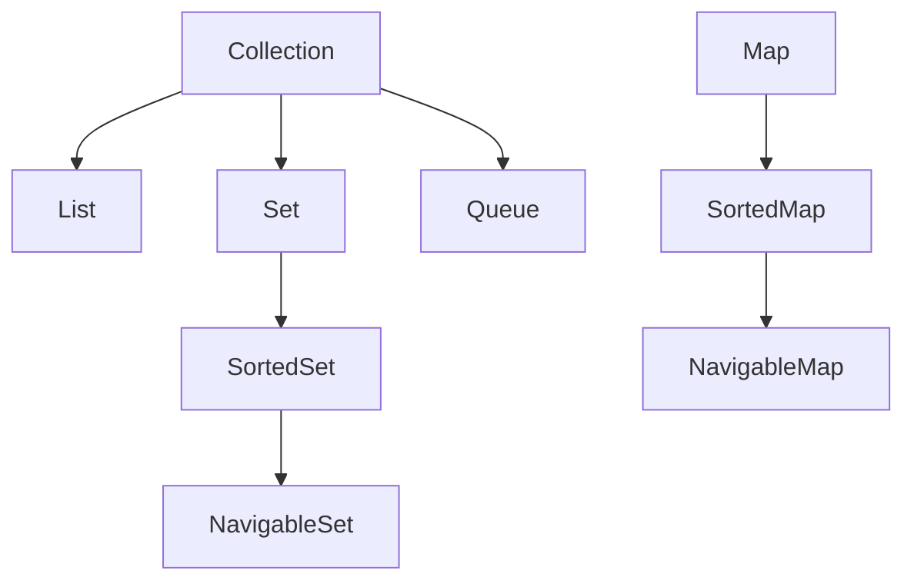

# Java Collections Overview

## Introduction

The Java Collections Framework (JCF) is a unified architecture for representing and manipulating collections of objects. It contains interfaces, implementations, and algorithms that allow developers to store, retrieve, process, and manipulate groups of objects efficiently.

If you've ever needed to work with a group of objects rather than just a single object, collections are your solution. Rather than reinventing the wheel by creating custom data structures, Java provides a set of ready-to-use collection classes that implement common data structures like lists, sets, maps, queues, and more.

## Why Use Java Collections?

Before diving into the specifics, let's understand why collections are essential in Java:

1. **Reduces programming effort** - Reusable data structures so you don't have to write them yourself
2. **Improves program speed and quality** - High-performance implementations of useful data structures
3. **Allows interoperability** - Establishes a common language for passing collections between APIs
4. **Reduces effort to learn and use new APIs** - Similar interfaces across collections
5. **Promotes software reuse** - Decouples algorithms from specific implementations

## Core Collection Interfaces

The JCF consists of several core interfaces that define different types of collections:



### Collection Interface

At the root of the collection hierarchy is the `Collection` interface. It's the foundation for all collection classes and defines the operations that all collections will have:

```java
public interface Collection<E> extends Iterable<E> {
    // Basic operations
    boolean add(E element);
    boolean remove(Object element);
    boolean contains(Object element);
    int size();
    boolean isEmpty();
    
    // Bulk operations
    boolean addAll(Collection<? extends E> c);
    boolean removeAll(Collection<?> c);
    boolean retainAll(Collection<?> c);
    void clear();
    
    // Array operations
    Object[] toArray();
    <T> T[] toArray(T[] a);
    
    // ... other methods
}
```

### List Interface

A `List` is an ordered collection that allows duplicate elements. Elements can be accessed by their integer index.

```java
// Creating Lists
List<String> arrayList = new ArrayList<>();
List<String> linkedList = new LinkedList<>();

// Basic operations
arrayList.add("Apple");           // Adding elements
arrayList.add("Banana");
arrayList.add("Apple");           // Duplicates allowed
System.out.println(arrayList);    // Output: [Apple, Banana, Apple]

// Access by index
String fruit = arrayList.get(1);  // Get element at index 1
System.out.println(fruit);        // Output: Banana

// Insert at specific position
arrayList.add(1, "Orange");
System.out.println(arrayList);    // Output: [Apple, Orange, Banana, Apple]

// Replace element
arrayList.set(0, "Mango");
System.out.println(arrayList);    // Output: [Mango, Orange, Banana, Apple]
```

### Set Interface

A `Set` is a collection that does not allow duplicate elements. It models the mathematical set abstraction.

```java
// Creating Sets
Set<String> hashSet = new HashSet<>();
Set<String> linkedHashSet = new LinkedHashSet<>();
Set<String> treeSet = new TreeSet<>();

// Adding elements
hashSet.add("Apple");
hashSet.add("Banana");
hashSet.add("Apple");     // Duplicate not added
System.out.println(hashSet);  // Output: [Apple, Banana] (order not guaranteed)

// Check membership
boolean contains = hashSet.contains("Apple");
System.out.println("Contains Apple? " + contains);  // Output: Contains Apple? true

// Remove element
hashSet.remove("Apple");
System.out.println(hashSet);  // Output: [Banana]
```

### Map Interface

A `Map` is an object that maps keys to values. A map cannot contain duplicate keys; each key can map to at most one value.

```java
// Creating Maps
Map<String, Integer> hashMap = new HashMap<>();
Map<String, Integer> linkedHashMap = new LinkedHashMap<>();
Map<String, Integer> treeMap = new TreeMap<>();

// Adding key-value pairs
hashMap.put("Apple", 95);
hashMap.put("Banana", 105);
hashMap.put("Cherry", 80);

// Get value by key
int appleCalories = hashMap.get("Apple");
System.out.println("Apple calories: " + appleCalories);  // Output: Apple calories: 95

// Check if key exists
boolean containsKey = hashMap.containsKey("Grape");
System.out.println("Contains Grape? " + containsKey);    // Output: Contains Grape? false

// Iterate over a Map
for (Map.Entry<String, Integer> entry : hashMap.entrySet()) {
    System.out.println(entry.getKey() + ": " + entry.getValue() + " calories");
}
// Output:
// Apple: 95 calories
// Banana: 105 calories
// Cherry: 80 calories
```

### Queue Interface

A `Queue` represents a collection designed for holding elements prior to processing. Besides basic Collection operations, queues provide additional insertion, extraction, and inspection operations.

```java
// Creating Queues
Queue<String> linkedList = new LinkedList<>();
Queue<String> priorityQueue = new PriorityQueue<>();

// Adding elements
linkedList.add("First");
linkedList.add("Second");
linkedList.add("Third");

// Queue-specific operations
String head = linkedList.peek();  // View the head of queue without removing
System.out.println("Head: " + head);  // Output: Head: First

String removed = linkedList.poll();  // Remove and return the head
System.out.println("Removed: " + removed);  // Output: Removed: First
System.out.println("Queue after poll: " + linkedList);  // Output: Queue after poll: [Second, Third]
```

## Common Collection Implementations

Here are the most frequently used implementations of the collection interfaces:

### List Implementations

1. **ArrayList**: Implements a resizable array. Good for random access but slow for inserting/removing elements in the middle.
2. **LinkedList**: Implements a doubly-linked list. Good for frequent insertions/deletions but slower for random access.

### Set Implementations

1. **HashSet**: Uses a hash table for storage. Offers constant-time performance but doesn't guarantee iteration order.
2. **LinkedHashSet**: Hash table with linked list for predictable iteration order.
3. **TreeSet**: Implements a Red-Black tree. Elements are sorted in natural order or by a Comparator.

### Map Implementations

1. **HashMap**: Uses a hash table for storage. Fast access but doesn't maintain any order.
2. **LinkedHashMap**: Hash table with linked list maintains insertion order or access order.
3. **TreeMap**: Red-Black tree implementation. Keys are sorted in natural order or by a Comparator.

### Queue Implementations

1. **LinkedList**: Implements Queue interface, offers FIFO behavior.
2. **PriorityQueue**: Elements are ordered by natural ordering or by a Comparator.

## Choosing the Right Collection

Selecting the appropriate collection depends on your specific requirements:

1. **Need ordered elements with duplicates?** → Use a `List` (ArrayList or LinkedList)
2. **Need uniqueness without caring about order?** → Use `HashSet`
3. **Need uniqueness with insertion order preserved?** → Use `LinkedHashSet`
4. **Need uniqueness with elements sorted?** → Use `TreeSet`
5. **Need key-value pairs with fast lookup?** → Use `HashMap`
6. **Need key-value pairs with insertion order?** → Use `LinkedHashMap`
7. **Need key-value pairs sorted by keys?** → Use `TreeMap`
8. **Need FIFO (first-in-first-out) processing?** → Use a `Queue`

## Practical Example: Student Records System

Let's create a simple student records system to demonstrate the use of various collections:

```java
import java.util.*;

public class StudentRecordsSystem {
    public static void main(String[] args) {
        // Store students in a list (maintains insertion order, allows duplicates)
        List<String> studentList = new ArrayList<>();
        studentList.add("John Smith");
        studentList.add("Maria Garcia");
        studentList.add("James Johnson");
        studentList.add("Maria Garcia"); // Duplicate student
        
        System.out.println("All students (including duplicates): " + studentList);
        
        // Store unique students using a Set
        Set<String> uniqueStudents = new HashSet<>(studentList);
        System.out.println("Unique students: " + uniqueStudents);
        
        // Store student IDs and names using a Map
        Map<Integer, String> studentIdMap = new HashMap<>();
        studentIdMap.put(1001, "John Smith");
        studentIdMap.put(1002, "Maria Garcia");
        studentIdMap.put(1003, "James Johnson");
        
        // Retrieve student by ID
        int studentId = 1002;
        System.out.println("Student with ID " + studentId + ": " + studentIdMap.get(studentId));
        
        // Store students in a queue for processing
        Queue<String> registrationQueue = new LinkedList<>();
        registrationQueue.add("Sarah Wilson");
        registrationQueue.add("Michael Brown");
        registrationQueue.add("David Lee");
        
        System.out.println("\nProcessing registration queue:");
        while (!registrationQueue.isEmpty()) {
            String student = registrationQueue.poll();
            System.out.println("Processing registration for: " + student);
        }
        
        // Store students with grades using TreeMap (sorted by name)
        Map<String, Double> studentGrades = new TreeMap<>();
        studentGrades.put("John Smith", 85.5);
        studentGrades.put("Maria Garcia", 92.0);
        studentGrades.put("James Johnson", 76.8);
        studentGrades.put("Sarah Wilson", 95.3);
        
        System.out.println("\nStudent grades (alphabetically sorted):");
        for (Map.Entry<String, Double> entry : studentGrades.entrySet()) {
            System.out.println(entry.getKey() + ": " + entry.getValue());
        }
    }
}
```

Output:
```
All students (including duplicates): [John Smith, Maria Garcia, James Johnson, Maria Garcia]
Unique students: [John Smith, James Johnson, Maria Garcia]
Student with ID 1002: Maria Garcia

Processing registration queue:
Processing registration for: Sarah Wilson
Processing registration for: Michael Brown
Processing registration for: David Lee

Student grades (alphabetically sorted):
James Johnson: 76.8
John Smith: 85.5
Maria Garcia: 92.0
Sarah Wilson: 95.3
```

## Performance Considerations

When choosing a collection, consider the time complexity of common operations:

| Collection | Add/Insert | Remove | Get | Contains |
|-----------|------------|--------|-----|----------|
| ArrayList | O(1)* | O(n) | O(1) | O(n) |
| LinkedList | O(1)** | O(1)** | O(n) | O(n) |
| HashSet | O(1) | O(1) | N/A | O(1) |
| TreeSet | O(log n) | O(log n) | N/A | O(log n) |
| HashMap | O(1) | O(1) | O(1) | O(1) |
| TreeMap | O(log n) | O(log n) | O(log n) | O(log n) |

\* Amortized constant time for ArrayList (occasional resize operation is O(n))  
\** If position is known, otherwise O(n) to find the position

## Summary

The Java Collections Framework provides a comprehensive set of interfaces and classes for storing and manipulating groups of objects. We've covered:

- The core interfaces: Collection, List, Set, Queue, and Map
- Common implementations like ArrayList, LinkedList, HashSet, TreeSet, HashMap, and TreeMap
- How to choose the right collection based on your requirements
- A practical example showing how different collections can be used together
- Performance considerations for different collection types

Understanding the Java Collections Framework is essential for writing efficient Java programs. By choosing the right collection for your specific needs, you can significantly improve your application's performance and readability.

## Additional Resources

1. [Oracle's Java Collections Tutorial](https://docs.oracle.com/javase/tutorial/collections/index.html)
2. [Java Collections Framework Documentation](https://docs.oracle.com/en/java/javase/11/docs/api/java.base/java/util/doc-files/coll-overview.html)

## Practice Exercises

1. Create a program that reads a text file and counts the frequency of each word using appropriate collections.
2. Implement a simple contact management system that stores contacts in different collections and allows for searching, adding, and removing contacts.
3. Write a program that removes all duplicate elements from a list while maintaining the original order.
4. Create a simple task scheduler that uses a PriorityQueue to process tasks based on their priority level.
5. Implement a cache using LinkedHashMap with a maximum size that evicts the least recently used items when the cache is full.