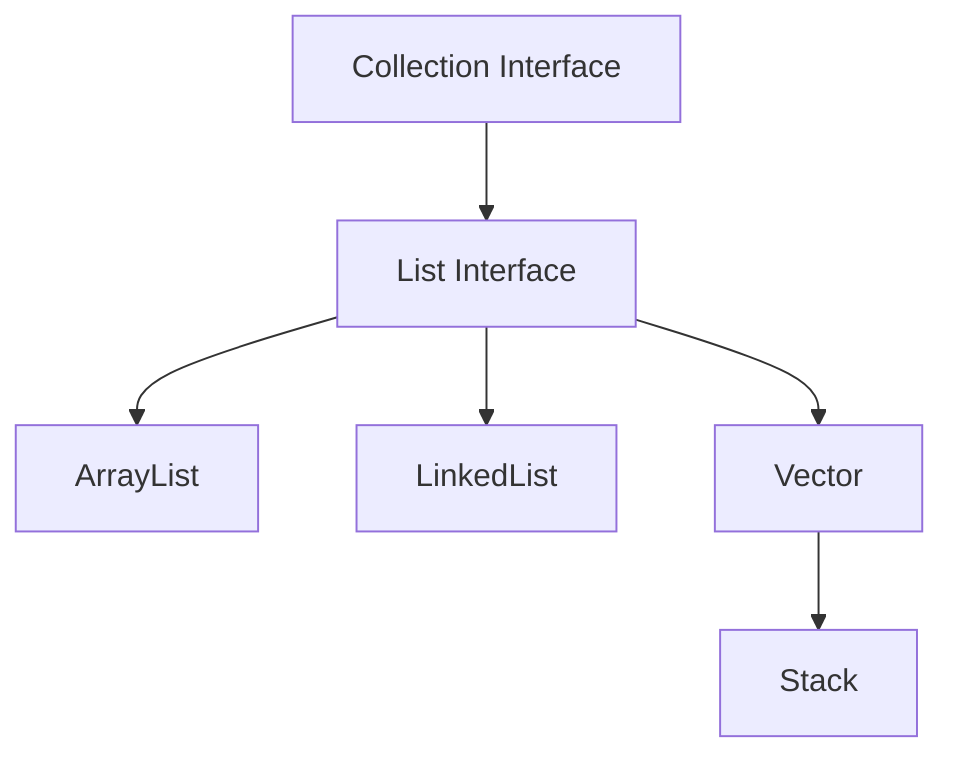

# Java List Interface

## Introduction

The List interface is one of the fundamental data structures in the Java Collections Framework. Unlike regular arrays, which have a fixed size, List provides a dynamic, ordered collection that can grow or shrink as needed. This flexibility makes it perfect for many programming scenarios where you need to store and manipulate collections of objects.

In this tutorial, we'll explore the List interface, its implementations, and how to use it effectively in your Java programs.



## What is the List Interface?

The List interface extends the Collection interface and represents an ordered collection of elements. Some key characteristics of List include:

- **Ordered**: Elements maintain their insertion order
- **Indexed**: You can access elements by their integer index (position)
- **Allow duplicates**: Unlike Sets, Lists can contain duplicate elements
- **Permit null values**: Most List implementations allow null elements

## Common List Implementations

Java provides several implementations of the List interface, each with different performance characteristics:

### ArrayList

An ArrayList is backed by a dynamic array that grows as needed. It provides fast random access but may be slower for insertions and deletions in the middle.

### LinkedList

A LinkedList is implemented as a doubly-linked list. It excels at insertions and deletions but is slower for random access operations.

### Vector

Vector is similar to ArrayList but is synchronized (thread-safe). It's generally slower than ArrayList but safe for multi-threaded access.

### Stack

Stack extends Vector and follows Last-In-First-Out (LIFO) principle with push and pop operations.

## Creating Lists in Java

Let's look at different ways to create Lists in Java:

```java
import java.util.ArrayList;
import java.util.Arrays;
import java.util.LinkedList;
import java.util.List;

public class ListCreationExamples {
    public static void main(String[] args) {
        // Empty ArrayList
        List<String> fruits = new ArrayList<>();
        
        // ArrayList with initial elements
        List<String> vegetables = new ArrayList<>(Arrays.asList("Carrot", "Broccoli", "Spinach"));
        
        // LinkedList
        List<Integer> numbers = new LinkedList<>();
        
        // Using List.of (Java 9+) - creates immutable list
        List<String> colors = List.of("Red", "Green", "Blue");
        
        System.out.println("fruits: " + fruits);
        System.out.println("vegetables: " + vegetables);
        System.out.println("numbers: " + numbers);
        System.out.println("colors: " + colors);
    }
}
```

**Output:**
```
fruits: []
vegetables: [Carrot, Broccoli, Spinach]
numbers: []
colors: [Red, Green, Blue]
```

## Basic List Operations

Let's explore common operations you can perform with Lists:

### Adding Elements

```java
List<String> programmingLanguages = new ArrayList<>();

// Adding elements
programmingLanguages.add("Java");               // Adds at the end
programmingLanguages.add("Python");             // Adds at the end
programmingLanguages.add(0, "JavaScript");      // Adds at specific index

System.out.println(programmingLanguages);
```

**Output:**
```
[JavaScript, Java, Python]
```

### Accessing Elements

```java
List<String> fruits = new ArrayList<>();
fruits.add("Apple");
fruits.add("Banana");
fruits.add("Orange");

// Accessing by index
String firstFruit = fruits.get(0);
String lastFruit = fruits.get(fruits.size() - 1);

System.out.println("First fruit: " + firstFruit);
System.out.println("Last fruit: " + lastFruit);
System.out.println("List size: " + fruits.size());
```

**Output:**
```
First fruit: Apple
Last fruit: Orange
List size: 3
```

### Removing Elements

```java
List<String> countries = new ArrayList<>();
countries.add("USA");
countries.add("India");
countries.add("Japan");
countries.add("Brazil");

System.out.println("Original list: " + countries);

// Remove by index
countries.remove(1);
System.out.println("After removing index 1: " + countries);

// Remove by value
countries.remove("Japan");
System.out.println("After removing Japan: " + countries);
```

**Output:**
```
Original list: [USA, India, Japan, Brazil]
After removing index 1: [USA, Japan, Brazil]
After removing Japan: [USA, Brazil]
```

### Checking for Elements

```java
List<String> pets = new ArrayList<>();
pets.add("Dog");
pets.add("Cat");
pets.add("Fish");

boolean hasCat = pets.contains("Cat");
boolean hasBird = pets.contains("Bird");
int dogIndex = pets.indexOf("Dog");
boolean isEmpty = pets.isEmpty();

System.out.println("Contains Cat? " + hasCat);
System.out.println("Contains Bird? " + hasBird);
System.out.println("Index of Dog: " + dogIndex);
System.out.println("Is the list empty? " + isEmpty);
```

**Output:**
```
Contains Cat? true
Contains Bird? false
Index of Dog: 0
Is the list empty? false
```

## Iterating Through Lists

There are several ways to iterate through a List in Java:

```java
List<String> planets = new ArrayList<>();
planets.add("Mercury");
planets.add("Venus");
planets.add("Earth");
planets.add("Mars");

// Method 1: For loop with index
System.out.println("Using for loop with index:");
for (int i = 0; i < planets.size(); i++) {
    System.out.println(i + ": " + planets.get(i));
}

// Method 2: Enhanced for loop
System.out.println("\nUsing enhanced for loop:");
for (String planet : planets) {
    System.out.println(planet);
}

// Method 3: Iterator
System.out.println("\nUsing Iterator:");
Iterator<String> iterator = planets.iterator();
while (iterator.hasNext()) {
    System.out.println(iterator.next());
}

// Method 4: forEach with lambda (Java 8+)
System.out.println("\nUsing forEach with lambda:");
planets.forEach(planet -> System.out.println(planet));

// Method 5: Stream API (Java 8+)
System.out.println("\nUsing Stream API:");
planets.stream()
       .filter(planet -> planet.length() > 5)
       .forEach(System.out::println);
```

**Output:**
```
Using for loop with index:
0: Mercury
1: Venus
2: Earth
3: Mars

Using enhanced for loop:
Mercury
Venus
Earth
Mars

Using Iterator:
Mercury
Venus
Earth
Mars

Using forEach with lambda:
Mercury
Venus
Earth
Mars

Using Stream API:
Mercury
```

## ArrayList vs LinkedList: When to Use Each

Understanding the performance differences helps you choose the right implementation:

| Operation | ArrayList | LinkedList |
|-----------|-----------|------------|
| Random access (get) | O(1) - Constant time | O(n) - Linear time |
| Add/remove at end | O(1) amortized | O(1) |
| Add/remove at beginning | O(n) | O(1) |
| Add/remove in middle | O(n) | O(n), but faster than ArrayList for frequent operations |
| Memory usage | Less overhead | More overhead (stores references) |

### When to use ArrayList:
- When you need frequent random access by index
- When you're primarily adding/removing elements at the end
- When memory usage is a concern

### When to use LinkedList:
- When you frequently add/remove elements at the beginning
- When you frequently insert/remove elements in the middle
- When you don't need random access

## Sorting Lists

Java provides several ways to sort Lists:

```java
import java.util.ArrayList;
import java.util.Collections;
import java.util.Comparator;
import java.util.List;

public class ListSortingExample {
    public static void main(String[] args) {
        // Sorting strings
        List<String> fruits = new ArrayList<>();
        fruits.add("Orange");
        fruits.add("Apple");
        fruits.add("Banana");
        fruits.add("Kiwi");
        
        System.out.println("Original fruit list: " + fruits);
        
        // Natural ordering (alphabetical)
        Collections.sort(fruits);
        System.out.println("Sorted fruit list: " + fruits);
        
        // Reverse order
        Collections.reverse(fruits);
        System.out.println("Reverse sorted fruit list: " + fruits);
        
        // Sorting custom objects
        List<Person> people = new ArrayList<>();
        people.add(new Person("John", 25));
        people.add(new Person("Alice", 22));
        people.add(new Person("Bob", 30));
        
        // Sort by age using Comparator
        Collections.sort(people, Comparator.comparing(Person::getAge));
        System.out.println("\nPeople sorted by age:");
        for (Person person : people) {
            System.out.println(person);
        }
        
        // Sort by name using Comparator
        Collections.sort(people, Comparator.comparing(Person::getName));
        System.out.println("\nPeople sorted by name:");
        for (Person person : people) {
            System.out.println(person);
        }
    }
    
    static class Person {
        private String name;
        private int age;
        
        public Person(String name, int age) {
            this.name = name;
            this.age = age;
        }
        
        public String getName() { return name; }
        public int getAge() { return age; }
        
        @Override
        public String toString() {
            return name + " (" + age + ")";
        }
    }
}
```

**Output:**
```
Original fruit list: [Orange, Apple, Banana, Kiwi]
Sorted fruit list: [Apple, Banana, Kiwi, Orange]
Reverse sorted fruit list: [Orange, Kiwi, Banana, Apple]

People sorted by age:
Alice (22)
John (25)
Bob (30)

People sorted by name:
Alice (22)
Bob (30)
John (25)
```

## Practical Examples

### Example 1: Todo List Application

```java
import java.util.ArrayList;
import java.util.List;
import java.util.Scanner;

public class TodoListApplication {
    public static void main(String[] args) {
        List<String> todoList = new ArrayList<>();
        Scanner scanner = new Scanner(System.in);
        boolean running = true;
        
        while (running) {
            System.out.println("\n=== TODO LIST APPLICATION ===");
            System.out.println("1. Add task");
            System.out.println("2. View tasks");
            System.out.println("3. Mark task as completed (remove)");
            System.out.println("4. Exit");
            System.out.print("Enter your choice: ");
            
            int choice = scanner.nextInt();
            scanner.nextLine(); // Consume newline
            
            switch (choice) {
                case 1:
                    System.out.print("Enter task description: ");
                    String task = scanner.nextLine();
                    todoList.add(task);
                    System.out.println("Task added successfully!");
                    break;
                case 2:
                    if (todoList.isEmpty()) {
                        System.out.println("Your todo list is empty!");
                    } else {
                        System.out.println("\nYour tasks:");
                        for (int i = 0; i < todoList.size(); i++) {
                            System.out.println((i + 1) + ". " + todoList.get(i));
                        }
                    }
                    break;
                case 3:
                    if (todoList.isEmpty()) {
                        System.out.println("No tasks to remove!");
                    } else {
                        System.out.print("Enter task number to mark as completed: ");
                        int taskNum = scanner.nextInt();
                        if (taskNum > 0 && taskNum <= todoList.size()) {
                            String removedTask = todoList.remove(taskNum - 1);
                            System.out.println("Task completed and removed: " + removedTask);
                        } else {
                            System.out.println("Invalid task number!");
                        }
                    }
                    break;
                case 4:
                    System.out.println("Thank you for using Todo List App!");
                    running = false;
                    break;
                default:
                    System.out.println("Invalid choice! Please try again.");
            }
        }
        scanner.close();
    }
}
```

This example demonstrates how to use an ArrayList to manage a simple todo list application.

### Example 2: Shopping Cart System

```java
import java.util.ArrayList;
import java.util.List;

public class ShoppingCartDemo {
    public static void main(String[] args) {
        ShoppingCart cart = new ShoppingCart();
        
        // Add items to cart
        cart.addItem(new Product("Laptop", 999.99));
        cart.addItem(new Product("Mouse", 29.99));
        cart.addItem(new Product("Keyboard", 49.99));
        
        // Display cart
        cart.displayCart();
        
        // Remove an item
        cart.removeItem(1); // Remove Mouse
        
        // Display updated cart
        System.out.println("\nAfter removing an item:");
        cart.displayCart();
        
        // Update quantity
        cart.updateQuantity(0, 2); // Update Laptop quantity
        
        // Display final cart
        System.out.println("\nAfter updating quantity:");
        cart.displayCart();
    }
    
    static class Product {
        private String name;
        private double price;
        
        public Product(String name, double price) {
            this.name = name;
            this.price = price;
        }
        
        public String getName() { return name; }
        public double getPrice() { return price; }
        
        @Override
        public String toString() {
            return name + " - $" + price;
        }
    }
    
    static class CartItem {
        private Product product;
        private int quantity;
        
        public CartItem(Product product, int quantity) {
            this.product = product;
            this.quantity = quantity;
        }
        
        public Product getProduct() { return product; }
        public int getQuantity() { return quantity; }
        public void setQuantity(int quantity) { this.quantity = quantity; }
        public double getTotal() { return product.getPrice() * quantity; }
    }
    
    static class ShoppingCart {
        private List<CartItem> items;
        
        public ShoppingCart() {
            this.items = new ArrayList<>();
        }
        
        public void addItem(Product product) {
            // Check if product already exists in cart
            for (CartItem item : items) {
                if (item.getProduct().getName().equals(product.getName())) {
                    item.setQuantity(item.getQuantity() + 1);
                    return;
                }
            }
            // Add new product
            items.add(new CartItem(product, 1));
        }
        
        public void removeItem(int index) {
            if (index >= 0 && index < items.size()) {
                items.remove(index);
            }
        }
        
        public void updateQuantity(int index, int quantity) {
            if (index >= 0 && index < items.size() && quantity > 0) {
                items.get(index).setQuantity(quantity);
            }
        }
        
        public void displayCart() {
            if (items.isEmpty()) {
                System.out.println("Your cart is empty");
                return;
            }
            
            System.out.println("===== YOUR SHOPPING CART =====");
            double total = 0;
            for (int i = 0; i < items.size(); i++) {
                CartItem item = items.get(i);
                System.out.printf("%d. %s - $%.2f x %d = $%.2f\n", 
                    i + 1, 
                    item.getProduct().getName(), 
                    item.getProduct().getPrice(), 
                    item.getQuantity(), 
                    item.getTotal());
                total += item.getTotal();
            }
            System.out.printf("\nTotal: $%.2f\n", total);
        }
    }
}
```

This example shows a more complex application of Lists to implement a shopping cart system.

## Summary

The Java List interface is a fundamental part of the Collections Framework that provides a flexible, ordered collection for storing elements. We've explored:

- The basic properties of the List interface
- Different List implementations (ArrayList, LinkedList, Vector)
- Common operations (add, get, remove, contains)
- Methods for iterating through Lists
- Performance considerations when choosing between implementations
- Sorting operations for Lists
- Practical applications using List to solve real-world problems

By mastering the List interface, you gain a powerful tool for managing collections of data in your Java applications. The flexibility of dynamic sizing and the wide range of available methods make Lists suitable for many programming scenarios.

## Additional Resources

1. [Java Documentation: List Interface](https://docs.oracle.com/en/java/javase/11/docs/api/java.base/java/util/List.html)
2. [Java Documentation: ArrayList](https://docs.oracle.com/en/java/javase/11/docs/api/java.base/java/util/ArrayList.html)
3. [Java Documentation: LinkedList](https://docs.oracle.com/en/java/javase/11/docs/api/java.base/java/util/LinkedList.html)

## Exercises

1. Create a program that reads a list of names from user input and sorts them alphabetically.
2. Implement a student grade management system using ArrayLists to store student records.
3. Write a program that finds common elements between two lists.
4. Create a music playlist application that allows adding, removing, and shuffling songs.
5. Implement a LinkedList from scratch to understand how it works internally.

By completing these exercises, you'll gain practical experience with the List interface and its implementations.