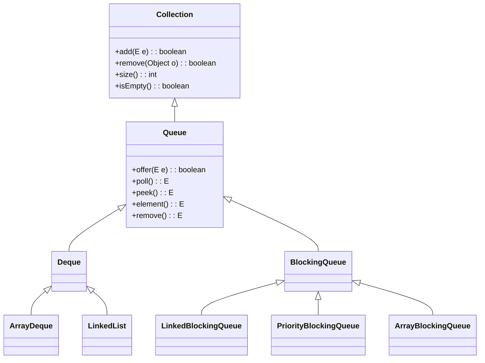

# Java Queue Interface

## Introduction

The Queue interface is one of the fundamental data structures in the Java Collections Framework. It represents an ordered collection of elements designed for holding elements before processing, following the First-In-First-Out (FIFO) principle in most implementations.

Queues are commonly used in scenarios where resources are shared among multiple consumers, such as:
- Task scheduling
- Print spooling
- Handling requests on a single shared resource
- Breadth-first search algorithms
- Buffering

In this tutorial, you'll learn how queues work in Java, how to implement them with different classes, and explore practical examples of their real-world applications.

## Queue Interface Basics

The `Queue` interface extends the `Collection` interface and defines the basic operations associated with queue data structures.



### Key Queue Methods

The Queue interface provides methods for inserting, extracting, and examining elements:

| Operation | Throws Exception | Returns Special Value |
|-----------|------------------|----------------------|
| Insert    | `add(e)`         | `offer(e)`           |
| Remove    | `remove()`       | `poll()`             |
| Examine   | `element()`      | `peek()`             |

Let's understand the difference between these methods:

1. **Insertion Operations**:
   - `add(e)`: Adds an element to the queue. Throws an exception if the queue is capacity-restricted and currently full.
   - `offer(e)`: Adds an element to the queue. Returns `false` if the queue is capacity-restricted and currently full.

2. **Removal Operations**:
   - `remove()`: Removes and returns the head of the queue. Throws an exception if the queue is empty.
   - `poll()`: Removes and returns the head of the queue. Returns `null` if the queue is empty.

3. **Examination Operations**:
   - `element()`: Retrieves, but does not remove, the head of the queue. Throws an exception if the queue is empty.
   - `peek()`: Retrieves, but does not remove, the head of the queue. Returns `null` if the queue is empty.

## Common Queue Implementations

Java provides several implementations of the Queue interface:

1. **LinkedList**: Implements both List and Deque interfaces, can be used as a queue.
2. **PriorityQueue**: Elements are ordered based on their natural ordering or by a Comparator.
3. **ArrayDeque**: Resizable array implementation of the Deque interface.
4. **LinkedBlockingQueue**, **ArrayBlockingQueue**, **PriorityBlockingQueue**: Thread-safe implementations for concurrent applications.

## Basic Queue Operations Example

Let's see a simple example of how to use a Queue:

```java
import java.util.LinkedList;
import java.util.Queue;

public class BasicQueueExample {
    public static void main(String[] args) {
        // Creating a queue using LinkedList implementation
        Queue<String> waitingLine = new LinkedList<>();
        
        // Adding elements to the queue
        waitingLine.add("Person 1");
        waitingLine.add("Person 2");
        waitingLine.offer("Person 3");
        
        // Displaying the queue
        System.out.println("Current queue: " + waitingLine);
        
        // Accessing the element at the front of the queue
        System.out.println("Head of queue: " + waitingLine.peek());
        
        // Removing the head of the queue
        String served = waitingLine.poll();
        System.out.println("Served: " + served);
        
        // Displaying the queue after removal
        System.out.println("Queue after serving: " + waitingLine);
        
        // Size of the queue
        System.out.println("Queue size: " + waitingLine.size());
        
        // Check if queue is empty
        System.out.println("Is queue empty? " + waitingLine.isEmpty());
    }
}
```

**Output:**
```
Current queue: [Person 1, Person 2, Person 3]
Head of queue: Person 1
Served: Person 1
Queue after serving: [Person 2, Person 3]
Queue size: 2
Is queue empty? false
```

## PriorityQueue Example

A PriorityQueue orders elements based on their natural ordering or by a Comparator provided at queue construction time:

```java
import java.util.PriorityQueue;

public class PriorityQueueExample {
    public static void main(String[] args) {
        // Creating a priority queue with default natural ordering
        PriorityQueue<Integer> numbers = new PriorityQueue<>();
        
        // Adding items to the priority queue
        numbers.add(10);
        numbers.add(2);
        numbers.add(5);
        numbers.add(1);
        numbers.add(7);
        
        System.out.println("PriorityQueue: " + numbers);
        
        // Removing elements from the queue
        System.out.println("Polling elements from the PriorityQueue:");
        while (!numbers.isEmpty()) {
            System.out.println(numbers.poll());
        }
    }
}
```

**Output:**
```
PriorityQueue: [1, 2, 5, 10, 7]
Polling elements from the PriorityQueue:
1
2
5
7
10
```

Notice how the elements are removed in order of priority (natural ordering for integers, which is ascending).

## Using Custom Objects with PriorityQueue

To use custom objects in a PriorityQueue, you need to either:
1. Make your class implement the Comparable interface, or
2. Provide a Comparator when creating the queue

Here's an example with a Task class and priority based on task urgency:

```java
import java.util.Comparator;
import java.util.PriorityQueue;

class Task {
    private String name;
    private int urgency; // 1 = low, 10 = high

    public Task(String name, int urgency) {
        this.name = name;
        this.urgency = urgency;
    }

    public String getName() {
        return name;
    }

    public int getUrgency() {
        return urgency;
    }

    @Override
    public String toString() {
        return name + " (urgency: " + urgency + ")";
    }
}

public class CustomObjectPriorityQueueExample {
    public static void main(String[] args) {
        // Creating a PriorityQueue with a custom Comparator
        PriorityQueue<Task> taskQueue = new PriorityQueue<>(
            Comparator.comparing(Task::getUrgency).reversed()
        );
        
        // Adding tasks to the queue
        taskQueue.add(new Task("Check email", 3));
        taskQueue.add(new Task("Fix critical bug", 10));
        taskQueue.add(new Task("Prepare presentation", 5));
        taskQueue.add(new Task("Call client", 7));
        
        System.out.println("Tasks in the queue:");
        System.out.println(taskQueue);
        
        System.out.println("\nProcessing tasks by urgency:");
        while (!taskQueue.isEmpty()) {
            Task task = taskQueue.poll();
            System.out.println("Processing: " + task);
        }
    }
}
```

**Output:**
```
Tasks in the queue:
[Fix critical bug (urgency: 10), Call client (urgency: 7), Prepare presentation (urgency: 5), Check email (urgency: 3)]

Processing tasks by urgency:
Processing: Fix critical bug (urgency: 10)
Processing: Call client (urgency: 7)
Processing: Prepare presentation (urgency: 5)
Processing: Check email (urgency: 3)
```

## Real-World Application: Customer Service System

Let's implement a simple customer service ticket system using queues:

```java
import java.util.LinkedList;
import java.util.PriorityQueue;
import java.util.Queue;

class SupportTicket implements Comparable<SupportTicket> {
    private int id;
    private String customerName;
    private String issue;
    private int priority; // 1 = low, 5 = high

    public SupportTicket(int id, String customerName, String issue, int priority) {
        this.id = id;
        this.customerName = customerName;
        this.issue = issue;
        this.priority = priority;
    }

    public int getId() {
        return id;
    }

    public String getCustomerName() {
        return customerName;
    }

    public String getIssue() {
        return issue;
    }

    public int getPriority() {
        return priority;
    }

    @Override
    public int compareTo(SupportTicket other) {
        // Sort by priority (higher priority first)
        return other.priority - this.priority;
    }

    @Override
    public String toString() {
        return "Ticket #" + id + " - " + customerName + " - Priority: " + priority + " - Issue: " + issue;
    }
}

public class CustomerServiceSystem {
    public static void main(String[] args) {
        // Regular FIFO queue for standard customers
        Queue<SupportTicket> regularQueue = new LinkedList<>();
        
        // Priority queue for premium customers
        PriorityQueue<SupportTicket> premiumQueue = new PriorityQueue<>();
        
        // Adding tickets to regular queue
        regularQueue.add(new SupportTicket(1001, "John Smith", "Can't login", 2));
        regularQueue.add(new SupportTicket(1002, "Jane Doe", "Payment issue", 3));
        regularQueue.add(new SupportTicket(1003, "Bob Johnson", "Feature request", 1));
        
        // Adding tickets to premium queue
        premiumQueue.add(new SupportTicket(2001, "Alice Corporation", "Server down", 5));
        premiumQueue.add(new SupportTicket(2002, "Big Enterprise Ltd", "Security question", 4));
        premiumQueue.add(new SupportTicket(2003, "Tech Giants Inc", "API integration", 3));
        
        System.out.println("Processing Premium Customer Tickets:");
        while (!premiumQueue.isEmpty()) {
            SupportTicket ticket = premiumQueue.poll();
            System.out.println("Processing " + ticket);
            // In a real application, you would handle the ticket here
        }
        
        System.out.println("\nProcessing Regular Customer Tickets:");
        while (!regularQueue.isEmpty()) {
            SupportTicket ticket = regularQueue.poll();
            System.out.println("Processing " + ticket);
            // In a real application, you would handle the ticket here
        }
    }
}
```

**Output:**
```
Processing Premium Customer Tickets:
Processing Ticket #2001 - Alice Corporation - Priority: 5 - Issue: Server down
Processing Ticket #2002 - Big Enterprise Ltd - Priority: 4 - Issue: Security question
Processing Ticket #2003 - Tech Giants Inc - Priority: 3 - Issue: API integration

Processing Regular Customer Tickets:
Processing Ticket #1001 - John Smith - Priority: 2 - Issue: Can't login
Processing Ticket #1002 - Jane Doe - Priority: 3 - Issue: Payment issue
Processing Ticket #1003 - Bob Johnson - Priority: 1 - Issue: Feature request
```

## ArrayDeque as a Queue

The `ArrayDeque` class is often the preferred implementation for a queue as it generally provides better performance than `LinkedList`:

```java
import java.util.ArrayDeque;
import java.util.Queue;

public class ArrayDequeExample {
    public static void main(String[] args) {
        Queue<String> queue = new ArrayDeque<>();
        
        // Adding elements
        queue.add("First");
        queue.add("Second");
        queue.add("Third");
        
        System.out.println("Queue: " + queue);
        
        // Processing the queue
        while (!queue.isEmpty()) {
            System.out.println("Processing: " + queue.poll());
        }
    }
}
```

**Output:**
```
Queue: [First, Second, Third]
Processing: First
Processing: Second
Processing: Third
```

## Dealing with Exceptions vs. Special Return Values

Let's demonstrate the difference between the exception-throwing methods and those that return special values:

```java
import java.util.LinkedList;
import java.util.Queue;
import java.util.NoSuchElementException;

public class QueueExceptionExample {
    public static void main(String[] args) {
        Queue<String> queue = new LinkedList<>();
        
        // Working with an empty queue
        try {
            // This will throw an exception since the queue is empty
            String element = queue.element();
        } catch (NoSuchElementException e) {
            System.out.println("Exception caught: Cannot get element from empty queue");
        }
        
        // Using peek instead
        String peekedElement = queue.peek();
        System.out.println("Result of peek on empty queue: " + peekedElement);
        
        // Add an element
        queue.add("First");
        
        // Both element and peek work with non-empty queue
        System.out.println("Element: " + queue.element());
        System.out.println("Peek: " + queue.peek());
        
        // Remove the element
        System.out.println("Removed: " + queue.remove());
        
        try {
            // This will throw an exception since the queue is empty again
            String removedElement = queue.remove();
        } catch (NoSuchElementException e) {
            System.out.println("Exception caught: Cannot remove from empty queue");
        }
        
        // Using poll instead on empty queue
        String polledElement = queue.poll();
        System.out.println("Result of poll on empty queue: " + polledElement);
    }
}
```

**Output:**
```
Exception caught: Cannot get element from empty queue
Result of peek on empty queue: null
Element: First
Peek: First
Removed: First
Exception caught: Cannot remove from empty queue
Result of poll on empty queue: null
```

## Summary

In this tutorial, you've learned about Java's Queue interface and its implementations. Here's a recap:

- A Queue is a collection designed for holding elements before processing, typically in FIFO order
- The Queue interface provides methods for adding, removing, and examining elements
- Key implementations include LinkedList, PriorityQueue, and ArrayDeque
- PriorityQueue orders elements by their natural ordering or via a custom Comparator
- Queues are useful in many scenarios like task scheduling, resource sharing, and algorithms like BFS

Choose the right Queue implementation based on your specific needs:
- Use `LinkedList` if you need a basic FIFO queue and also want List operations
- Use `ArrayDeque` for better performance in most scenarios
- Use `PriorityQueue` when you need elements processed based on priority
- Use concurrent queue implementations like `LinkedBlockingQueue` for thread-safe operations

## Practice Exercises

1. Create a simple task scheduler that adds tasks to a queue and processes them one by one.
2. Implement a printer spooler that handles print jobs in order of priority.
3. Create a customer service application that handles VIP customers first, then regular customers.
4. Implement a breadth-first search algorithm using a queue to traverse a graph or tree.
5. Create a simulation of a bank with multiple teller windows using queues.

## Additional Resources

- [Java Queue Interface Documentation](https://docs.oracle.com/en/java/javase/17/docs/api/java.base/java/util/Queue.html)
- [Java Deque Interface Documentation](https://docs.oracle.com/en/java/javase/17/docs/api/java.base/java/util/Deque.html)
- [Java PriorityQueue Documentation](https://docs.oracle.com/en/java/javase/17/docs/api/java.base/java/util/PriorityQueue.html)
- [Concurrent Collections Documentation](https://docs.oracle.com/en/java/javase/17/docs/api/java.base/java/util/concurrent/package-summary.html)

Understanding queues is essential for becoming proficient in Java programming and solving real-world problems efficiently. They provide a structured way to manage data processing in many applications and are a fundamental building block in computer science.