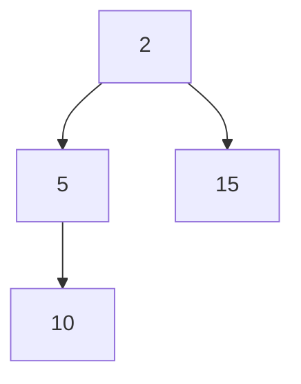

# Java PriorityQueue

## Introduction

A PriorityQueue is a special type of queue data structure in Java that orders its elements according to their natural ordering or by a Comparator provided at queue construction time. Unlike standard queues that follow the First-In-First-Out (FIFO) principle, a PriorityQueue retrieves elements based on their priority.

The PriorityQueue class is part of Java's Collections Framework and implements the Queue interface. It's particularly useful when you need to process elements in order of priority rather than insertion order.

Key features of PriorityQueue include:
- Elements are ordered by natural ordering or by a Comparator
- The head of the queue is the least element according to the specified ordering
- It does not permit null elements
- It is not thread-safe
- It offers O(log(n)) time for enqueueing and dequeueing operations

## Creating a PriorityQueue

There are several ways to create a PriorityQueue in Java:

### Basic PriorityQueue

```java
// Creating a PriorityQueue with default initial capacity (11)
PriorityQueue<Integer> pq = new PriorityQueue<>();

// Creating a PriorityQueue with specified initial capacity
PriorityQueue<Integer> pq2 = new PriorityQueue<>(15);
```

### PriorityQueue with Comparator

```java
// Creating a PriorityQueue with a custom Comparator (descending order)
PriorityQueue<Integer> pqDesc = new PriorityQueue<>(Comparator.reverseOrder());

// Alternative way using a lambda expression
PriorityQueue<Integer> pqDescAlt = new PriorityQueue<>((a, b) -> b - a);
```

### Creating from another Collection

```java
// Creating from another collection
List<Integer> list = Arrays.asList(10, 5, 3, 8, 2);
PriorityQueue<Integer> pqFromList = new PriorityQueue<>(list);
```

## Basic Operations

### Adding Elements

```java
PriorityQueue<Integer> pq = new PriorityQueue<>();

// Add elements to the queue
pq.add(10);
pq.add(5);
pq.add(15);
pq.add(2);

System.out.println("Priority Queue: " + pq);
```

Output:
```
Priority Queue: [2, 5, 15, 10]
```

Note that the internal representation doesn't always show elements in sorted order, but they are retrieved in the correct priority order.

### Retrieving Elements

```java
PriorityQueue<Integer> pq = new PriorityQueue<>();
pq.add(10);
pq.add(5);
pq.add(15);
pq.add(2);

// Peek at the highest priority element without removing it
System.out.println("Highest priority element: " + pq.peek());

// Poll (retrieve and remove) the highest priority element
System.out.println("Removed: " + pq.poll());
System.out.println("After poll: " + pq);

System.out.println("Removed: " + pq.poll());
System.out.println("After poll: " + pq);
```

Output:
```
Highest priority element: 2
Removed: 2
After poll: [5, 10, 15]
Removed: 5
After poll: [10, 15]
```

### Other Operations

```java
PriorityQueue<String> pq = new PriorityQueue<>();
pq.add("banana");
pq.add("apple");
pq.add("cherry");

// Check if queue contains an element
System.out.println("Contains 'apple': " + pq.contains("apple"));

// Get the size of the queue
System.out.println("Size: " + pq.size());

// Remove a specific element
boolean removed = pq.remove("banana");
System.out.println("Removed 'banana': " + removed);
System.out.println("After removal: " + pq);

// Clear the queue
pq.clear();
System.out.println("After clear: " + pq);
System.out.println("Is empty: " + pq.isEmpty());
```

Output:
```
Contains 'apple': true
Size: 3
Removed 'banana': true
After removal: [apple, cherry]
After clear: []
Is empty: true
```

## How PriorityQueue Works

A PriorityQueue in Java is typically implemented as a binary heap, which is a complete binary tree where each node is smaller than its children (for a min-heap) or greater than its children (for a max-heap).



In the diagram above, we're visualizing a min-heap for the values [2, 5, 15, 10].

The operations work as follows:
1. **Insertion (add/offer)**: New elements are added at the end of the heap and then "bubbled up" to the correct position (O(log n))
2. **Deletion (poll/remove)**: The root element is removed, replaced by the last element, and then "bubbled down" to maintain the heap property (O(log n))
3. **Peeking (peek)**: Simply returns the root element without modifying the heap (O(1))

## Custom Objects in PriorityQueue

### Using Natural Ordering (Comparable)

For custom objects, we need to define how they should be compared:

```java
class Patient implements Comparable<Patient> {
    private String name;
    private int priority; // Lower value means higher priority
    
    public Patient(String name, int priority) {
        this.name = name;
        this.priority = priority;
    }
    
    @Override
    public int compareTo(Patient other) {
        return this.priority - other.priority;
    }
    
    @Override
    public String toString() {
        return name + " (priority: " + priority + ")";
    }
}

// Using custom class with natural ordering
PriorityQueue<Patient> emergencyRoom = new PriorityQueue<>();
emergencyRoom.add(new Patient("John", 2));
emergencyRoom.add(new Patient("Emma", 1)); // Higher priority (lower number)
emergencyRoom.add(new Patient("Robert", 5));
emergencyRoom.add(new Patient("Sophia", 3));

System.out.println("Emergency Room Queue:");
while (!emergencyRoom.isEmpty()) {
    System.out.println("Treating: " + emergencyRoom.poll());
}
```

Output:
```
Emergency Room Queue:
Treating: Emma (priority: 1)
Treating: John (priority: 2)
Treating: Sophia (priority: 3)
Treating: Robert (priority: 5)
```

### Using Custom Comparator

```java
class Task {
    private String description;
    private int priority;
    
    public Task(String description, int priority) {
        this.description = description;
        this.priority = priority;
    }
    
    public int getPriority() {
        return priority;
    }
    
    public String getDescription() {
        return description;
    }
    
    @Override
    public String toString() {
        return description + " (priority: " + priority + ")";
    }
}

// Using custom comparator
PriorityQueue<Task> taskQueue = new PriorityQueue<>(
    (t1, t2) -> t1.getPriority() - t2.getPriority()
);

taskQueue.add(new Task("Fix critical bug", 1));
taskQueue.add(new Task("Update documentation", 3));
taskQueue.add(new Task("Implement new feature", 2));

System.out.println("Task Queue:");
while (!taskQueue.isEmpty()) {
    System.out.println("Next task: " + taskQueue.poll());
}
```

Output:
```
Task Queue:
Next task: Fix critical bug (priority: 1)
Next task: Implement new feature (priority: 2)
Next task: Update documentation (priority: 3)
```

## Real-World Applications

### Example 1: Dijkstra's Algorithm for Finding Shortest Path

```java
class Node {
    int vertex;
    int distance;
    
    public Node(int vertex, int distance) {
        this.vertex = vertex;
        this.distance = distance;
    }
}

public void dijkstra(int[][] graph, int source) {
    int vertices = graph.length;
    int[] distance = new int[vertices];
    boolean[] visited = new boolean[vertices];
    
    // Initialize distances and priority queue
    Arrays.fill(distance, Integer.MAX_VALUE);
    distance[source] = 0;
    
    PriorityQueue<Node> pq = new PriorityQueue<>((n1, n2) -> n1.distance - n2.distance);
    pq.add(new Node(source, 0));
    
    while (!pq.isEmpty()) {
        Node current = pq.poll();
        int u = current.vertex;
        
        if (visited[u]) continue;
        visited[u] = true;
        
        // Update distances to adjacent vertices
        for (int v = 0; v < vertices; v++) {
            if (graph[u][v] > 0 && !visited[v]) {
                int newDistance = distance[u] + graph[u][v];
                if (newDistance < distance[v]) {
                    distance[v] = newDistance;
                    pq.add(new Node(v, newDistance));
                }
            }
        }
    }
    
    // Print distances from source
    System.out.println("Distances from source " + source + ":");
    for (int i = 0; i < vertices; i++) {
        System.out.println("To " + i + ": " + distance[i]);
    }
}
```

### Example 2: Job Scheduler with Priorities

```java
class Job {
    private String name;
    private int priority;
    private long scheduledTime;
    
    public Job(String name, int priority, long scheduledTime) {
        this.name = name;
        this.priority = priority;
        this.scheduledTime = scheduledTime;
    }
    
    public String getName() {
        return name;
    }
    
    public int getPriority() {
        return priority;
    }
    
    public long getScheduledTime() {
        return scheduledTime;
    }
    
    @Override
    public String toString() {
        return name + " (priority: " + priority + ", time: " + scheduledTime + ")";
    }
}

class JobScheduler {
    private PriorityQueue<Job> jobQueue;
    
    public JobScheduler() {
        // Prioritize by: 1. Priority level, 2. Scheduled time
        this.jobQueue = new PriorityQueue<>(
            (j1, j2) -> j1.getPriority() == j2.getPriority() ? 
                Long.compare(j1.getScheduledTime(), j2.getScheduledTime()) : 
                Integer.compare(j1.getPriority(), j2.getPriority())
        );
    }
    
    public void scheduleJob(Job job) {
        jobQueue.add(job);
    }
    
    public Job getNextJob() {
        return jobQueue.poll();
    }
    
    public boolean hasJobs() {
        return !jobQueue.isEmpty();
    }
}

// Usage example
public static void main(String[] args) {
    JobScheduler scheduler = new JobScheduler();
    
    scheduler.scheduleJob(new Job("Process payment", 1, System.currentTimeMillis()));
    scheduler.scheduleJob(new Job("Generate report", 2, System.currentTimeMillis() + 5000));
    scheduler.scheduleJob(new Job("Send notification", 1, System.currentTimeMillis() + 1000));
    scheduler.scheduleJob(new Job("Update database", 3, System.currentTimeMillis()));
    
    System.out.println("Job execution order:");
    while (scheduler.hasJobs()) {
        System.out.println("Executing: " + scheduler.getNextJob());
    }
}
```

Output would show jobs executed in order of priority (with time as tiebreaker for same priority):
```
Job execution order:
Executing: Process payment (priority: 1, time: 1623499200000)
Executing: Send notification (priority: 1, time: 1623499201000)
Executing: Generate report (priority: 2, time: 1623499205000)
Executing: Update database (priority: 3, time: 1623499200000)
```

### Example 3: A* Search Algorithm for Pathfinding

```java
class Node {
    int x, y;
    double gCost; // Cost from start to current node
    double hCost; // Estimated cost from current node to goal (heuristic)
    Node parent;
    
    public Node(int x, int y) {
        this.x = x;
        this.y = y;
    }
    
    public double getFCost() {
        return gCost + hCost;
    }
}

// In A* algorithm:
PriorityQueue<Node> openSet = new PriorityQueue<>(
    (a, b) -> Double.compare(a.getFCost(), b.getFCost())
);
// Add start node to queue and proceed with algorithm...
```

## Common Pitfalls and Best Practices

### Pitfalls

1. **Modifying elements after insertion**: If you modify objects after inserting them into a PriorityQueue, their priority won't be automatically recalculated.

```java
// DON'T DO THIS
PriorityQueue<Task> tasks = new PriorityQueue<>((t1, t2) -> t1.getPriority() - t2.getPriority());
Task task = new Task("Important task", 2);
tasks.add(task);
task.setPriority(1); // This won't re-order the queue!
```

2. **Null elements**: PriorityQueue does not allow null elements.

```java
// This will throw NullPointerException
PriorityQueue<String> pq = new PriorityQueue<>();
pq.add(null); // Runtime exception
```

3. **Iterator ordering**: Iterating through a PriorityQueue doesn't guarantee elements will be processed in priority order.

```java
// This WON'T print elements in priority order
for (Integer num : pq) {
    System.out.println(num);
}

// Use this instead for priority order
while (!pq.isEmpty()) {
    System.out.println(pq.poll());
}
```

### Best Practices

1. **Choose appropriate initial capacity**: If you know the expected size, specify an initial capacity to avoid resizing.

2. **Make custom classes immutable**: When using custom objects in a PriorityQueue, make them immutable or be careful not to modify their priority-affecting properties after insertion.

3. **Consider thread safety**: PriorityQueue is not thread-safe. Use `PriorityBlockingQueue` for concurrent applications.

4. **Limit queue size**: For memory-intensive applications, consider limiting the queue size by removing lower priority elements when a threshold is reached.

## Performance Characteristics

| Operation | Time Complexity |
|-----------|----------------|
| Insertion (offer/add) | O(log n) |
| Deletion (poll/remove) | O(log n) |
| Peek (element/peek) | O(1) |
| Contains | O(n) |
| Size | O(1) |

## Summary

Java's PriorityQueue is a powerful data structure that allows you to process elements based on their priority rather than insertion order. Key points to remember:

- PriorityQueue orders elements by natural ordering or by a custom Comparator
- The head of the queue is always the least element according to the specified ordering
- Common operations include add(), peek(), poll(), and remove()
- It's implemented as a binary heap, providing efficient insertion and deletion operations
- Custom objects need to implement Comparable or be used with a Comparator
- It's widely used in algorithms like Dijkstra's, A* search, and various scheduling problems

Understanding PriorityQueue and when to use it will significantly enhance your Java programming toolkit, especially when dealing with problems that require prioritized processing of elements.

## Practice Exercises

1. Create a PriorityQueue of integers that processes numbers in descending order.
2. Implement a simple task scheduler that manages tasks with different priorities.
3. Create a student grade system that processes students based on their GPA.
4. Implement a simple version of Huffman coding algorithm using PriorityQueue.
5. Write a program to find the k largest elements in an array using a PriorityQueue.

## Additional Resources

- [Java Documentation: PriorityQueue](https://docs.oracle.com/en/java/javase/17/docs/api/java.base/java/util/PriorityQueue.html)
- [Oracle Tutorial: Implementations](https://docs.oracle.com/javase/tutorial/collections/implementations/index.html)
- Book: "Java Collections: An Introduction to Abstract Data Types, Data Structures, and Algorithms" by David A. Watt
- Book: "Algorithms" by Robert Sedgewick and Kevin Wayne (covers heap and priority queue algorithms)