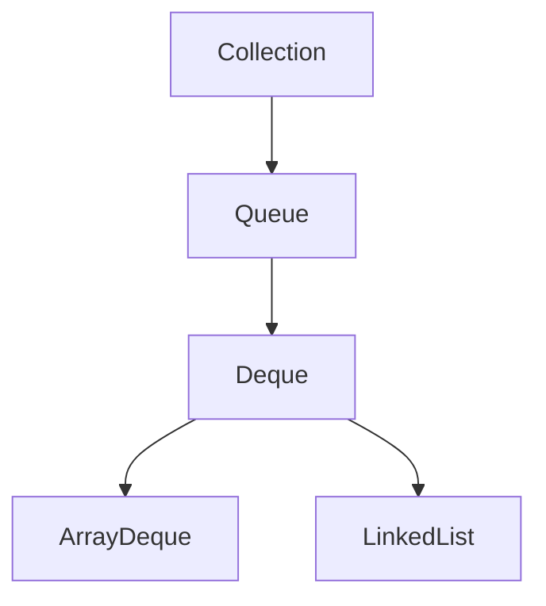

# Java Deque Interface

## Introduction

The Deque interface in Java is a part of the Java Collections Framework and stands for "**D**ouble-**E**nded **Que**ue" (pronounced "deck"). As the name suggests, it's a linear collection that supports element insertion and removal at both ends. This makes it a versatile data structure that can function both as a queue (FIFO - First In, First Out) and a stack (LIFO - Last In, First Out) simultaneously.

Introduced in Java 6, the `Deque` interface extends the `Queue` interface, adding methods to support operations from both ends of the collection.

## Deque in the Collections Hierarchy

The `Deque` interface fits into the Java Collections Framework as follows:



## Key Features of Deque

- **Double-ended operations**: Insert and remove elements from both ends
- **Queue operations**: Can function as a standard FIFO queue
- **Stack operations**: Can function as a LIFO stack
- **Null handling**: Some implementations allow null elements, while others don't

## Common Implementations

Java provides two main implementations of the Deque interface:

1. **ArrayDeque**: Implemented using a resizable array
2. **LinkedList**: Implemented as a doubly-linked list (also implements the List interface)

## Basic Deque Operations

The Deque interface provides methods for operations at both ends:

| Operation | First Element (Head) | Last Element (Tail) |
|-----------|---------------------|---------------------|
| Insert    | `addFirst(e)`, `offerFirst(e)` | `addLast(e)`, `offerLast(e)` |
| Remove    | `removeFirst()`, `pollFirst()` | `removeLast()`, `pollLast()` |
| Examine   | `getFirst()`, `peekFirst()` | `getLast()`, `peekLast()` |

### Methods Comparison

For each operation, the Deque interface provides two methods that differ in how they handle special cases:

- Methods like `addFirst()` throw an exception when the operation fails
- Methods like `offerFirst()` return a special value (typically `null` or `false`)

Let's look at an example that demonstrates basic Deque operations:

```java
import java.util.ArrayDeque;
import java.util.Deque;

public class DequeBasicExample {
    public static void main(String[] args) {
        // Create a Deque using ArrayDeque implementation
        Deque<String> deque = new ArrayDeque<>();
        
        // Adding elements to the deque
        deque.addFirst("First");
        deque.addLast("Last");
        deque.offerFirst("New First");
        deque.offerLast("New Last");
        
        System.out.println("Deque after additions: " + deque);
        
        // Examining elements (without removing)
        System.out.println("First element: " + deque.getFirst());
        System.out.println("Last element: " + deque.getLast());
        System.out.println("First element (peek): " + deque.peekFirst());
        System.out.println("Last element (peek): " + deque.peekLast());
        
        // Removing elements
        System.out.println("Removed first: " + deque.removeFirst());
        System.out.println("Removed last: " + deque.removeLast());
        System.out.println("Deque after removals: " + deque);
        
        System.out.println("Polled first: " + deque.pollFirst());
        System.out.println("Polled last: " + deque.pollLast());
        System.out.println("Deque after polls: " + deque);
        
        // At this point, the deque is empty
        System.out.println("Is deque empty? " + deque.isEmpty());
        
        // This would throw NoSuchElementException
        // System.out.println(deque.getFirst());
        
        // This will return null since the deque is empty
        System.out.println("Peek on empty deque: " + deque.peekFirst());
    }
}
```

**Output:**

```
Deque after additions: [New First, First, Last, New Last]
First element: New First
Last element: New Last
First element (peek): New First
Last element (peek): New Last
Removed first: New First
Removed last: New Last
Deque after removals: [First, Last]
Polled first: First
Polled last: Last
Deque after polls: []
Is deque empty? true
Peek on empty deque: null
```

## Using Deque as a Stack

The `Deque` interface is Java's preferred way to implement the stack data structure since Java 6. In fact, the documentation recommends using `Deque` instead of the legacy `Stack` class.

Here's how you can use a Deque as a stack:

```java
import java.util.ArrayDeque;
import java.util.Deque;

public class DequeAsStackExample {
    public static void main(String[] args) {
        Deque<String> stack = new ArrayDeque<>();
        
        // Push operations (add to top of stack)
        stack.push("Element 1");  // equivalent to addFirst()
        stack.push("Element 2");
        stack.push("Element 3");
        
        System.out.println("Stack: " + stack);
        
        // Peek at the top element without removing
        System.out.println("Top element: " + stack.peek());  // equivalent to peekFirst()
        
        // Pop operations (remove from top of stack)
        System.out.println("Popped: " + stack.pop());  // equivalent to removeFirst()
        System.out.println("Popped: " + stack.pop());
        
        System.out.println("Stack after pops: " + stack);
        
        // Check if stack is empty
        System.out.println("Is stack empty? " + stack.isEmpty());
    }
}
```

**Output:**

```
Stack: [Element 3, Element 2, Element 1]
Top element: Element 3
Popped: Element 3
Popped: Element 2
Stack after pops: [Element 1]
Is stack empty? false
```

## Using Deque as a Queue

The Deque interface can also be used as a traditional FIFO (First-In-First-Out) queue:

```java
import java.util.ArrayDeque;
import java.util.Deque;

public class DequeAsQueueExample {
    public static void main(String[] args) {
        Deque<String> queue = new ArrayDeque<>();
        
        // Enqueue operations (add to end of queue)
        queue.offer("Customer 1");  // equivalent to offerLast()
        queue.offer("Customer 2");
        queue.offer("Customer 3");
        
        System.out.println("Queue: " + queue);
        
        // Peek at the front element without removing
        System.out.println("Front of queue: " + queue.peek());  // equivalent to peekFirst()
        
        // Dequeue operations (remove from front of queue)
        System.out.println("Served: " + queue.poll());  // equivalent to pollFirst()
        System.out.println("Served: " + queue.poll());
        
        System.out.println("Queue after service: " + queue);
        
        // Add more elements
        queue.add("Customer 4");  // equivalent to addLast()
        System.out.println("Queue after adding: " + queue);
    }
}
```

**Output:**

```
Queue: [Customer 1, Customer 2, Customer 3]
Front of queue: Customer 1
Served: Customer 1
Served: Customer 2
Queue after service: [Customer 3]
Queue after adding: [Customer 3, Customer 4]
```

## ArrayDeque vs. LinkedList

Both `ArrayDeque` and `LinkedList` implement the `Deque` interface, but they have different performance characteristics:

### ArrayDeque

- Implemented using a resizable array
- Generally better performance for most operations
- More memory-efficient
- No null elements allowed
- Faster than LinkedList for add and remove operations at both ends
- Not suitable when you need to insert elements in the middle

```java
Deque<Integer> arrayDeque = new ArrayDeque<>();
```

### LinkedList

- Implemented as a doubly-linked list
- Allows null elements
- Also implements the List interface
- Better for frequent insertions/deletions in the middle of the list
- Higher memory overhead due to node pointers

```java
Deque<Integer> linkedListDeque = new LinkedList<>();
```

## Common Use Cases for Deque

### 1. Implementing the Sliding Window Pattern

A sliding window algorithm often needs to maintain elements in a specific range, and a Deque is perfect for this:

```java
import java.util.ArrayDeque;
import java.util.Deque;

public class SlidingWindowMaximum {
    public static int[] maxSlidingWindow(int[] nums, int k) {
        if (nums == null || nums.length == 0 || k <= 0) {
            return new int[0];
        }
        
        int n = nums.length;
        int[] result = new int[n - k + 1];
        int resultIdx = 0;
        
        // Store indices of elements, not the elements themselves
        Deque<Integer> deque = new ArrayDeque<>();
        
        for (int i = 0; i < nums.length; i++) {
            // Remove elements outside the current window
            while (!deque.isEmpty() && deque.peekFirst() < i - k + 1) {
                deque.pollFirst();
            }
            
            // Remove smaller elements as they won't be the maximum
            while (!deque.isEmpty() && nums[deque.peekLast()] < nums[i]) {
                deque.pollLast();
            }
            
            // Add current element's index
            deque.offerLast(i);
            
            // If window has k elements, add to results
            if (i >= k - 1) {
                result[resultIdx++] = nums[deque.peekFirst()];
            }
        }
        
        return result;
    }
    
    public static void main(String[] args) {
        int[] nums = {1, 3, -1, -3, 5, 3, 6, 7};
        int k = 3;
        
        int[] result = maxSlidingWindow(nums, k);
        
        System.out.print("Maximum values in sliding windows: ");
        for (int val : result) {
            System.out.print(val + " ");
        }
    }
}
```

**Output:**

```
Maximum values in sliding windows: 3 3 5 5 6 7
```

### 2. Implementing a Browser History Feature

A deque can be used to implement the back and forward functionality in a web browser:

```java
import java.util.ArrayDeque;
import java.util.Deque;

public class BrowserHistory {
    private String currentPage;
    private Deque<String> backStack;
    private Deque<String> forwardStack;
    
    public BrowserHistory(String homepage) {
        currentPage = homepage;
        backStack = new ArrayDeque<>();
        forwardStack = new ArrayDeque<>();
        System.out.println("Browser opened with homepage: " + homepage);
    }
    
    public void visit(String url) {
        backStack.push(currentPage);
        currentPage = url;
        forwardStack.clear();  // Clear forward history after a new visit
        System.out.println("Visited: " + url);
    }
    
    public String back(int steps) {
        while (steps > 0 && !backStack.isEmpty()) {
            forwardStack.push(currentPage);
            currentPage = backStack.pop();
            steps--;
        }
        System.out.println("Navigated back to: " + currentPage);
        return currentPage;
    }
    
    public String forward(int steps) {
        while (steps > 0 && !forwardStack.isEmpty()) {
            backStack.push(currentPage);
            currentPage = forwardStack.pop();
            steps--;
        }
        System.out.println("Navigated forward to: " + currentPage);
        return currentPage;
    }
    
    public static void main(String[] args) {
        BrowserHistory browser = new BrowserHistory("homepage.com");
        
        browser.visit("google.com");
        browser.visit("facebook.com");
        browser.visit("youtube.com");
        
        browser.back(1);
        browser.back(1);
        browser.forward(1);
        
        browser.visit("linkedin.com");
        browser.forward(1);  // Can't go forward after a new visit
        browser.back(2);
    }
}
```

**Output:**

```
Browser opened with homepage: homepage.com
Visited: google.com
Visited: facebook.com
Visited: youtube.com
Navigated back to: facebook.com
Navigated back to: google.com
Navigated forward to: facebook.com
Visited: linkedin.com
Navigated forward to: linkedin.com
Navigated back to: homepage.com
```

## Thread Safety Considerations

Neither `ArrayDeque` nor `LinkedList` is thread-safe. For concurrent applications, you can use:

```java
// Creating a thread-safe deque
Deque<String> concurrentDeque = Collections.synchronizedDeque(new ArrayDeque<>());
```

Or consider using `ConcurrentLinkedDeque` from the `java.util.concurrent` package:

```java
import java.util.concurrent.ConcurrentLinkedDeque;

Deque<String> concurrentDeque = new ConcurrentLinkedDeque<>();
```

## Performance Comparison

Here's a quick comparison of time complexity for common operations:

| Operation | ArrayDeque | LinkedList |
|-----------|------------|------------|
| add(First/Last) | O(1) | O(1) |
| remove(First/Last) | O(1) | O(1) |
| get(First/Last) | O(1) | O(1) |
| contains(Object) | O(n) | O(n) |

## Summary

The Java `Deque` interface provides a powerful and flexible way to work with double-ended queues. Its key points include:

- It can function both as a stack (LIFO) and a queue (FIFO)
- It offers methods for manipulating elements at both ends
- Main implementations are `ArrayDeque` and `LinkedList`
- `ArrayDeque` is generally preferred for better performance
- Not thread-safe by default, but synchronization wrappers are available

Deque is a versatile data structure that's useful for various applications, including:
- Implementing stacks and queues
- Managing browser history
- Implementing sliding window algorithms
- Handling undo operations in applications

## Practice Exercises

1. Implement a palindrome checker using a Deque
2. Create a function that reverses a string using a Deque
3. Implement a queue that supports finding the minimum element in constant time
4. Create a solution for the "matching parentheses" problem using a Deque

## Additional Resources

- [Java Deque Interface Documentation](https://docs.oracle.com/en/java/javase/17/docs/api/java.base/java/util/Deque.html)
- [ArrayDeque Documentation](https://docs.oracle.com/en/java/javase/17/docs/api/java.base/java/util/ArrayDeque.html)
- [LinkedList Documentation](https://docs.oracle.com/en/java/javase/17/docs/api/java.base/java/util/LinkedList.html)
- [Java Collections Framework Tutorial](https://docs.oracle.com/javase/tutorial/collections/index.html)
- [Stack vs Deque in Java](https://www.baeldung.com/java-stack-vs-deque)

Happy coding with Java Deques!