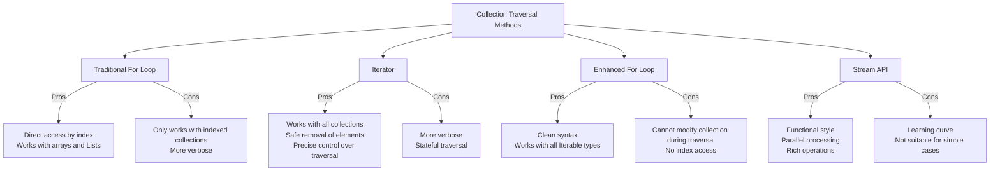

# Java Iterators

## Introduction

In Java programming, an Iterator is an object that enables you to traverse through a collection of objects, accessing each element sequentially without exposing the underlying representation of the collection. Iterators are a fundamental part of the Java Collections Framework and provide a standard way to access elements in different collection types.

The Iterator pattern implements a common interface that separates the process of traversing a collection from the collection itself. This separation is crucial because it allows you to:

1. Access elements sequentially without knowing the internal structure of the collection
2. Remove elements safely during traversal
3. Use a consistent approach across different collection types

Let's explore how Iterators work in Java and how you can use them effectively in your programs.

## Iterator Interface Basics

In Java, the `Iterator` interface is part of the `java.util` package and defines the following methods:

```java
public interface Iterator<E> {
    // Returns true if the iteration has more elements
    boolean hasNext();
    
    // Returns the next element in the iteration
    E next();
    
    // Removes the last element returned by next() (optional operation)
    default void remove() {
        throw new UnsupportedOperationException("remove");
    }
    
    // Performs the given action for each remaining element (added in Java 8)
    default void forEachRemaining(Consumer<? super E> action) {
        while (hasNext())
            action.accept(next());
    }
}
```

## Getting an Iterator

Every collection in the Java Collections Framework implements the `Iterable` interface, which has a method called `iterator()` that returns an Iterator. Here's how you obtain an Iterator:

```java
import java.util.ArrayList;
import java.util.Iterator;
import java.util.List;

public class IteratorExample {
    public static void main(String[] args) {
        List<String> fruits = new ArrayList<>();
        fruits.add("Apple");
        fruits.add("Banana");
        fruits.add("Orange");
        fruits.add("Mango");
        
        Iterator<String> iterator = fruits.iterator();
        
        // Now we can use this iterator to traverse the list
    }
}
```

## Basic Iterator Operations

### Traversing a Collection

The most common use of an Iterator is to traverse a collection. Here's how:

```java
import java.util.ArrayList;
import java.util.Iterator;
import java.util.List;

public class IteratorTraversalExample {
    public static void main(String[] args) {
        List<String> fruits = new ArrayList<>();
        fruits.add("Apple");
        fruits.add("Banana");
        fruits.add("Orange");
        fruits.add("Mango");
        
        Iterator<String> iterator = fruits.iterator();
        
        System.out.println("Fruits in the collection:");
        while (iterator.hasNext()) {
            String fruit = iterator.next();
            System.out.println(fruit);
        }
    }
}
```

**Output:**
```
Fruits in the collection:
Apple
Banana
Orange
Mango
```

### Removing Elements During Traversal

One of the key advantages of iterators is the ability to safely remove elements while traversing the collection:

```java
import java.util.ArrayList;
import java.util.Iterator;
import java.util.List;

public class IteratorRemovalExample {
    public static void main(String[] args) {
        List<String> fruits = new ArrayList<>();
        fruits.add("Apple");
        fruits.add("Banana");
        fruits.add("Orange");
        fruits.add("Mango");
        
        System.out.println("Original list: " + fruits);
        
        // Remove fruits that start with 'A'
        Iterator<String> iterator = fruits.iterator();
        while (iterator.hasNext()) {
            String fruit = iterator.next();
            if (fruit.startsWith("A")) {
                iterator.remove(); // Safe removal during iteration
            }
        }
        
        System.out.println("List after removal: " + fruits);
    }
}
```

**Output:**
```
Original list: [Apple, Banana, Orange, Mango]
List after removal: [Banana, Orange, Mango]
```

:::caution
Never use the `collection.remove()` method while iterating with an Iterator. This can cause a `ConcurrentModificationException`. Always use the `iterator.remove()` method instead.
:::

## Enhanced For Loop

Java provides an enhanced for loop (for-each loop) which uses Iterator behind the scenes, making the code more readable:

```java
import java.util.ArrayList;
import java.util.List;

public class EnhancedForLoopExample {
    public static void main(String[] args) {
        List<String> fruits = new ArrayList<>();
        fruits.add("Apple");
        fruits.add("Banana");
        fruits.add("Orange");
        fruits.add("Mango");
        
        System.out.println("Fruits in the collection:");
        for (String fruit : fruits) {
            System.out.println(fruit);
        }
    }
}
```

**Output:**
```
Fruits in the collection:
Apple
Banana
Orange
Mango
```

The enhanced for loop is actually syntactic sugar for using an Iterator. Under the hood, Java converts this loop to use an Iterator.

## ListIterator - Enhanced Iterator for Lists

The `java.util.ListIterator` is a more powerful iterator specifically designed for lists. It extends the Iterator interface and provides additional functionality:

1. Bidirectional traversal (forward and backward)
2. Access to the index of elements during traversal
3. Ability to replace elements during traversal
4. Ability to add elements during traversal

```java
import java.util.ArrayList;
import java.util.List;
import java.util.ListIterator;

public class ListIteratorExample {
    public static void main(String[] args) {
        List<String> fruits = new ArrayList<>();
        fruits.add("Apple");
        fruits.add("Banana");
        fruits.add("Orange");
        
        // Get ListIterator
        ListIterator<String> listIterator = fruits.listIterator();
        
        System.out.println("Forward traversal:");
        while (listIterator.hasNext()) {
            int index = listIterator.nextIndex();
            String fruit = listIterator.next();
            System.out.println("Index: " + index + ", Fruit: " + fruit);
        }
        
        System.out.println("\nBackward traversal:");
        while (listIterator.hasPrevious()) {
            int index = listIterator.previousIndex();
            String fruit = listIterator.previous();
            System.out.println("Index: " + index + ", Fruit: " + fruit);
        }
    }
}
```

**Output:**
```
Forward traversal:
Index: 0, Fruit: Apple
Index: 1, Fruit: Banana
Index: 2, Fruit: Orange

Backward traversal:
Index: 2, Fruit: Orange
Index: 1, Fruit: Banana
Index: 0, Fruit: Apple
```

### Modifying Elements with ListIterator

ListIterator also allows you to replace elements or add new elements during iteration:

```java
import java.util.ArrayList;
import java.util.List;
import java.util.ListIterator;

public class ListIteratorModificationExample {
    public static void main(String[] args) {
        List<String> fruits = new ArrayList<>();
        fruits.add("Apple");
        fruits.add("Banana");
        fruits.add("Orange");
        
        System.out.println("Original list: " + fruits);
        
        ListIterator<String> listIterator = fruits.listIterator();
        
        // Replace "Apple" with "Green Apple"
        if (listIterator.hasNext()) {
            listIterator.next();  // Move to "Apple"
            listIterator.set("Green Apple");  // Replace it
        }
        
        // Add "Mango" after "Banana"
        if (listIterator.hasNext()) {
            listIterator.next();  // Move to "Banana"
            listIterator.add("Mango");  // Add after current position
        }
        
        System.out.println("Modified list: " + fruits);
    }
}
```

**Output:**
```
Original list: [Apple, Banana, Orange]
Modified list: [Green Apple, Banana, Mango, Orange]
```

## Iterator vs For Loop vs Stream API

Let's compare different ways to traverse collections in Java:



## Real-World Examples

### Example 1: Filtering a Collection

Imagine you have a collection of products and you need to filter out those that are out of stock:

```java
import java.util.ArrayList;
import java.util.Iterator;
import java.util.List;

class Product {
    private String name;
    private boolean inStock;
    
    public Product(String name, boolean inStock) {
        this.name = name;
        this.inStock = inStock;
    }
    
    public String getName() {
        return name;
    }
    
    public boolean isInStock() {
        return inStock;
    }
    
    @Override
    public String toString() {
        return name + " (In Stock: " + inStock + ")";
    }
}

public class ProductFilterExample {
    public static void main(String[] args) {
        List<Product> products = new ArrayList<>();
        products.add(new Product("Laptop", true));
        products.add(new Product("Phone", false));
        products.add(new Product("Tablet", true));
        products.add(new Product("Monitor", false));
        
        System.out.println("All products:");
        for (Product product : products) {
            System.out.println(product);
        }
        
        // Remove out-of-stock products using Iterator
        Iterator<Product> iterator = products.iterator();
        while (iterator.hasNext()) {
            Product product = iterator.next();
            if (!product.isInStock()) {
                iterator.remove();
            }
        }
        
        System.out.println("\nIn-stock products only:");
        for (Product product : products) {
            System.out.println(product);
        }
    }
}
```

**Output:**
```
All products:
Laptop (In Stock: true)
Phone (In Stock: false)
Tablet (In Stock: true)
Monitor (In Stock: false)

In-stock products only:
Laptop (In Stock: true)
Tablet (In Stock: true)
```

### Example 2: Processing Nested Collections

Iterators are particularly useful when working with nested collections:

```java
import java.util.ArrayList;
import java.util.Iterator;
import java.util.List;

public class NestedCollectionExample {
    public static void main(String[] args) {
        // Create a list of lists
        List<List<Integer>> nestedList = new ArrayList<>();
        
        List<Integer> list1 = new ArrayList<>();
        list1.add(1);
        list1.add(2);
        list1.add(3);
        
        List<Integer> list2 = new ArrayList<>();
        list2.add(4);
        list2.add(5);
        
        List<Integer> list3 = new ArrayList<>();
        list3.add(6);
        list3.add(7);
        list3.add(8);
        list3.add(9);
        
        nestedList.add(list1);
        nestedList.add(list2);
        nestedList.add(list3);
        
        // Process the nested list using iterators
        int sum = 0;
        
        Iterator<List<Integer>> outerIterator = nestedList.iterator();
        while (outerIterator.hasNext()) {
            List<Integer> innerList = outerIterator.next();
            
            Iterator<Integer> innerIterator = innerList.iterator();
            while (innerIterator.hasNext()) {
                Integer value = innerIterator.next();
                sum += value;
                
                // Remove all even numbers
                if (value % 2 == 0) {
                    innerIterator.remove();
                }
            }
        }
        
        System.out.println("Sum of all numbers: " + sum);
        System.out.println("Nested list after removing even numbers: " + nestedList);
    }
}
```

**Output:**
```
Sum of all numbers: 45
Nested list after removing even numbers: [[1, 3], [5], [7, 9]]
```

## The forEachRemaining Method (Java 8+)

Java 8 introduced a new method to the Iterator interface called `forEachRemaining()`, which allows you to process all remaining elements in a functional style:

```java
import java.util.ArrayList;
import java.util.Iterator;
import java.util.List;

public class ForEachRemainingExample {
    public static void main(String[] args) {
        List<String> languages = new ArrayList<>();
        languages.add("Java");
        languages.add("Python");
        languages.add("JavaScript");
        languages.add("C++");
        
        Iterator<String> iterator = languages.iterator();
        
        // Process the first element traditionally
        if (iterator.hasNext()) {
            System.out.println("First language: " + iterator.next());
        }
        
        // Process all remaining elements using forEachRemaining
        System.out.println("\nRemaining languages:");
        iterator.forEachRemaining(language -> 
            System.out.println("- " + language)
        );
    }
}
```

**Output:**
```
First language: Java

Remaining languages:
- Python
- JavaScript
- C++
```

## Fail-Fast vs Fail-Safe Iterators

Java collections have two types of iterators:

1. **Fail-Fast Iterators**: Throw `ConcurrentModificationException` if the collection is modified while iterating (except through the iterator's own `remove` method). Most Java Collections Framework iterators are fail-fast.

2. **Fail-Safe Iterators**: Don't throw exceptions when the collection is modified during iteration. They usually work on a copy of the collection. Examples include iterators from `ConcurrentHashMap` and `CopyOnWriteArrayList`.

```java
import java.util.ArrayList;
import java.util.ConcurrentModificationException;
import java.util.Iterator;
import java.util.List;
import java.util.concurrent.CopyOnWriteArrayList;

public class FailFastVsFailSafeExample {
    public static void main(String[] args) {
        // Fail-Fast example
        List<String> failFastList = new ArrayList<>();
        failFastList.add("One");
        failFastList.add("Two");
        failFastList.add("Three");
        
        try {
            System.out.println("Fail-Fast Iterator Example:");
            Iterator<String> failFastIterator = failFastList.iterator();
            while (failFastIterator.hasNext()) {
                String value = failFastIterator.next();
                System.out.println(value);
                
                // This will cause ConcurrentModificationException
                if (value.equals("Two")) {
                    failFastList.remove(value);
                }
            }
        } catch (ConcurrentModificationException e) {
            System.out.println("ConcurrentModificationException caught!");
        }
        
        // Fail-Safe example
        List<String> failSafeList = new CopyOnWriteArrayList<>();
        failSafeList.add("One");
        failSafeList.add("Two");
        failSafeList.add("Three");
        
        System.out.println("\nFail-Safe Iterator Example:");
        Iterator<String> failSafeIterator = failSafeList.iterator();
        while (failSafeIterator.hasNext()) {
            String value = failSafeIterator.next();
            System.out.println(value);
            
            // This won't cause exception, but the iterator won't see this change
            if (value.equals("Two")) {
                failSafeList.remove(value);
                System.out.println("(Removed 'Two' from list, but iterator won't see the change)");
            }
        }
        
        System.out.println("\nFinal fail-safe list content: " + failSafeList);
    }
}
```

**Output:**
```
Fail-Fast Iterator Example:
One
Two
ConcurrentModificationException caught!

Fail-Safe Iterator Example:
One
Two
(Removed 'Two' from list, but iterator won't see the change)
Three

Final fail-safe list content: [One, Three]
```

## Best Practices When Using Iterators

1. **Use the right iterator for your needs**:
   - Use regular Iterator for simple traversal and removal
   - Use ListIterator for bidirectional traversal and modification of Lists
   - Consider Stream API for functional-style operations

2. **Avoid concurrent modification**:
   - Don't modify collections directly during iteration
   - Use `iterator.remove()` instead of `collection.remove()` during iteration
   - Use concurrent collections for multi-threaded scenarios

3. **Release resources**:
   - Some specialized iterators might need to be closed after use
   - Although standard collection iterators don't require explicit cleanup

4. **Consider enhanced for-loop for simpler cases**:
   - When you just need to access elements and don't need to modify the collection

5. **Choose the right collection**:
   - The performance of iterators depends on the underlying collection
   - LinkedList provides O(1) add/remove operations during iteration
   - ArrayList provides O(1) access but O(n) for element removal

## Summary

Java Iterators are a fundamental part of the Java Collections Framework that provide a standard way to traverse collections. They abstract the underlying implementation details of collections, offering a consistent approach to element access and manipulation.

Key points to remember about Iterators:

- They provide sequential access to collection elements
- They allow safe removal of elements during iteration
- ListIterator offers enhanced capabilities for List collections
- The enhanced for-loop provides a cleaner syntax for simple traversal
- Fail-fast iterators throw exceptions if collections are modified incorrectly during iteration
- Fail-safe iterators work with a snapshot of data and don't throw exceptions

By mastering iterators, you can write more efficient and safer code when working with Java collections.

## Exercises

1. Create a program that uses an Iterator to filter prime numbers from a List of integers.
2. Write code that uses ListIterator to reverse the elements in a List without using any additional collections.
3. Implement a custom Iterable class that iterates through a sequence of Fibonacci numbers.
4. Create a program that demonstrates the difference between Fail-Fast and Fail-Safe iterators with different collections.
5. Write a method that takes two Lists and uses Iterators to find elements that appear in both lists.

## Additional Resources

- [Java Documentation on Iterator Interface](https://docs.oracle.com/en/java/javase/17/docs/api/java.base/java/util/Iterator.html)
- [Java Documentation on ListIterator Interface](https://docs.oracle.com/en/java/javase/17/docs/api/java.base/java/util/ListIterator.html)
- [Java Collections Framework Overview](https://docs.oracle.com/javase/tutorial/collections/interfaces/index.html)
- [Oracle's Tutorial on Iterators](https://docs.oracle.com/javase/tutorial/collections/interfaces/collection.html)
- [Baeldung's Guide to Java Iterator](https://www.baeldung.com/java-iterator)

Happy coding with Java Iterators!