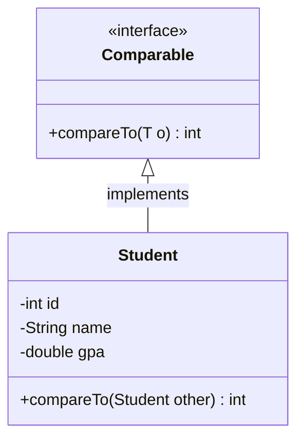
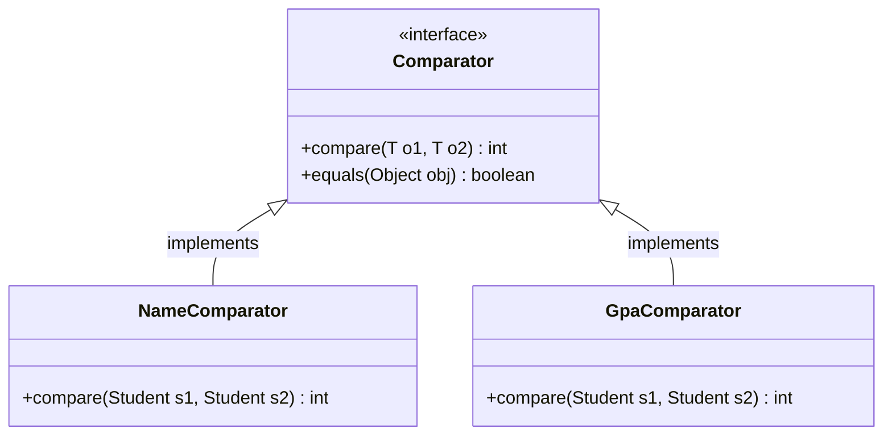

# Java Comparator and Comparable

When working with Java collections, one of the most common operations is sorting elements. While sorting primitive types like integers or strings is straightforward, sorting custom objects requires special mechanisms. Java provides two interfaces to handle object comparison and sorting: `Comparable` and `Comparator`.

## Introduction to Object Sorting

In real-world applications, we frequently need to sort collections of custom objects based on specific properties. For example:

- Sorting users by their age or name
- Arranging products by price or rating
- Ordering tasks by priority or deadline

Java offers two primary ways to enable object sorting:

1. **Comparable**: For implementing a "natural ordering" within the class itself
2. **Comparator**: For creating external sorting strategies that can be applied to objects

Let's explore both approaches in detail.

## The Comparable Interface

The `Comparable` interface is part of the `java.lang` package and represents the "natural ordering" of objects. A class that implements `Comparable` can be sorted using standard sorting methods.

### How Comparable Works



The `Comparable` interface has a single method:

```java
public int compareTo(T o);
```

This method returns:
- A negative integer if the current object is less than the specified object
- Zero if they're equal
- A positive integer if the current object is greater than the specified object

### Implementing Comparable

Let's implement the `Comparable` interface in a `Student` class to sort students by their GPA:

```java
public class Student implements Comparable<Student> {
    private int id;
    private String name;
    private double gpa;
    
    public Student(int id, String name, double gpa) {
        this.id = id;
        this.name = name;
        this.gpa = gpa;
    }
    
    // Getters
    public int getId() { return id; }
    public String getName() { return name; }
    public double getGpa() { return gpa; }
    
    @Override
    public int compareTo(Student other) {
        // Sort by GPA in ascending order
        return Double.compare(this.gpa, other.gpa);
    }
    
    @Override
    public String toString() {
        return "Student{id=" + id + ", name='" + name + "', gpa=" + gpa + '}';
    }
}
```

### Using Comparable Objects

Once a class implements `Comparable`, it can be sorted using `Collections.sort()` or arrays can be sorted using `Arrays.sort()`:

```java
import java.util.ArrayList;
import java.util.Collections;
import java.util.List;

public class ComparableExample {
    public static void main(String[] args) {
        List<Student> students = new ArrayList<>();
        students.add(new Student(101, "Alice", 3.8));
        students.add(new Student(102, "Bob", 3.5));
        students.add(new Student(103, "Charlie", 4.0));
        students.add(new Student(104, "Diana", 3.2));
        
        System.out.println("Before sorting:");
        for (Student student : students) {
            System.out.println(student);
        }
        
        Collections.sort(students);
        
        System.out.println("\nAfter sorting (by GPA):");
        for (Student student : students) {
            System.out.println(student);
        }
    }
}
```

**Output:**
```
Before sorting:
Student{id=101, name='Alice', gpa=3.8}
Student{id=102, name='Bob', gpa=3.5}
Student{id=103, name='Charlie', gpa=4.0}
Student{id=104, name='Diana', gpa=3.2}

After sorting (by GPA):
Student{id=104, name='Diana', gpa=3.2}
Student{id=102, name='Bob', gpa=3.5}
Student{id=101, name='Alice', gpa=3.8}
Student{id=103, name='Charlie', gpa=4.0}
```

### Limitations of Comparable

While `Comparable` is useful, it has limitations:
1. You can define only one "natural ordering" for a class
2. You need access to the class source code to implement it
3. You can't change how sorting works without modifying the class

This is where the `Comparator` interface comes into play.

## The Comparator Interface

The `Comparator` interface is part of the `java.util` package and allows you to define multiple sorting strategies for a class without modifying it.

### How Comparator Works



The primary method of the `Comparator` interface is:

```java
int compare(T o1, T o2);
```

Similar to `compareTo()`, this method returns:
- A negative integer if o1 is less than o2
- Zero if they're equal
- A positive integer if o1 is greater than o2

### Creating Comparators

Let's create comparators for the `Student` class to sort by name and ID:

```java
import java.util.Comparator;

// Comparator to sort students by name
public class NameComparator implements Comparator<Student> {
    @Override
    public int compare(Student s1, Student s2) {
        return s1.getName().compareTo(s2.getName());
    }
}

// Comparator to sort students by ID
public class IdComparator implements Comparator<Student> {
    @Override
    public int compare(Student s1, Student s2) {
        return s1.getId() - s2.getId();
    }
}
```

### Using Comparators

You can use these comparators with the overloaded version of `Collections.sort()`:

```java
import java.util.ArrayList;
import java.util.Collections;
import java.util.List;

public class ComparatorExample {
    public static void main(String[] args) {
        List<Student> students = new ArrayList<>();
        students.add(new Student(101, "Alice", 3.8));
        students.add(new Student(103, "Bob", 3.5));
        students.add(new Student(102, "Charlie", 4.0));
        students.add(new Student(104, "Diana", 3.2));
        
        // Sort by name
        Collections.sort(students, new NameComparator());
        
        System.out.println("Sorted by name:");
        for (Student student : students) {
            System.out.println(student);
        }
        
        // Sort by ID
        Collections.sort(students, new IdComparator());
        
        System.out.println("\nSorted by ID:");
        for (Student student : students) {
            System.out.println(student);
        }
    }
}
```

**Output:**
```
Sorted by name:
Student{id=101, name='Alice', gpa=3.8}
Student{id=103, name='Bob', gpa=3.5}
Student{id=102, name='Charlie', gpa=4.0}
Student{id=104, name='Diana', gpa=3.2}

Sorted by ID:
Student{id=101, name='Alice', gpa=3.8}
Student{id=102, name='Charlie', gpa=4.0}
Student{id=103, name='Bob', gpa=3.5}
Student{id=104, name='Diana', gpa=3.2}
```

## Modern Approaches: Lambda Expressions and Method References

Java 8 introduced lambda expressions and method references, which simplify creating comparators.

### Using Lambda Expressions

```java
import java.util.ArrayList;
import java.util.Collections;
import java.util.List;

public class ModernComparatorExample {
    public static void main(String[] args) {
        List<Student> students = new ArrayList<>();
        students.add(new Student(101, "Alice", 3.8));
        students.add(new Student(103, "Bob", 3.5));
        students.add(new Student(102, "Charlie", 4.0));
        students.add(new Student(104, "Diana", 3.2));
        
        // Sort by name using lambda
        Collections.sort(students, (s1, s2) -> s1.getName().compareTo(s2.getName()));
        
        System.out.println("Sorted by name (lambda):");
        students.forEach(System.out::println);
        
        // Sort by GPA in descending order
        Collections.sort(students, (s1, s2) -> Double.compare(s2.getGpa(), s1.getGpa()));
        
        System.out.println("\nSorted by GPA (descending):");
        students.forEach(System.out::println);
    }
}
```

### Using Comparator Utility Methods

Java 8 also introduced several utility methods in the `Comparator` interface:

```java
import java.util.ArrayList;
import java.util.Comparator;
import java.util.List;

public class ComparatorUtilityExample {
    public static void main(String[] args) {
        List<Student> students = new ArrayList<>();
        students.add(new Student(101, "Alice", 3.8));
        students.add(new Student(103, "Bob", 3.5));
        students.add(new Student(102, "Charlie", 4.0));
        students.add(new Student(104, "Diana", 3.2));
        
        // Sort by name
        students.sort(Comparator.comparing(Student::getName));
        
        System.out.println("Sorted by name:");
        students.forEach(System.out::println);
        
        // Sort by GPA in descending order, then by name for ties
        students.sort(
            Comparator.comparing(Student::getGpa).reversed()
                .thenComparing(Student::getName)
        );
        
        System.out.println("\nSorted by GPA (descending) then by name:");
        students.forEach(System.out::println);
    }
}
```

**Output:**
```
Sorted by name:
Student{id=101, name='Alice', gpa=3.8}
Student{id=103, name='Bob', gpa=3.5}
Student{id=102, name='Charlie', gpa=4.0}
Student{id=104, name='Diana', gpa=3.2}

Sorted by GPA (descending) then by name:
Student{id=102, name='Charlie', gpa=4.0}
Student{id=101, name='Alice', gpa=3.8}
Student{id=103, name='Bob', gpa=3.5}
Student{id=104, name='Diana', gpa=3.2}
```

## Real-world Application: Task Management System

Let's explore a practical example where sorting is essential: a task management system.

```java
import java.time.LocalDate;
import java.util.ArrayList;
import java.util.Collections;
import java.util.Comparator;
import java.util.List;

class Task implements Comparable<Task> {
    private int id;
    private String title;
    private int priority; // 1 (highest) to 5 (lowest)
    private LocalDate deadline;
    private boolean completed;
    
    public Task(int id, String title, int priority, LocalDate deadline) {
        this.id = id;
        this.title = title;
        this.priority = priority;
        this.deadline = deadline;
        this.completed = false;
    }
    
    // Getters and setters
    public int getId() { return id; }
    public String getTitle() { return title; }
    public int getPriority() { return priority; }
    public LocalDate getDeadline() { return deadline; }
    public boolean isCompleted() { return completed; }
    public void setCompleted(boolean completed) { this.completed = completed; }
    
    // Natural ordering: by priority
    @Override
    public int compareTo(Task other) {
        return Integer.compare(this.priority, other.priority);
    }
    
    @Override
    public String toString() {
        return "Task{" +
                "id=" + id +
                ", title='" + title + '\'' +
                ", priority=" + priority +
                ", deadline=" + deadline +
                ", completed=" + completed +
                '}';
    }
}

public class TaskManagementExample {
    public static void main(String[] args) {
        List<Task> tasks = new ArrayList<>();
        tasks.add(new Task(1, "Complete project report", 2, LocalDate.of(2023, 6, 15)));
        tasks.add(new Task(2, "Prepare presentation", 1, LocalDate.of(2023, 6, 10)));
        tasks.add(new Task(3, "Update website content", 3, LocalDate.of(2023, 6, 20)));
        tasks.add(new Task(4, "Schedule team meeting", 2, LocalDate.of(2023, 6, 5)));
        tasks.add(new Task(5, "Review pull requests", 4, LocalDate.of(2023, 6, 30)));
        
        // Default sorting by priority (using Comparable)
        Collections.sort(tasks);
        System.out.println("Tasks sorted by priority:");
        tasks.forEach(System.out::println);
        
        // Sort by deadline (using Comparator)
        tasks.sort(Comparator.comparing(Task::getDeadline));
        System.out.println("\nTasks sorted by deadline:");
        tasks.forEach(System.out::println);
        
        // Sort by priority, then by deadline for same-priority tasks
        tasks.sort(
            Comparator.comparing(Task::getPriority)
                     .thenComparing(Task::getDeadline)
        );
        System.out.println("\nTasks sorted by priority, then by deadline:");
        tasks.forEach(System.out::println);
        
        // Complex sorting: incomplete tasks first (by priority), then completed tasks
        Comparator<Task> complexComparator = Comparator
            .comparing(Task::isCompleted)
            .thenComparing(Task::getPriority)
            .thenComparing(Task::getDeadline);
            
        tasks.get(1).setCompleted(true);  // Mark task with ID 2 as completed
        tasks.get(3).setCompleted(true);  // Mark task with ID 4 as completed
        
        tasks.sort(complexComparator);
        System.out.println("\nTasks sorted with incomplete first, by priority:");
        tasks.forEach(System.out::println);
    }
}
```

This example demonstrates how sorting can be used in a task management application to present tasks in different orders depending on the user's needs.

## Comparable vs Comparator: When to Use Each

Here's a quick comparison to help you decide which interface to use:

| Feature | Comparable | Comparator |
|---------|------------|------------|
| Package | java.lang | java.util |
| Method | compareTo() | compare() |
| Purpose | Defines natural ordering | Defines custom ordering |
| Number of orderings | One (natural) | Multiple possible |
| Implementation location | Inside the class being compared | In separate classes |
| Access to source | Required | Not required |
| Flexibility | Less flexible | More flexible |

### Use Comparable when:
- There's a clear, default way to order objects of a class
- You have access to the class source code
- You need only one ordering strategy

### Use Comparator when:
- You need multiple ways to sort objects
- You don't have access to the source code
- You want to keep sorting logic separate from the class
- You need to sort objects based on criteria that isn't the natural ordering

## Summary

In this guide, we explored Java's mechanisms for sorting objects:

1. **Comparable** interface:
   - Provides a single, natural ordering for a class
   - Implemented by the class being sorted
   - Uses the `compareTo()` method

2. **Comparator** interface:
   - Provides flexible, external sorting strategies
   - Implemented in separate classes or using lambda expressions
   - Uses the `compare()` method

3. **Modern approaches**:
   - Lambda expressions simplify Comparator creation
   - Method references provide cleaner syntax
   - Utility methods like `comparing()` and `thenComparing()` enable complex sorting logic

Understanding these interfaces is crucial for working effectively with Java collections and developing applications that need to present data in specific orders.

## Additional Resources

- [Oracle's Tutorial on Object Ordering](https://docs.oracle.com/javase/tutorial/collections/interfaces/order.html)
- [Java 8 Comparator API documentation](https://docs.oracle.com/javase/8/docs/api/java/util/Comparator.html)

## Exercises

1. Create a `Book` class with fields for title, author, and publication year. Implement `Comparable` to sort by publication year.

2. Create three different comparators for the `Book` class to sort by title, author, and page count.

3. Use lambda expressions and the `comparing` method to sort a list of books by author, then by title for books by the same author.

4. Implement a product catalog system where products can be sorted by price, popularity, or rating.

5. Create a custom `TreeMap` that uses a comparator to organize elements by their string length rather than lexicographically.