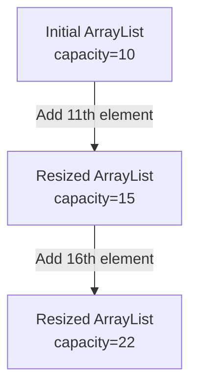

# Java ArrayList

## Introduction

The `ArrayList` is one of the most commonly used classes in the Java Collections Framework. It provides a resizable array implementation, allowing elements to be added or removed dynamically. Unlike traditional arrays that have a fixed size, `ArrayList` automatically grows as elements are added, making it much more flexible and convenient for everyday programming tasks.

In this tutorial, we'll explore the `ArrayList` class, its operations, and practical examples of using it in your Java programs.

## ArrayList Basics

`ArrayList` is part of the `java.util` package and implements the `List` interface. This means it inherits all the methods defined in the `List` interface and is an ordered collection (also known as a sequence) that allows duplicate elements.

### Key Features of ArrayList

- **Dynamic Size**: Automatically grows as elements are added
- **Random Access**: Provides fast access to elements using index
- **Ordered Collection**: Maintains the insertion order of elements
- **Allows Duplicates**: Can contain multiple instances of the same element
- **Non-synchronized**: Not thread-safe by default

## Creating an ArrayList

There are several ways to create an `ArrayList` in Java:

```java
// Creating an empty ArrayList
ArrayList<String> fruits = new ArrayList<>();

// Creating an ArrayList with initial capacity
ArrayList<Integer> numbers = new ArrayList<>(20);

// Creating an ArrayList with elements from another collection
ArrayList<String> originalList = new ArrayList<>();
originalList.add("Apple");
originalList.add("Banana");
ArrayList<String> copyList = new ArrayList<>(originalList);
```

### The Diamond Operator (`<>`)

Notice the empty angle brackets `<>` in the first example. This is the diamond operator introduced in Java 7, which lets the compiler infer the type arguments for the constructor call based on the variable declaration.

## Basic ArrayList Operations

Let's explore the fundamental operations you can perform with an `ArrayList`:

### Adding Elements

```java
import java.util.ArrayList;

public class ArrayListAddExample {
    public static void main(String[] args) {
        // Create a new ArrayList
        ArrayList<String> fruits = new ArrayList<>();
        
        // Add elements to the ArrayList
        fruits.add("Apple");
        fruits.add("Banana");
        fruits.add("Orange");
        
        // Print the ArrayList
        System.out.println("Fruits list: " + fruits);
        
        // Add element at a specific index
        fruits.add(1, "Mango");
        
        // Print the updated ArrayList
        System.out.println("Updated fruits list: " + fruits);
    }
}
```

**Output:**
```
Fruits list: [Apple, Banana, Orange]
Updated fruits list: [Apple, Mango, Banana, Orange]
```

### Accessing Elements

```java
import java.util.ArrayList;

public class ArrayListAccessExample {
    public static void main(String[] args) {
        ArrayList<String> fruits = new ArrayList<>();
        fruits.add("Apple");
        fruits.add("Banana");
        fruits.add("Orange");
        
        // Get element at index 1
        String fruit = fruits.get(1);
        System.out.println("Element at index 1: " + fruit);
        
        // Check if ArrayList contains an element
        boolean containsApple = fruits.contains("Apple");
        System.out.println("ArrayList contains Apple: " + containsApple);
        
        // Find index of an element
        int indexOfOrange = fruits.indexOf("Orange");
        System.out.println("Index of Orange: " + indexOfOrange);
        
        // Get size of ArrayList
        int size = fruits.size();
        System.out.println("Size of ArrayList: " + size);
    }
}
```

**Output:**
```
Element at index 1: Banana
ArrayList contains Apple: true
Index of Orange: 2
Size of ArrayList: 3
```

### Removing Elements

```java
import java.util.ArrayList;

public class ArrayListRemoveExample {
    public static void main(String[] args) {
        ArrayList<String> fruits = new ArrayList<>();
        fruits.add("Apple");
        fruits.add("Banana");
        fruits.add("Orange");
        fruits.add("Mango");
        fruits.add("Banana"); // Adding duplicate element
        
        System.out.println("Original list: " + fruits);
        
        // Remove element by value (removes only the first occurrence)
        fruits.remove("Banana");
        System.out.println("After removing Banana: " + fruits);
        
        // Remove element by index
        fruits.remove(1); // Removes element at index 1
        System.out.println("After removing element at index 1: " + fruits);
        
        // Create another ArrayList for demonstration
        ArrayList<String> toRemove = new ArrayList<>();
        toRemove.add("Apple");
        toRemove.add("Mango");
        
        // Remove all elements present in another collection
        fruits.removeAll(toRemove);
        System.out.println("After removing Apple and Mango: " + fruits);
        
        // Clear all elements
        fruits.clear();
        System.out.println("After clearing the list: " + fruits);
    }
}
```

**Output:**
```
Original list: [Apple, Banana, Orange, Mango, Banana]
After removing Banana: [Apple, Orange, Mango, Banana]
After removing element at index 1: [Apple, Mango, Banana]
After removing Apple and Mango: [Banana]
After clearing the list: []
```

### Updating Elements

```java
import java.util.ArrayList;

public class ArrayListUpdateExample {
    public static void main(String[] args) {
        ArrayList<String> fruits = new ArrayList<>();
        fruits.add("Apple");
        fruits.add("Banana");
        fruits.add("Orange");
        
        System.out.println("Original list: " + fruits);
        
        // Update element at index 1
        fruits.set(1, "Grapes");
        System.out.println("After updating index 1: " + fruits);
    }
}
```

**Output:**
```
Original list: [Apple, Banana, Orange]
After updating index 1: [Apple, Grapes, Orange]
```

## Iterating Through an ArrayList

There are several ways to iterate through an `ArrayList`:

```java
import java.util.ArrayList;
import java.util.Iterator;

public class ArrayListIterationExample {
    public static void main(String[] args) {
        ArrayList<String> fruits = new ArrayList<>();
        fruits.add("Apple");
        fruits.add("Banana");
        fruits.add("Orange");
        
        System.out.println("Using for loop with index:");
        for (int i = 0; i < fruits.size(); i++) {
            System.out.println(i + ": " + fruits.get(i));
        }
        
        System.out.println("\nUsing enhanced for loop (for-each):");
        for (String fruit : fruits) {
            System.out.println(fruit);
        }
        
        System.out.println("\nUsing Iterator:");
        Iterator<String> iterator = fruits.iterator();
        while (iterator.hasNext()) {
            System.out.println(iterator.next());
        }
        
        System.out.println("\nUsing forEach method with lambda (Java 8+):");
        fruits.forEach(fruit -> System.out.println(fruit));
        
        // Even more concise with method reference
        System.out.println("\nUsing forEach with method reference:");
        fruits.forEach(System.out::println);
    }
}
```

**Output:**
```
Using for loop with index:
0: Apple
1: Banana
2: Orange

Using enhanced for loop (for-each):
Apple
Banana
Orange

Using Iterator:
Apple
Banana
Orange

Using forEach method with lambda (Java 8+):
Apple
Banana
Orange

Using forEach with method reference:
Apple
Banana
Orange
```

## Understanding How ArrayList Works Internally

The `ArrayList` class works by maintaining a dynamically resizable array under the hood. When you create an `ArrayList`, it creates an internal array with a default capacity (usually 10). As you add more elements than the current capacity, `ArrayList` automatically creates a new, larger array (typically 1.5 times the size) and copies all elements from the old array to the new one.



This resizing operation takes O(n) time, but since it happens only occasionally, the amortized time complexity for adding elements is O(1).

## ArrayList vs Array

Here's a comparison of `ArrayList` with traditional arrays:

| Feature | ArrayList | Array |
|---------|-----------|-------|
| Size | Dynamic | Fixed |
| Type Safety | Generic type safety | Can hold primitives directly |
| Element Type | Can only store objects (wrapper classes for primitives) | Can store primitives and objects |
| Memory Efficiency | Less efficient due to overhead | More efficient |
| Functionality | Rich API with many utility methods | Limited functionality |
| Null Values | Can hold null values | Can hold null for object arrays, not for primitive arrays |
| Multi-dimensional | Not directly supported | Supported |

## Common ArrayList Methods

Here's a quick reference of commonly used `ArrayList` methods:

| Method | Description |
|---------|-----------|
| `add(E e)` | Adds element at the end |
| `add(int index, E element)` | Adds element at specified index |
| `remove(Object o)` | Removes first occurrence of specified element |
| `remove(int index)` | Removes element at specified index |
| `get(int index)` | Returns element at specified index |
| `set(int index, E element)` | Replaces element at specified index |
| `size()` | Returns number of elements |
| `isEmpty()` | Returns true if list contains no elements |
| `clear()` | Removes all elements |
| `contains(Object o)` | Returns true if list contains specified element |
| `indexOf(Object o)` | Returns index of first occurrence of element |
| `lastIndexOf(Object o)` | Returns index of last occurrence of element |
| `toArray()` | Returns array containing all elements |
| `subList(int fromIndex, int toIndex)` | Returns view of portion of list |

## Practical Examples

### Example 1: Shopping Cart

Let's implement a basic shopping cart using ArrayList:

```java
import java.util.ArrayList;

class Product {
    private String name;
    private double price;
    
    public Product(String name, double price) {
        this.name = name;
        this.price = price;
    }
    
    public String getName() {
        return name;
    }
    
    public double getPrice() {
        return price;
    }
    
    @Override
    public String toString() {
        return name + " - $" + price;
    }
}

public class ShoppingCartExample {
    public static void main(String[] args) {
        ArrayList<Product> cart = new ArrayList<>();
        
        // Add products to cart
        cart.add(new Product("Laptop", 999.99));
        cart.add(new Product("Mouse", 29.99));
        cart.add(new Product("Keyboard", 59.99));
        
        // Display cart contents
        System.out.println("Shopping Cart Contents:");
        for (Product product : cart) {
            System.out.println(product);
        }
        
        // Calculate total price
        double total = 0;
        for (Product product : cart) {
            total += product.getPrice();
        }
        System.out.println("\nTotal: $" + total);
        
        // Remove an item
        cart.remove(1); // Remove Mouse
        
        // Display updated cart
        System.out.println("\nUpdated Shopping Cart Contents:");
        for (Product product : cart) {
            System.out.println(product);
        }
        
        // Calculate new total
        total = 0;
        for (Product product : cart) {
            total += product.getPrice();
        }
        System.out.println("\nNew Total: $" + total);
    }
}
```

**Output:**
```
Shopping Cart Contents:
Laptop - $999.99
Mouse - $29.99
Keyboard - $59.99

Total: $1089.97

Updated Shopping Cart Contents:
Laptop - $999.99
Keyboard - $59.99

New Total: $1059.98
```

### Example 2: Task Manager

Let's implement a simple task manager application:

```java
import java.util.ArrayList;
import java.util.Scanner;

class Task {
    private String description;
    private boolean completed;
    
    public Task(String description) {
        this.description = description;
        this.completed = false;
    }
    
    public String getDescription() {
        return description;
    }
    
    public boolean isCompleted() {
        return completed;
    }
    
    public void setCompleted(boolean completed) {
        this.completed = completed;
    }
    
    @Override
    public String toString() {
        return (completed ? "[✓] " : "[ ] ") + description;
    }
}

public class TaskManagerExample {
    private static ArrayList<Task> tasks = new ArrayList<>();
    private static Scanner scanner = new Scanner(System.in);
    
    public static void main(String[] args) {
        boolean quit = false;
        
        while (!quit) {
            printMenu();
            int choice = getInput();
            
            switch (choice) {
                case 1:
                    addTask();
                    break;
                case 2:
                    viewTasks();
                    break;
                case 3:
                    markTaskAsCompleted();
                    break;
                case 4:
                    removeTask();
                    break;
                case 5:
                    quit = true;
                    break;
                default:
                    System.out.println("Invalid choice. Please try again.");
            }
        }
        
        System.out.println("Goodbye!");
    }
    
    private static void printMenu() {
        System.out.println("\n===== Task Manager =====");
        System.out.println("1. Add Task");
        System.out.println("2. View Tasks");
        System.out.println("3. Mark Task as Completed");
        System.out.println("4. Remove Task");
        System.out.println("5. Quit");
        System.out.print("Enter your choice: ");
    }
    
    private static int getInput() {
        try {
            return Integer.parseInt(scanner.nextLine());
        } catch (NumberFormatException e) {
            return -1;
        }
    }
    
    private static void addTask() {
        System.out.print("Enter task description: ");
        String description = scanner.nextLine();
        tasks.add(new Task(description));
        System.out.println("Task added successfully!");
    }
    
    private static void viewTasks() {
        if (tasks.isEmpty()) {
            System.out.println("No tasks to display.");
            return;
        }
        
        System.out.println("\n===== Tasks =====");
        for (int i = 0; i < tasks.size(); i++) {
            System.out.println((i + 1) + ". " + tasks.get(i));
        }
    }
    
    private static void markTaskAsCompleted() {
        viewTasks();
        
        if (tasks.isEmpty()) {
            return;
        }
        
        System.out.print("Enter task number to mark as completed: ");
        int taskNumber = getInput();
        
        if (taskNumber < 1 || taskNumber > tasks.size()) {
            System.out.println("Invalid task number.");
            return;
        }
        
        Task task = tasks.get(taskNumber - 1);
        task.setCompleted(true);
        System.out.println("Task marked as completed!");
    }
    
    private static void removeTask() {
        viewTasks();
        
        if (tasks.isEmpty()) {
            return;
        }
        
        System.out.print("Enter task number to remove: ");
        int taskNumber = getInput();
        
        if (taskNumber < 1 || taskNumber > tasks.size()) {
            System.out.println("Invalid task number.");
            return;
        }
        
        tasks.remove(taskNumber - 1);
        System.out.println("Task removed successfully!");
    }
}
```

This example demonstrates a console-based task manager that uses an `ArrayList` to store and manage tasks. It provides options to add tasks, view tasks, mark tasks as completed, and remove tasks.

## Performance Considerations

Understanding performance characteristics of `ArrayList` is important for writing efficient code:

- **Access (get/set)**: O(1) - Constant time
- **Add/Remove at the end**: O(1) amortized - Usually constant time, occasionally O(n) when resizing
- **Add/Remove at specified index**: O(n) - Linear time due to shifting elements
- **Search (contains/indexOf)**: O(n) - Linear time
- **Iterating**: O(n) - Linear time

If you need frequent insertions/deletions at arbitrary positions, consider using `LinkedList` instead. If you need fast lookups, `HashMap` might be more suitable.

## Common Mistakes and Best Practices

### Common Mistakes

1. **Not using generics**: Always specify the type of elements that will be stored in the ArrayList.
   ```java
   // Bad
   ArrayList list = new ArrayList();
   
   // Good
   ArrayList<String> list = new ArrayList<>();
   ```

2. **Inefficient removal in loops**:
   ```java
   // Bad - will cause ConcurrentModificationException
   for (String item : list) {
       if (item.startsWith("A")) {
           list.remove(item);
       }
   }
   
   // Good - using Iterator
   Iterator<String> iterator = list.iterator();
   while (iterator.hasNext()) {
       String item = iterator.next();
       if (item.startsWith("A")) {
           iterator.remove();
       }
   }
   ```

3. **Forgetting about auto-boxing/unboxing penalty** when using primitive types:
   ```java
   ArrayList<Integer> numbers = new ArrayList<>();
   // Each operation involves auto-boxing/unboxing which has performance overhead
   ```

### Best Practices

1. **Specify initial capacity** when you know approximately how many elements will be stored:
   ```java
   ArrayList<String> list = new ArrayList<>(1000);
   ```

2. **Use trimToSize()** to save memory if the list won't grow further:
   ```java
   list.trimToSize();
   ```

3. **Prefer enhanced for-loop** or iterator for traversal when you don't need the index:
   ```java
   for (String item : list) {
       System.out.println(item);
   }
   ```

4. **Use clear() instead of creating a new ArrayList** when you want to reuse the same list:
   ```java
   // Instead of: list = new ArrayList<>();
   list.clear();
   ```

## Summary

`ArrayList` is a versatile and commonly used collection class in Java that provides a dynamic array implementation. It offers the benefits of arrays with the additional flexibility of dynamic resizing. Key points to remember:

- `ArrayList` is part of the Java Collections Framework in the `java.util` package
- It implements the `List` interface, so it's an ordered collection that allows duplicates
- Elements can be added, accessed, updated, and removed using various methods
- It automatically resizes when needed, making it more flexible than traditional arrays
- Best for applications where random access and frequent operations at the end of the list are common
- Less efficient for frequent insertions/deletions at arbitrary positions

## Exercises

1. Create an `ArrayList` of integers and add the numbers 1 through 10. Then remove all even numbers and print the result.

2. Write a program that reads a list of names from the user (until they enter "done") and stores them in an `ArrayList`. Then sort the names alphabetically and print them.

3. Implement a simple contact management system using `ArrayList` where each contact has a name, phone number, and email address.

4. Create a program that maintains two `ArrayLists`: one for pending tasks and another for completed tasks. Allow users to move tasks between lists.

5. Implement a method that takes two `ArrayLists` and returns a new `ArrayList` containing elements that appear in both lists (their intersection).

## Additional Resources

- [Java Official Documentation: ArrayList](https://docs.oracle.com/javase/8/docs/api/java/util/ArrayList.html)
- [Oracle Java Tutorials: Collections](https://docs.oracle.com/javase/tutorial/collections/index.html)
- [Java Collections Framework Overview](https://www.baeldung.com/java-collections)
- [ArrayList vs LinkedList Performance](https://www.baeldung.com/java-arraylist-linkedlist)

Happy coding with ArrayList! As you continue your Java journey, you'll find this collection class indispensable for many programming tasks.