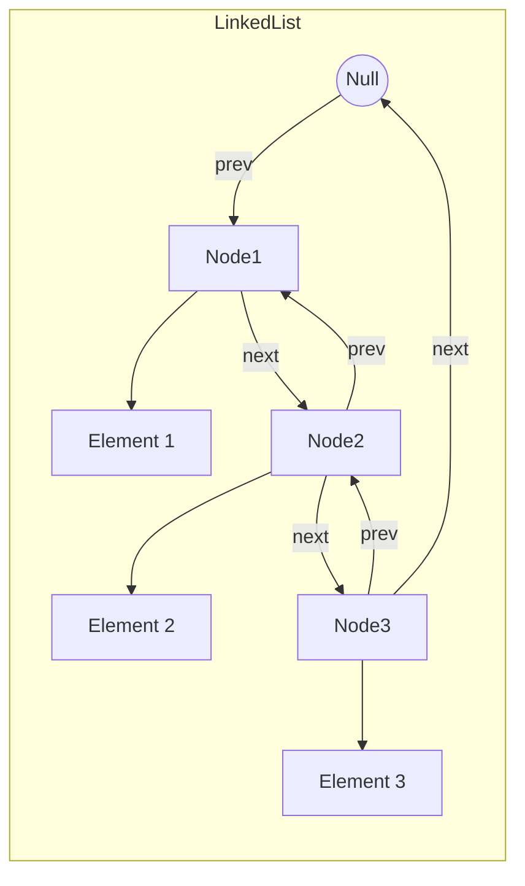

# Java LinkedList

## Introduction

The `LinkedList` class is a fundamental part of the Java Collections Framework that implements both the `List` and `Deque` interfaces. Unlike `ArrayList`, which is backed by a dynamic array, `LinkedList` is implemented as a doubly-linked list. Each element in a `LinkedList` maintains references to both the previous and next elements in the sequence, making it efficient for certain operations but less efficient for others.

In this tutorial, you'll learn:
- What a `LinkedList` is and how it works
- When to use `LinkedList` vs other collection types
- Core operations and their time complexity
- Practical examples and use cases
- Best practices when working with `LinkedList`

Let's dive into this versatile data structure!

## Understanding LinkedList

### What is a LinkedList?

A `LinkedList` in Java is a data structure that stores elements in a sequence of nodes. Each node contains:
- The actual element value
- A reference to the previous node
- A reference to the next node

This structure allows for efficient insertion and removal of elements from any position in the list.



### LinkedList vs ArrayList

Before diving deeper, let's compare `LinkedList` with its most common alternative, `ArrayList`:

| Operation                  | LinkedList                           | ArrayList            |
|----------------------------|--------------------------------------|----------------------|
| Access (get/set)           | O(n) - Linear time                   | O(1) - Constant time |
| Insert/Delete at beginning | O(1) - Constant time                 | O(n) - Linear time   |
| Insert/Delete at end       | O(1) - Constant time                 | O(1) amortized       |
| Insert/Delete in middle    | O(n) to find + O(1) to change        | O(n)                 |
| Memory overhead            | Higher (stores prev/next references) | Lower                |

## Getting Started with LinkedList

### Creating a LinkedList

Let's start with the basics - creating a `LinkedList`:

```java
import java.util.LinkedList;

// Create an empty LinkedList
LinkedList<String> names = new LinkedList<>();

// Create a LinkedList with initial elements
LinkedList<Integer> numbers = new LinkedList<>(List.of(1, 2, 3, 4, 5));
```

### Basic Operations

Here are some fundamental operations you can perform with a `LinkedList`:

```java
import java.util.LinkedList;

public class LinkedListBasics {
    public static void main(String[] args) {
        LinkedList<String> fruits = new LinkedList<>();
        
        // Adding elements
        fruits.add("Apple");            // Adds to the end
        fruits.add("Banana");
        fruits.addFirst("Mango");       // Adds to the beginning
        fruits.addLast("Orange");       // Adds to the end
        
        System.out.println("LinkedList: " + fruits);
        
        // Accessing elements
        String first = fruits.getFirst();
        String last = fruits.getLast();
        String middle = fruits.get(1);
        
        System.out.println("First: " + first);
        System.out.println("Last: " + last);
        System.out.println("Middle (index 1): " + middle);
        
        // Removing elements
        fruits.removeFirst();           // Removes from the beginning
        fruits.removeLast();            // Removes from the end
        fruits.remove(0);               // Removes by index
        
        System.out.println("After removal: " + fruits);
        
        // Size
        System.out.println("Size: " + fruits.size());
    }
}
```

**Output:**
```
LinkedList: [Mango, Apple, Banana, Orange]
First: Mango
Last: Orange
Middle (index 1): Apple
After removal: [Banana]
Size: 1
```

## Advanced LinkedList Operations

### Queue and Deque Operations

Since `LinkedList` implements the `Deque` interface, it can be used as a queue or a stack:

```java
import java.util.LinkedList;

public class LinkedListAsQueueAndStack {
    public static void main(String[] args) {
        LinkedList<String> list = new LinkedList<>();
        
        // Using as a Queue (First-In-First-Out)
        System.out.println("Using LinkedList as a Queue:");
        list.offer("Task 1");    // Add to the tail
        list.offer("Task 2");
        list.offer("Task 3");
        
        System.out.println(list);
        
        // Process queue
        while (!list.isEmpty()) {
            System.out.println("Processing: " + list.poll());  // Remove from head
        }
        
        // Using as a Stack (Last-In-First-Out)
        System.out.println("\nUsing LinkedList as a Stack:");
        list.push("Page 1");     // Add to the head
        list.push("Page 2");
        list.push("Page 3");
        
        System.out.println(list);
        
        // Process stack
        while (!list.isEmpty()) {
            System.out.println("Processing: " + list.pop());   // Remove from head
        }
    }
}
```

**Output:**
```
Using LinkedList as a Queue:
[Task 1, Task 2, Task 3]
Processing: Task 1
Processing: Task 2
Processing: Task 3

Using LinkedList as a Stack:
[Page 3, Page 2, Page 1]
Processing: Page 3
Processing: Page 2
Processing: Page 1
```

### Iterating Through a LinkedList

There are multiple ways to iterate through a `LinkedList`:

```java
import java.util.Iterator;
import java.util.LinkedList;
import java.util.ListIterator;

public class LinkedListIteration {
    public static void main(String[] args) {
        LinkedList<String> countries = new LinkedList<>();
        countries.add("USA");
        countries.add("India");
        countries.add("Japan");
        countries.add("Brazil");
        
        // Method 1: Enhanced for loop
        System.out.println("Using enhanced for loop:");
        for (String country : countries) {
            System.out.println(country);
        }
        
        // Method 2: Iterator
        System.out.println("\nUsing Iterator:");
        Iterator<String> iterator = countries.iterator();
        while (iterator.hasNext()) {
            System.out.println(iterator.next());
        }
        
        // Method 3: ListIterator (allows backward iteration too)
        System.out.println("\nUsing ListIterator (backwards):");
        ListIterator<String> listIterator = countries.listIterator(countries.size());
        while (listIterator.hasPrevious()) {
            System.out.println(listIterator.previous());
        }
        
        // Method 4: forEach with lambda (Java 8+)
        System.out.println("\nUsing forEach method:");
        countries.forEach(country -> System.out.println(country));
    }
}
```

**Output:**
```
Using enhanced for loop:
USA
India
Japan
Brazil

Using Iterator:
USA
India
Japan
Brazil

Using ListIterator (backwards):
Brazil
Japan
India
USA

Using forEach method:
USA
India
Japan
Brazil
```

## Practical Examples

### Example 1: Browser History Implementation

A common use case for `LinkedList` is implementing a browser history functionality:

```java
import java.util.LinkedList;

public class BrowserHistory {
    private LinkedList<String> history = new LinkedList<>();
    private int currentIndex = -1;
    
    public void visit(String url) {
        // Clear forward history when visiting a new page
        while (history.size() > currentIndex + 1) {
            history.removeLast();
        }
        
        history.add(url);
        currentIndex++;
        System.out.println("Visiting: " + url);
    }
    
    public void back() {
        if (currentIndex > 0) {
            currentIndex--;
            System.out.println("Going back to: " + history.get(currentIndex));
        } else {
            System.out.println("Cannot go back - at oldest page");
        }
    }
    
    public void forward() {
        if (currentIndex < history.size() - 1) {
            currentIndex++;
            System.out.println("Going forward to: " + history.get(currentIndex));
        } else {
            System.out.println("Cannot go forward - at newest page");
        }
    }
    
    public void showHistory() {
        System.out.println("\nBrowsing History:");
        for (int i = 0; i < history.size(); i++) {
            if (i == currentIndex) {
                System.out.println(i + ": " + history.get(i) + " (current)");
            } else {
                System.out.println(i + ": " + history.get(i));
            }
        }
        System.out.println();
    }
    
    public static void main(String[] args) {
        BrowserHistory browser = new BrowserHistory();
        
        browser.visit("www.google.com");
        browser.visit("www.wikipedia.org");
        browser.visit("www.github.com");
        
        browser.showHistory();
        
        browser.back();
        browser.back();
        browser.showHistory();
        
        browser.visit("www.stackoverflow.com");
        browser.showHistory();
        
        browser.forward();
    }
}
```

**Output:**
```
Visiting: www.google.com
Visiting: www.wikipedia.org
Visiting: www.github.com

Browsing History:
0: www.google.com
1: www.wikipedia.org
2: www.github.com (current)

Going back to: www.wikipedia.org
Going back to: www.google.com

Browsing History:
0: www.google.com (current)
1: www.wikipedia.org
2: www.github.com

Visiting: www.stackoverflow.com

Browsing History:
0: www.google.com
1: www.stackoverflow.com (current)

Cannot go forward - at newest page
```

### Example 2: Music Playlist Manager

Another practical example is a music playlist manager:

```java
import java.util.LinkedList;
import java.util.ListIterator;

public class MusicPlaylist {
    private LinkedList<String> playlist = new LinkedList<>();
    private ListIterator<String> iterator;
    private String currentSong;
    
    public MusicPlaylist() {
        iterator = playlist.listIterator();
    }
    
    public void addSong(String song) {
        playlist.add(song);
        System.out.println("Added: " + song);
    }
    
    public void start() {
        if (playlist.isEmpty()) {
            System.out.println("Playlist is empty!");
            return;
        }
        
        // Reset to beginning
        iterator = playlist.listIterator();
        if (iterator.hasNext()) {
            currentSong = iterator.next();
            System.out.println("Now playing: " + currentSong);
        }
    }
    
    public void nextSong() {
        if (iterator == null) {
            System.out.println("Playlist hasn't been started yet. Call start() first.");
            return;
        }
        
        if (iterator.hasNext()) {
            currentSong = iterator.next();
            System.out.println("Now playing: " + currentSong);
        } else {
            System.out.println("End of playlist reached.");
        }
    }
    
    public void previousSong() {
        if (iterator == null) {
            System.out.println("Playlist hasn't been started yet. Call start() first.");
            return;
        }
        
        // Go back twice because nextIndex points to the element after the current one
        if (iterator.hasPrevious()) {
            iterator.previous();
            if (iterator.hasPrevious()) {
                currentSong = iterator.previous();
                // Move forward one to maintain position
                iterator.next();
                System.out.println("Now playing: " + currentSong);
            } else {
                // At the beginning, just move forward to maintain position
                if (iterator.hasNext()) {
                    iterator.next();
                }
                System.out.println("Beginning of playlist reached.");
            }
        } else {
            System.out.println("Beginning of playlist reached.");
        }
    }
    
    public void showPlaylist() {
        System.out.println("\nPlaylist:");
        int index = 0;
        for (String song : playlist) {
            if (song.equals(currentSong)) {
                System.out.println(index + ": " + song + " ← PLAYING");
            } else {
                System.out.println(index + ": " + song);
            }
            index++;
        }
        System.out.println();
    }
    
    public static void main(String[] args) {
        MusicPlaylist player = new MusicPlaylist();
        
        player.addSong("Bohemian Rhapsody - Queen");
        player.addSong("Imagine - John Lennon");
        player.addSong("Shape of You - Ed Sheeran");
        player.addSong("Billie Jean - Michael Jackson");
        player.addSong("Hotel California - Eagles");
        
        player.start();
        player.showPlaylist();
        
        player.nextSong();
        player.nextSong();
        player.showPlaylist();
        
        player.previousSong();
        player.showPlaylist();
    }
}
```

**Output:**
```
Added: Bohemian Rhapsody - Queen
Added: Imagine - John Lennon
Added: Shape of You - Ed Sheeran
Added: Billie Jean - Michael Jackson
Added: Hotel California - Eagles
Now playing: Bohemian Rhapsody - Queen

Playlist:
0: Bohemian Rhapsody - Queen ← PLAYING
1: Imagine - John Lennon
2: Shape of You - Ed Sheeran
3: Billie Jean - Michael Jackson
4: Hotel California - Eagles

Now playing: Imagine - John Lennon
Now playing: Shape of You - Ed Sheeran

Playlist:
0: Bohemian Rhapsody - Queen
1: Imagine - John Lennon
2: Shape of You - Ed Sheeran ← PLAYING
3: Billie Jean - Michael Jackson
4: Hotel California - Eagles

Now playing: Imagine - John Lennon

Playlist:
0: Bohemian Rhapsody - Queen
1: Imagine - John Lennon ← PLAYING
2: Shape of You - Ed Sheeran
3: Billie Jean - Michael Jackson
4: Hotel California - Eagles
```

## Best Practices

When working with `LinkedList`, keep these tips in mind:

1. **Choose the right collection**: Use `LinkedList` when you need frequent insertions/deletions at both ends or in the middle, and don't need random access.

2. **Avoid random access**: Don't use `get(index)` frequently as it's an O(n) operation. Traverse using iterators instead.

3. **Use specialized methods**: Use the specialized methods like `addFirst()`, `addLast()`, `removeFirst()`, `removeLast()` instead of generic `add(index, element)` when applicable.

4. **Consider memory usage**: `LinkedList` uses more memory than `ArrayList` due to the overhead of storing node references.

5. **Be careful with large lists**: Due to its memory overhead and lack of locality of reference, a very large `LinkedList` can be less efficient than other collections.

## Summary

In this tutorial, you've learned:

- The structure and characteristics of Java's `LinkedList` implementation
- Basic operations like adding, accessing, and removing elements
- Advanced operations using queue and deque functionality
- Different ways to iterate through a `LinkedList`
- Real-world applications with practical examples
- Best practices for efficient use of `LinkedList`

`LinkedList` is a versatile data structure that's particularly useful when you need fast insertions and deletions at any position within a list. While it may not be as efficient as `ArrayList` for random access operations, its flexibility makes it an important tool in any Java programmer's toolkit.

## Additional Resources

- [Java Documentation for LinkedList](https://docs.oracle.com/en/java/javase/17/docs/api/java.base/java/util/LinkedList.html)
- [Deque Interface Documentation](https://docs.oracle.com/en/java/javase/17/docs/api/java.base/java/util/Deque.html)

## Practice Exercises

1. Implement a text editor's undo/redo functionality using `LinkedList`.
2. Create a simulation of a customer service queue using `LinkedList`.
3. Build a card game where players can draw and discard cards, using `LinkedList` for the deck and discard pile.
4. Implement a custom `LinkedList` using your own Node class to better understand how it works internally.
5. Create a program that removes duplicates from a `LinkedList` while maintaining the original order.