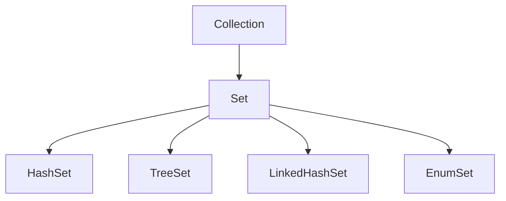

# Java Set Interface

## Introduction

The Set interface is one of the fundamental collection types in the Java Collections Framework. Unlike List, a Set is a collection that contains no duplicate elements. This interface models the mathematical set abstraction and is used when you want to eliminate duplicates from a collection.

In this tutorial, we'll explore the Set interface, its implementations, and common operations. You'll learn when to use Sets and how they can solve real-world programming problems.

## What is the Set Interface?

The Set interface extends the Collection interface and adds the constraint that duplicate elements are prohibited. In addition, most implementations of Set also add a stronger constraint that only one null element is permitted.

Here's where the Set interface fits in the Java Collections hierarchy:



## Key Characteristics of Sets

- **No duplicate elements**: Sets automatically reject duplicate elements
- **At most one null**: Most implementations allow at most one null element
- **No indexing**: Unlike Lists, Sets don't provide index-based access to elements
- **No guaranteed order**: Some implementations like HashSet don't guarantee the order of elements

## Common Set Implementations

### HashSet

HashSet is the most commonly used Set implementation. It uses a hash table for storage, which gives excellent performance for add, remove, and contains operations (constant time on average).

```java
import java.util.HashSet;
import java.util.Set;

public class HashSetExample {
    public static void main(String[] args) {
        // Creating a HashSet
        Set<String> fruits = new HashSet<>();
        
        // Adding elements
        fruits.add("Apple");
        fruits.add("Banana");
        fruits.add("Orange");
        fruits.add("Apple"); // Duplicate - will not be added
        
        System.out.println("HashSet contents: " + fruits);
        System.out.println("Size of HashSet: " + fruits.size());
        System.out.println("Contains Orange? " + fruits.contains("Orange"));
    }
}
```

Output:
```
HashSet contents: [Apple, Orange, Banana]
Size of HashSet: 3
Contains Orange? true
```

Note that the order of elements is not guaranteed in a HashSet.

### TreeSet

TreeSet stores elements in a sorted order (natural ordering or by a Comparator). It's backed by a TreeMap, which is a Red-Black tree implementation.

```java
import java.util.Set;
import java.util.TreeSet;

public class TreeSetExample {
    public static void main(String[] args) {
        // Creating a TreeSet
        Set<String> sortedFruits = new TreeSet<>();
        
        // Adding elements
        sortedFruits.add("Orange");
        sortedFruits.add("Apple");
        sortedFruits.add("Banana");
        sortedFruits.add("Mango");
        
        System.out.println("TreeSet contents (sorted): " + sortedFruits);
        
        // Using a TreeSet with integers
        Set<Integer> numbers = new TreeSet<>();
        numbers.add(10);
        numbers.add(5);
        numbers.add(25);
        numbers.add(15);
        
        System.out.println("TreeSet of numbers: " + numbers);
    }
}
```

Output:
```
TreeSet contents (sorted): [Apple, Banana, Mango, Orange]
TreeSet of numbers: [5, 10, 15, 25]
```

### LinkedHashSet

LinkedHashSet maintains insertion order while still providing the no-duplicates property of Sets. It's implemented as a hash table with a linked list running through it.

```java
import java.util.LinkedHashSet;
import java.util.Set;

public class LinkedHashSetExample {
    public static void main(String[] args) {
        // Creating a LinkedHashSet
        Set<String> orderedFruits = new LinkedHashSet<>();
        
        // Adding elements
        orderedFruits.add("Orange");
        orderedFruits.add("Apple");
        orderedFruits.add("Banana");
        orderedFruits.add("Mango");
        
        System.out.println("LinkedHashSet contents (maintains insertion order): " + orderedFruits);
        
        // Removing an element
        orderedFruits.remove("Apple");
        System.out.println("After removing Apple: " + orderedFruits);
    }
}
```

Output:
```
LinkedHashSet contents (maintains insertion order): [Orange, Apple, Banana, Mango]
After removing Apple: [Orange, Banana, Mango]
```

## Common Set Operations

The Set interface provides several methods that are particularly useful for set operations:

### Basic Operations

```java
import java.util.HashSet;
import java.util.Set;

public class SetOperationsExample {
    public static void main(String[] args) {
        // Create a set
        Set<String> colors = new HashSet<>();
        
        // Adding elements
        colors.add("Red");
        colors.add("Green");
        colors.add("Blue");
        
        // Check if element exists
        System.out.println("Contains Green? " + colors.contains("Green"));
        
        // Remove an element
        colors.remove("Green");
        System.out.println("After removing Green: " + colors);
        
        // Size of the set
        System.out.println("Size: " + colors.size());
        
        // Iterating through the set
        System.out.println("Colors in the set:");
        for (String color : colors) {
            System.out.println("- " + color);
        }
        
        // Check if empty
        System.out.println("Is the set empty? " + colors.isEmpty());
        
        // Clear the set
        colors.clear();
        System.out.println("After clearing, size: " + colors.size());
    }
}
```

Output:
```
Contains Green? true
After removing Green: [Red, Blue]
Size: 2
Colors in the set:
- Red
- Blue
Is the set empty? false
After clearing, size: 0
```

### Mathematical Set Operations

Sets in Java can perform common mathematical set operations like union, intersection, difference, and subset checking:

```java
import java.util.HashSet;
import java.util.Set;

public class MathSetOperationsExample {
    public static void main(String[] args) {
        // Create two sets
        Set<Integer> set1 = new HashSet<>();
        set1.add(1);
        set1.add(2);
        set1.add(3);
        set1.add(4);
        
        Set<Integer> set2 = new HashSet<>();
        set2.add(3);
        set2.add(4);
        set2.add(5);
        set2.add(6);
        
        System.out.println("Set 1: " + set1);
        System.out.println("Set 2: " + set2);
        
        // Union (addAll)
        Set<Integer> union = new HashSet<>(set1);
        union.addAll(set2);
        System.out.println("Union: " + union);
        
        // Intersection (retainAll)
        Set<Integer> intersection = new HashSet<>(set1);
        intersection.retainAll(set2);
        System.out.println("Intersection: " + intersection);
        
        // Difference (removeAll) - elements in set1 but not in set2
        Set<Integer> difference = new HashSet<>(set1);
        difference.removeAll(set2);
        System.out.println("Difference (set1 - set2): " + difference);
        
        // Symmetric difference (elements in either set1 or set2, but not in both)
        Set<Integer> symmetricDifference = new HashSet<>(union);
        symmetricDifference.removeAll(intersection);
        System.out.println("Symmetric difference: " + symmetricDifference);
        
        // Check if set2 is a subset of union
        System.out.println("Is set2 a subset of union? " + union.containsAll(set2));
    }
}
```

Output:
```
Set 1: [1, 2, 3, 4]
Set 2: [3, 4, 5, 6]
Union: [1, 2, 3, 4, 5, 6]
Intersection: [3, 4]
Difference (set1 - set2): [1, 2]
Symmetric difference: [1, 2, 5, 6]
Is set2 a subset of union? true
```

## When to Use Different Set Implementations

Here's a guide to help you choose the right Set implementation for your needs:

| Implementation | Order | Performance | Null Elements | Use When |
|----------------|-------|-------------|--------------|----------|
| HashSet | No guaranteed order | O(1) for basic operations | Allows one null | You need fast lookup and don't care about order |
| TreeSet | Sorted order | O(log n) for basic operations | No null elements if using natural ordering | You need elements in sorted order |
| LinkedHashSet | Insertion order | O(1) for basic operations | Allows one null | You need fast access and insertion order matters |
| EnumSet | Natural enum order | Very fast operations | No nulls | Working with enum values |

## Real-World Applications

### 1. Removing Duplicates from a Collection

One of the most common uses of a Set is to remove duplicate elements from a list:

```java
import java.util.Arrays;
import java.util.HashSet;
import java.util.List;
import java.util.Set;

public class DuplicateRemovalExample {
    public static void main(String[] args) {
        // List with duplicate elements
        List<String> usernames = Arrays.asList("john", "mary", "john", "alice", "bob", "mary");
        System.out.println("Original list: " + usernames);
        
        // Remove duplicates using HashSet
        Set<String> uniqueUsernames = new HashSet<>(usernames);
        System.out.println("Unique usernames: " + uniqueUsernames);
        
        // If you need a list back with unique elements
        List<String> uniqueUsernamesList = List.copyOf(uniqueUsernames);
        System.out.println("Unique usernames list: " + uniqueUsernamesList);
    }
}
```

Output:
```
Original list: [john, mary, john, alice, bob, mary]
Unique usernames: [bob, john, mary, alice]
Unique usernames list: [bob, john, mary, alice]
```

### 2. Finding Common Elements

Sets are perfect for finding common elements between collections:

```java
import java.util.HashSet;
import java.util.Set;

public class CommonElementsExample {
    public static void main(String[] args) {
        // Two groups of students enrolled in different courses
        Set<String> javaCourse = new HashSet<>();
        javaCourse.add("Alice");
        javaCourse.add("Bob");
        javaCourse.add("Charlie");
        javaCourse.add("Diana");
        
        Set<String> pythonCourse = new HashSet<>();
        pythonCourse.add("Bob");
        pythonCourse.add("Diana");
        pythonCourse.add("Edward");
        pythonCourse.add("Fiona");
        
        // Students enrolled in both courses
        Set<String> studentsInBothCourses = new HashSet<>(javaCourse);
        studentsInBothCourses.retainAll(pythonCourse);
        
        System.out.println("Java students: " + javaCourse);
        System.out.println("Python students: " + pythonCourse);
        System.out.println("Students in both courses: " + studentsInBothCourses);
        
        // Students in either course (union)
        Set<String> allStudents = new HashSet<>(javaCourse);
        allStudents.addAll(pythonCourse);
        System.out.println("All students: " + allStudents);
    }
}
```

Output:
```
Java students: [Alice, Bob, Charlie, Diana]
Python students: [Bob, Diana, Edward, Fiona]
Students in both courses: [Bob, Diana]
All students: [Alice, Bob, Charlie, Diana, Edward, Fiona]
```

### 3. Using Set for Filtering Unique Words from Text

```java
import java.util.Arrays;
import java.util.Set;
import java.util.TreeSet;

public class UniqueWordsExample {
    public static void main(String[] args) {
        String text = "To be or not to be that is the question Whether tis nobler in the mind to suffer";
        
        // Convert to lowercase and split by whitespace
        String[] words = text.toLowerCase().split("\\s+");
        System.out.println("Total words: " + words.length);
        
        // Get unique words in alphabetical order
        Set<String> uniqueWords = new TreeSet<>(Arrays.asList(words));
        System.out.println("Unique words: " + uniqueWords);
        System.out.println("Unique word count: " + uniqueWords.size());
    }
}
```

Output:
```
Total words: 16
Unique words: [be, in, is, mind, nobler, not, or, question, suffer, that, the, tis, to, whether]
Unique word count: 14
```

## Best Practices for Using Sets

1. **Choose the right implementation**: Select HashSet for general purposes, TreeSet for sorted sets, and LinkedHashSet when you need to maintain insertion order.

2. **Use generics**: Always use generics with sets to ensure type safety.

3. **Consider immutability**: For thread safety and better design, consider using immutable sets when appropriate:
   ```java
   Set<String> immutableSet = Set.of("One", "Two", "Three");
   ```

4. **Override equals() and hashCode()**: When using custom objects in a Set, make sure to properly override the equals() and hashCode() methods to ensure correct behavior.

5. **Be careful with mutable elements**: If Set elements are mutable and changed after being added to the Set, you might not be able to find or remove them correctly.

## Custom Objects in Sets

When adding custom objects to a Set, you need to properly implement equals() and hashCode() methods:

```java
import java.util.HashSet;
import java.util.Objects;
import java.util.Set;

public class CustomObjectSetExample {
    public static void main(String[] args) {
        // Create a set of Person objects
        Set<Person> people = new HashSet<>();
        
        // Add people to the set
        people.add(new Person("John", "Doe", 30));
        people.add(new Person("Jane", "Smith", 25));
        people.add(new Person("John", "Doe", 30)); // Same as first person
        people.add(new Person("Bob", "Johnson", 40));
        
        System.out.println("Set size: " + people.size());
        System.out.println("People in the set:");
        for (Person person : people) {
            System.out.println(person);
        }
    }
    
    static class Person {
        private String firstName;
        private String lastName;
        private int age;
        
        public Person(String firstName, String lastName, int age) {
            this.firstName = firstName;
            this.lastName = lastName;
            this.age = age;
        }
        
        @Override
        public boolean equals(Object o) {
            if (this == o) return true;
            if (o == null || getClass() != o.getClass()) return false;
            Person person = (Person) o;
            return age == person.age && 
                   Objects.equals(firstName, person.firstName) && 
                   Objects.equals(lastName, person.lastName);
        }
        
        @Override
        public int hashCode() {
            return Objects.hash(firstName, lastName, age);
        }
        
        @Override
        public String toString() {
            return firstName + " " + lastName + ", " + age;
        }
    }
}
```

Output:
```
Set size: 3
People in the set:
John Doe, 30
Bob Johnson, 40
Jane Smith, 25
```

## Performance Comparison

Here's a quick performance comparison of the main Set implementations:

| Operation | HashSet | TreeSet | LinkedHashSet |
|-----------|---------|---------|---------------|
| add()     | O(1)    | O(log n)| O(1)          |
| contains()| O(1)    | O(log n)| O(1)          |
| remove()  | O(1)    | O(log n)| O(1)          |
| Iteration | O(n)    | O(n)    | O(n)          |
| Order     | None    | Sorted  | Insertion     |

## Summary

The Set interface in Java provides a powerful way to work with collections of unique elements. In this tutorial, we've covered:

- The basics of the Set interface and its place in the Java Collections Framework
- Key implementations: HashSet, TreeSet, and LinkedHashSet
- How to perform common operations like adding, removing, and checking for elements
- Mathematical set operations like union, intersection, and difference
- Real-world applications and best practices
- Using custom objects in Sets

The ability to ensure uniqueness and perform set operations makes the Set interface incredibly useful for many programming tasks. Depending on your specific requirements for ordering, performance, and functionality, you can choose the Set implementation that best fits your needs.

## Exercises

1. Create a program that reads a text file and counts the number of unique words.
2. Implement a method that takes two Lists as parameters and returns a Set containing elements that appear in either list but not both.
3. Write a program that uses a TreeSet to automatically sort and remove duplicates from user input.
4. Create a custom class representing a Student with fields for id, name, and grade. Use this class in a HashSet and ensure duplicate students (same id) are not added.
5. Implement the Sieve of Eratosthenes algorithm for finding prime numbers using a Set.

## Additional Resources

- [Java Documentation: Set Interface](https://docs.oracle.com/en/java/javase/11/docs/api/java.base/java/util/Set.html)
- [Java Documentation: HashSet Class](https://docs.oracle.com/en/java/javase/11/docs/api/java.base/java/util/HashSet.html)
- [Java Documentation: TreeSet Class](https://docs.oracle.com/en/java/javase/11/docs/api/java.base/java/util/TreeSet.html)
- [Java Documentation: LinkedHashSet Class](https://docs.oracle.com/en/java/javase/11/docs/api/java.base/java/util/LinkedHashSet.html)