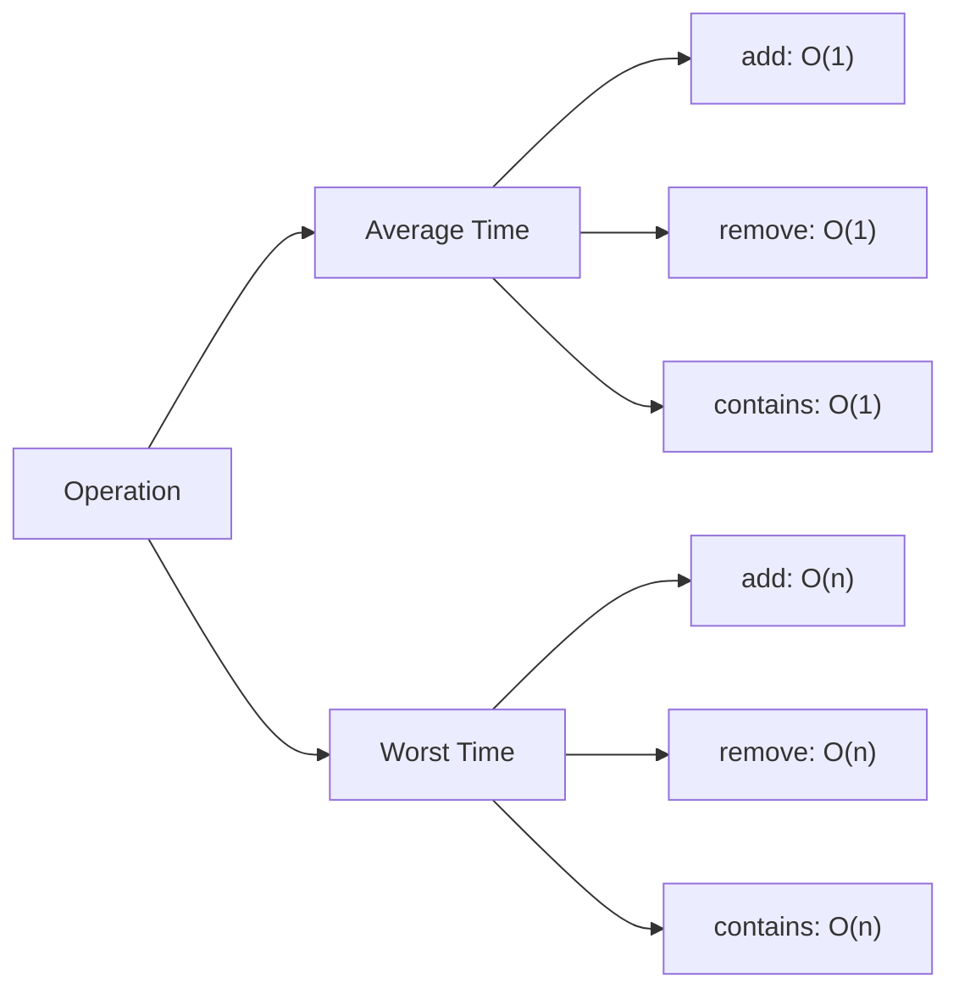
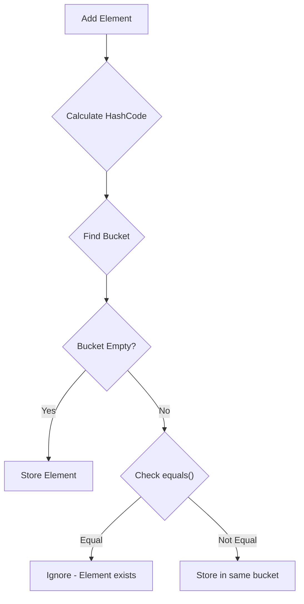

# Java HashSet

## Introduction

HashSet is one of the most commonly used implementations of the Set interface in Java's Collections Framework. Unlike lists that maintain elements in a specific order and allow duplicates, HashSet is an unordered collection that contains no duplicate elements. This makes HashSet particularly efficient for membership testing - checking whether a specific element exists in the collection.

HashSet is built on top of HashMap, another key component of the Collections Framework. It stores elements by using a mechanism called hashing, which allows it to provide constant-time performance for basic operations (add, remove, contains) in most cases.

## HashSet Fundamentals

### Key Properties of HashSet

- **No Duplicate Elements**: HashSet doesn't allow duplicate values. If you try to add an element that already exists, the add operation will return false and the set remains unchanged.
- **Unordered Collection**: Elements in a HashSet are not stored in any particular order. The iteration order may change over time.
- **Null Elements**: HashSet allows one null element.
- **Not Thread-Safe**: HashSet is not synchronized by default.

### Creating a HashSet

There are multiple ways to create a HashSet:

```java
// Default constructor
HashSet<String> fruits = new HashSet<>();

// Constructor with initial capacity
HashSet<Integer> numbers = new HashSet<>(20);

// Constructor with initial capacity and load factor
HashSet<Double> prices = new HashSet<>(50, 0.75f);

// Creating HashSet from another collection
ArrayList<String> fruitList = new ArrayList<>();
fruitList.add("Apple");
fruitList.add("Banana");
HashSet<String> fruitSet = new HashSet<>(fruitList);
```

## Basic Operations

### Adding Elements

```java
HashSet<String> programmingLanguages = new HashSet<>();

// Adding elements to HashSet
programmingLanguages.add("Java");
programmingLanguages.add("Python");
programmingLanguages.add("JavaScript");
programmingLanguages.add("C++");
programmingLanguages.add("Java"); // Attempting to add a duplicate

System.out.println("HashSet after adding elements: " + programmingLanguages);
```

**Output:**
```
HashSet after adding elements: [Java, C++, Python, JavaScript]
```

Note that:
1. The duplicate "Java" was not added to the set
2. The order of elements is not guaranteed to be the same as insertion order

### Removing Elements

```java
HashSet<String> programmingLanguages = new HashSet<>();
programmingLanguages.add("Java");
programmingLanguages.add("Python");
programmingLanguages.add("JavaScript");
programmingLanguages.add("C++");

// Removing elements
boolean removed = programmingLanguages.remove("Python");
System.out.println("Was Python removed? " + removed);
System.out.println("HashSet after removal: " + programmingLanguages);

// Trying to remove an element that doesn't exist
removed = programmingLanguages.remove("Ruby");
System.out.println("Was Ruby removed? " + removed);
```

**Output:**
```
Was Python removed? true
HashSet after removal: [Java, C++, JavaScript]
Was Ruby removed? false
```

### Checking if Elements Exist

```java
HashSet<String> programmingLanguages = new HashSet<>();
programmingLanguages.add("Java");
programmingLanguages.add("Python");
programmingLanguages.add("JavaScript");

// Check if an element exists
boolean containsJava = programmingLanguages.contains("Java");
boolean containsRuby = programmingLanguages.contains("Ruby");

System.out.println("Contains Java? " + containsJava);
System.out.println("Contains Ruby? " + containsRuby);
```

**Output:**
```
Contains Java? true
Contains Ruby? false
```

### Size and Clear Operations

```java
HashSet<String> programmingLanguages = new HashSet<>();
programmingLanguages.add("Java");
programmingLanguages.add("Python");
programmingLanguages.add("JavaScript");

// Get the size of the HashSet
int size = programmingLanguages.size();
System.out.println("Size of HashSet: " + size);

// Check if HashSet is empty
boolean isEmpty = programmingLanguages.isEmpty();
System.out.println("Is HashSet empty? " + isEmpty);

// Clear all elements
programmingLanguages.clear();
System.out.println("HashSet after clear: " + programmingLanguages);
System.out.println("Is HashSet empty now? " + programmingLanguages.isEmpty());
```

**Output:**
```
Size of HashSet: 3
Is HashSet empty? false
HashSet after clear: []
Is HashSet empty now? true
```

## Iterating Through a HashSet

There are multiple ways to iterate through a HashSet:

### Using Enhanced for Loop

```java
HashSet<String> colors = new HashSet<>();
colors.add("Red");
colors.add("Green");
colors.add("Blue");
colors.add("Yellow");

// Enhanced for loop
System.out.println("Iterating using enhanced for loop:");
for (String color : colors) {
    System.out.println(color);
}
```

### Using Iterator

```java
HashSet<String> colors = new HashSet<>();
colors.add("Red");
colors.add("Green");
colors.add("Blue");
colors.add("Yellow");

// Using Iterator
System.out.println("\nIterating using Iterator:");
Iterator<String> iterator = colors.iterator();
while (iterator.hasNext()) {
    String color = iterator.next();
    System.out.println(color);
    
    // We can also remove elements while iterating
    if (color.equals("Green")) {
        iterator.remove(); // Safe way to remove during iteration
    }
}
System.out.println("HashSet after removal: " + colors);
```

### Using forEach Method (Java 8+)

```java
HashSet<String> colors = new HashSet<>();
colors.add("Red");
colors.add("Green");
colors.add("Blue");
colors.add("Yellow");

// Using forEach method (Java 8+)
System.out.println("\nIterating using forEach method:");
colors.forEach(color -> System.out.println(color));
```

## HashSet Performance

HashSet provides constant-time O(1) performance for basic operations (add, remove, contains, size) in most scenarios, making it highly efficient for membership testing.



The worst-case scenario occurs when there are many hash collisions, which can happen if:
1. The hash function produces many duplicate hash codes
2. The HashSet becomes very large and approaches its capacity
3. Objects in the set have poor hashCode() implementations

## Practical Examples

### Example 1: Removing Duplicates from a List

One of the most common applications of HashSet is to remove duplicates from a collection.

```java
import java.util.*;

public class DuplicateRemover {
    public static void main(String[] args) {
        // List with duplicate elements
        List<Integer> numbersWithDuplicates = Arrays.asList(1, 2, 3, 2, 1, 4, 5, 4, 6);
        System.out.println("Original list: " + numbersWithDuplicates);
        
        // Convert to HashSet to remove duplicates
        HashSet<Integer> uniqueNumbers = new HashSet<>(numbersWithDuplicates);
        System.out.println("After removing duplicates: " + uniqueNumbers);
        
        // If you need a List back
        List<Integer> uniqueNumbersList = new ArrayList<>(uniqueNumbers);
        System.out.println("Back to list: " + uniqueNumbersList);
    }
}
```

**Output:**
```
Original list: [1, 2, 3, 2, 1, 4, 5, 4, 6]
After removing duplicates: [1, 2, 3, 4, 5, 6]
Back to list: [1, 2, 3, 4, 5, 6]
```

### Example 2: Finding Common Elements (Intersection)

HashSet can be used to find common elements between collections:

```java
import java.util.*;

public class SetOperations {
    public static void main(String[] args) {
        // Create first set
        HashSet<String> set1 = new HashSet<>();
        set1.add("Apple");
        set1.add("Banana");
        set1.add("Cherry");
        set1.add("Date");
        
        // Create second set
        HashSet<String> set2 = new HashSet<>();
        set2.add("Apple");
        set2.add("Cherry");
        set2.add("Grape");
        set2.add("Kiwi");
        
        System.out.println("Set 1: " + set1);
        System.out.println("Set 2: " + set2);
        
        // Find intersection (common elements)
        HashSet<String> intersection = new HashSet<>(set1);
        intersection.retainAll(set2);
        System.out.println("Intersection: " + intersection);
        
        // Find union
        HashSet<String> union = new HashSet<>(set1);
        union.addAll(set2);
        System.out.println("Union: " + union);
        
        // Find difference (elements in set1 but not in set2)
        HashSet<String> difference = new HashSet<>(set1);
        difference.removeAll(set2);
        System.out.println("Difference (set1 - set2): " + difference);
    }
}
```

**Output:**
```
Set 1: [Apple, Cherry, Date, Banana]
Set 2: [Apple, Cherry, Kiwi, Grape]
Intersection: [Apple, Cherry]
Union: [Apple, Cherry, Date, Kiwi, Banana, Grape]
Difference (set1 - set2): [Date, Banana]
```

### Example 3: Word Frequency Counter

This example demonstrates how to count unique words in a text:

```java
import java.util.*;

public class UniqueWordCounter {
    public static void main(String[] args) {
        String text = "to be or not to be that is the question whether "
                + "tis nobler in the mind to suffer the slings and arrows "
                + "of outrageous fortune or to take arms against a sea of troubles";
        
        // Split the text into words
        String[] words = text.toLowerCase().split(" ");
        
        // Store unique words in a HashSet
        HashSet<String> uniqueWords = new HashSet<>(Arrays.asList(words));
        
        System.out.println("Original text has " + words.length + " words");
        System.out.println("Number of unique words: " + uniqueWords.size());
        System.out.println("Unique words: " + uniqueWords);
    }
}
```

**Output:**
```
Original text has 29 words
Number of unique words: 23
Unique words: [a, against, take, arrows, that, of, is, sea, slings, outrageous, to, or, fortune, whether, troubles, and, arms, suffer, tis, question, the, nobler, mind, in, be, not]
```

## Understanding How HashSet Works Internally

HashSet is backed by a HashMap instance. When you add an element to a HashSet:

1. The element's `hashCode()` method is called to determine where to store it
2. The hash code is used to map the element to a specific "bucket" (array position)
3. If there's already an element with the same hash in that bucket:
   - The `equals()` method compares the elements
   - If they're equal, the new element isn't added (preventing duplicates)
   - If they're different, both elements are stored in the same bucket (a collision)



This is why:
- Objects added to HashSet must have appropriate `equals()` and `hashCode()` implementations
- Modifying mutable objects after adding them to a HashSet can lead to unexpected behavior

## Best Practices and Common Pitfalls

### Best Practices

1. **Choose the right initial capacity**: If you know the approximate number of elements, initialize the HashSet with appropriate capacity to avoid resizing.

2. **Override equals() and hashCode()**: When creating custom classes to be stored in HashSet, always properly implement these methods.

```java
public class Person {
    private String name;
    private int age;
    
    // Constructor, getters, setters...
    
    @Override
    public boolean equals(Object o) {
        if (this == o) return true;
        if (o == null || getClass() != o.getClass()) return false;
        Person person = (Person) o;
        return age == person.age && Objects.equals(name, person.name);
    }
    
    @Override
    public int hashCode() {
        return Objects.hash(name, age);
    }
}
```

3. **Use LinkedHashSet for ordered elements**: If you need to maintain insertion order, use LinkedHashSet instead of HashSet.

### Common Pitfalls

1. **Modifying elements after insertion**: HashSet relies on hash codes not changing. If you modify an object after adding it to a HashSet, the HashSet may not be able to find it again.

```java
HashSet<StringBuilder> builders = new HashSet<>();
StringBuilder sb = new StringBuilder("Hello");
builders.add(sb);

// Modifying the object after adding it
sb.append(" World");

// The contains check may fail even though the object reference is in the set!
System.out.println(builders.contains(sb)); // May return false
```

2. **Using mutable objects as keys**: For similar reasons, avoid using mutable objects in HashSets unless you're careful not to modify them after insertion.

3. **Not checking if add() was successful**: The add() method returns a boolean indicating whether the element was actually added.

```java
HashSet<String> names = new HashSet<>();
boolean wasAdded = names.add("John");
// Always check the return value if you need to know if the element was added
if (!wasAdded) {
    System.out.println("John was already in the set!");
}
```

## HashSet vs. Other Collections

When should you use HashSet instead of other collections?

| Collection    | When to Use                                                                         |
|---------------|-------------------------------------------------------------------------------------|
| HashSet       | • Need to store unique elements • Fast lookups are important • Order doesn't matter |
| LinkedHashSet | • Need unique elements with insertion order preserved                               |
| TreeSet       | • Need unique elements sorted in natural order or by comparator                     |
| ArrayList     | • Duplicates are allowed • Index-based access is needed • Order matters             |
| HashMap       | • Need to store key-value pairs                                                     |

## Summary

HashSet is a powerful implementation of the Set interface that provides efficient storage and retrieval of unique elements. Its key features include:

- O(1) time complexity for basic operations in average case
- No duplicate elements
- Unordered collection
- Support for null elements
- Built on HashMap under the hood

HashSet is ideal when you need to:
- Check if an element exists in a collection
- Eliminate duplicates from data
- Perform set operations like union, intersection, and difference

Remember that elements in a HashSet should have well-implemented equals() and hashCode() methods, especially when using custom classes.

## Exercises

1. Create a HashSet of your favorite movies. Try adding a duplicate and verify that it isn't added.

2. Write a program that finds all words that appear in both of two different text files using HashSet.

3. Implement a simple spelling checker that compares words in a text against words in a dictionary (stored in a HashSet).

4. Create a custom class Student with name and ID fields. Make sure to override equals() and hashCode(). Create a HashSet of Student objects and demonstrate that duplicates are correctly identified.

5. Use a HashSet to find and print all unique characters in a string.

## Additional Resources

- [Java HashSet Documentation](https://docs.oracle.com/en/java/javase/17/docs/api/java.base/java/util/HashSet.html)
- [Java Collections Framework Overview](https://docs.oracle.com/javase/tutorial/collections/intro/index.html)
- [Effective Java by Joshua Bloch](https://www.oreilly.com/library/view/effective-java-3rd/9780134686097/) - Contains excellent discussions on hash-based collections