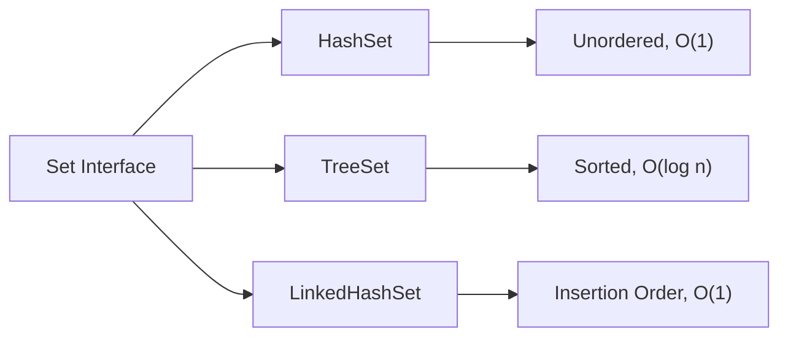

# Java TreeSet

## Introduction

Java `TreeSet` is an important implementation of the `NavigableSet` interface in the Java Collections Framework. Unlike `HashSet` which stores elements in an unpredictable order, `TreeSet` keeps all elements in a sorted order, making it ideal for scenarios where you need to maintain elements in a specific sequence.

`TreeSet` uses a self-balancing binary search tree (specifically a Red-Black tree) for storage, ensuring that basic operations like `add`, `remove`, and `contains` are performed in logarithmic time (O(log n)).

## TreeSet Basics

### Key Characteristics

- **Ordered Collection**: Elements are stored in sorted order (natural ordering or custom comparator)
- **No Duplicates**: Like all Set implementations, TreeSet doesn't allow duplicate elements
- **Not Synchronized**: Not thread-safe by default
- **Performance**: O(log n) time complexity for most operations
- **Null Handling**: Doesn't allow null elements (throws NullPointerException)

### Creating a TreeSet

Let's start by exploring different ways to create a TreeSet:

```java
// Creating an empty TreeSet with natural ordering
TreeSet<String> fruits = new TreeSet<>();

// Creating a TreeSet from another collection
ArrayList<String> fruitsList = new ArrayList<>();
fruitsList.add("Apple");
fruitsList.add("Banana");
fruitsList.add("Orange");
TreeSet<String> fruitsFromList = new TreeSet<>(fruitsList);

// Creating a TreeSet with a custom comparator (descending order)
TreeSet<String> fruitsDescending = new TreeSet<>(Comparator.reverseOrder());

// Creating a TreeSet with a custom comparator (case-insensitive)
TreeSet<String> fruitsCaseInsensitive = new TreeSet<>(String.CASE_INSENSITIVE_ORDER);
```

## Basic Operations

Let's explore the common operations you can perform with TreeSet:

### Adding Elements

```java
TreeSet<String> fruits = new TreeSet<>();

// Adding elements
fruits.add("Apple");
fruits.add("Banana");
fruits.add("Cherry");
fruits.add("Date");
fruits.add("Elderberry");

System.out.println("TreeSet after adding elements: " + fruits);
```

**Output:**
```
TreeSet after adding elements: [Apple, Banana, Cherry, Date, Elderberry]
```

Notice how the elements are automatically stored in their natural sorting order (alphabetical for strings).

### Removing Elements

```java
TreeSet<String> fruits = new TreeSet<>();
fruits.add("Apple");
fruits.add("Banana");
fruits.add("Cherry");
fruits.add("Date");

// Removing an element
fruits.remove("Banana");
System.out.println("After removing 'Banana': " + fruits);

// Removing the first element
String first = fruits.pollFirst();
System.out.println("Removed first element: " + first);
System.out.println("After pollFirst: " + fruits);

// Removing the last element
String last = fruits.pollLast();
System.out.println("Removed last element: " + last);
System.out.println("After pollLast: " + fruits);
```

**Output:**
```
After removing 'Banana': [Apple, Cherry, Date]
Removed first element: Apple
After pollFirst: [Cherry, Date]
Removed last element: Date
After pollLast: [Cherry]
```

### Checking for Elements

```java
TreeSet<String> fruits = new TreeSet<>();
fruits.add("Apple");
fruits.add("Banana");
fruits.add("Cherry");

// Check if the set contains an element
System.out.println("Contains Apple? " + fruits.contains("Apple"));
System.out.println("Contains Mango? " + fruits.contains("Mango"));

// Check first and last elements
System.out.println("First element: " + fruits.first());
System.out.println("Last element: " + fruits.last());

// Check size
System.out.println("Size of TreeSet: " + fruits.size());

// Check if empty
System.out.println("Is the TreeSet empty? " + fruits.isEmpty());
```

**Output:**
```
Contains Apple? true
Contains Mango? false
First element: Apple
Last element: Cherry
Size of TreeSet: 3
Is the TreeSet empty? false
```

## Navigation Methods

One of TreeSet's key advantages is its navigation capabilities. It provides methods to find elements relative to others:

```java
TreeSet<Integer> numbers = new TreeSet<>();
numbers.add(10);
numbers.add(20);
numbers.add(30);
numbers.add(40);
numbers.add(50);

// Finding elements
System.out.println("Lower than 25: " + numbers.lower(25));     // Greatest element < 25
System.out.println("Floor of 30: " + numbers.floor(30));       // Greatest element ≤ 30
System.out.println("Ceiling of 25: " + numbers.ceiling(25));   // Smallest element ≥ 25
System.out.println("Higher than 40: " + numbers.higher(40));   // Smallest element > 40

// Subset operations
System.out.println("Subset [20, 40]: " + numbers.subSet(20, 50));
System.out.println("Subset [20, 50] inclusive: " + numbers.subSet(20, true, 50, true));
System.out.println("Head set < 30: " + numbers.headSet(30));
System.out.println("Head set ≤ 30: " + numbers.headSet(30, true));
System.out.println("Tail set ≥ 30: " + numbers.tailSet(30));
```

**Output:**
```
Lower than 25: 20
Floor of 30: 30
Ceiling of 25: 30
Higher than 40: 50
Subset [20, 40]: [20, 30, 40]
Subset [20, 50] inclusive: [20, 30, 40, 50]
Head set < 30: [10, 20]
Head set ≤ 30: [10, 20, 30]
Tail set ≥ 30: [30, 40, 50]
```

## Iterating Over a TreeSet

You can traverse a TreeSet in several ways:

```java
TreeSet<String> colors = new TreeSet<>();
colors.add("Red");
colors.add("Green");
colors.add("Blue");
colors.add("Yellow");
colors.add("Orange");

// Method 1: Enhanced for loop
System.out.println("Using enhanced for loop:");
for (String color : colors) {
    System.out.println(color);
}

// Method 2: Iterator
System.out.println("\nUsing iterator:");
Iterator<String> iterator = colors.iterator();
while (iterator.hasNext()) {
    System.out.println(iterator.next());
}

// Method 3: Descending iterator
System.out.println("\nUsing descending iterator:");
Iterator<String> descendingIterator = colors.descendingIterator();
while (descendingIterator.hasNext()) {
    System.out.println(descendingIterator.next());
}

// Method 4: Descending set
System.out.println("\nUsing descending set:");
NavigableSet<String> descendingSet = colors.descendingSet();
for (String color : descendingSet) {
    System.out.println(color);
}
```

**Output:**
```
Using enhanced for loop:
Blue
Green
Orange
Red
Yellow

Using iterator:
Blue
Green
Orange
Red
Yellow

Using descending iterator:
Yellow
Red
Orange
Green
Blue

Using descending set:
Yellow
Red
Orange
Green
Blue
```

## Custom Ordering with TreeSet

By default, TreeSet uses the natural ordering of elements. For strings, this means alphabetical order, and for numbers, numerical order. However, you can define custom ordering using a Comparator.

```java
// Creating a TreeSet of Custom Objects
class Person {
    private String name;
    private int age;

    public Person(String name, int age) {
        this.name = name;
        this.age = age;
    }

    public String getName() { return name; }
    public int getAge() { return age; }

    @Override
    public String toString() {
        return name + " (" + age + ")";
    }
}

// Example usage
public class TreeSetCustomOrderingExample {
    public static void main(String[] args) {
        // Sort by age (ascending)
        TreeSet<Person> personsByAge = new TreeSet<>(Comparator.comparingInt(Person::getAge));
        
        // Sort by name (alphabetically)
        TreeSet<Person> personsByName = new TreeSet<>(Comparator.comparing(Person::getName));
        
        // Adding people
        Person p1 = new Person("Alice", 28);
        Person p2 = new Person("Bob", 22);
        Person p3 = new Person("Charlie", 35);
        Person p4 = new Person("David", 19);
        
        personsByAge.addAll(Arrays.asList(p1, p2, p3, p4));
        personsByName.addAll(Arrays.asList(p1, p2, p3, p4));
        
        System.out.println("Sorted by age: " + personsByAge);
        System.out.println("Sorted by name: " + personsByName);
    }
}
```

**Output:**
```
Sorted by age: [David (19), Bob (22), Alice (28), Charlie (35)]
Sorted by name: [Alice (28), Bob (22), Charlie (35), David (19)]
```

## TreeSet vs HashSet vs LinkedHashSet

Let's understand when to use TreeSet compared to other Set implementations:



| Feature        | TreeSet            | HashSet             | LinkedHashSet            |
|----------------|--------------------|---------------------|--------------------------|
| Ordering       | Sorted order       | No guaranteed order | Insertion order          |
| Performance    | O(log n)           | O(1)                | O(1)                     |
| Null elements  | Not allowed        | One null allowed    | One null allowed         |
| Implementation | Red-Black Tree     | Hash Table          | Hash Table + Linked List |
| Memory usage   | Higher             | Lower               | Highest                  |
| Use case       | When order matters | Fast lookups        | Predictable iteration    |

## Practical Examples

### Example 1: Word Frequency Counter

Let's build a simple word frequency counter that keeps words in alphabetical order:

```java
public class WordFrequencyCounter {
    public static void main(String[] args) {
        String text = "Java is a programming language. Java is widely used. Programming in Java is fun.";
        String[] words = text.toLowerCase().replaceAll("[^a-zA-Z ]", "").split("\\s+");
        
        // Count frequency of each word
        Map<String, Integer> wordFrequency = new HashMap<>();
        for (String word : words) {
            wordFrequency.put(word, wordFrequency.getOrDefault(word, 0) + 1);
        }
        
        // Sort words alphabetically using TreeSet
        TreeSet<String> sortedWords = new TreeSet<>(wordFrequency.keySet());
        
        // Print results in alphabetical order
        System.out.println("Word frequencies (alphabetically sorted):");
        for (String word : sortedWords) {
            System.out.println(word + ": " + wordFrequency.get(word));
        }
    }
}
```

**Output:**
```
Word frequencies (alphabetically sorted):
a: 1
fun: 1
in: 1
is: 3
java: 3
language: 1
programming: 2
used: 1
widely: 1
```

### Example 2: Schedule Management

Let's create a simple appointment scheduling system with TreeSet:

```java
class Appointment implements Comparable<Appointment> {
    private LocalDateTime time;
    private String description;
    
    public Appointment(LocalDateTime time, String description) {
        this.time = time;
        this.description = description;
    }
    
    public LocalDateTime getTime() { return time; }
    public String getDescription() { return description; }
    
    @Override
    public int compareTo(Appointment other) {
        return this.time.compareTo(other.time);
    }
    
    @Override
    public String toString() {
        return time.format(DateTimeFormatter.ofPattern("yyyy-MM-dd HH:mm")) + 
               " - " + description;
    }
}

public class ScheduleManager {
    public static void main(String[] args) {
        TreeSet<Appointment> schedule = new TreeSet<>();
        
        // Add appointments
        schedule.add(new Appointment(
            LocalDateTime.of(2023, 10, 15, 10, 0), 
            "Team Meeting"
        ));
        schedule.add(new Appointment(
            LocalDateTime.of(2023, 10, 15, 14, 30), 
            "Client Call"
        ));
        schedule.add(new Appointment(
            LocalDateTime.of(2023, 10, 15, 9, 0), 
            "Breakfast with Manager"
        ));
        schedule.add(new Appointment(
            LocalDateTime.of(2023, 10, 16, 11, 0), 
            "Project Review"
        ));
        
        // Print all appointments (automatically sorted by time)
        System.out.println("All appointments:");
        schedule.forEach(System.out::println);
        
        // Find next appointment after a given time
        LocalDateTime now = LocalDateTime.of(2023, 10, 15, 10, 30);
        Appointment nextAppointment = schedule.higher(new Appointment(now, ""));
        System.out.println("\nNext appointment after " + 
                           now.format(DateTimeFormatter.ofPattern("yyyy-MM-dd HH:mm")) + 
                           ":\n" + nextAppointment);
    }
}
```

**Output:**
```
All appointments:
2023-10-15 09:00 - Breakfast with Manager
2023-10-15 10:00 - Team Meeting
2023-10-15 14:30 - Client Call
2023-10-16 11:00 - Project Review

Next appointment after 2023-10-15 10:30:
2023-10-15 14:30 - Client Call
```

## Common Pitfalls and Best Practices

### 1. Object Mutability

Be cautious when using mutable objects in a TreeSet. If you modify an element after adding it to the TreeSet, its position in the set might become incorrect.

```java
TreeSet<StringBuilder> builders = new TreeSet<>(Comparator.comparing(StringBuilder::toString));
StringBuilder sb = new StringBuilder("apple");
builders.add(sb);
sb.append("sauce"); // Modifying the object AFTER adding it to the TreeSet

// The TreeSet is now in an inconsistent state!
System.out.println(builders.contains(sb)); // Might return false even though 'sb' is in the set!
```

### 2. Comparator Consistency with equals()

For proper functioning, the ordering imposed by a custom comparator should be consistent with equals(). If two objects are considered equal by the comparator, equals() should also consider them equal.

### 3. Performance Considerations

Remember that TreeSet operations are O(log n) rather than O(1) of HashSet. For large sets where order doesn't matter, HashSet might be more efficient.

## Summary

Java TreeSet is a powerful implementation of the Set interface that provides:

1. **Ordered Elements**: Maintains elements in sorted order
2. **Navigation Methods**: Provides methods to navigate through the set
3. **No Duplicates**: Ensures uniqueness of elements
4. **Logarithmic Time**: O(log n) complexity for basic operations
5. **Custom Ordering**: Supports natural ordering and custom comparators

The unique combination of ordering and efficient operations makes TreeSet ideal for scenarios where you need to maintain a sorted collection of unique elements.

## Practice Exercises

1. **Range Counter**: Write a program that uses TreeSet to count how many numbers in a given array fall within a specific range.

2. **Word Dictionary**: Implement a simple dictionary using TreeSet that allows case-insensitive lookups and prefix searches.

3. **Meeting Scheduler**: Extend the appointment scheduling example to handle overlapping appointments and find available time slots.

4. **Custom Object Sorting**: Create a TreeSet of Movie objects that can be sorted by different criteria (title, release year, rating).

5. **Floor and Ceiling Operations**: Write a program that finds the nearest stock prices (both lower and higher) to a given target price using TreeSet's floor and ceiling methods.

## Additional Resources

- [Java Documentation for TreeSet](https://docs.oracle.com/en/java/javase/17/docs/api/java.base/java/util/TreeSet.html)
- [Red-Black Tree Visualization](https://www.cs.usfca.edu/~galles/visualization/RedBlack.html)
- [Java Collections Framework Overview](https://docs.oracle.com/javase/tutorial/collections/intro/index.html)
- [Effective Java by Joshua Bloch](https://www.oreilly.com/library/view/effective-java-3rd/9780134686097/) - Chapters on Collections
- [Data Structures and Algorithms in Java](https://www.amazon.com/Data-Structures-Algorithms-Java-6th/dp/1118771338)

By understanding TreeSet thoroughly, you've mastered an essential tool in the Java Collections Framework that will help you solve many common programming tasks requiring sorted data structures.