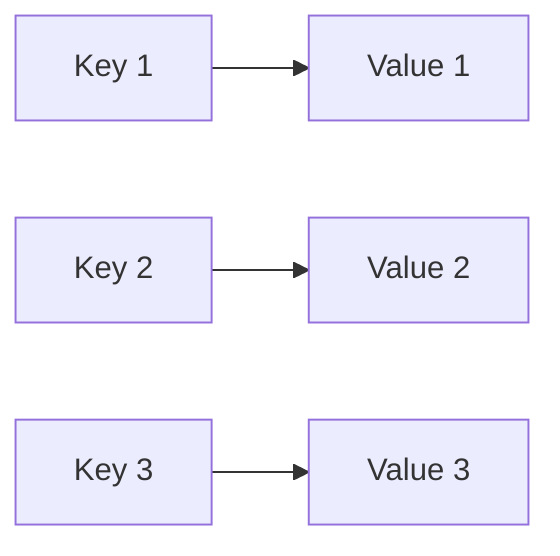
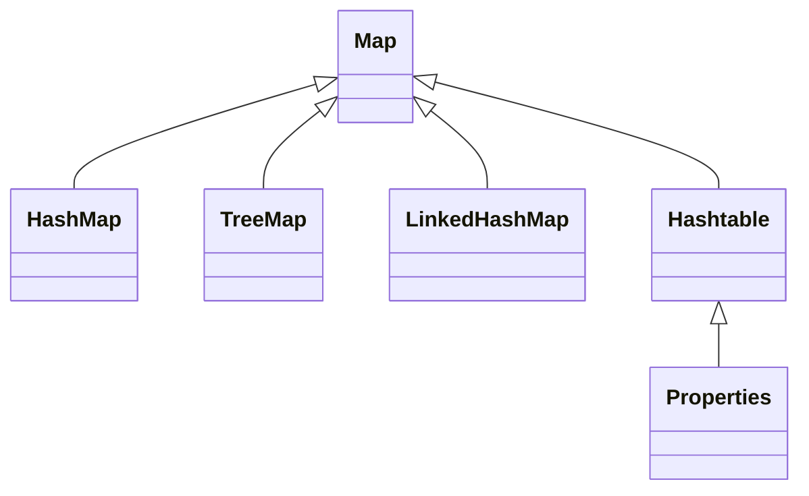

# Java Map Interface

## Introduction

The Map interface is a fundamental part of the Java Collections Framework but unlike other collection types, it doesn't extend the Collection interface. Maps represent a collection of key-value pairs, where each key is mapped to exactly one value. The key feature of a Map is its ability to efficiently retrieve values based on their keys.

In this tutorial, you'll learn:
- What the Map interface is and why it's useful
- The core Map implementations (HashMap, LinkedHashMap, TreeMap)
- Essential methods for working with Maps
- Common use cases and practical examples
- Performance considerations

## Map Interface Basics

A Map in Java is an object that maps keys to values. A Map cannot contain duplicate keys, and each key can map to at most one value.

Here's a visualization of how a Map works:



### Map Interface Hierarchy

The Map interface is part of the Java Collections Framework but follows a different hierarchy:



## Common Map Implementations

### HashMap

`HashMap` is the most commonly used Map implementation. It provides constant-time performance for basic operations (get and put), assuming the hash function disperses elements properly.

```java
import java.util.HashMap;
import java.util.Map;

public class HashMapExample {
    public static void main(String[] args) {
        // Create a new HashMap
        Map<String, Integer> studentScores = new HashMap<>();
        
        // Add key-value pairs
        studentScores.put("Alice", 95);
        studentScores.put("Bob", 88);
        studentScores.put("Charlie", 90);
        studentScores.put("Diana", 78);
        
        // Access values
        System.out.println("Bob's score: " + studentScores.get("Bob"));
        
        // Print all entries
        System.out.println("All scores: " + studentScores);
    }
}
```

Output:
```
Bob's score: 88
All scores: {Bob=88, Alice=95, Diana=78, Charlie=90}
```

**Note:** The order of elements in a HashMap is not guaranteed. Notice how the output order differs from the insertion order.

### LinkedHashMap

`LinkedHashMap` maintains insertion order (or access order if specified) while providing HashMap's performance benefits.

```java
import java.util.LinkedHashMap;
import java.util.Map;

public class LinkedHashMapExample {
    public static void main(String[] args) {
        // Create a new LinkedHashMap
        Map<String, Integer> studentScores = new LinkedHashMap<>();
        
        // Add key-value pairs
        studentScores.put("Alice", 95);
        studentScores.put("Bob", 88);
        studentScores.put("Charlie", 90);
        studentScores.put("Diana", 78);
        
        // Print all entries - notice that insertion order is preserved
        System.out.println("All scores: " + studentScores);
    }
}
```

Output:
```
All scores: {Alice=95, Bob=88, Charlie=90, Diana=78}
```

### TreeMap

`TreeMap` keeps entries sorted based on the natural ordering of its keys (or using a custom Comparator).

```java
import java.util.Map;
import java.util.TreeMap;

public class TreeMapExample {
    public static void main(String[] args) {
        // Create a new TreeMap
        Map<String, Integer> studentScores = new TreeMap<>();
        
        // Add key-value pairs
        studentScores.put("Charlie", 90);
        studentScores.put("Alice", 95);
        studentScores.put("Diana", 78);
        studentScores.put("Bob", 88);
        
        // Print all entries - notice that keys are sorted alphabetically
        System.out.println("All scores (sorted by name): " + studentScores);
    }
}
```

Output:
```
All scores (sorted by name): {Alice=95, Bob=88, Charlie=90, Diana=78}
```

## Common Map Methods

The Map interface provides several essential methods for working with key-value collections:

### Basic Operations

```java
import java.util.HashMap;
import java.util.Map;

public class MapMethodsExample {
    public static void main(String[] args) {
        Map<String, String> countryCapitals = new HashMap<>();
        
        // Adding elements with put()
        countryCapitals.put("USA", "Washington D.C.");
        countryCapitals.put("India", "New Delhi");
        countryCapitals.put("Japan", "Tokyo");
        
        // Size of the map
        System.out.println("Map size: " + countryCapitals.size());
        
        // Check if map contains a key
        System.out.println("Contains key 'USA': " + countryCapitals.containsKey("USA"));
        System.out.println("Contains key 'Russia': " + countryCapitals.containsKey("Russia"));
        
        // Check if map contains a value
        System.out.println("Contains value 'Tokyo': " + countryCapitals.containsValue("Tokyo"));
        
        // Getting a value with get()
        System.out.println("Capital of India: " + countryCapitals.get("India"));
        
        // Getting a value with getOrDefault()
        System.out.println("Capital of UK: " + 
            countryCapitals.getOrDefault("UK", "Not in map"));
        
        // Remove a mapping
        countryCapitals.remove("Japan");
        System.out.println("After removing Japan: " + countryCapitals);
        
        // Clear the map
        countryCapitals.clear();
        System.out.println("After clearing the map: " + countryCapitals);
        System.out.println("Is map empty: " + countryCapitals.isEmpty());
    }
}
```

Output:
```
Map size: 3
Contains key 'USA': true
Contains key 'Russia': false
Contains value 'Tokyo': true
Capital of India: New Delhi
Capital of UK: Not in map
After removing Japan: {USA=Washington D.C., India=New Delhi}
After clearing the map: {}
Is map empty: true
```

### Iterating Through a Map

There are several ways to iterate through a Map:

```java
import java.util.HashMap;
import java.util.Map;

public class MapIterationExample {
    public static void main(String[] args) {
        Map<String, String> countryCapitals = new HashMap<>();
        
        countryCapitals.put("USA", "Washington D.C.");
        countryCapitals.put("India", "New Delhi");
        countryCapitals.put("Japan", "Tokyo");
        countryCapitals.put("France", "Paris");
        
        // Method 1: Using entrySet() with enhanced for loop
        System.out.println("\nIteration using entrySet():");
        for (Map.Entry<String, String> entry : countryCapitals.entrySet()) {
            System.out.println(entry.getKey() + ": " + entry.getValue());
        }
        
        // Method 2: Using keySet() to iterate over keys
        System.out.println("\nIteration using keySet():");
        for (String key : countryCapitals.keySet()) {
            System.out.println(key + ": " + countryCapitals.get(key));
        }
        
        // Method 3: Using values() to iterate over just the values
        System.out.println("\nIteration using values():");
        for (String value : countryCapitals.values()) {
            System.out.println(value);
        }
        
        // Method 4: Using forEach (Java 8+)
        System.out.println("\nIteration using forEach:");
        countryCapitals.forEach((key, value) -> System.out.println(key + ": " + value));
    }
}
```

Output:
```
Iteration using entrySet():
USA: Washington D.C.
Japan: Tokyo
France: Paris
India: New Delhi

Iteration using keySet():
USA: Washington D.C.
Japan: Tokyo
France: Paris
India: New Delhi

Iteration using values():
Washington D.C.
Tokyo
Paris
New Delhi

Iteration using forEach:
USA: Washington D.C.
Japan: Tokyo
France: Paris
India: New Delhi
```

## Practical Examples

### Example 1: Word Frequency Counter

A common use case for Maps is counting occurrences of elements. Here's how you can implement a simple word frequency counter:

```java
import java.util.HashMap;
import java.util.Map;

public class WordFrequencyCounter {
    public static void main(String[] args) {
        String text = "to be or not to be that is the question to be or not to be";
        String[] words = text.split(" ");
        
        Map<String, Integer> wordFrequency = new HashMap<>();
        
        // Count word occurrences
        for (String word : words) {
            // If the word is already in the map, increment its count
            // Otherwise, add it with count 1
            wordFrequency.put(word, wordFrequency.getOrDefault(word, 0) + 1);
        }
        
        // Display results
        System.out.println("Word frequencies:");
        for (Map.Entry<String, Integer> entry : wordFrequency.entrySet()) {
            System.out.println(entry.getKey() + ": " + entry.getValue() + " time(s)");
        }
    }
}
```

Output:
```
Word frequencies:
question: 1 time(s)
is: 1 time(s)
or: 2 time(s)
that: 1 time(s)
not: 2 time(s)
be: 4 time(s)
to: 4 time(s)
the: 1 time(s)
```

### Example 2: Student Grade Management System

Here's a more complex example showing how Maps can be used in a student grade management system:

```java
import java.util.*;

public class GradeManagementSystem {
    public static void main(String[] args) {
        // Map of student name to their grades in different subjects
        Map<String, Map<String, Integer>> studentGrades = new HashMap<>();
        
        // Add data for student 1
        Map<String, Integer> aliceGrades = new HashMap<>();
        aliceGrades.put("Math", 90);
        aliceGrades.put("Science", 95);
        aliceGrades.put("English", 87);
        studentGrades.put("Alice", aliceGrades);
        
        // Add data for student 2
        Map<String, Integer> bobGrades = new HashMap<>();
        bobGrades.put("Math", 85);
        bobGrades.put("Science", 80);
        bobGrades.put("English", 92);
        studentGrades.put("Bob", bobGrades);
        
        // Print all students and their grades
        for (String student : studentGrades.keySet()) {
            System.out.println("Student: " + student);
            Map<String, Integer> grades = studentGrades.get(student);
            
            double average = 0.0;
            for (String subject : grades.keySet()) {
                int grade = grades.get(subject);
                System.out.println("  " + subject + ": " + grade);
                average += grade;
            }
            
            average /= grades.size();
            System.out.printf("  Average: %.2f%n%n", average);
        }
    }
}
```

Output:
```
Student: Bob
  Science: 80
  Math: 85
  English: 92
  Average: 85.67

Student: Alice
  Science: 95
  Math: 90
  English: 87
  Average: 90.67
```

### Example 3: Cache Implementation

Maps are commonly used to implement caching systems:

```java
import java.util.HashMap;
import java.util.Map;

public class SimpleCache {
    public static void main(String[] args) {
        // Create a cache map
        Map<String, String> dataCache = new HashMap<>();
        
        // Function that simulates fetching data from a slow data source
        System.out.println("Fetching data for key1...");
        String value1 = getValueFromCache(dataCache, "key1");
        System.out.println("Value for key1: " + value1);
        
        System.out.println("\nFetching data for key1 again (should use cache)...");
        value1 = getValueFromCache(dataCache, "key1");
        System.out.println("Value for key1: " + value1);
        
        System.out.println("\nFetching data for key2...");
        String value2 = getValueFromCache(dataCache, "key2");
        System.out.println("Value for key2: " + value2);
    }
    
    private static String getValueFromCache(Map<String, String> cache, String key) {
        // Check if value exists in cache
        if (cache.containsKey(key)) {
            System.out.println("Cache hit! Using cached value.");
            return cache.get(key);
        } else {
            System.out.println("Cache miss! Fetching from slow data source...");
            // Simulate slow data retrieval
            String value = fetchDataFromSlowSource(key);
            // Store in cache for future use
            cache.put(key, value);
            return value;
        }
    }
    
    private static String fetchDataFromSlowSource(String key) {
        // This simulates a database call or API request
        try {
            Thread.sleep(2000);  // Simulate delay
        } catch (InterruptedException e) {
            e.printStackTrace();
        }
        return "Data for " + key;
    }
}
```

Output:
```
Fetching data for key1...
Cache miss! Fetching from slow data source...
Value for key1: Data for key1

Fetching data for key1 again (should use cache)...
Cache hit! Using cached value.
Value for key1: Data for key1

Fetching data for key2...
Cache miss! Fetching from slow data source...
Value for key2: Data for key2
```

## Map Implementation Comparison

When choosing a Map implementation, consider these factors:

| Implementation | Order | Performance (Get/Put/Remove) | Memory Usage | Thread-Safe |
|----------------|-------|------------------------------|--------------|------------|
| HashMap        | No guaranteed order | O(1) | Low-Medium | No |
| LinkedHashMap  | Insertion order (or access order) | O(1) | Medium | No |
| TreeMap        | Sorted by key | O(log n) | Medium-High | No |
| Hashtable      | No guaranteed order | O(1) | Medium | Yes |
| ConcurrentHashMap | No guaranteed order | O(1) | Medium | Yes |

Choose the right implementation based on your specific needs:

- Need a fast, general-purpose implementation? Use **HashMap**
- Need to maintain insertion order? Use **LinkedHashMap**
- Need keys to be sorted? Use **TreeMap**
- Need thread safety? Use **ConcurrentHashMap** (prefer this over the older Hashtable)

## Summary

The Map interface is a powerful tool in Java's Collections Framework that allows you to store and retrieve data using key-value pairs. In this tutorial, you've learned:

- The basics of the Map interface and its purpose
- Different Map implementations (HashMap, LinkedHashMap, TreeMap)
- Essential methods for working with Maps
- How to iterate through a Map using various approaches
- Practical applications of Maps in real-world scenarios

Maps are incredibly useful for solving many programming problems, from simple lookups to complex data organization. Understanding Maps and when to use each implementation will significantly enhance your Java programming skills.

## Practice Exercises

1. Create a program that reads a text file and counts the frequency of each word. Use a Map to store the word frequencies.

2. Implement a simple phone book application that uses a Map to store names (keys) and phone numbers (values). Include functionality to add, search, update, and delete entries.

3. Create a student database using a Map where the key is the student ID and the value is a Student object containing name, age, and grades.

4. Implement a cache with expiry using a Map. When retrieving items, check if they have expired and remove them if necessary.

5. Create a program that reads a list of countries and their capitals, then quizzes the user by showing a random country and asking for its capital.

## Additional Resources

- [Java Map Interface Documentation](https://docs.oracle.com/en/java/javase/17/docs/api/java.base/java/util/Map.html)
- [Java HashMap Documentation](https://docs.oracle.com/en/java/javase/17/docs/api/java.base/java/util/HashMap.html)
- [Java TreeMap Documentation](https://docs.oracle.com/en/java/javase/17/docs/api/java.base/java/util/TreeMap.html)
- [Java LinkedHashMap Documentation](https://docs.oracle.com/en/java/javase/17/docs/api/java.base/java/util/LinkedHashMap.html)