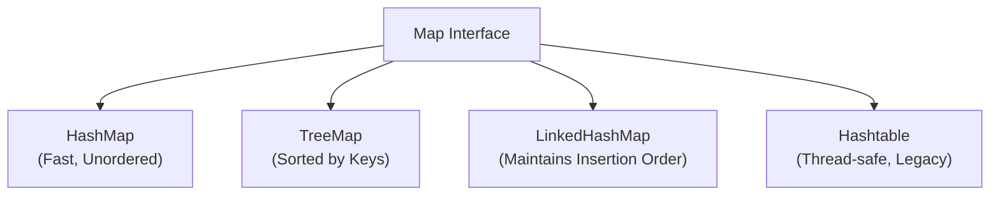

# Java HashMap

## Introduction

HashMap is one of the most frequently used implementations of the Map interface in the Java Collections Framework. It stores data in key-value pairs, providing quick access to values when the key is known. HashMap uses a hashing technique to store elements, making retrieval operations highly efficient with an average time complexity of O(1).

In this tutorial, we'll explore how HashMaps work, how to use them effectively, and some common use cases where HashMaps shine.

## What is a HashMap?

HashMap is a class that implements the Map interface, which maps unique keys to values. It uses a technique called hashing to store the key-value pairs efficiently. Some key characteristics of HashMap include:

- It allows one null key and multiple null values
- It doesn't guarantee the order of elements (not synchronized)
- It doesn't maintain insertion order (use LinkedHashMap if you need this)
- It provides constant-time performance for basic operations (get and put)

### HashMap vs Other Map Implementations



## Creating a HashMap

Let's start by creating a simple HashMap:

```java
// Import statement
import java.util.HashMap;

// Creating a HashMap with String keys and Integer values
HashMap<String, Integer> studentScores = new HashMap<>();

// Alternative way using the Map interface
Map<String, Integer> studentScores = new HashMap<>();
```

## Basic Operations

### Adding Elements

To add elements to a HashMap, use the `put()` method:

```java
// Creating a HashMap of student names and scores
HashMap<String, Integer> studentScores = new HashMap<>();

// Adding elements
studentScores.put("John", 85);
studentScores.put("Lisa", 92);
studentScores.put("Mike", 78);
studentScores.put("Sarah", 95);

System.out.println("Student scores: " + studentScores);
```

Output:
```
Student scores: {Sarah=95, Mike=78, John=85, Lisa=92}
```

Note: The order may be different when you run this code as HashMap doesn't maintain insertion order.

### Accessing Elements

To retrieve a value by its key, use the `get()` method:

```java
// Get a specific student's score
Integer lisaScore = studentScores.get("Lisa");
System.out.println("Lisa's score: " + lisaScore);

// Trying to get a value for a key that doesn't exist
Integer alexScore = studentScores.get("Alex");
System.out.println("Alex's score: " + alexScore);
```

Output:
```
Lisa's score: 92
Alex's score: null
```

### Checking if a Key Exists

Before accessing a value, you might want to check if a key exists:

```java
// Check if a key exists
boolean hasLisa = studentScores.containsKey("Lisa");
System.out.println("Contains Lisa: " + hasLisa);

boolean hasAlex = studentScores.containsKey("Alex");
System.out.println("Contains Alex: " + hasAlex);
```

Output:
```
Contains Lisa: true
Contains Alex: false
```

### Checking if a Value Exists

Similarly, you can check if a specific value exists:

```java
// Check if a value exists
boolean hasScore92 = studentScores.containsValue(92);
System.out.println("Contains score 92: " + hasScore92);

boolean hasScore100 = studentScores.containsValue(100);
System.out.println("Contains score 100: " + hasScore100);
```

Output:
```
Contains score 92: true
Contains score 100: false
```

### Removing Elements

To remove an entry from the HashMap:

```java
// Remove a student
studentScores.remove("Mike");
System.out.println("After removing Mike: " + studentScores);
```

Output:
```
After removing Mike: {Sarah=95, John=85, Lisa=92}
```

### Size and Empty Check

To check the size of a HashMap or if it's empty:

```java
// Get the size
int size = studentScores.size();
System.out.println("Size of HashMap: " + size);

// Check if empty
boolean isEmpty = studentScores.isEmpty();
System.out.println("Is HashMap empty? " + isEmpty);

// Clear the HashMap
studentScores.clear();
System.out.println("After clearing: " + studentScores);
System.out.println("Is HashMap empty now? " + studentScores.isEmpty());
```

Output:
```
Size of HashMap: 3
Is HashMap empty? false
After clearing: {}
Is HashMap empty now? true
```

## Iterating Over a HashMap

There are several ways to iterate through a HashMap:

### Using entrySet()

```java
HashMap<String, Integer> fruits = new HashMap<>();
fruits.put("Apple", 10);
fruits.put("Banana", 5);
fruits.put("Orange", 8);

// Iterate using entrySet
for (Map.Entry<String, Integer> entry : fruits.entrySet()) {
    System.out.println("Fruit: " + entry.getKey() + ", Quantity: " + entry.getValue());
}
```

Output:
```
Fruit: Apple, Quantity: 10
Fruit: Orange, Quantity: 8
Fruit: Banana, Quantity: 5
```

### Using keySet()

```java
// Iterate over keys
for (String fruit : fruits.keySet()) {
    System.out.println("Fruit: " + fruit);
}
```

Output:
```
Fruit: Apple
Fruit: Orange
Fruit: Banana
```

### Using values()

```java
// Iterate over values
for (Integer quantity : fruits.values()) {
    System.out.println("Quantity: " + quantity);
}
```

Output:
```
Quantity: 10
Quantity: 8
Quantity: 5
```

### Using forEach() (Java 8+)

```java
// Using forEach method (Java 8+)
fruits.forEach((fruit, quantity) -> {
    System.out.println(fruit + ": " + quantity);
});
```

Output:
```
Apple: 10
Orange: 8
Banana: 5
```

## HashMap with Custom Objects

When using custom objects as keys in a HashMap, you must override the `hashCode()` and `equals()` methods to ensure proper functioning.

```java
class Student {
    private int id;
    private String name;
    
    public Student(int id, String name) {
        this.id = id;
        this.name = name;
    }
    
    public int getId() {
        return id;
    }
    
    public String getName() {
        return name;
    }
    
    @Override
    public boolean equals(Object obj) {
        if (this == obj) return true;
        if (obj == null || getClass() != obj.getClass()) return false;
        Student student = (Student) obj;
        return id == student.id && name.equals(student.name);
    }
    
    @Override
    public int hashCode() {
        return Objects.hash(id, name);
    }
    
    @Override
    public String toString() {
        return "Student{id=" + id + ", name='" + name + "'}";
    }
}

// Usage example
HashMap<Student, Integer> studentGrades = new HashMap<>();
studentGrades.put(new Student(1, "John"), 85);
studentGrades.put(new Student(2, "Lisa"), 92);

// This will work correctly due to properly implemented equals and hashCode
Student john = new Student(1, "John");
System.out.println("John's grade: " + studentGrades.get(john));  // Outputs: 85
```

## Practical Examples

### Example 1: Word Frequency Counter

A common use case for HashMaps is counting frequencies:

```java
public class WordFrequencyCounter {
    public static void main(String[] args) {
        String text = "this is a sample text with some words that repeat and some words that don't repeat";
        String[] words = text.toLowerCase().split(" ");
        
        HashMap<String, Integer> wordFrequency = new HashMap<>();
        
        // Count word frequencies
        for (String word : words) {
            // If the word is seen for the first time, put 1, otherwise increment the count
            wordFrequency.put(word, wordFrequency.getOrDefault(word, 0) + 1);
        }
        
        // Display word frequencies
        System.out.println("Word Frequencies:");
        for (Map.Entry<String, Integer> entry : wordFrequency.entrySet()) {
            System.out.println(entry.getKey() + ": " + entry.getValue());
        }
    }
}
```

Output:
```
Word Frequencies:
that: 2
words: 2
is: 1
with: 1
repeat: 2
a: 1
some: 2
and: 1
sample: 1
text: 1
this: 1
don't: 1
```

### Example 2: Caching Computed Results

HashMaps are great for caching previously computed results:

```java
public class FibonacciCache {
    private HashMap<Integer, Long> cache = new HashMap<>();
    
    public long fibonacci(int n) {
        // Check if the result is already in the cache
        if (cache.containsKey(n)) {
            System.out.println("Using cached value for fib(" + n + ")");
            return cache.get(n);
        }
        
        // Compute the value if not in cache
        long result;
        if (n <= 1) {
            result = n;
        } else {
            result = fibonacci(n - 1) + fibonacci(n - 2);
        }
        
        // Store the result in the cache
        cache.put(n, result);
        return result;
    }
    
    public static void main(String[] args) {
        FibonacciCache calculator = new FibonacciCache();
        System.out.println("fib(30) = " + calculator.fibonacci(30));
        System.out.println("fib(30) again = " + calculator.fibonacci(30)); // Uses cache
    }
}
```

## HashMap Performance Considerations

- **Initial Capacity**: You can specify the initial capacity to avoid rehashing operations, which can improve performance.
- **Load Factor**: Controls how full the HashMap can be before it's resized.
- **Time Complexity**: Average case O(1) for get and put operations, but worst-case scenario can be O(n).

```java
// Creating HashMap with initial capacity and load factor
HashMap<String, Integer> optimizedMap = new HashMap<>(100, 0.75f);
```

## Common Methods Reference

| Method | Description |
| ------ | ----------- |
| `put(K key, V value)` | Adds a key-value mapping to the map |
| `get(Object key)` | Returns the value associated with the specified key |
| `remove(Object key)` | Removes the mapping for the specified key |
| `containsKey(Object key)` | Returns true if the map contains the specified key |
| `containsValue(Object value)` | Returns true if the map maps one or more keys to the specified value |
| `size()` | Returns the number of key-value mappings |
| `isEmpty()` | Returns true if the map contains no key-value mappings |
| `clear()` | Removes all mappings from the map |
| `keySet()` | Returns a Set view of the keys contained in the map |
| `values()` | Returns a Collection view of the values contained in the map |
| `entrySet()` | Returns a Set view of the mappings contained in the map |

## Summary

HashMap is a powerful data structure in Java that provides fast access to values using keys. It's ideal for scenarios where quick lookups are needed and the insertion order is not important. Some key points to remember:

- HashMaps store key-value pairs with unique keys
- They provide O(1) average time complexity for most operations
- They don't maintain the insertion order
- When using custom objects as keys, remember to override equals() and hashCode()
- HashMaps allow one null key and multiple null values

## Exercises

1. Create a HashMap to store and retrieve student information (name, age, grade).
2. Write a program to find duplicate characters in a string using HashMap.
3. Implement a simple cache system using HashMap to store results of expensive operations.
4. Write a function that takes two arrays and returns elements that appear in both arrays using a HashMap.
5. Create a program that uses a HashMap to count the occurrence of each word in a text file.

## Additional Resources

- [Java HashMap Documentation](https://docs.oracle.com/en/java/javase/11/docs/api/java.base/java/util/HashMap.html)
- [Java Collections Framework Overview](https://docs.oracle.com/en/java/javase/11/docs/api/java.base/java/util/doc-files/coll-overview.html)
- Book: "Effective Java" by Joshua Bloch (Chapter on Collections)
- Book: "Java Generics and Collections" by Maurice Naftalin and Philip Wadler

Happy HashMap coding!