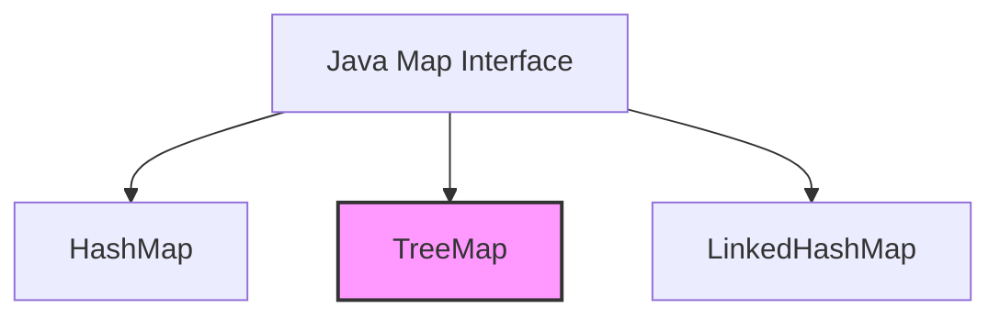
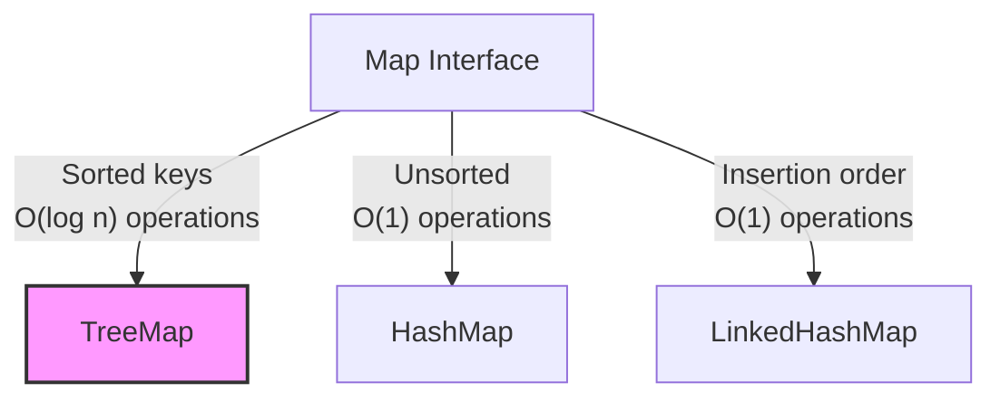

# Java TreeMap

## Introduction

TreeMap is a powerful implementation of the Map interface in the Java Collections Framework. Unlike HashMap, which stores elements in an unsorted manner, TreeMap keeps its entries sorted according to the natural ordering of its keys or using a custom comparator provided during creation.

TreeMap is based on a Red-Black tree data structure, which ensures that basic operations like `get`, `put`, and `remove` have O(log n) time complexity. This makes TreeMap an excellent choice when you need a map that maintains its entries in a sorted order.



## Creating a TreeMap

You can create a TreeMap in several ways:

### Default Constructor

```java
// Creates an empty TreeMap with natural ordering
TreeMap<String, Integer> scores = new TreeMap<>();
```

### With Comparator

```java
// Creates a TreeMap with a custom comparator (reverse order)
TreeMap<String, Integer> reverseScores = new TreeMap<>(Comparator.reverseOrder());
```

### From Another Map

```java
Map<String, Integer> originalMap = new HashMap<>();
originalMap.put("Alice", 95);
originalMap.put("Bob", 82);
originalMap.put("Charlie", 90);

// Create TreeMap from another map
TreeMap<String, Integer> sortedScores = new TreeMap<>(originalMap);
```

## Basic Operations

Let's explore the basic operations you can perform with a TreeMap:

### Adding Elements

```java
TreeMap<String, Integer> studentScores = new TreeMap<>();

// Adding key-value pairs
studentScores.put("Alice", 95);
studentScores.put("Bob", 82);
studentScores.put("Charlie", 90);
studentScores.put("David", 88);

System.out.println("Student scores: " + studentScores);
```

**Output:**
```
Student scores: {Alice=95, Bob=82, Charlie=90, David=88}
```

Notice that the entries are sorted by keys (student names) in alphabetical order.

### Accessing Elements

```java
// Get value for a specific key
Integer bobScore = studentScores.get("Bob");
System.out.println("Bob's score: " + bobScore);

// Check if a key exists
boolean hasEve = studentScores.containsKey("Eve");
System.out.println("Contains Eve: " + hasEve);

// Check if a value exists
boolean hasScore90 = studentScores.containsValue(90);
System.out.println("Contains score 90: " + hasScore90);
```

**Output:**
```
Bob's score: 82
Contains Eve: false
Contains score 90: true
```

### Removing Elements

```java
// Remove by key
Integer removedScore = studentScores.remove("Bob");
System.out.println("Removed Bob's score: " + removedScore);
System.out.println("Updated map: " + studentScores);
```

**Output:**
```
Removed Bob's score: 82
Updated map: {Alice=95, Charlie=90, David=88}
```

### Iterating Through a TreeMap

```java
TreeMap<String, Integer> fruits = new TreeMap<>();
fruits.put("Apple", 10);
fruits.put("Banana", 5);
fruits.put("Orange", 8);
fruits.put("Mango", 12);

// Iterating through entries
System.out.println("Fruit inventory:");
for (Map.Entry<String, Integer> entry : fruits.entrySet()) {
    System.out.println(entry.getKey() + ": " + entry.getValue());
}

// Iterating through keys
System.out.println("\nAvailable fruits:");
for (String fruit : fruits.keySet()) {
    System.out.println(fruit);
}

// Iterating through values
System.out.println("\nQuantities:");
for (Integer quantity : fruits.values()) {
    System.out.println(quantity);
}
```

**Output:**
```
Fruit inventory:
Apple: 10
Banana: 5
Mango: 12
Orange: 8

Available fruits:
Apple
Banana
Mango
Orange

Quantities:
10
5
12
8
```

## Special TreeMap Methods

TreeMap provides several navigation methods that aren't available in other Map implementations:

### First and Last Entry

```java
TreeMap<Integer, String> ranks = new TreeMap<>();
ranks.put(1, "Gold");
ranks.put(2, "Silver");
ranks.put(3, "Bronze");
ranks.put(4, "Fourth");
ranks.put(5, "Fifth");

// Get first and last entries
Map.Entry<Integer, String> firstEntry = ranks.firstEntry();
Map.Entry<Integer, String> lastEntry = ranks.lastEntry();

System.out.println("First entry: " + firstEntry.getKey() + "=" + firstEntry.getValue());
System.out.println("Last entry: " + lastEntry.getKey() + "=" + lastEntry.getValue());
```

**Output:**
```
First entry: 1=Gold
Last entry: 5=Fifth
```

### Floor, Ceiling, Lower, and Higher

```java
// Floor entry: greatest key less than or equal to the given key
Map.Entry<Integer, String> floorEntry = ranks.floorEntry(2);
System.out.println("Floor entry of 2: " + floorEntry.getKey() + "=" + floorEntry.getValue());

// Ceiling entry: least key greater than or equal to the given key
Map.Entry<Integer, String> ceilingEntry = ranks.ceilingEntry(2);
System.out.println("Ceiling entry of 2: " + ceilingEntry.getKey() + "=" + ceilingEntry.getValue());

// Lower entry: greatest key strictly less than the given key
Map.Entry<Integer, String> lowerEntry = ranks.lowerEntry(3);
System.out.println("Lower entry of 3: " + lowerEntry.getKey() + "=" + lowerEntry.getValue());

// Higher entry: least key strictly greater than the given key
Map.Entry<Integer, String> higherEntry = ranks.higherEntry(3);
System.out.println("Higher entry of 3: " + higherEntry.getKey() + "=" + higherEntry.getValue());
```

**Output:**
```
Floor entry of 2: 2=Silver
Ceiling entry of 2: 2=Silver
Lower entry of 3: 2=Silver
Higher entry of 3: 4=Fourth
```

### Sub-Maps

```java
// Get a portion of the map (inclusive from, exclusive to)
SortedMap<Integer, String> subMap = ranks.subMap(2, 5);
System.out.println("SubMap (2-5 exclusive): " + subMap);

// Get a portion of the map with custom inclusion
NavigableMap<Integer, String> subMapInclusive = ranks.subMap(2, true, 5, true);
System.out.println("SubMap (2-5 inclusive): " + subMapInclusive);

// Get all entries with keys less than specified key
SortedMap<Integer, String> headMap = ranks.headMap(3);
System.out.println("HeadMap (< 3): " + headMap);

// Get all entries with keys greater than or equal to specified key
SortedMap<Integer, String> tailMap = ranks.tailMap(3);
System.out.println("TailMap (>= 3): " + tailMap);
```

**Output:**
```
SubMap (2-5 exclusive): {2=Silver, 3=Bronze, 4=Fourth}
SubMap (2-5 inclusive): {2=Silver, 3=Bronze, 4=Fourth, 5=Fifth}
HeadMap (< 3): {1=Gold, 2=Silver}
TailMap (>= 3): {3=Bronze, 4=Fourth, 5=Fifth}
```

## Navigating in Descending Order

```java
// Get descending map
NavigableMap<Integer, String> descendingMap = ranks.descendingMap();
System.out.println("Descending Map: " + descendingMap);

// Get descending key set
NavigableSet<Integer> descendingKeySet = ranks.descendingKeySet();
System.out.println("Descending Keys: " + descendingKeySet);
```

**Output:**
```
Descending Map: {5=Fifth, 4=Fourth, 3=Bronze, 2=Silver, 1=Gold}
Descending Keys: [5, 4, 3, 2, 1]
```

## Practical Examples

### Example 1: Phone Directory

This example shows how to implement a simple phone directory using TreeMap:

```java
public class PhoneDirectory {
    public static void main(String[] args) {
        TreeMap<String, String> phoneBook = new TreeMap<>();
        
        // Add contacts (automatically sorted by name)
        phoneBook.put("John Smith", "555-1234");
        phoneBook.put("Alice Johnson", "555-5678");
        phoneBook.put("Bob Brown", "555-8765");
        phoneBook.put("David Wilson", "555-4321");
        phoneBook.put("Carol Davis", "555-9876");
        
        // Print all contacts in alphabetical order
        System.out.println("Phone Directory:");
        System.out.println("---------------");
        for (Map.Entry<String, String> entry : phoneBook.entrySet()) {
            System.out.printf("%-15s: %s%n", entry.getKey(), entry.getValue());
        }
        
        // Find contacts that start with a specific letter
        String letter = "B";
        System.out.println("\nContacts starting with '" + letter + "':");
        
        // Use ceiling and lower to get a range
        String start = letter;
        String end = letter + Character.MAX_VALUE; // Next letter
        
        SortedMap<String, String> contactsStartingWith = phoneBook.subMap(start, end);
        for (Map.Entry<String, String> entry : contactsStartingWith.entrySet()) {
            System.out.printf("%-15s: %s%n", entry.getKey(), entry.getValue());
        }
    }
}
```

**Output:**
```
Phone Directory:
---------------
Alice Johnson  : 555-5678
Bob Brown      : 555-8765
Carol Davis    : 555-9876
David Wilson   : 555-4321
John Smith     : 555-1234

Contacts starting with 'B':
Bob Brown      : 555-8765
```

### Example 2: Event Scheduling System

This example demonstrates how to use TreeMap for a simple event scheduling system:

```java
import java.time.LocalDateTime;
import java.time.format.DateTimeFormatter;
import java.util.TreeMap;

public class EventScheduler {
    public static void main(String[] args) {
        // TreeMap with LocalDateTime as key for automatic chronological sorting
        TreeMap<LocalDateTime, String> schedule = new TreeMap<>();
        DateTimeFormatter formatter = DateTimeFormatter.ofPattern("yyyy-MM-dd HH:mm");
        
        // Add events
        schedule.put(LocalDateTime.parse("2023-10-15 09:00", formatter), "Team Meeting");
        schedule.put(LocalDateTime.parse("2023-10-15 12:30", formatter), "Lunch with Client");
        schedule.put(LocalDateTime.parse("2023-10-15 15:00", formatter), "Project Review");
        schedule.put(LocalDateTime.parse("2023-10-16 10:00", formatter), "Budget Planning");
        schedule.put(LocalDateTime.parse("2023-10-17 14:00", formatter), "Product Launch");
        
        // Display all events in chronological order
        System.out.println("Complete Schedule:");
        System.out.println("-----------------");
        for (Map.Entry<LocalDateTime, String> event : schedule.entrySet()) {
            System.out.println(event.getKey().format(formatter) + " - " + event.getValue());
        }
        
        // Find the next upcoming event after a specific time
        LocalDateTime now = LocalDateTime.parse("2023-10-15 13:00", formatter);
        Map.Entry<LocalDateTime, String> nextEvent = schedule.ceilingEntry(now);
        
        System.out.println("\nNext event after " + now.format(formatter) + ":");
        if (nextEvent != null) {
            System.out.println(nextEvent.getKey().format(formatter) + " - " + nextEvent.getValue());
        } else {
            System.out.println("No upcoming events.");
        }
        
        // Get today's events
        LocalDateTime startOfDay = LocalDateTime.parse("2023-10-15 00:00", formatter);
        LocalDateTime endOfDay = LocalDateTime.parse("2023-10-16 00:00", formatter);
        
        System.out.println("\nToday's events:");
        System.out.println("--------------");
        SortedMap<LocalDateTime, String> todaysEvents = schedule.subMap(startOfDay, endOfDay);
        for (Map.Entry<LocalDateTime, String> event : todaysEvents.entrySet()) {
            System.out.println(event.getKey().format(formatter) + " - " + event.getValue());
        }
    }
}
```

**Output:**
```
Complete Schedule:
-----------------
2023-10-15 09:00 - Team Meeting
2023-10-15 12:30 - Lunch with Client
2023-10-15 15:00 - Project Review
2023-10-16 10:00 - Budget Planning
2023-10-17 14:00 - Product Launch

Next event after 2023-10-15 13:00:
2023-10-15 15:00 - Project Review

Today's events:
--------------
2023-10-15 09:00 - Team Meeting
2023-10-15 12:30 - Lunch with Client
2023-10-15 15:00 - Project Review
```

## Performance Considerations

When considering whether to use TreeMap, keep these performance characteristics in mind:

- **Time Complexity**:
  - `get()`, `put()`, `remove()`, `containsKey()` operations: O(log n)
  - Operations on `values()` collection: O(n)
  
- **When to use TreeMap**:
  - When you need keys ordered in a specific way (natural or custom)
  - When you need to find closest matches to a given key (using methods like `floorKey()`, `ceilingKey()`)
  - When you need to extract portions of the map (using `subMap()`, `headMap()`, `tailMap()`)

- **When to avoid TreeMap**:
  - When you don't need ordered keys and want faster access (use HashMap instead)
  - When memory usage is a concern (TreeMap has higher overhead than HashMap)

## Comparison with Other Map Implementations



| Map Implementation | Ordering | Key Search | Insertion/Deletion | Memory Usage |
|--------------------|----------|------------|-------------------|--------------|
| TreeMap            | Sorted by keys | O(log n) | O(log n) | Moderate |
| HashMap            | Unordered | O(1) | O(1) | Low |
| LinkedHashMap      | Insertion order | O(1) | O(1) | High |

## Summary

TreeMap is a powerful implementation of the Map interface that maintains its keys in a sorted order. This makes it ideal for applications that require ordered data or range-based operations. Key features include:

- Sorted key storage based on natural ordering or a custom comparator
- O(log n) time complexity for most operations
- Specialized navigation methods like `floorKey()`, `ceilingKey()`, `firstEntry()`, and `lastEntry()`
- Ability to extract portions of the map with `subMap()`, `headMap()`, and `tailMap()`

TreeMap is most useful when you need to maintain elements in a sorted order and perform operations based on that order, such as finding closest matches or extracting ranges of keys.

## Practice Exercises

1. Create a TreeMap that maps student names to their grades, then write methods to:
   - Find all students with grades above a certain threshold
   - Calculate the average grade
   - Find the student with the highest grade

2. Implement a word frequency counter that counts occurrences of words in a text and stores them in a TreeMap, so the words are displayed in alphabetical order.

3. Create a schedule application that uses TreeMap with date/time objects as keys and appointments as values, with methods to:
   - Add new appointments
   - Find the next appointment after a given time
   - List all appointments for a specific date range

## Additional Resources

- [Oracle Java Documentation: TreeMap](https://docs.oracle.com/en/java/javase/17/docs/api/java.base/java/util/TreeMap.html)
- [Red-Black Trees](https://en.wikipedia.org/wiki/Red%E2%80%93black_tree) - The data structure behind TreeMap
- [Java Collections Framework Overview](https://docs.oracle.com/javase/tutorial/collections/intro/index.html)