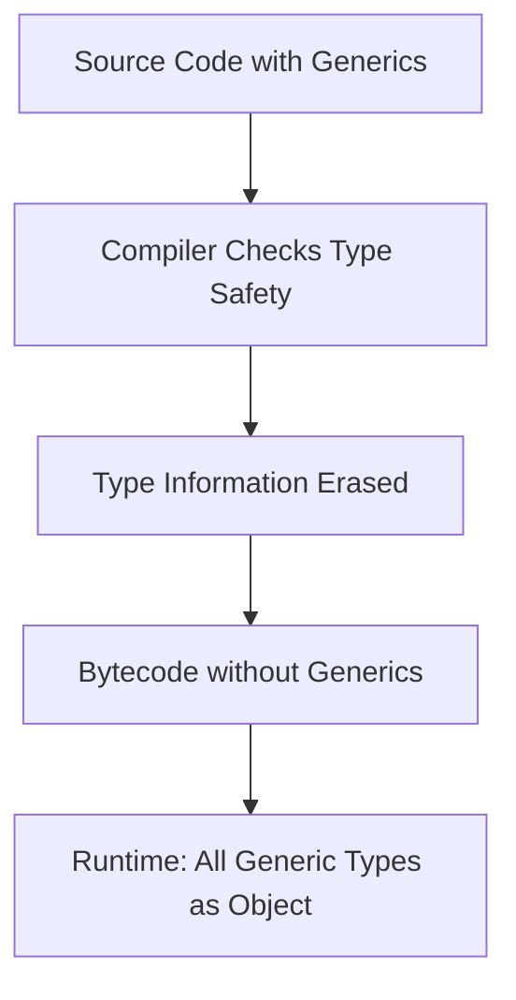

# Java Generics Basics

## Introduction

Java Generics were introduced in Java 5 as a way to provide compile-time type safety and eliminate the need for explicit type casting. Before generics, collections could store any object type, leading to potential `ClassCastException` errors at runtime when retrieving elements. Generics allow you to specify the exact types that a collection can contain, enabling the compiler to catch type mismatches before your program runs.

In this tutorial, we'll explore the basics of Java Generics, understand their syntax, and learn how to use them effectively in your code.

## What are Java Generics?

Java Generics enable you to create classes, interfaces, and methods that can work with different data types while providing compile-time type safety. They use type parameters, which act as placeholders for the actual data types that will be specified when creating an instance.

Think of generics as a way to tell the compiler what type of objects a collection can contain, allowing for more robust code and fewer runtime errors.

## Why Use Generics?

Generics offer several key benefits:

1. **Type Safety**: Catch type errors at compile time rather than at runtime
2. **Elimination of Casting**: No need for explicit casting when retrieving elements
3. **Code Reusability**: Write algorithms once that work with different types
4. **Better API Design**: Create more flexible and type-safe libraries

## Generic Classes

Let's start by creating a simple generic class:

```java
public class Box<T> {
    private T content;
    
    public void put(T content) {
        this.content = content;
    }
    
    public T get() {
        return content;
    }
}
```

Here, `T` is a type parameter that serves as a placeholder for the actual type that will be specified when creating a `Box` object.

### Using a Generic Class

```java
// Creating a Box that can store Strings
Box<String> stringBox = new Box<>();
stringBox.put("Hello Generics!");
String message = stringBox.get();  // No casting needed
System.out.println(message);

// Creating a Box that can store Integers
Box<Integer> intBox = new Box<>();
intBox.put(42);
int number = intBox.get();  // No casting needed
System.out.println(number);
```

**Output:**
```
Hello Generics!
42
```

In the above example:
- We created two different `Box` objects: one for storing `String` values and another for `Integer` values
- The compiler ensures that we can only put a `String` into `stringBox` and an `Integer` into `intBox`
- We don't need explicit casting when retrieving values from these boxes

## Type Parameters Naming Conventions

The common convention for naming type parameters is:

- `T`: Type
- `E`: Element (used extensively by the Java Collections Framework)
- `K`: Key
- `V`: Value
- `N`: Number
- `S`, `U`, `V`, etc.: 2nd, 3rd, 4th types

## Generic Methods

You can also create generic methods within non-generic classes:

```java
public class Utilities {
    public static <T> void printArray(T[] array) {
        for (T element : array) {
            System.out.print(element + " ");
        }
        System.out.println();
    }
}
```

### Using a Generic Method

```java
String[] strings = {"Hello", "World", "of", "Generics"};
Integer[] integers = {1, 2, 3, 4, 5};

Utilities.printArray(strings);
Utilities.printArray(integers);
```

**Output:**
```
Hello World of Generics 
1 2 3 4 5 
```

In this example, the `printArray` method can print arrays of any type because it's a generic method.

## Multiple Type Parameters

Generic classes and methods can use multiple type parameters:

```java
public class Pair<K, V> {
    private K key;
    private V value;
    
    public Pair(K key, V value) {
        this.key = key;
        this.value = value;
    }
    
    public K getKey() {
        return key;
    }
    
    public V getValue() {
        return value;
    }
    
    @Override
    public String toString() {
        return "(" + key + ", " + value + ")";
    }
}
```

### Using Multiple Type Parameters

```java
Pair<String, Integer> person = new Pair<>("John", 25);
System.out.println("Name: " + person.getKey());
System.out.println("Age: " + person.getValue());
System.out.println("Person: " + person);

Pair<Double, Double> point = new Pair<>(2.5, 3.7);
System.out.println("Point: " + point);
```

**Output:**
```
Name: John
Age: 25
Person: (John, 25)
Point: (2.5, 3.7)
```

## Type Erasure

Java's generics are implemented using a mechanism called **type erasure**. This means that generic type information is only available at compile time and is erased by the compiler afterward. At runtime, generic types are treated as `Object`.

This was done to maintain backward compatibility with pre-generics code.



## Generic Collections

One of the most common uses of generics is with Java collections:

```java
// Before Generics (Java 1.4 and earlier)
List oldList = new ArrayList();
oldList.add("Hello");
oldList.add(42);  // This will compile but might cause problems later
String item = (String) oldList.get(0);  // Explicit casting required
// This would cause a ClassCastException:
// String trouble = (String) oldList.get(1);  

// With Generics (Java 5+)
List<String> newList = new ArrayList<>();
newList.add("Hello");
// newList.add(42);  // Compile error - type safety!
String safeItem = newList.get(0);  // No casting needed
```

## Real-World Example: Generic Repository

Let's create a simple in-memory repository pattern using generics, which could be used in applications for data access:

```java
import java.util.ArrayList;
import java.util.HashMap;
import java.util.List;
import java.util.Map;

// An interface that represents an entity with an ID
interface Entity<ID> {
    ID getId();
}

// A generic repository for managing entities
class Repository<T extends Entity<ID>, ID> {
    private Map<ID, T> entities = new HashMap<>();
    
    public void save(T entity) {
        entities.put(entity.getId(), entity);
    }
    
    public T findById(ID id) {
        return entities.get(id);
    }
    
    public List<T> findAll() {
        return new ArrayList<>(entities.values());
    }
    
    public void delete(ID id) {
        entities.remove(id);
    }
}

// A concrete entity class
class User implements Entity<Long> {
    private Long id;
    private String name;
    private String email;
    
    public User(Long id, String name, String email) {
        this.id = id;
        this.name = name;
        this.email = email;
    }
    
    @Override
    public Long getId() {
        return id;
    }
    
    public String getName() {
        return name;
    }
    
    public String getEmail() {
        return email;
    }
    
    @Override
    public String toString() {
        return "User{id=" + id + ", name='" + name + "', email='" + email + "'}";
    }
}
```

Using the generic repository:

```java
// Create a user repository
Repository<User, Long> userRepo = new Repository<>();

// Add users
userRepo.save(new User(1L, "Alice", "alice@example.com"));
userRepo.save(new User(2L, "Bob", "bob@example.com"));
userRepo.save(new User(3L, "Charlie", "charlie@example.com"));

// Find a specific user
User user = userRepo.findById(2L);
System.out.println("Found user: " + user);

// List all users
System.out.println("\nAll users:");
for (User u : userRepo.findAll()) {
    System.out.println(u);
}

// Delete a user
userRepo.delete(1L);

// List all users after deletion
System.out.println("\nAfter deletion:");
for (User u : userRepo.findAll()) {
    System.out.println(u);
}
```

**Output:**
```
Found user: User{id=2, name='Bob', email='bob@example.com'}

All users:
User{id=1, name='Alice', email='alice@example.com'}
User{id=2, name='Bob', email='bob@example.com'}
User{id=3, name='Charlie', email='charlie@example.com'}

After deletion:
User{id=2, name='Bob', email='bob@example.com'}
User{id=3, name='Charlie', email='charlie@example.com'}
```

This example demonstrates how generics enable you to create reusable data access patterns that work with any entity type while maintaining type safety.

## Bounded Type Parameters

Sometimes you want to restrict the types that can be used as type arguments. This is where bounded type parameters come in:

```java
// T must be a subtype of Number
public class MathBox<T extends Number> {
    private T value;
    
    public MathBox(T value) {
        this.value = value;
    }
    
    public double getSqrt() {
        return Math.sqrt(value.doubleValue());
    }
    
    public T getValue() {
        return value;
    }
}
```

Using the bounded generic class:

```java
MathBox<Integer> intBox = new MathBox<>(16);
System.out.println("Square root of " + intBox.getValue() + " is " + intBox.getSqrt());

MathBox<Double> doubleBox = new MathBox<>(2.25);
System.out.println("Square root of " + doubleBox.getValue() + " is " + doubleBox.getSqrt());

// This won't compile:
// MathBox<String> stringBox = new MathBox<>("Not a number");
```

**Output:**
```
Square root of 16 is 4.0
Square root of 2.25 is 1.5
```

## Wildcards in Generics

Wildcards are represented by the question mark (`?`) and are used when you want to make your code more flexible:

```java
public static void printList(List<?> list) {
    for (Object item : list) {
        System.out.print(item + " ");
    }
    System.out.println();
}
```

### Using Wildcards

```java
List<Integer> numbers = Arrays.asList(1, 2, 3, 4, 5);
List<String> words = Arrays.asList("Hello", "Generics", "World");

printList(numbers);
printList(words);
```

**Output:**
```
1 2 3 4 5 
Hello Generics World 
```

## Summary

Java Generics provide a powerful way to implement type-safe collections and methods, making your code more robust and reusable. Here's what we've covered:

- Generic classes and interfaces using type parameters
- Generic methods for flexible type handling
- Multiple type parameters for more complex scenarios
- Type erasure and its implications
- Generic collections and their benefits
- Bounded type parameters to restrict types
- Wildcards for added flexibility

By using generics effectively, you can write cleaner, safer, and more reusable code. They're especially useful when working with collections and creating flexible frameworks and libraries.

## Exercises

To reinforce your understanding, try these exercises:

1. Create a generic `Stack<T>` class that supports `push()`, `pop()`, and `peek()` operations
2. Implement a generic method that swaps two elements in an array
3. Create a `Pair<T, U>` class that can store two different types of values
4. Write a generic method that finds the maximum value in an array of comparable elements
5. Implement a simple generic `Cache<K, V>` class that stores key-value pairs with expiration times

## Additional Resources

- [Java Generics Tutorial (Oracle)](https://docs.oracle.com/javase/tutorial/java/generics/index.html)
- [Effective Java by Joshua Bloch](https://www.oreilly.com/library/view/effective-java-3rd/9780134686097/) - Chapter on Generics
- [Java Generic Methods](https://www.baeldung.com/java-generics)
- [Wildcards in Java](https://docs.oracle.com/javase/tutorial/java/generics/wildcards.html)

Happy coding with Java Generics!