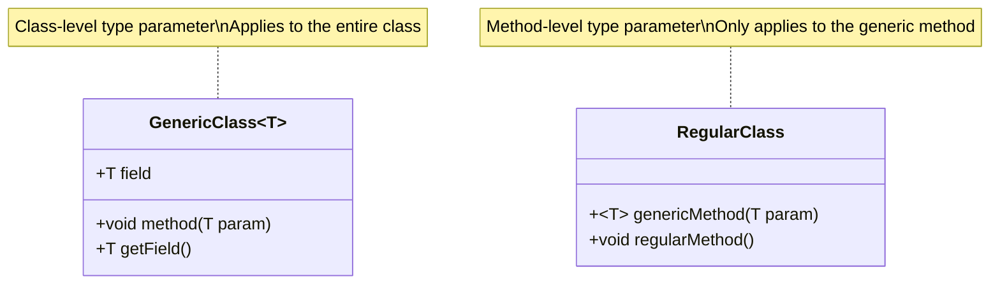

# Java Generic Methods

## Introduction

Generic methods are a powerful feature in Java that allow you to write a single method declaration that can operate on different types while maintaining type safety. Just as you can create generic classes, you can also create generic methods that can work with different data types without compromising on type safety or requiring code duplication.

In this tutorial, we'll explore generic methods in depth, how to create them, when to use them, and how they enhance your Java code with specific examples.

## What are Generic Methods?

A generic method is a method that introduces its own type parameters, independently of the class it belongs to. This means that even in a non-generic class, you can have methods that work with generic types.

The syntax for generic methods includes a type parameter section, denoted by angle brackets `<>`, that appears before the method's return type.

## Basic Syntax of Generic Methods

Here's the basic syntax for declaring a generic method:

```java
public <T> returnType methodName(T parameter) {
    // Method body
}
```

Where:
- `<T>` is the type parameter declaration
- `T` can be used as a type within the method (for parameters, local variables, or return type)
- You can have multiple type parameters like `<T, U, V>`

## Creating Your First Generic Method

Let's create a simple generic method that prints any type of array:

```java
public class GenericMethodExample {
    
    // Generic method to print array of any type
    public <E> void printArray(E[] array) {
        // Display array elements
        for (E element : array) {
            System.out.print(element + " ");
        }
        System.out.println();
    }
    
    public static void main(String[] args) {
        // Create arrays of Integer, Double and Character
        Integer[] intArray = {1, 2, 3, 4, 5};
        Double[] doubleArray = {1.1, 2.2, 3.3, 4.4};
        Character[] charArray = {'H', 'E', 'L', 'L', 'O'};
        
        GenericMethodExample example = new GenericMethodExample();
        
        // Call generic method with different arrays
        System.out.println("Integer Array:");
        example.printArray(intArray);
        
        System.out.println("Double Array:");
        example.printArray(doubleArray);
        
        System.out.println("Character Array:");
        example.printArray(charArray);
    }
}
```

**Output:**
```
Integer Array:
1 2 3 4 5 
Double Array:
1.1 2.2 3.3 4.4 
Character Array:
H E L L O 
```

In this example, the `printArray()` method can accept arrays of any reference type because it's defined as a generic method with type parameter `<E>`.

## Generic Methods with Multiple Type Parameters

You can define a generic method with multiple type parameters when you need to work with different types within the same method:

```java
public class MultiTypeGenericMethod {
    
    // Generic method with multiple type parameters
    public <K, V> void printPair(K key, V value) {
        System.out.println("Key: " + key + ", Value: " + value);
    }
    
    public static void main(String[] args) {
        MultiTypeGenericMethod example = new MultiTypeGenericMethod();
        
        // Use the method with different type combinations
        example.printPair(10, "Ten");
        example.printPair("ID", 1001);
        example.printPair(5.5, true);
    }
}
```

**Output:**
```
Key: 10, Value: Ten
Key: ID, Value: 1001
Key: 5.5, Value: true
```

## Type Parameter Naming Conventions

While you can use any valid identifier for type parameters, the Java convention is to use single, uppercase letters. Common conventions include:

- `T` - Type
- `E` - Element (used extensively by the Java Collections Framework)
- `K` - Key
- `V` - Value
- `N` - Number
- `S`, `U`, `V` etc. - Second, third, and fourth types

## Generic Methods with Bounded Type Parameters

Sometimes you might want to restrict the types that can be used as type arguments. This is done by using bounded type parameters:

```java
public class BoundedGenericMethod {
    
    // Generic method with bounded type parameter
    public <T extends Number> double sum(T[] array) {
        double sum = 0.0;
        
        for (T element : array) {
            sum += element.doubleValue(); // Convert to double and add
        }
        
        return sum;
    }
    
    public static void main(String[] args) {
        BoundedGenericMethod example = new BoundedGenericMethod();
        
        Integer[] intArray = {1, 2, 3, 4, 5};
        Double[] doubleArray = {1.1, 2.2, 3.3, 4.4};
        
        System.out.println("Sum of Integer array: " + example.sum(intArray));
        System.out.println("Sum of Double array: " + example.sum(doubleArray));
        
        // This would not compile because String is not a subclass of Number
        // String[] stringArray = {"hello", "world"};
        // example.sum(stringArray); // Compilation error!
    }
}
```

**Output:**
```
Sum of Integer array: 15.0
Sum of Double array: 11.0
```

In this example, the type parameter `T` is bounded to be a subclass of `Number`, which allows you to use methods from the `Number` class like `doubleValue()`.

## Generic Methods with Wildcards

Wildcards in generic methods provide additional flexibility. There are three types of wildcards:

1. Unbounded wildcard: `<?>`
2. Upper bounded wildcard: `<? extends Type>`
3. Lower bounded wildcard: `<? super Type>`

```java
public class GenericWildcardMethods {
    
    // Using unbounded wildcard
    public static void printList(List<?> list) {
        for (Object elem : list) {
            System.out.print(elem + " ");
        }
        System.out.println();
    }
    
    // Using upper bounded wildcard
    public static double sumOfList(List<? extends Number> list) {
        double sum = 0.0;
        for (Number n : list) {
            sum += n.doubleValue();
        }
        return sum;
    }
    
    // Using lower bounded wildcard
    public static void addIntegers(List<? super Integer> list) {
        list.add(10);
        list.add(20);
    }
    
    public static void main(String[] args) {
        // Using unbounded wildcard
        List<Integer> intList = Arrays.asList(1, 2, 3);
        List<String> stringList = Arrays.asList("Hello", "World");
        
        System.out.println("Integer List:");
        printList(intList);
        
        System.out.println("String List:");
        printList(stringList);
        
        // Using upper bounded wildcard
        List<Integer> nums = Arrays.asList(1, 2, 3);
        System.out.println("Sum: " + sumOfList(nums));
        
        // Using lower bounded wildcard
        List<Number> numberList = new ArrayList<>();
        addIntegers(numberList);
        System.out.println("After adding integers: " + numberList);
    }
}
```

**Output:**
```
Integer List:
1 2 3 
String List:
Hello World 
Sum: 6.0
After adding integers: [10, 20]
```

## Static Generic Methods

Generic methods can also be static. This is particularly useful when you want utility methods that can operate on different types:

```java
public class StaticGenericMethod {
    
    // Static generic method
    public static <T> T findMax(T[] array, Comparator<T> comparator) {
        if (array == null || array.length == 0) {
            return null;
        }
        
        T max = array[0];
        for (int i = 1; i < array.length; i++) {
            if (comparator.compare(array[i], max) > 0) {
                max = array[i];
            }
        }
        return max;
    }
    
    public static void main(String[] args) {
        // Find max integer
        Integer[] integers = {5, 3, 10, 2, 8};
        Integer maxInt = findMax(integers, Integer::compare);
        System.out.println("Max integer: " + maxInt);
        
        // Find max string (by length)
        String[] strings = {"apple", "banana", "pear", "strawberry", "fig"};
        String maxString = findMax(strings, Comparator.comparing(String::length));
        System.out.println("Longest string: " + maxString);
    }
}
```

**Output:**
```
Max integer: 10
Longest string: strawberry
```

## Real-World Example: Generic Exchange Method

Let's see a practical example of a generic method that exchanges the positions of two elements in an array:

```java
public class ArrayUtils {
    
    // Generic method to exchange elements
    public static <T> void swap(T[] array, int i, int j) {
        if (i < 0 || i >= array.length || j < 0 || j >= array.length) {
            throw new IndexOutOfBoundsException("Invalid index");
        }
        
        T temp = array[i];
        array[i] = array[j];
        array[j] = temp;
    }
    
    public static void main(String[] args) {
        // Test with String array
        String[] fruits = {"Apple", "Banana", "Cherry", "Date"};
        System.out.println("Before swap: " + Arrays.toString(fruits));
        
        swap(fruits, 0, 3);
        System.out.println("After swap: " + Arrays.toString(fruits));
        
        // Test with Integer array
        Integer[] numbers = {1, 2, 3, 4, 5};
        System.out.println("Before swap: " + Arrays.toString(numbers));
        
        swap(numbers, 1, 4);
        System.out.println("After swap: " + Arrays.toString(numbers));
    }
}
```

**Output:**
```
Before swap: [Apple, Banana, Cherry, Date]
After swap: [Date, Banana, Cherry, Apple]
Before swap: [1, 2, 3, 4, 5]
After swap: [1, 5, 3, 4, 2]
```

## Type Inference in Generic Methods

Java compiler can infer the type arguments for generic methods in many cases, which makes your code cleaner:

```java
public class TypeInferenceExample {
    
    public static <T> List<T> createEmptyList() {
        return new ArrayList<>();
    }
    
    public static void main(String[] args) {
        // Without type inference (Java 5-6 style)
        List<String> stringList = TypeInferenceExample.<String>createEmptyList();
        
        // With type inference (Java 7+)
        List<Integer> intList = createEmptyList();
        
        // The compiler infers the type based on context
        stringList.add("Hello");
        intList.add(42);
        
        System.out.println(stringList);
        System.out.println(intList);
    }
}
```

**Output:**
```
[Hello]
[42]
```

## Generic Methods Design Patterns

### 1. Factory Pattern Using Generic Methods

```java
public class GenericFactory {
    
    public static <T> T createInstance(Class<T> clazz) throws Exception {
        return clazz.getDeclaredConstructor().newInstance();
    }
    
    public static void main(String[] args) {
        try {
            // Create objects using the factory method
            ArrayList<String> list = createInstance(ArrayList.class);
            HashSet<Integer> set = createInstance(HashSet.class);
            
            // Use created objects
            list.add("Test");
            set.add(123);
            
            System.out.println("List: " + list);
            System.out.println("Set: " + set);
        } catch (Exception e) {
            e.printStackTrace();
        }
    }
}
```

**Output:**
```
List: [Test]
Set: [123]
```

### 2. Adapter Pattern Using Generic Methods

```java
interface Shape {
    double area();
}

class Circle implements Shape {
    private double radius;
    
    public Circle(double radius) {
        this.radius = radius;
    }
    
    @Override
    public double area() {
        return Math.PI * radius * radius;
    }
}

class Rectangle implements Shape {
    private double width;
    private double height;
    
    public Rectangle(double width, double height) {
        this.width = width;
        this.height = height;
    }
    
    @Override
    public double area() {
        return width * height;
    }
}

public class ShapeUtils {
    // Generic method that adapts any Shape to return formatted area
    public static <T extends Shape> String getFormattedArea(T shape) {
        return String.format("Area: %.2f square units", shape.area());
    }
    
    public static void main(String[] args) {
        Circle circle = new Circle(5.0);
        Rectangle rectangle = new Rectangle(4.0, 6.0);
        
        System.out.println("Circle " + getFormattedArea(circle));
        System.out.println("Rectangle " + getFormattedArea(rectangle));
    }
}
```

**Output:**
```
Circle Area: 78.54 square units
Rectangle Area: 24.00 square units
```

## When to Use Generic Methods

Generic methods are particularly useful in the following situations:

1. When you need to operate on collections of different types
2. When creating utility methods that should work with any type
3. When implementing algorithms that are independent of the specific data type
4. When you want to ensure type safety without code duplication
5. When you're creating APIs that need to be flexible yet type-safe

## Generic Methods vs. Generic Classes

Here's a visual representation of the difference between generic methods and generic classes:



The key differences:
1. Generic classes declare type parameters at the class level, affecting all relevant methods and fields
2. Generic methods declare type parameters at the method level, only affecting that specific method
3. You can have generic methods in non-generic classes
4. You can have generic methods with different type parameters than their containing generic class

## Common Mistakes and Pitfalls

### 1. Raw Type Usage

```java
// Incorrect - uses raw type
public static void printList(List list) { ... }

// Correct - uses generic type
public static <T> void printList(List<T> list) { ... }
```

### 2. Not Constraining Types When Necessary

```java
// Too permissive - any type will work
public static <T> T max(T a, T b) {
    return a > b ? a : b; // Won't compile!
}

// Correct - constrained to Comparable types
public static <T extends Comparable<T>> T max(T a, T b) {
    return a.compareTo(b) > 0 ? a : b;
}
```

### 3. Confusion with Wildcards

```java
// Incorrect - too restrictive
public static <T> void copy(List<T> dest, List<T> src) { ... }

// Correct - allows compatible types
public static <T> void copy(List<T> dest, List<? extends T> src) { ... }
```

### 4. Not Using Type Inference

```java
// Unnecessary type parameter specification
Map<String, List<String>> map = GenericUtils.<String, List<String>>createMap();

// Let the compiler infer the types
Map<String, List<String>> map = GenericUtils.createMap();
```

## Summary

Generic methods are a powerful feature in Java that allows you to create flexible, reusable, and type-safe code. In this tutorial, we've covered:

- The basic syntax and declaration of generic methods
- Creating generic methods with single and multiple type parameters
- Using bounded type parameters to restrict applicable types
- Working with wildcards for additional flexibility
- Static generic methods for utility functions
- Real-world examples and design patterns using generic methods
- When to use generic methods and common pitfalls to avoid

By incorporating generic methods into your Java programming toolkit, you can write cleaner, more reusable code while maintaining strong type safety. This provides the best of both worlds: flexibility and compile-time checking.

## Additional Resources

- [Oracle's Java Tutorials: Generic Methods](https://docs.oracle.com/javase/tutorial/java/generics/methods.html)
- [Java Generics FAQ](http://www.angelikalanger.com/GenericsFAQ/JavaGenericsFAQ.html)
- [Effective Java by Joshua Bloch](https://www.oreilly.com/library/view/effective-java-3rd/9780134686097/) - Item 30: Favor generic methods

## Exercises

1. Create a generic method that finds and returns the minimum element in an array.
2. Write a generic method that converts an array to a list.
3. Implement a generic binary search method.
4. Create a generic method that merges two sorted lists into a new sorted list.
5. Develop a generic method that filters elements from a list based on a predicate.

Happy coding with generic methods in Java!