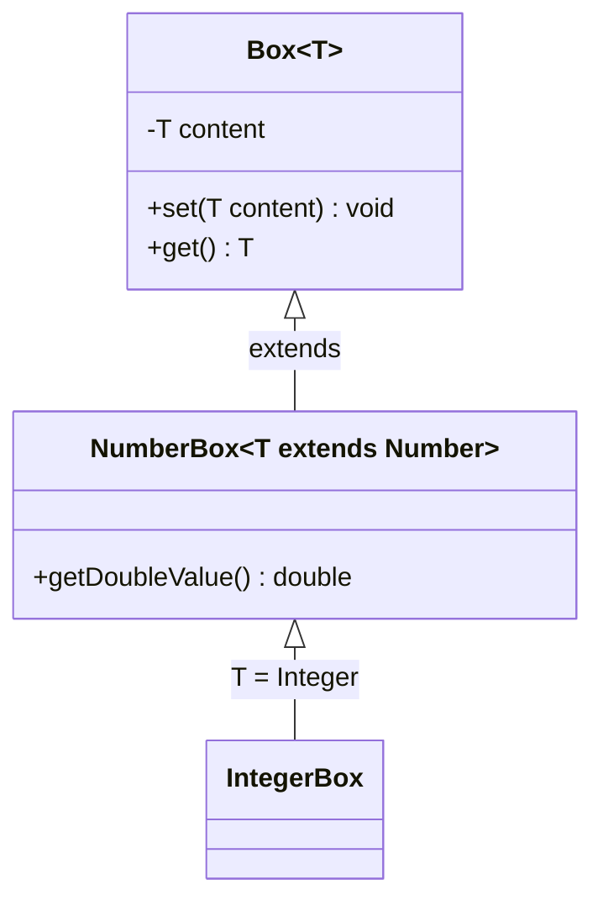

# Java Generic Classes

## Introduction

Generic classes are one of the most powerful features in Java, introduced in Java 5. They allow you to define classes, interfaces, and methods that can work with different types while providing compile-time type safety. Instead of creating separate implementations for each data type, you can create a single generic class that works with any type you specify when using it.

In this tutorial, we'll explore how to define, implement, and use generic classes in Java, along with practical examples to help you understand their benefits.

## Why Use Generic Classes?

Before diving into the syntax, let's understand why generic classes are important:

1. **Type Safety**: Generics provide compile-time type checking, reducing the risk of ClassCastException at runtime.
2. **Code Reusability**: Write a class once and use it with multiple types.
3. **Elimination of Type Casting**: No need for explicit type casting when retrieving elements.
4. **Better API Design**: Create more flexible and type-safe APIs.

## Basic Syntax of Generic Classes

To create a generic class, you use angle brackets `<>` with a type parameter after the class name:

```java
public class Box<T> {
    private T content;
    
    public void set(T content) {
        this.content = content;
    }
    
    public T get() {
        return content;
    }
}
```

In this example:
- `T` is a type parameter that acts as a placeholder for the actual type.
- When you instantiate the class, you specify what type `T` should be.

## Using Generic Classes

Here's how to use the generic `Box` class:

```java
// Create a Box for storing Strings
Box<String> stringBox = new Box<>();
stringBox.set("Hello, Generics!");
String greeting = stringBox.get();  // No casting needed
System.out.println(greeting);

// Create a Box for storing Integers
Box<Integer> intBox = new Box<>();
intBox.set(42);
Integer number = intBox.get();  // No casting needed
System.out.println(number);
```

**Output:**
```
Hello, Generics!
42
```

Notice that we didn't need to cast the returned value when calling `get()`. This is because the compiler knows exactly what type is stored in the box.

## Multiple Type Parameters

You can define a generic class with multiple type parameters:

```java
public class Pair<K, V> {
    private K key;
    private V value;
    
    public Pair(K key, V value) {
        this.key = key;
        this.value = value;
    }
    
    public K getKey() {
        return key;
    }
    
    public V getValue() {
        return value;
    }
    
    @Override
    public String toString() {
        return key + " = " + value;
    }
}
```

Here's how to use the `Pair` class:

```java
Pair<String, Integer> person = new Pair<>("John", 25);
System.out.println("Name: " + person.getKey());
System.out.println("Age: " + person.getValue());
System.out.println(person);  // Uses the toString() method

Pair<Double, Double> point = new Pair<>(2.5, 3.7);
System.out.println("X coordinate: " + point.getKey());
System.out.println("Y coordinate: " + point.getValue());
```

**Output:**
```
Name: John
Age: 25
John = 25
X coordinate: 2.5
Y coordinate: 3.7
```

## Type Parameter Naming Conventions

By convention, type parameters in Java use single, uppercase letters:

- `T` - Type
- `E` - Element (used extensively in the Collections framework)
- `K` - Key
- `V` - Value
- `N` - Number
- `S`, `U`, `V` etc. - 2nd, 3rd, 4th types

Following these conventions makes your code more readable to other Java developers.

## Bounded Type Parameters

Sometimes you might want to restrict the types that can be used with your generic class. You can do this with bounded type parameters using the `extends` keyword:

```java
public class MathBox<T extends Number> {
    private T value;
    
    public MathBox(T value) {
        this.value = value;
    }
    
    public T getValue() {
        return value;
    }
    
    public double getSquareRoot() {
        return Math.sqrt(value.doubleValue());
    }
    
    public double add(T another) {
        return value.doubleValue() + another.doubleValue();
    }
}
```

In this example, `T extends Number` means that `T` must be `Number` or a subclass of `Number` (like `Integer`, `Double`, etc.). This gives us access to `Number` methods like `doubleValue()`.

Here's how to use the `MathBox` class:

```java
MathBox<Integer> intMathBox = new MathBox<>(16);
System.out.println("Square root of " + intMathBox.getValue() + " is " + intMathBox.getSquareRoot());

MathBox<Double> doubleMathBox = new MathBox<>(7.5);
System.out.println("7.5 + 2.5 = " + doubleMathBox.add(2.5));

// This would cause a compile-time error:
// MathBox<String> stringMathBox = new MathBox<>("Hello");  // String doesn't extend Number
```

**Output:**
```
Square root of 16 is 4.0
7.5 + 2.5 = 10.0
```

## Generic Methods in Generic Classes

You can also define generic methods within generic classes. These methods can use the class's type parameters or introduce their own:

```java
public class Utilities<T> {
    private T defaultValue;
    
    public Utilities(T defaultValue) {
        this.defaultValue = defaultValue;
    }
    
    // Method that uses the class's type parameter T
    public T getOrDefault(T value) {
        return (value != null) ? value : defaultValue;
    }
    
    // Generic method with its own type parameter E
    public <E> E firstNonNull(E first, E second) {
        return (first != null) ? first : second;
    }
    
    // Generic method that takes an array of any type and returns the first element
    public <E> E getFirstElement(E[] array) {
        if (array == null || array.length == 0) {
            return null;
        }
        return array[0];
    }
}
```

Here's how to use these methods:

```java
Utilities<String> stringUtils = new Utilities<>("default");
String result1 = stringUtils.getOrDefault(null);
System.out.println("Default value: " + result1);

String result2 = stringUtils.firstNonNull(null, "backup");
System.out.println("First non-null: " + result2);

Integer[] numbers = {1, 2, 3, 4, 5};
Integer firstNumber = stringUtils.getFirstElement(numbers);
System.out.println("First element: " + firstNumber);
```

**Output:**
```
Default value: default
First non-null: backup
First element: 1
```

## Type Erasure

It's important to understand that Java generics are implemented using a mechanism called "type erasure." This means that generic type information is only available at compile time and is erased by the compiler afterward.

For example, at runtime, `Box<String>` and `Box<Integer>` are both just `Box` classes. This was done for backward compatibility with pre-generic Java code.

Because of type erasure, there are certain limitations when working with generics:
- You cannot create an instance of a type parameter: `new T()` is not allowed
- You cannot create arrays of generic types: `new T[10]` is not allowed
- You cannot use `instanceof` with generic types
- You cannot use primitive types as type arguments (use wrapper classes instead)

## Real-world Example: A Custom Generic Collection

Let's implement a simple generic collection class to understand how generics are used in real applications:

```java
public class SimpleList<E> {
    private static final int DEFAULT_CAPACITY = 10;
    private Object[] elements;
    private int size;
    
    public SimpleList() {
        elements = new Object[DEFAULT_CAPACITY];
        size = 0;
    }
    
    public void add(E element) {
        if (size == elements.length) {
            growCapacity();
        }
        elements[size++] = element;
    }
    
    @SuppressWarnings("unchecked")
    public E get(int index) {
        if (index < 0 || index >= size) {
            throw new IndexOutOfBoundsException("Index: " + index + ", Size: " + size);
        }
        return (E) elements[index];
    }
    
    public int size() {
        return size;
    }
    
    private void growCapacity() {
        Object[] newElements = new Object[elements.length * 2];
        System.arraycopy(elements, 0, newElements, 0, elements.length);
        elements = newElements;
    }
}
```

Let's use our `SimpleList` class:

```java
// Create a list of strings
SimpleList<String> names = new SimpleList<>();
names.add("Alice");
names.add("Bob");
names.add("Charlie");

// Iterate through the list
for (int i = 0; i < names.size(); i++) {
    System.out.println("Name at index " + i + ": " + names.get(i));
}

// Create a list of integers
SimpleList<Integer> scores = new SimpleList<>();
scores.add(95);
scores.add(87);
scores.add(100);

// Calculate the sum
int sum = 0;
for (int i = 0; i < scores.size(); i++) {
    sum += scores.get(i);
}
System.out.println("Average score: " + (sum / scores.size()));
```

**Output:**
```
Name at index 0: Alice
Name at index 1: Bob
Name at index 2: Charlie
Average score: 94
```

## The Relationship Between Generic Classes

Let's explore how generics interact with inheritance:



Important points to understand:

1. **Type parameter inheritance**: `Box<Number>` is **not** a superclass of `Box<Integer>`, even though `Number` is a superclass of `Integer`.
2. **Generic class inheritance**: A class can extend a generic class or implement a generic interface with either concrete or generic types.

Here's a code example that demonstrates these relationships:

```java
// NumberBox is a generic class that extends Box, with a type constraint
class NumberBox<T extends Number> extends Box<T> {
    public double getDoubleValue() {
        return get().doubleValue();
    }
}

// IntegerBox is a concrete extension of NumberBox
class IntegerBox extends NumberBox<Integer> {
    public int incrementAndGet() {
        set(get() + 1);
        return get();
    }
}
```

Usage example:

```java
IntegerBox iBox = new IntegerBox();
iBox.set(5);
System.out.println("Value as double: " + iBox.getDoubleValue());
System.out.println("Incremented value: " + iBox.incrementAndGet());

// This works because IntegerBox IS-A Box<Integer>
Box<Integer> boxRef = iBox;
System.out.println(boxRef.get());

// But this doesn't work, because Box<Number> is NOT a supertype of Box<Integer>
// Box<Number> numberBox = iBox;  // Compile error
```

**Output:**
```
Value as double: 5.0
Incremented value: 6
6
```

## Summary

Generic classes in Java provide a powerful mechanism for creating reusable, type-safe code. They allow you to write classes and methods that can work with different types while maintaining compile-time type safety.

Key points to remember:
- Generic classes use type parameters in angle brackets: `class Name<T>`
- You can have multiple type parameters: `class Name<K, V>`
- Type parameters can be bounded: `class Name<T extends Number>`
- Generic classes can contain both generic and non-generic methods
- Due to type erasure, certain operations on type parameters are not allowed

By mastering generic classes, you'll be able to write more flexible, reusable code and take full advantage of Java's type system to catch errors at compile time rather than runtime.

## Exercises

1. Create a generic `Stack<T>` class with `push()`, `pop()`, `peek()`, and `isEmpty()` methods.
2. Implement a generic `Pair<T, U>` class where both items can be of different types.
3. Create a `MinMax<T extends Comparable<T>>` class that stores minimum and maximum values of type T.
4. Implement a generic `Cache<K, V>` class that stores key-value pairs with methods to add, retrieve, and check if a key exists.
5. Create a `FilteredList<T>` class that can store elements of type T and filter them based on a given condition.

## Additional Resources

- [Java Generics Tutorial (Oracle)](https://docs.oracle.com/javase/tutorial/java/generics/index.html)
- [Effective Java by Joshua Bloch](https://www.oreilly.com/library/view/effective-java-3rd/9780134686097/) - Chapter on Generics
- [Java Generics and Collections](https://www.oreilly.com/library/view/java-generics-and/0596527756/) by Maurice Naftalin and Philip Wadler