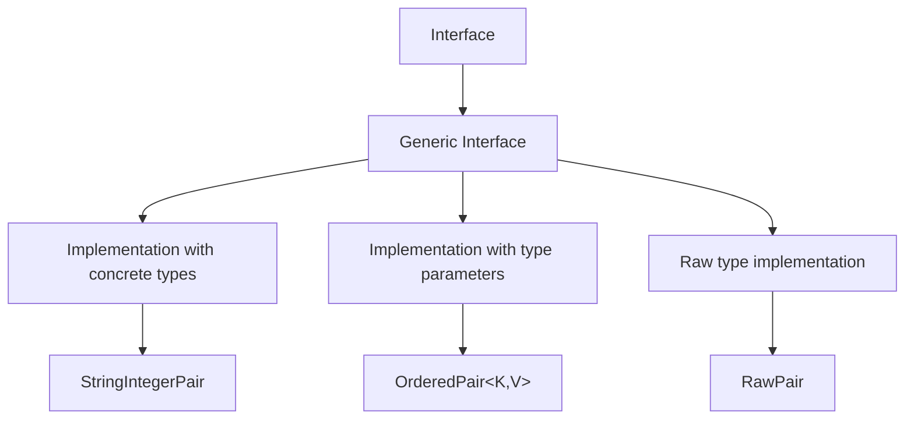

# Java Generic Interfaces

## Introduction

Generic interfaces represent one of the most powerful features in Java's type system. They allow you to define interfaces with type parameters, enabling you to create flexible and type-safe contracts that can work with different data types. Just like generic classes, generic interfaces help eliminate type casting and provide compile-time type checking, making your code more robust and less prone to runtime errors.

In this tutorial, you'll learn how to define, implement, and use generic interfaces in Java. We'll explore various examples and real-world applications to help you understand how generic interfaces can improve your code's flexibility and reusability.

## Understanding Generic Interfaces

### What is a Generic Interface?

A generic interface is an interface that is parameterized over types. It allows you to specify, at the time of implementation or use, the types that the interface will operate on.

Here's the basic syntax for defining a generic interface:

```java
public interface InterfaceName<T> {
    // Methods declaration using type T
    T methodName(T parameter);
    // Other methods...
}
```

Where `T` is a type parameter that will be replaced with a concrete type when the interface is implemented or used.

### Why Use Generic Interfaces?

Generic interfaces provide several benefits:

1. **Type Safety**: They help catch type errors at compile time rather than runtime
2. **Elimination of Casting**: They reduce the need for explicit type casting
3. **Code Reusability**: The same interface can be used with different data types
4. **API Design**: They enable the creation of flexible and type-safe APIs

## Defining Generic Interfaces

Let's start by creating a simple generic interface:

```java
public interface Pair<K, V> {
    K getKey();
    V getValue();
    void setKey(K key);
    void setValue(V value);
}
```

In this example, `Pair<K, V>` is a generic interface with two type parameters: `K` for the key type and `V` for the value type.

## Implementing Generic Interfaces

There are several ways to implement a generic interface:

### 1. Implementing with Concrete Types

You can implement a generic interface by specifying concrete types:

```java
public class StringIntegerPair implements Pair<String, Integer> {
    private String key;
    private Integer value;
    
    public StringIntegerPair(String key, Integer value) {
        this.key = key;
        this.value = value;
    }
    
    @Override
    public String getKey() {
        return key;
    }
    
    @Override
    public Integer getValue() {
        return value;
    }
    
    @Override
    public void setKey(String key) {
        this.key = key;
    }
    
    @Override
    public void setValue(Integer value) {
        this.value = value;
    }
}
```

Usage example:

```java
public class Main {
    public static void main(String[] args) {
        StringIntegerPair pair = new StringIntegerPair("Age", 25);
        System.out.println(pair.getKey() + ": " + pair.getValue());
        
        pair.setValue(26);
        System.out.println(pair.getKey() + ": " + pair.getValue());
    }
}
```

Output:
```
Age: 25
Age: 26
```

### 2. Implementing with Generic Type Parameters

You can also create a generic class that implements a generic interface:

```java
public class OrderedPair<K, V> implements Pair<K, V> {
    private K key;
    private V value;
    
    public OrderedPair(K key, V value) {
        this.key = key;
        this.value = value;
    }
    
    @Override
    public K getKey() {
        return key;
    }
    
    @Override
    public V getValue() {
        return value;
    }
    
    @Override
    public void setKey(K key) {
        this.key = key;
    }
    
    @Override
    public void setValue(V value) {
        this.value = value;
    }
}
```

Usage example:

```java
public class Main {
    public static void main(String[] args) {
        // String, Integer pair
        Pair<String, Integer> ageMapping = new OrderedPair<>("John", 25);
        System.out.println(ageMapping.getKey() + " is " + ageMapping.getValue() + " years old");
        
        // String, String pair
        Pair<String, String> capitalMapping = new OrderedPair<>("USA", "Washington D.C.");
        System.out.println("The capital of " + capitalMapping.getKey() + " is " + capitalMapping.getValue());
    }
}
```

Output:
```
John is 25 years old
The capital of USA is Washington D.C.
```

### 3. Raw Types (Not Recommended)

You can implement a generic interface without specifying type arguments, but this is not recommended as it bypasses generic type checking:

```java
public class RawPair implements Pair {  // Raw type, not recommended
    private Object key;
    private Object value;
    
    @Override
    public Object getKey() {
        return key;
    }
    
    @Override
    public Object getValue() {
        return value;
    }
    
    @Override
    public void setKey(Object key) {
        this.key = key;
    }
    
    @Override
    public void setValue(Object value) {
        this.value = value;
    }
}
```

## Extending Generic Interfaces

Generic interfaces can extend other generic interfaces:

```java
public interface SortedPair<K extends Comparable<K>, V> extends Pair<K, V> {
    int compareKeys(K otherKey);
}
```

Implementation:

```java
public class ComparablePair<K extends Comparable<K>, V> implements SortedPair<K, V> {
    private K key;
    private V value;
    
    public ComparablePair(K key, V value) {
        this.key = key;
        this.value = value;
    }
    
    @Override
    public K getKey() {
        return key;
    }
    
    @Override
    public V getValue() {
        return value;
    }
    
    @Override
    public void setKey(K key) {
        this.key = key;
    }
    
    @Override
    public void setValue(V value) {
        this.value = value;
    }
    
    @Override
    public int compareKeys(K otherKey) {
        return this.key.compareTo(otherKey);
    }
}
```

Usage example:

```java
public class Main {
    public static void main(String[] args) {
        ComparablePair<String, Integer> pair1 = new ComparablePair<>("Apple", 10);
        
        System.out.println("Comparing 'Apple' with 'Banana': " + 
                          pair1.compareKeys("Banana"));  // Negative number
        System.out.println("Comparing 'Apple' with 'Apple': " + 
                          pair1.compareKeys("Apple"));   // Zero
        System.out.println("Comparing 'Apple' with 'Aardvark': " + 
                          pair1.compareKeys("Aardvark"));  // Positive number
    }
}
```

Output:
```
Comparing 'Apple' with 'Banana': -1
Comparing 'Apple' with 'Apple': 0
Comparing 'Apple' with 'Aardvark': 15
```

## Type Bounds in Generic Interfaces

You can restrict the types that can be used with a generic interface using bounds:

### Upper Bounded Interface

```java
public interface NumberProcessor<T extends Number> {
    double process(T number);
    T getMaxValue();
}
```

Implementation:

```java
public class IntegerProcessor implements NumberProcessor<Integer> {
    @Override
    public double process(Integer number) {
        return number * 2.5;
    }
    
    @Override
    public Integer getMaxValue() {
        return Integer.MAX_VALUE;
    }
}
```

Usage:

```java
public class Main {
    public static void main(String[] args) {
        NumberProcessor<Integer> processor = new IntegerProcessor();
        System.out.println("Processing 10: " + processor.process(10));
        System.out.println("Max value: " + processor.getMaxValue());
    }
}
```

Output:
```
Processing 10: 25.0
Max value: 2147483647
```

## Real-World Applications

### Example 1: Generic Repository Interface

A common use case for generic interfaces is in creating a repository pattern for data access:

```java
// Generic repository interface
public interface Repository<T, ID> {
    T findById(ID id);
    List<T> findAll();
    void save(T entity);
    void update(T entity);
    void delete(ID id);
}

// Implementation for User entity
class UserRepository implements Repository<User, Long> {
    private Map<Long, User> users = new HashMap<>();
    
    @Override
    public User findById(Long id) {
        return users.get(id);
    }
    
    @Override
    public List<User> findAll() {
        return new ArrayList<>(users.values());
    }
    
    @Override
    public void save(User entity) {
        users.put(entity.getId(), entity);
    }
    
    @Override
    public void update(User entity) {
        if (users.containsKey(entity.getId())) {
            users.put(entity.getId(), entity);
        }
    }
    
    @Override
    public void delete(Long id) {
        users.remove(id);
    }
}

// User class
class User {
    private Long id;
    private String name;
    
    public User(Long id, String name) {
        this.id = id;
        this.name = name;
    }
    
    public Long getId() {
        return id;
    }
    
    public String getName() {
        return name;
    }
}
```

Usage:

```java
public class Main {
    public static void main(String[] args) {
        Repository<User, Long> userRepo = new UserRepository();
        
        // Save users
        userRepo.save(new User(1L, "Alice"));
        userRepo.save(new User(2L, "Bob"));
        
        // Find user
        User user = userRepo.findById(1L);
        System.out.println("Found user: " + user.getName());
        
        // List all users
        List<User> allUsers = userRepo.findAll();
        System.out.println("All users:");
        for (User u : allUsers) {
            System.out.println("- " + u.getName());
        }
    }
}
```

Output:
```
Found user: Alice
All users:
- Alice
- Bob
```

### Example 2: Generic Comparator Interface

Another common application is a generic comparator for custom sorting:

```java
// Generic comparator interface
public interface CustomComparator<T> {
    int compare(T first, T second);
    boolean isEqual(T first, T second);
}

// Implementation for string comparison
class StringLengthComparator implements CustomComparator<String> {
    @Override
    public int compare(String first, String second) {
        return first.length() - second.length();
    }
    
    @Override
    public boolean isEqual(String first, String second) {
        return first.length() == second.length();
    }
}

// Generic sorter that uses the comparator
class GenericSorter<T> {
    private CustomComparator<T> comparator;
    
    public GenericSorter(CustomComparator<T> comparator) {
        this.comparator = comparator;
    }
    
    public void sort(List<T> list) {
        for (int i = 0; i < list.size(); i++) {
            for (int j = i + 1; j < list.size(); j++) {
                if (comparator.compare(list.get(i), list.get(j)) > 0) {
                    T temp = list.get(i);
                    list.set(i, list.get(j));
                    list.set(j, temp);
                }
            }
        }
    }
}
```

Usage:

```java
public class Main {
    public static void main(String[] args) {
        CustomComparator<String> lengthComparator = new StringLengthComparator();
        GenericSorter<String> sorter = new GenericSorter<>(lengthComparator);
        
        List<String> words = new ArrayList<>();
        words.add("elephant");
        words.add("cat");
        words.add("rhinoceros");
        words.add("dog");
        words.add("bird");
        
        System.out.println("Before sorting: " + words);
        sorter.sort(words);
        System.out.println("After sorting by length: " + words);
        
        // Check equality
        System.out.println("'cat' and 'dog' have equal length: " + 
                         lengthComparator.isEqual("cat", "dog"));
        System.out.println("'cat' and 'elephant' have equal length: " + 
                         lengthComparator.isEqual("cat", "elephant"));
    }
}
```

Output:
```
Before sorting: [elephant, cat, rhinoceros, dog, bird]
After sorting by length: [cat, dog, bird, elephant, rhinoceros]
'cat' and 'dog' have equal length: true
'cat' and 'elephant' have equal length: false
```

## Understanding the Type Hierarchy

Let's visualize how generic interfaces fit into Java's type system:



## Best Practices for Generic Interfaces

1. **Use descriptive type parameter names**: For simple types, use conventional names like T, E, K, V. For more complex scenarios, use more descriptive names.

2. **Apply bounded types when needed**: Use bounds (`extends` or `super`) to restrict the types that can be used with your interface.

3. **Avoid raw types**: Always specify the type parameters when implementing generic interfaces.

4. **Design for flexibility**: Create interfaces with the right level of abstraction to allow for various implementations.

5. **Use wildcards appropriately**: When you need more flexibility in method parameters.

6. **Document type parameters**: Clearly describe what each type parameter represents in your JavaDoc.

## Summary

In this tutorial, you learned about Java generic interfaces, including:

- How to define generic interfaces with type parameters
- Different ways to implement generic interfaces
- How to extend generic interfaces
- Using bounds to restrict type parameters
- Real-world applications of generic interfaces

Generic interfaces are a powerful tool in Java that allows you to create flexible, type-safe abstractions. They enable you to build reusable components that can work with different types while maintaining compile-time type safety.

## Exercises

1. Create a generic `Stack<T>` interface with methods `push`, `pop`, and `peek`. Implement this interface with an `ArrayStack<T>` class.

2. Design a `Converter<S, T>` interface that converts from type S to type T. Create implementations for common conversions (e.g., String to Integer, Integer to String).

3. Extend the `Repository<T, ID>` example to include methods for searching by criteria using a generic `Predicate<T>` interface.

4. Create a `Cache<K, V>` interface with methods to get, put, and remove items. Implement this interface with a class that uses a time-based eviction policy.

5. Design a generic `Validator<T>` interface with a `validate` method. Create implementations for validating common types of data (e.g., email addresses, phone numbers).

## Additional Resources

- [Oracle's Java Tutorials: Generic Types](https://docs.oracle.com/javase/tutorial/java/generics/types.html)
- [Java Generics FAQ](http://www.angelikalanger.com/GenericsFAQ/JavaGenericsFAQ.html)
- [Effective Java by Joshua Bloch](https://www.amazon.com/Effective-Java-Joshua-Bloch/dp/0134685997) - Chapter on Generics
- [Java Generics and Collections](https://www.amazon.com/Java-Generics-Collections-Maurice-Naftalin/dp/0596527756) by Maurice Naftalin and Philip Wadler