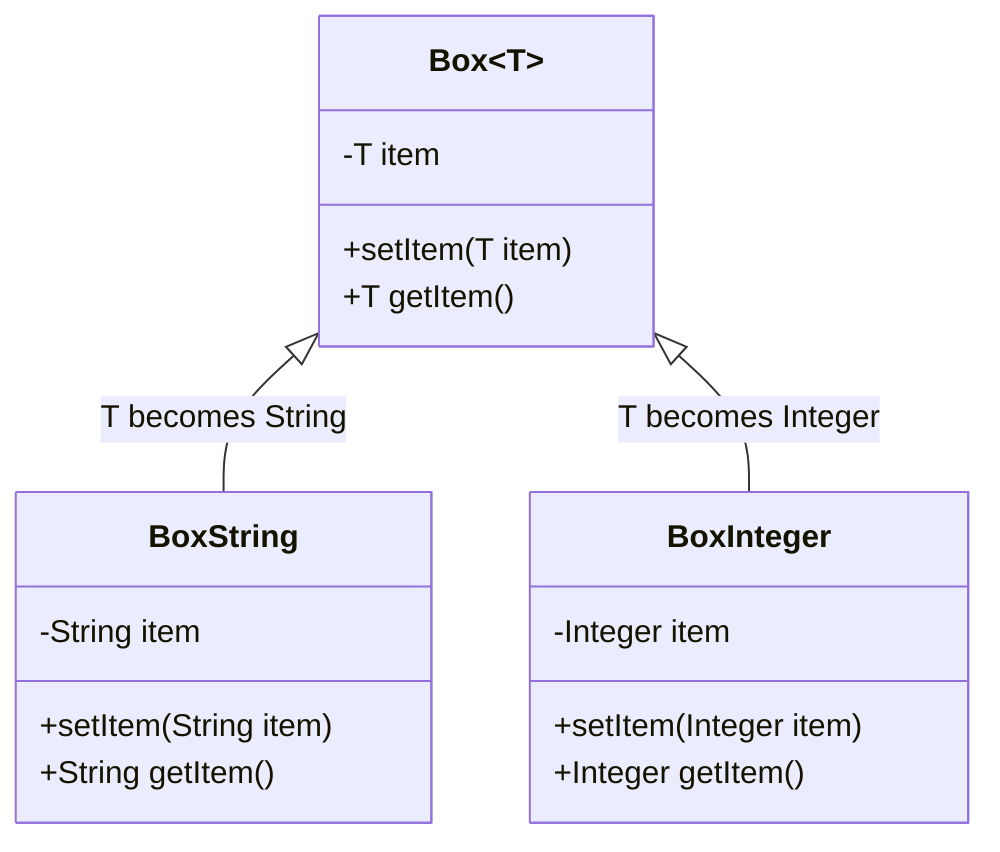

# Java Type Parameters

## Introduction

Type parameters are a fundamental concept in Java Generics that allow you to write flexible, type-safe code. They enable you to create classes, interfaces, and methods that can work with different types while maintaining compile-time type safety. 

Instead of using specific types like `String` or `Integer`, type parameters let you use placeholders that get replaced with actual types when your code is used. This powerful feature helps eliminate casting, reduce code duplication, and catch type errors during compilation rather than at runtime.

## What Are Type Parameters?

Type parameters (also called type variables) are placeholders for types that you specify when using a generic class, interface, or method. They are denoted by a single uppercase letter, conventionally:

- `T` for Type
- `E` for Element
- `K` for Key
- `V` for Value
- `N` for Number

Let's look at the basic syntax for type parameters:

```java
public class Box<T> {
    private T item;

    public void setItem(T item) {
        this.item = item;
    }

    public T getItem() {
        return item;
    }
}
```

In this example, `T` is a type parameter that represents the type of the item stored in the `Box`.

## Using Type Parameters in Classes

Let's create a simple generic container class with a type parameter and explore how to use it:

```java
public class Container<T> {
    private T value;
    
    public Container(T value) {
        this.value = value;
    }
    
    public T getValue() {
        return value;
    }
    
    public void setValue(T value) {
        this.value = value;
    }
    
    public void showType() {
        System.out.println("Type of T is: " + value.getClass().getName());
    }
}
```

Here's how you can use this generic class:

```java
public class TypeParameterDemo {
    public static void main(String[] args) {
        // Container with an Integer
        Container<Integer> intContainer = new Container<>(42);
        intContainer.showType();
        System.out.println("Value: " + intContainer.getValue());
        
        // Container with a String
        Container<String> stringContainer = new Container<>("Hello Generics");
        stringContainer.showType();
        System.out.println("Value: " + stringContainer.getValue());
    }
}
```

**Output:**
```
Type of T is: java.lang.Integer
Value: 42
Type of T is: java.lang.String
Value: Hello Generics
```

When you create a `Container<Integer>`, the type parameter `T` is replaced with `Integer` throughout the class. Similarly, with `Container<String>`, `T` becomes `String`.

## Multiple Type Parameters

You can use multiple type parameters when you need to work with more than one type. A common example is implementing a key-value pair:

```java
public class Pair<K, V> {
    private K key;
    private V value;
    
    public Pair(K key, V value) {
        this.key = key;
        this.value = value;
    }
    
    public K getKey() {
        return key;
    }
    
    public V getValue() {
        return value;
    }
    
    @Override
    public String toString() {
        return "(" + key + ", " + value + ")";
    }
}
```

Here's how you can use the `Pair` class:

```java
public class MultipleParametersDemo {
    public static void main(String[] args) {
        // A pair of String and Integer
        Pair<String, Integer> person = new Pair<>("John", 25);
        System.out.println("Name: " + person.getKey());
        System.out.println("Age: " + person.getValue());
        
        // A pair of String and Double
        Pair<String, Double> product = new Pair<>("Laptop", 999.99);
        System.out.println("Product: " + product.getKey());
        System.out.println("Price: $" + product.getValue());
        
        System.out.println("Person details: " + person);
        System.out.println("Product details: " + product);
    }
}
```

**Output:**
```
Name: John
Age: 25
Product: Laptop
Price: $999.99
Person details: (John, 25)
Product details: (Laptop, 999.99)
```

## Type Parameters in Methods

You can also declare type parameters for individual methods. These are called generic methods, and they can be static or instance methods:

```java
public class GenericMethods {
    // Generic method with single type parameter
    public static <T> void printArray(T[] array) {
        for (T element : array) {
            System.out.print(element + " ");
        }
        System.out.println();
    }
    
    // Generic method that swaps two elements in an array
    public static <E> void swap(E[] array, int i, int j) {
        if (i >= 0 && i < array.length && j >= 0 && j < array.length) {
            E temp = array[i];
            array[i] = array[j];
            array[j] = temp;
        }
    }
    
    // Generic method with multiple type parameters
    public static <K, V> boolean compareKeyValue(Pair<K, V> p1, Pair<K, V> p2) {
        return p1.getKey().equals(p2.getKey()) && 
               p1.getValue().equals(p2.getValue());
    }
}
```

Here's how you can use these generic methods:

```java
public class GenericMethodsDemo {
    public static void main(String[] args) {
        // Using printArray with different types
        Integer[] intArray = {1, 2, 3, 4, 5};
        String[] stringArray = {"Hello", "Generics", "in", "Java"};
        
        System.out.println("Integer array:");
        GenericMethods.printArray(intArray);
        
        System.out.println("String array:");
        GenericMethods.printArray(stringArray);
        
        // Using swap method
        System.out.println("\nBefore swap:");
        GenericMethods.printArray(stringArray);
        
        GenericMethods.swap(stringArray, 0, 3);
        
        System.out.println("After swap:");
        GenericMethods.printArray(stringArray);
        
        // Using compareKeyValue method
        Pair<String, Integer> pair1 = new Pair<>("key", 1);
        Pair<String, Integer> pair2 = new Pair<>("key", 1);
        Pair<String, Integer> pair3 = new Pair<>("key", 2);
        
        System.out.println("\nComparing pairs:");
        System.out.println("pair1 equals pair2: " + 
            GenericMethods.compareKeyValue(pair1, pair2));
        System.out.println("pair1 equals pair3: " + 
            GenericMethods.compareKeyValue(pair1, pair3));
    }
}
```

**Output:**
```
Integer array:
1 2 3 4 5 
String array:
Hello Generics in Java 

Before swap:
Hello Generics in Java 
After swap:
Java Generics in Hello 

Comparing pairs:
pair1 equals pair2: true
pair1 equals pair3: false
```

## Type Parameter Bounds

Sometimes, you may want to restrict the types that can be used as type arguments. You can do this using bounds:

### Upper Bounds

An upper bound restricts the type parameter to a specific type or its subclasses using the `extends` keyword:

```java
public class MathBox<T extends Number> {
    private T value;
    
    public MathBox(T value) {
        this.value = value;
    }
    
    public double sqrt() {
        return Math.sqrt(value.doubleValue());
    }
    
    public double add(T otherValue) {
        return value.doubleValue() + otherValue.doubleValue();
    }
    
    public T getValue() {
        return value;
    }
}
```

In this example, `T extends Number` means that `T` must be `Number` or a subclass of `Number`.

Let's see how to use it:

```java
public class BoundedTypeDemo {
    public static void main(String[] args) {
        // This works because Integer extends Number
        MathBox<Integer> intBox = new MathBox<>(16);
        System.out.println("Square root of " + intBox.getValue() + " is " + intBox.sqrt());
        
        // This works because Double extends Number
        MathBox<Double> doubleBox = new MathBox<>(25.0);
        System.out.println("Square root of " + doubleBox.getValue() + " is " + doubleBox.sqrt());
        
        // Adding two values
        System.out.println("16 + 4 = " + intBox.add(4));
        
        // This won't compile:
        // MathBox<String> stringBox = new MathBox<>("Hello");
    }
}
```

**Output:**
```
Square root of 16 is 4.0
Square root of 25.0 is 5.0
16 + 4 = 20.0
```

### Multiple Bounds

You can specify multiple bounds by using the `&` operator:

```java
public interface Displayable {
    void display();
}

// Class with multiple bounds
public class DisplayableNumber<T extends Number & Displayable> {
    private T value;
    
    public DisplayableNumber(T value) {
        this.value = value;
    }
    
    public void showNumber() {
        System.out.print("Value: ");
        value.display();
    }
}

// Example implementation of a class that satisfies both bounds
public class DisplayableInteger extends Integer implements Displayable {
    public DisplayableInteger(int value) {
        super(value);
    }
    
    @Override
    public void display() {
        System.out.println(this.intValue());
    }
}
```

## Type Erasure

It's important to understand that type parameters exist only at compile-time. At runtime, the Java Virtual Machine (JVM) erases the type parameters through a process called **type erasure**.

During type erasure:
1. All generic type information is removed
2. Type parameters are replaced with their bounds or Object if unbounded
3. Necessary casts are added by the compiler

This is why you'll see warnings about "unchecked" operations when mixing generics with non-generic code.

```java
// This is what your generic class looks like at runtime after type erasure
public class Container {  // T is erased
    private Object value;  // T becomes Object
    
    public Container(Object value) {
        this.value = value;
    }
    
    public Object getValue() {
        return value;
    }
    
    public void setValue(Object value) {
        this.value = value;
    }
}
```

## Real-World Applications

### Example 1: Generic Repository Pattern

Here's an example of how you might use type parameters in a simple data access layer:

```java
// A base entity class
public abstract class Entity {
    protected Long id;
    
    public Long getId() {
        return id;
    }
    
    public void setId(Long id) {
        this.id = id;
    }
}

// A generic repository interface
public interface Repository<T extends Entity> {
    T findById(Long id);
    List<T> findAll();
    void save(T entity);
    void delete(T entity);
}

// Implementation for a User entity
public class User extends Entity {
    private String username;
    private String email;
    
    // Constructors, getters and setters
}

// Repository implementation
public class UserRepository implements Repository<User> {
    private List<User> users = new ArrayList<>();
    
    @Override
    public User findById(Long id) {
        return users.stream()
                .filter(user -> user.getId().equals(id))
                .findFirst()
                .orElse(null);
    }
    
    @Override
    public List<User> findAll() {
        return new ArrayList<>(users);
    }
    
    @Override
    public void save(User user) {
        // Implementation details omitted for brevity
        users.add(user);
    }
    
    @Override
    public void delete(User user) {
        users.removeIf(u -> u.getId().equals(user.getId()));
    }
}
```

### Example 2: Generic Event Handling System

```java
public interface Event {
    long getTimestamp();
}

public class UserLoginEvent implements Event {
    private String username;
    private long timestamp;
    
    public UserLoginEvent(String username) {
        this.username = username;
        this.timestamp = System.currentTimeMillis();
    }
    
    public String getUsername() {
        return username;
    }
    
    @Override
    public long getTimestamp() {
        return timestamp;
    }
}

public interface EventListener<E extends Event> {
    void onEvent(E event);
}

public class EventBus<E extends Event> {
    private List<EventListener<E>> listeners = new ArrayList<>();
    
    public void subscribe(EventListener<E> listener) {
        listeners.add(listener);
    }
    
    public void publish(E event) {
        for (EventListener<E> listener : listeners) {
            listener.onEvent(event);
        }
    }
}

// Using the event system
public class LoginEventListener implements EventListener<UserLoginEvent> {
    @Override
    public void onEvent(UserLoginEvent event) {
        System.out.println("User " + event.getUsername() + 
                          " logged in at " + new Date(event.getTimestamp()));
    }
}
```

## Best Practices for Using Type Parameters

1. **Use Meaningful Names**: While single letters like `T` and `E` are conventional, descriptive names like `ElementType` can be clearer in complex scenarios.

2. **Favor Bounded Type Parameters**: When your generic code needs to invoke methods on a type parameter, use bounds to ensure those methods are available.

3. **Design for Extension**: Define interfaces and use them as bounds to allow for flexible implementations.

4. **Avoid Raw Types**: Don't use generic types without specifying type parameters.

   ```java
   // Avoid this (raw type)
   List myList = new ArrayList();
   
   // Use this instead
   List<String> myList = new ArrayList<>();
   ```

5. **Prefer Lists to Arrays**: Arrays have runtime type safety but not compile-time type safety, while lists (with generics) have compile-time type safety.

## Common Pitfalls and Limitations

1. **You Can't Create Instances of Type Parameters**:
   ```java
   public class Factory<T> {
       // This won't compile
       public T create() {
           return new T();  // Error!
       }
   }
   ```

2. **No Primitive Types as Type Arguments**:
   ```java
   // This won't work
   Container<int> intContainer;  // Error!
   
   // Use wrapper classes instead
   Container<Integer> intContainer;
   ```

3. **Type Parameter Information is Erased at Runtime**:
   ```java
   public static <T> boolean isTypeEqual(T a, T b) {
       // This won't work as expected
       return a.getClass() == b.getClass();
   }
   ```

4. **Cannot Overload Methods Where the Erasure of Parameters is the Same**:
   ```java
   // These methods have the same erasure
   public void process(List<String> strings) { }
   public void process(List<Integer> integers) { } // Error!
   ```

## Visual Representation of Type Parameters

Here's a diagram showing how type parameters work:



## Summary

Type parameters are a powerful feature of Java Generics that enable you to write flexible, reusable code while maintaining type safety. They allow you to:

- Create classes, interfaces, and methods that work with different types
- Catch type errors at compile-time rather than runtime
- Eliminate casting and reduce code duplication
- Build type-safe collections and APIs

By mastering type parameters, you'll be able to write more robust and flexible Java code that adapts to different types while ensuring type safety.

## Exercise Ideas

1. **Generic Stack Implementation**: Create a generic `Stack<E>` class with methods `push()`, `pop()`, `peek()`, and `isEmpty()`.

2. **Generic Binary Tree**: Implement a generic binary tree class that can store any type of data.

3. **Generic Method Challenge**: Write a generic method that finds the maximum element in an array of any type that implements `Comparable`.

4. **Bounded Type Parameters**: Create a class that uses bounded type parameters to calculate statistics (average, min, max) on arrays of any numeric type.

5. **Generic Event System**: Extend the event system example with additional event types and listeners.

## Additional Resources

- [Oracle Java Tutorials: Generics](https://docs.oracle.com/javase/tutorial/java/generics/index.html)
- [Java Generics FAQs](http://www.angelikalanger.com/GenericsFAQ/JavaGenericsFAQ.html)
- [Effective Java by Joshua Bloch](https://www.amazon.com/Effective-Java-Joshua-Bloch/dp/0134685997) - Chapter on Generics
- [Java Generics and Collections by Maurice Naftalin and Philip Wadler](https://www.amazon.com/Java-Generics-Collections-Maurice-Naftalin/dp/0596527756)