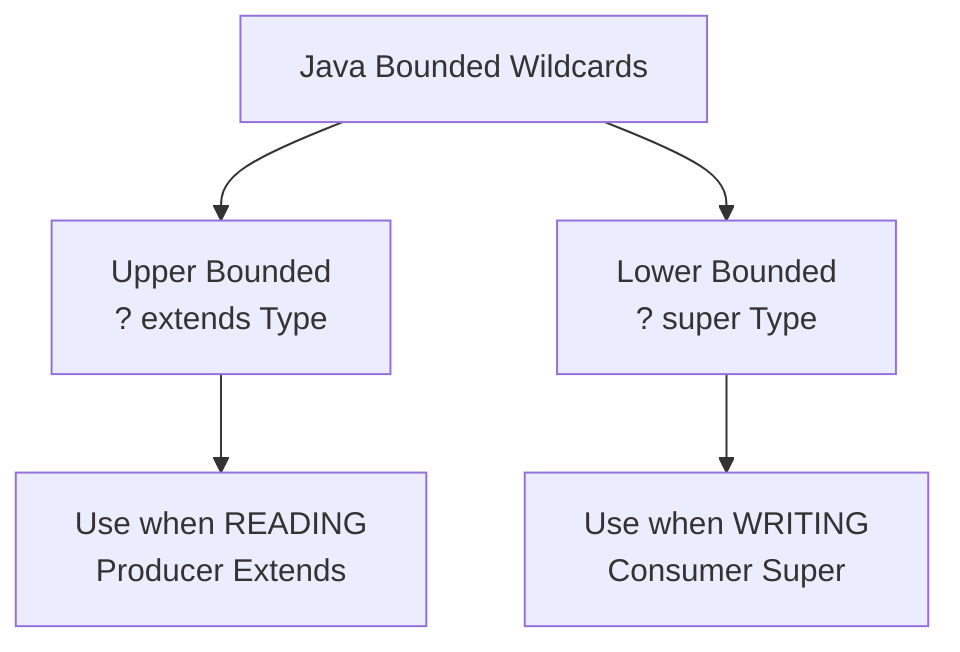

# Java Bounded Types

## Introduction

When working with Java generics, you may encounter situations where you need to restrict the types that can be used as type parameters. This is where bounded types come into play. Bounded types allow you to specify restrictions on the type parameters, making your generic code more type-safe and expressive.

In this tutorial, you'll learn about:

- Why we need bounded types
- Upper bounded wildcards
- Lower bounded wildcards
- Multiple bounds
- Practical applications of bounded types

Let's dive in and explore how bounded types can make your generic code more robust and flexible!

## Understanding the Need for Bounded Types

When creating generic classes or methods, you sometimes need to ensure that the type parameters have certain capabilities or properties. For example, you might want to:

- Ensure a type parameter can be compared with other objects of the same type
- Restrict a type parameter to accept only numbers
- Make sure a type parameter implements specific methods

Without bounded types, you would be limited to using `Object` methods only when working with generic types. Bounded types solve this problem by allowing you to specify constraints on type parameters.

## Upper Bounded Wildcards

An upper bounded wildcard restricts the unknown type to be a specific type or a subtype of that type. It uses the syntax `<? extends Type>`.

### Basic Syntax

```java
public <T extends UpperBound> void methodName(T parameter) {
    // method body
}
```

Or with wildcards:

```java
public void methodName(List<? extends UpperBound> list) {
    // method body
}
```

### Example: Working with Numbers

Let's create a method that calculates the sum of elements in a list of numbers:

```java
public class MathUtils {
    // This method accepts a list of any Number type or its subclasses
    public static double sumOfList(List<? extends Number> list) {
        double sum = 0.0;
        for (Number number : list) {
            sum += number.doubleValue();
        }
        return sum;
    }
    
    public static void main(String[] args) {
        // Creating lists of different number types
        List<Integer> integers = Arrays.asList(1, 2, 3, 4, 5);
        List<Double> doubles = Arrays.asList(1.1, 2.2, 3.3, 4.4, 5.5);
        List<Float> floats = Arrays.asList(1.0f, 2.0f, 3.0f);
        
        // Using the bounded type method with different number lists
        System.out.println("Sum of integers: " + sumOfList(integers));
        System.out.println("Sum of doubles: " + sumOfList(doubles));
        System.out.println("Sum of floats: " + sumOfList(floats));
        
        // This won't compile:
        // List<String> strings = Arrays.asList("a", "b", "c");
        // sumOfList(strings); // Compilation error!
    }
}
```

**Output:**
```
Sum of integers: 15.0
Sum of doubles: 16.5
Sum of floats: 6.0
```

In this example, our `sumOfList` method accepts lists containing any subtype of `Number`, such as `Integer`, `Double`, or `Float`. However, it would reject a list of `String` objects since `String` doesn't extend `Number`.

### Important Note on Read-Only Nature

With upper bounded wildcards, you can read from the collection but not add elements to it (except `null`). This is because the compiler cannot guarantee type safety for writes, as it doesn't know the exact type of the list:

```java
public static void addToNumberList(List<? extends Number> list) {
    // This won't compile:
    // list.add(1);       // Compilation error
    // list.add(1.0);     // Compilation error
    
    // But you can read elements:
    Number firstElement = list.get(0);
    System.out.println("First element: " + firstElement);
    
    // And you can add null:
    list.add(null);  // This works
}
```

## Lower Bounded Wildcards

Lower bounded wildcards restrict the unknown type to be a specific type or a supertype of that type. It uses the syntax `<? super Type>`.

### Basic Syntax

```java
public void methodName(List<? super LowerBound> list) {
    // method body
}
```

### Example: Copying Elements

Let's create a method that copies integers to a destination list:

```java
public class CopyUtils {
    public static void copyIntegers(List<Integer> source, List<? super Integer> destination) {
        for (Integer number : source) {
            destination.add(number);
        }
    }
    
    public static void main(String[] args) {
        List<Integer> integers = Arrays.asList(1, 2, 3, 4, 5);
        
        // We can copy to a list of Integers
        List<Integer> integerDestination = new ArrayList<>();
        copyIntegers(integers, integerDestination);
        System.out.println("Integer list: " + integerDestination);
        
        // We can copy to a list of Numbers (superclass of Integer)
        List<Number> numberDestination = new ArrayList<>();
        copyIntegers(integers, numberDestination);
        System.out.println("Number list: " + numberDestination);
        
        // We can copy to a list of Objects (superclass of Integer)
        List<Object> objectDestination = new ArrayList<>();
        copyIntegers(integers, objectDestination);
        System.out.println("Object list: " + objectDestination);
        
        // This won't compile:
        // List<Double> doubleDestination = new ArrayList<>();
        // copyIntegers(integers, doubleDestination); // Compilation error!
    }
}
```

**Output:**
```
Integer list: [1, 2, 3, 4, 5]
Number list: [1, 2, 3, 4, 5]
Object list: [1, 2, 3, 4, 5]
```

In this example, our `copyIntegers` method accepts a destination list of type `Integer` or any of its supertypes (`Number`, `Object`). This makes sense because you can safely add an `Integer` to a list of `Integer`, `Number`, or `Object`. However, you can't add an `Integer` to a list of `Double`, so the compiler prevents this.

### Read vs. Write Operations

With lower bounded wildcards:
- You can write to the collection (add elements)
- Reading from the collection returns `Object` type, requiring casting for specific types

```java
public static void addAndReadFromList(List<? super Integer> list) {
    // You can add elements:
    list.add(1);
    list.add(2);
    
    // Reading returns Object (requires casting):
    Object element = list.get(0);
    // Integer number = list.get(0); // Compilation error
    Integer number = (Integer) list.get(0); // Requires casting
    
    System.out.println("Element: " + element);
}
```

## The PECS Principle: Producer Extends, Consumer Super

A helpful mnemonic for remembering when to use which bounded wildcard is PECS:
- **Producer Extends**: Use `extends` when you're reading from a collection (the collection produces values for you)
- **Consumer Super**: Use `super` when you're writing to a collection (the collection consumes values from you)



## Multiple Bounds

Java also allows you to specify multiple bounds for a type parameter. This means the type parameter must satisfy all the specified bounds.

### Syntax

```java
public <T extends ClassA & InterfaceB & InterfaceC> void multipleTypeMethod(T parameter) {
    // method body
}
```

Note: If one of the bounds is a class, it must be listed first in the bounds list.

### Example: Combining Class and Interface Constraints

Let's create a method that works with objects that are both comparable and cloneable:

```java
public class MultipleTypeConstraints {
    // T must be a Number and implement Comparable
    public static <T extends Number & Comparable<T>> T findMax(T a, T b) {
        return a.compareTo(b) > 0 ? a : b;
    }
    
    public static void main(String[] args) {
        // Using with Integer
        Integer maxInt = findMax(5, 10);
        System.out.println("Max integer: " + maxInt);
        
        // Using with Double
        Double maxDouble = findMax(3.14, 2.71);
        System.out.println("Max double: " + maxDouble);
        
        // This won't compile:
        // findMax("abc", "xyz"); // Compilation error - String isn't a Number
    }
}
```

**Output:**
```
Max integer: 10
Max double: 3.14
```

In this example, the type parameter `T` must be both a subclass of `Number` and implement `Comparable<T>`. This allows the method to use both numeric operations (from `Number`) and comparison operations (from `Comparable`).

## Practical Applications

Let's look at some real-world applications of bounded types:

### 1. Generic Data Structures

```java
public class MaxHeap<T extends Comparable<T>> {
    private List<T> elements = new ArrayList<>();
    
    public void add(T element) {
        elements.add(element);
        // Heapify operations would go here
    }
    
    public T extractMax() {
        if (elements.isEmpty()) {
            throw new NoSuchElementException("Heap is empty");
        }
        T max = elements.get(0);
        // Heap reorganization would go here
        return max;
    }
    
    // Implementation details omitted for brevity
}

// Usage:
MaxHeap<Integer> intHeap = new MaxHeap<>();
intHeap.add(10);
intHeap.add(5);
intHeap.add(15);
System.out.println(intHeap.extractMax()); // 15
```

### 2. Generic Algorithms

```java
public class SortUtils {
    // Sorts any list whose elements implement Comparable
    public static <T extends Comparable<T>> void bubbleSort(List<T> list) {
        int n = list.size();
        for (int i = 0; i < n - 1; i++) {
            for (int j = 0; j < n - i - 1; j++) {
                if (list.get(j).compareTo(list.get(j + 1)) > 0) {
                    // Swap elements
                    T temp = list.get(j);
                    list.set(j, list.get(j + 1));
                    list.set(j + 1, temp);
                }
            }
        }
    }
    
    public static void main(String[] args) {
        List<Integer> numbers = new ArrayList<>(Arrays.asList(5, 2, 8, 1, 9));
        bubbleSort(numbers);
        System.out.println("Sorted numbers: " + numbers);
        
        List<String> names = new ArrayList<>(Arrays.asList("Charlie", "Alice", "Bob", "David"));
        bubbleSort(names);
        System.out.println("Sorted names: " + names);
    }
}
```

**Output:**
```
Sorted numbers: [1, 2, 5, 8, 9]
Sorted names: [Alice, Bob, Charlie, David]
```

### 3. Custom Collection Utilities

```java
public class CollectionUtils {
    // Copies all elements from source to destination
    public static <T> void copyAll(List<? extends T> source, List<? super T> destination) {
        for (T item : source) {
            destination.add(item);
        }
    }
    
    public static void main(String[] args) {
        List<Integer> integers = Arrays.asList(1, 2, 3);
        List<Number> numbers = new ArrayList<>();
        
        copyAll(integers, numbers);  // Works because Integer extends Number
        System.out.println(numbers);  // [1, 2, 3]
        
        List<Double> doubles = Arrays.asList(1.1, 2.2, 3.3);
        copyAll(doubles, numbers);  // Works because Double extends Number
        System.out.println(numbers);  // [1, 2, 3, 1.1, 2.2, 3.3]
    }
}
```

## Summary

Bounded types in Java generics provide powerful constraints that make your code more type-safe and expressive. We've covered:

- **Upper bounded wildcards** (`<? extends Type>`) - use when reading from a collection
- **Lower bounded wildcards** (`<? super Type>`) - use when writing to a collection
- **Multiple bounds** (`<T extends ClassA & InterfaceB>`) - combine constraints from multiple types
- The PECS principle (Producer Extends, Consumer Super)
- Practical applications in data structures, algorithms, and utility classes

By using bounded types appropriately, you can write generic code that is both flexible and type-safe, allowing the compiler to catch type errors at compile-time rather than facing runtime exceptions.

## Exercises

1. Create a generic method `findMinimum` that finds the minimum element in a collection of comparable elements.
2. Implement a generic `Pair<K, V>` class where K extends Comparable, and provide a method to compare pairs based on their keys.
3. Write a utility method that can filter a list of elements based on a predicate and copy the filtered elements to another list. Use bounded wildcards appropriately.
4. Create a generic stack implementation that can push elements of a specific type or its subtypes, and pop elements of the specific type.
5. Implement a method that can merge two sorted lists into a new sorted list using bounded types.

## Additional Resources

- [Oracle's Java Tutorials on Bounded Type Parameters](https://docs.oracle.com/javase/tutorial/java/generics/bounded.html)
- [Oracle's Java Tutorials on Wildcards](https://docs.oracle.com/javase/tutorial/java/generics/wildcards.html)
- [Effective Java by Joshua Bloch](https://www.amazon.com/Effective-Java-Joshua-Bloch/dp/0134685997) - Item 31: Use bounded wildcards to increase API flexibility
- [Java Generics and Collections by Maurice Naftalin and Philip Wadler](https://www.amazon.com/Java-Generics-Collections-Maurice-Naftalin/dp/0596527756)

Happy coding with bounded types!