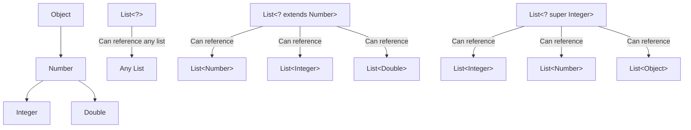

# Java Wildcard Types

## Introduction

Java wildcard types are an important feature in Java's generics system that provide flexibility when working with generic types. They allow you to write code that can work with collections of different but related types, making your code more reusable and type-safe.

In this tutorial, we'll explore:
- What wildcards are and why we need them
- The three types of wildcards in Java
- How to use wildcards in practical scenarios
- Common pitfalls and best practices

## What are Wildcards?

A wildcard is represented by the question mark (`?`) symbol and indicates an unknown type. Wildcards are particularly useful when you want to work with generic classes in a more flexible way.

Consider this situation: you have a method that needs to work with lists of different types. Without wildcards, you would need to create separate methods for each specific type, leading to code duplication.

## Types of Wildcards in Java

Java offers three types of wildcards:

1. **Unbounded wildcards**: `List<?>`
2. **Upper bounded wildcards**: `List<? extends SuperClass>`
3. **Lower bounded wildcards**: `List<? super SubClass>`

Let's explore each type in detail.

### Unbounded Wildcards

An unbounded wildcard is represented as `<?>` and means "a list of unknown type." It's useful when:
- The code can work with any type of object
- You're using methods that don't depend on the type parameter

```java
public static void printList(List<?> list) {
    for (Object element : list) {
        System.out.print(element + " ");
    }
    System.out.println();
}
```

**Example:**

```java
List<Integer> integers = Arrays.asList(1, 2, 3);
List<String> strings = Arrays.asList("one", "two", "three");

printList(integers);  // Output: 1 2 3
printList(strings);   // Output: one two three
```

However, there's an important limitation: you cannot add elements to a collection using an unbounded wildcard (except for `null`).

```java
public static void addToList(List<?> list) {
    // This will not compile!
    // list.add("element");  // Compile-time error
    
    // This is allowed
    list.add(null);
}
```

### Upper Bounded Wildcards

Upper bounded wildcards restrict the unknown type to a specific type or its subclasses. The syntax is `<? extends Type>`. This is useful when you need to read from a generic collection.

```java
public static double sumOfNumbers(List<? extends Number> numbers) {
    double sum = 0.0;
    for (Number num : numbers) {
        sum += num.doubleValue();
    }
    return sum;
}
```

**Example:**

```java
List<Integer> integers = Arrays.asList(1, 2, 3);
List<Double> doubles = Arrays.asList(1.1, 2.2, 3.3);

double intSum = sumOfNumbers(integers);  // Works with Integer
double doubleSum = sumOfNumbers(doubles); // Works with Double

System.out.println("Sum of integers: " + intSum);     // Output: Sum of integers: 6.0
System.out.println("Sum of doubles: " + doubleSum);   // Output: Sum of doubles: 6.6
```

Similar to unbounded wildcards, you cannot add elements to a collection with an upper bounded wildcard (except for `null`), as the compiler cannot guarantee type safety.

### Lower Bounded Wildcards

Lower bounded wildcards restrict the unknown type to a specific type or its superclasses. The syntax is `<? super Type>`. This is useful when you need to write to a generic collection.

```java
public static void addNumbers(List<? super Integer> list) {
    for (int i = 1; i <= 5; i++) {
        list.add(i); // This is allowed
    }
}
```

**Example:**

```java
List<Number> numbers = new ArrayList<>();
List<Object> objects = new ArrayList<>();

addNumbers(numbers); // Works because Number is a supertype of Integer
addNumbers(objects); // Works because Object is a supertype of Integer

System.out.println(numbers);  // Output: [1, 2, 3, 4, 5]
System.out.println(objects);  // Output: [1, 2, 3, 4, 5]
```

With lower bounded wildcards, you can add elements of the specified type or its subtypes to the collection. However, you can only read objects of type `Object` from it:

```java
public static void processElements(List<? super Integer> list) {
    // We can add integers
    list.add(10);
    
    // We can only read as Object
    Object obj = list.get(0);
    // Integer n = list.get(0); // Compile-time error
}
```

## PECS: Producer Extends, Consumer Super

There's a helpful mnemonic to remember when to use which wildcard: **PECS** - "Producer Extends, Consumer Super".

- Use `<? extends T>` when your collection is a **producer** (you read from it)
- Use `<? super T>` when your collection is a **consumer** (you write to it)

```java
// Producer: Collection produces (gives) values, so we use "extends"
public void copyElements(List<? extends T> source, List<T> destination) {
    for (T item : source) {
        destination.add(item); // Reading from source
    }
}

// Consumer: Collection consumes (takes in) values, so we use "super"
public void addElements(List<? super T> destination, T... elements) {
    for (T item : elements) {
        destination.add(item); // Writing to destination
    }
}
```

## Real-World Example: Generic Method with Wildcards

Let's create a utility method that copies elements from one list to another:

```java
public static <T> void copyList(List<? extends T> source, List<? super T> destination) {
    for (T element : source) {
        destination.add(element);
    }
}
```

**Example usage:**

```java
// Using class hierarchy: Animal -> Dog -> Poodle
class Animal {}
class Dog extends Animal {}
class Poodle extends Dog {}

public static void main(String[] args) {
    List<Dog> dogs = Arrays.asList(new Dog(), new Dog());
    
    // Destination can be of Dog type or any supertype of Dog
    List<Animal> animals = new ArrayList<>();
    List<Object> objects = new ArrayList<>();
    
    copyList(dogs, animals); // Works: copying Dogs to Animals list
    copyList(dogs, objects); // Works: copying Dogs to Objects list
    
    // Source can be of Dog type or any subtype of Dog
    List<Poodle> poodles = Arrays.asList(new Poodle(), new Poodle());
    List<Dog> moreDogs = new ArrayList<>();
    
    copyList(poodles, moreDogs); // Works: copying Poodles to Dogs list
    
    System.out.println("Animals list size: " + animals.size());     // Output: Animals list size: 2
    System.out.println("Objects list size: " + objects.size());     // Output: Objects list size: 2
    System.out.println("More dogs list size: " + moreDogs.size());  // Output: More dogs list size: 2
}
```

## Visualizing Wildcard Bounds

Here's a diagram showing how wildcard bounds work with a class hierarchy:



## Common Mistakes and Best Practices

### Mistake 1: Using wildcards unnecessarily

```java
// Unnecessary use of wildcard
public static void printSize(List<?> list) {
    System.out.println(list.size());
}

// Better approach - no wildcard needed
public static <T> void printSize(List<T> list) {
    System.out.println(list.size());
}
```

### Mistake 2: Using the wrong wildcard bound

```java
// Trying to add elements to a "produces" collection
public static void addElements(List<? extends Number> list) {
    // list.add(1); // Compile-time error!
}

// Correct approach
public static void addElements(List<? super Number> list) {
    list.add(1);
    list.add(2.0);
}
```

### Best Practice: Use wildcards in API signatures, not in variables

```java
// In API (method signatures)
public void processElements(List<? extends Number> numbers) { /* ... */ }

// In variable declarations, use concrete types when possible
List<Integer> integers = new ArrayList<>();
// Instead of: List<? extends Number> integers = new ArrayList<Integer>();
```

## Summary

Java wildcards are a powerful feature that allows for more flexible generic programming:

- **Unbounded wildcards** (`<?>`) allow you to work with collections of any type
- **Upper bounded wildcards** (`<? extends T>`) allow you to read from collections of a specific type or its subtypes
- **Upper bounded wildcards** are useful for producers (you get data from them)
- **Lower bounded wildcards** (`<? super T>`) allow you to write to collections of a specific type or its supertypes
- **Lower bounded wildcards** are useful for consumers (you put data into them)
- Remember PECS: "Producer Extends, Consumer Super"

By understanding when and how to use wildcards, you can write more flexible and type-safe generic code.

## Exercises

1. Write a method that finds the maximum value in a list of comparable objects using a wildcard.
2. Create a method that copies elements from a list of any type to a list of strings by calling the `toString()` method on each element.
3. Write a utility method that merges two sorted lists into a third sorted list using wildcards.
4. Implement a method that checks if two lists contain the same elements in the same order, regardless of their generic types.

## Additional Resources

- [Oracle's Java Tutorials: Generics](https://docs.oracle.com/javase/tutorial/java/generics/index.html)
- [Effective Java by Joshua Bloch](https://www.oreilly.com/library/view/effective-java-3rd/9780134686097/) - Item 31: Use bounded wildcards to increase API flexibility
- [Java Generics and Collections](https://www.oreilly.com/library/view/java-generics-and/0596527756/) by Maurice Naftalin and Philip Wadler