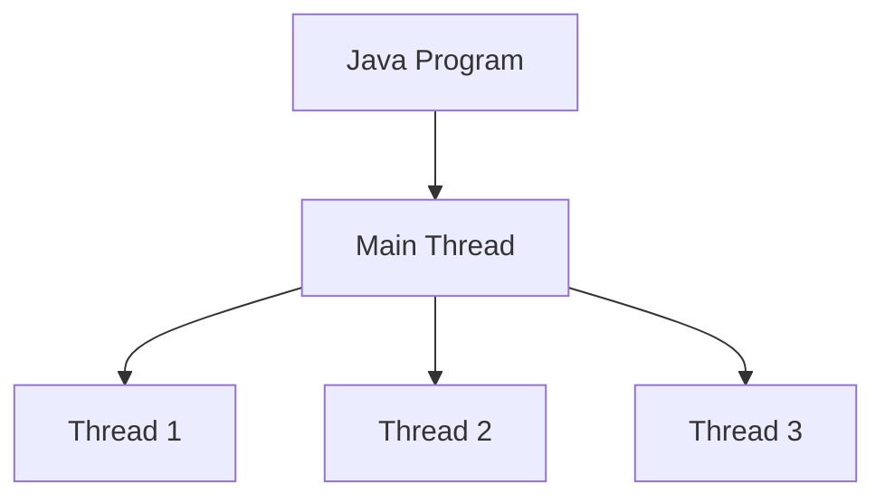
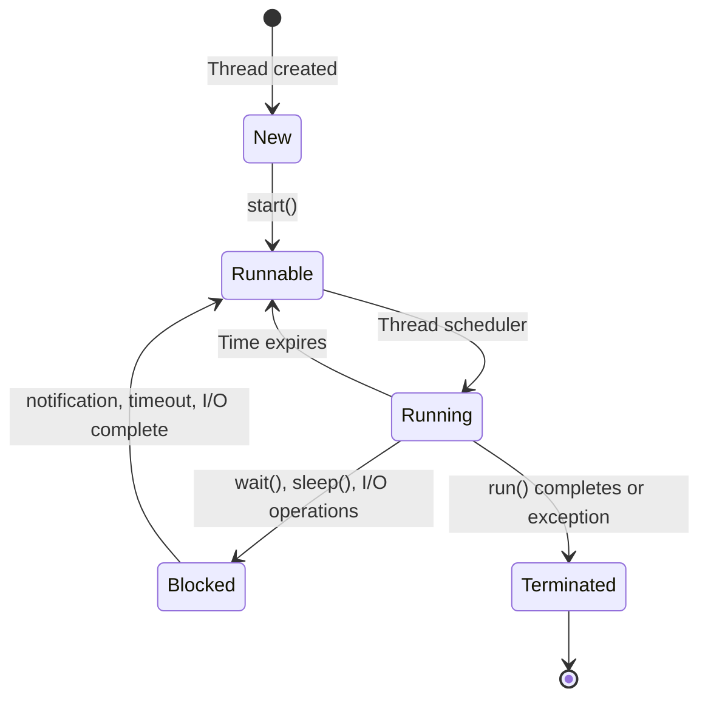

# Java Thread Basics

## Introduction

Multithreading is a powerful feature in Java that allows applications to perform multiple operations concurrently. At the core of Java's multithreading capabilities is the concept of a **thread** - an independent path of execution within a program. Threads allow developers to build applications that can perform multiple tasks simultaneously, making better use of available CPU resources and improving application responsiveness.

In this tutorial, we'll cover the fundamentals of Java threads, including:

- What threads are and why they're important
- Different ways to create threads in Java
- Understanding thread lifecycle
- Basic thread operations
- Common use cases and practical examples

By the end of this guide, you'll have a solid understanding of Java thread basics and be ready to write your first multithreaded applications.

## What is a Thread?

A thread is the smallest unit of execution within a process. When you run a Java program, the Java Virtual Machine (JVM) starts a single thread called the "main thread" that executes your `main()` method. However, you can create additional threads to perform tasks concurrently with the main thread.



### Why Use Threads?

There are several compelling reasons to use threads in your applications:

1. **Improved Responsiveness**: In GUI applications, background tasks can run in separate threads without freezing the user interface
2. **Increased Performance**: On multi-core CPUs, threads can execute in parallel, reducing processing time
3. **Resource Efficiency**: Threads share the same memory space, making them more lightweight than separate processes
4. **Simplified Program Structure**: Some problems are naturally modeled as concurrent activities

## Creating Threads in Java

Java provides two primary ways to create threads:

1. By extending the `Thread` class
2. By implementing the `Runnable` interface

Let's examine both approaches:

### Method 1: Extending the Thread Class

This approach involves creating a subclass of `Thread` and overriding its `run()` method with your code:

```java
public class MyThread extends Thread {
    @Override
    public void run() {
        System.out.println("Thread is running: " + Thread.currentThread().getName());
        // Your thread code goes here
        for (int i = 0; i < 5; i++) {
            System.out.println(Thread.currentThread().getName() + ": " + i);
            try {
                Thread.sleep(500); // Pausing execution for 500 milliseconds
            } catch (InterruptedException e) {
                System.out.println("Thread interrupted");
            }
        }
    }
}
```

To use this thread:

```java
public class ThreadExample {
    public static void main(String[] args) {
        System.out.println("Main thread starting...");
        
        // Creating thread objects
        MyThread thread1 = new MyThread();
        MyThread thread2 = new MyThread();
        
        // Setting names for easier identification
        thread1.setName("Thread-1");
        thread2.setName("Thread-2");
        
        // Starting the threads
        thread1.start();
        thread2.start();
        
        System.out.println("Main thread continues executing...");
    }
}
```

**Output:**
```
Main thread starting...
Main thread continues executing...
Thread is running: Thread-1
Thread is running: Thread-2
Thread-1: 0
Thread-2: 0
Thread-1: 1
Thread-2: 1
Thread-1: 2
Thread-2: 2
Thread-1: 3
Thread-2: 3
Thread-1: 4
Thread-2: 4
```

> **Note**: The exact order of thread execution may vary between runs, which is an important characteristic of multithreaded programs.

### Method 2: Implementing the Runnable Interface

This is the preferred approach as it separates the thread's tasks from its mechanics and doesn't consume your single inheritance opportunity:

```java
public class MyRunnable implements Runnable {
    @Override
    public void run() {
        System.out.println("Thread is running: " + Thread.currentThread().getName());
        // Your thread code goes here
        for (int i = 0; i < 5; i++) {
            System.out.println(Thread.currentThread().getName() + ": " + i);
            try {
                Thread.sleep(500);
            } catch (InterruptedException e) {
                System.out.println("Thread interrupted");
            }
        }
    }
}
```

To use this runnable:

```java
public class RunnableExample {
    public static void main(String[] args) {
        System.out.println("Main thread starting...");
        
        // Creating Runnable instance
        MyRunnable runnable = new MyRunnable();
        
        // Creating Thread objects with the Runnable
        Thread thread1 = new Thread(runnable, "Thread-1");
        Thread thread2 = new Thread(runnable, "Thread-2");
        
        // Starting the threads
        thread1.start();
        thread2.start();
        
        System.out.println("Main thread continues executing...");
    }
}
```

**Output:**
```
Main thread starting...
Main thread continues executing...
Thread is running: Thread-1
Thread is running: Thread-2
Thread-1: 0
Thread-2: 0
Thread-2: 1
Thread-1: 1
Thread-1: 2
Thread-2: 2
Thread-2: 3
Thread-1: 3
Thread-1: 4
Thread-2: 4
```

### Method 3: Using Lambda Expressions (Java 8+)

In modern Java, you can create threads more concisely using lambda expressions:

```java
public class LambdaThreadExample {
    public static void main(String[] args) {
        System.out.println("Main thread starting...");
        
        // Creating a thread with lambda expression
        Thread thread1 = new Thread(() -> {
            System.out.println("Thread is running: " + Thread.currentThread().getName());
            for (int i = 0; i < 5; i++) {
                System.out.println(Thread.currentThread().getName() + ": " + i);
                try {
                    Thread.sleep(500);
                } catch (InterruptedException e) {
                    System.out.println("Thread interrupted");
                }
            }
        }, "Lambda-Thread");
        
        // Start the thread
        thread1.start();
        
        System.out.println("Main thread continues executing...");
    }
}
```

**Output:**
```
Main thread starting...
Main thread continues executing...
Thread is running: Lambda-Thread
Lambda-Thread: 0
Lambda-Thread: 1
Lambda-Thread: 2
Lambda-Thread: 3
Lambda-Thread: 4
```

## Thread Lifecycle

A Java thread goes through various states throughout its lifetime. Understanding these states is crucial for effective thread management.



1. **New**: The thread has been created but not yet started.
2. **Runnable**: The thread is ready to run and waiting for CPU allocation.
3. **Running**: The thread is currently executing.
4. **Blocked/Waiting**: The thread is temporarily inactive (sleeping, waiting for a resource, etc.).
5. **Terminated**: The thread has completed execution or was stopped.

You can check a thread's state using the `getState()` method:

```java
Thread thread = new Thread(() -> {
    // Thread code
});
System.out.println("After creation: " + thread.getState()); // NEW
thread.start();
System.out.println("After start: " + thread.getState());    // RUNNABLE
```

## Basic Thread Operations

### Starting a Thread

To start a thread, call its `start()` method. This tells the JVM to allocate resources and execute the thread's `run()` method:

```java
Thread thread = new Thread(() -> System.out.println("Thread running"));
thread.start(); // Don't call run() directly!
```

> ⚠️ **Important:** Never call a thread's `run()` method directly. This will execute the code in the current thread, not in a new thread!

### Sleeping a Thread

To pause a thread's execution temporarily, use the `Thread.sleep()` method:

```java
try {
    // Sleep for 2 seconds
    Thread.sleep(2000);
} catch (InterruptedException e) {
    // Handle interruption
}
```

### Joining Threads

Sometimes you need to wait for a thread to complete before proceeding. The `join()` method allows one thread to wait for another to finish:

```java
public class JoinExample {
    public static void main(String[] args) {
        Thread workerThread = new Thread(() -> {
            System.out.println("Worker thread started");
            try {
                Thread.sleep(2000);
            } catch (InterruptedException e) {
                e.printStackTrace();
            }
            System.out.println("Worker thread finished");
        });
        
        System.out.println("Main thread: Starting worker");
        workerThread.start();
        
        try {
            // Main thread will wait for workerThread to finish
            workerThread.join();
        } catch (InterruptedException e) {
            e.printStackTrace();
        }
        
        System.out.println("Main thread: Worker has completed its task");
    }
}
```

**Output:**
```
Main thread: Starting worker
Worker thread started
Worker thread finished
Main thread: Worker has completed its task
```

### Thread Priority

Java allows you to influence thread scheduling by setting priorities. Thread priorities range from 1 (lowest) to 10 (highest), with 5 being the default:

```java
Thread thread = new Thread(() -> {
    // Code here
});
thread.setPriority(Thread.MAX_PRIORITY); // 10
thread.setPriority(Thread.MIN_PRIORITY); // 1
thread.setPriority(Thread.NORM_PRIORITY); // 5
```

> **Note:** Thread priorities are just hints to the operating system and don't guarantee execution order. Their effect varies across different operating systems and JVM implementations.

## Practical Examples

### Example 1: Simple Download Simulator

Let's build a simple file download simulator to demonstrate how threads can improve user experience:

```java
public class DownloadSimulator {
    public static void main(String[] args) {
        System.out.println("Download Manager Starting...");
        
        // Without threads (sequential downloads)
        long startTime = System.currentTimeMillis();
        downloadFile("Document1.pdf");
        downloadFile("Image1.jpg");
        downloadFile("Video1.mp4");
        long endTime = System.currentTimeMillis();
        
        System.out.println("Sequential downloads took: " + (endTime - startTime) + "ms");
        
        System.out.println("\nNow trying with threads (parallel downloads)...\n");
        
        // With threads (parallel downloads)
        Thread thread1 = new Thread(() -> downloadFile("Document1.pdf"));
        Thread thread2 = new Thread(() -> downloadFile("Image1.jpg"));
        Thread thread3 = new Thread(() -> downloadFile("Video1.mp4"));
        
        startTime = System.currentTimeMillis();
        thread1.start();
        thread2.start();
        thread3.start();
        
        try {
            thread1.join();
            thread2.join();
            thread3.join();
        } catch (InterruptedException e) {
            e.printStackTrace();
        }
        
        endTime = System.currentTimeMillis();
        System.out.println("Parallel downloads took: " + (endTime - startTime) + "ms");
    }
    
    private static void downloadFile(String fileName) {
        System.out.println("Started downloading: " + fileName);
        // Simulate file download time
        try {
            Thread.sleep(2000);  // 2 seconds
        } catch (InterruptedException e) {
            e.printStackTrace();
        }
        System.out.println("Finished downloading: " + fileName);
    }
}
```

**Output:**
```
Download Manager Starting...
Started downloading: Document1.pdf
Finished downloading: Document1.pdf
Started downloading: Image1.jpg
Finished downloading: Image1.jpg
Started downloading: Video1.mp4
Finished downloading: Video1.mp4
Sequential downloads took: 6023ms

Now trying with threads (parallel downloads)...

Started downloading: Document1.pdf
Started downloading: Image1.jpg
Started downloading: Video1.mp4
Finished downloading: Document1.pdf
Finished downloading: Image1.jpg
Finished downloading: Video1.mp4
Parallel downloads took: 2011ms
```

This example clearly shows how using threads can significantly improve performance for I/O-bound tasks by executing them in parallel.

### Example 2: Real-time Progress Updates

Let's create a scenario where a background thread performs a task while the main thread can continue to respond to the user:

```java
public class ProgressReporter {
    private static boolean taskComplete = false;
    
    public static void main(String[] args) {
        System.out.println("Application started");
        
        // Start the long-running task in a background thread
        Thread backgroundTask = new Thread(() -> {
            System.out.println("Background task started");
            try {
                // Simulate a long-running operation (10 seconds)
                for (int i = 1; i <= 10; i++) {
                    Thread.sleep(1000);
                    System.out.println("Task progress: " + (i * 10) + "% complete");
                }
            } catch (InterruptedException e) {
                System.out.println("Background task interrupted");
                return;
            }
            taskComplete = true;
            System.out.println("Background task completed!");
        });
        
        // Make this a daemon thread that won't prevent the JVM from exiting
        // backgroundTask.setDaemon(true);
        
        // Start the background task
        backgroundTask.start();
        
        // Main thread continues to do other work
        System.out.println("Main thread continues to run...");
        
        // Simulate the main thread doing quick tasks while waiting
        for (int i = 0; i < 5; i++) {
            System.out.println("Main thread: Processing user input " + i);
            try {
                Thread.sleep(500);
            } catch (InterruptedException e) {
                e.printStackTrace();
            }
        }
        
        // Main thread waits for background task to complete
        System.out.println("Main thread: Waiting for background task to complete...");
        try {
            backgroundTask.join();
        } catch (InterruptedException e) {
            e.printStackTrace();
        }
        
        if (taskComplete) {
            System.out.println("Main thread: Background task is now complete!");
        }
        
        System.out.println("Application ending");
    }
}
```

**Output:**
```
Application started
Background task started
Main thread continues to run...
Main thread: Processing user input 0
Task progress: 10% complete
Main thread: Processing user input 1
Main thread: Processing user input 2
Task progress: 20% complete
Main thread: Processing user input 3
Main thread: Processing user input 4
Task progress: 30% complete
Main thread: Waiting for background task to complete...
Task progress: 40% complete
Task progress: 50% complete
Task progress: 60% complete
Task progress: 70% complete
Task progress: 80% complete
Task progress: 90% complete
Task progress: 100% complete
Background task completed!
Main thread: Background task is now complete!
Application ending
```

This example demonstrates how threads allow an application to perform long-running tasks while still remaining responsive to users.

## Best Practices and Common Pitfalls

When working with threads, keep these best practices in mind:

1. **Prefer `Runnable` over extending `Thread`**: This follows good OOP principles and preserves your class's inheritance capabilities
2. **Always handle `InterruptedException`**: This allows your threads to respond properly to cancellation requests
3. **Use meaningful thread names**: This makes debugging much easier
4. **Be careful with shared resources**: Threads that modify the same data can cause concurrency issues
5. **Don't call `Thread.run()` directly**: Always use `Thread.start()` to launch a new thread
6. **Consider using higher-level concurrency utilities**: For most applications, the classes in `java.util.concurrent` provide safer and more convenient alternatives

## Summary

In this tutorial, you've learned about the fundamentals of Java threads:

- Threads are independent paths of execution within a Java program
- You can create threads by extending the `Thread` class, implementing the `Runnable` interface, or using lambda expressions
- Threads go through distinct lifecycle states: New, Runnable, Running, Blocked/Waiting, and Terminated
- Basic operations include starting threads, making them sleep, and joining them
- Threads can significantly improve application performance and responsiveness

Understanding threads is essential for developing responsive, efficient Java applications, especially for programs that involve I/O operations, user interfaces, or need to leverage multi-core processors.

## Additional Resources

To deepen your understanding of Java multithreading:

1. **Java Documentation**: Oracle's [official tutorial on concurrency](https://docs.oracle.com/javase/tutorial/essential/concurrency/index.html)
2. **Books**: "Java Concurrency in Practice" by Brian Goetz is highly recommended
3. **Advanced Topics**: Once you're comfortable with thread basics, explore thread pools, synchronization, locks, and the concurrency utilities in the `java.util.concurrent` package

## Exercises

To practice your understanding of threads:

1. Create a simple counter application where two threads increment a shared counter and print its value
2. Modify the download simulator to handle an arbitrary number of files with a configurable maximum number of concurrent downloads
3. Create a program that simulates a race between multiple threads, each representing a different runner
4. Build a simple chat application where one thread listens for incoming messages while another sends outgoing messages
5. Implement a program that uses threads to find the minimum, maximum, average, and sum of elements in a large array by dividing the work among multiple threads

Happy threading!