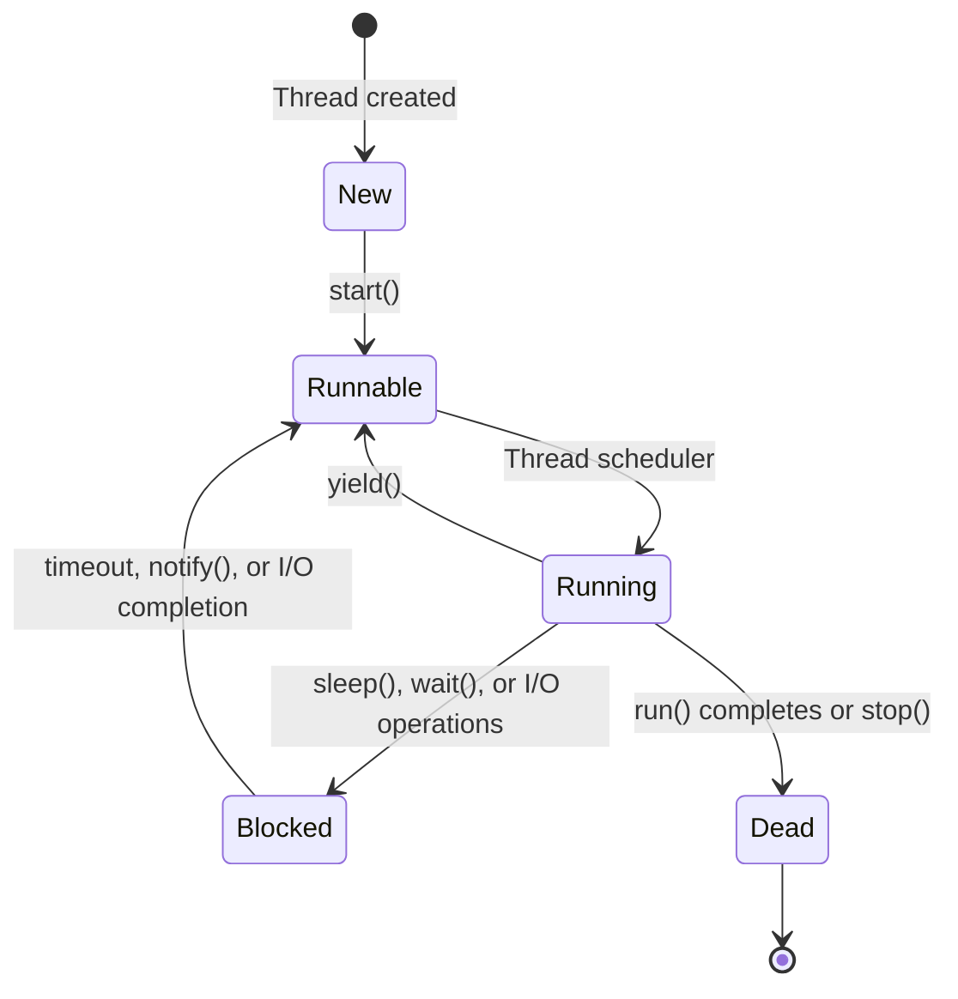

# Java Thread Creation

## Introduction

Multithreading is a powerful feature in Java that allows concurrent execution of two or more parts of a program, maximizing CPU utilization. Threads are lightweight sub-processes, the smallest unit of processing that can be scheduled by an operating system. In Java, creating threads is fundamental to developing concurrent applications that can perform multiple operations simultaneously.

This guide will walk you through different ways to create threads in Java, from basic approaches to more modern techniques. By the end, you'll understand how to create, start, and manage threads in your Java applications.

## Why Use Threads?

Before diving into thread creation, let's understand why threads are useful:

1. **Improved Application Responsiveness**: Threaded applications can remain responsive to user input while performing background tasks.
2. **Enhanced Performance**: Multiple threads can execute concurrently on multi-core processors, improving throughput.
3. **Resource Sharing**: Threads share the process's resources, making inter-thread communication more efficient than inter-process communication.
4. **Simplified Program Structure**: Complex operations can be divided into separate threads for clearer organization.

## Thread Lifecycle

Understanding a thread's lifecycle is crucial for effective thread management:



## Ways to Create Threads in Java

Java provides several methods to create threads, each with its advantages. Let's explore them one by one.

### 1. Extending the Thread Class

The most straightforward way to create a thread is by extending the `Thread` class and overriding its `run()` method.

```java
public class MyThread extends Thread {
    @Override
    public void run() {
        // Code to be executed in this thread
        for (int i = 1; i <= 5; i++) {
            System.out.println("Thread using Thread class: " + i);
            try {
                // Pause for half a second
                Thread.sleep(500);
            } catch (InterruptedException e) {
                System.out.println("Thread interrupted: " + e.getMessage());
            }
        }
    }
    
    public static void main(String[] args) {
        // Create and start the thread
        MyThread thread = new MyThread();
        thread.start();  // Calls the run() method in a new thread
        
        // Main thread continues execution
        for (int i = 1; i <= 5; i++) {
            System.out.println("Main thread: " + i);
            try {
                Thread.sleep(500);
            } catch (InterruptedException e) {
                System.out.println("Main thread interrupted: " + e.getMessage());
            }
        }
    }
}
```

**Output:**
```
Main thread: 1
Thread using Thread class: 1
Thread using Thread class: 2
Main thread: 2
Main thread: 3
Thread using Thread class: 3
Thread using Thread class: 4
Main thread: 4
Main thread: 5
Thread using Thread class: 5
```

Note that the output may vary between runs because thread execution order is not guaranteed.

**Key points:**
- `Thread.start()` creates a new thread and calls the `run()` method
- Never call `run()` directly—it will execute in the current thread, not a new one
- Each thread has its own call stack
- Java does not support multiple inheritance, so extending `Thread` may limit your class design

### 2. Implementing the Runnable Interface

Implementing the `Runnable` interface is often the preferred approach because:
- It doesn't require your class to subclass `Thread`
- It separates the task from the thread mechanism
- It allows your class to extend another class if needed

```java
public class RunnableExample implements Runnable {
    @Override
    public void run() {
        for (int i = 1; i <= 5; i++) {
            System.out.println("Thread using Runnable: " + i);
            try {
                Thread.sleep(500);
            } catch (InterruptedException e) {
                System.out.println("Thread interrupted: " + e.getMessage());
            }
        }
    }
    
    public static void main(String[] args) {
        // Create a Runnable instance
        Runnable runnable = new RunnableExample();
        
        // Create Thread with the Runnable
        Thread thread = new Thread(runnable);
        
        // Start the thread
        thread.start();
        
        // Main thread continues execution
        for (int i = 1; i <= 5; i++) {
            System.out.println("Main thread: " + i);
            try {
                Thread.sleep(500);
            } catch (InterruptedException e) {
                System.out.println("Main thread interrupted: " + e.getMessage());
            }
        }
    }
}
```

**Output:**
```
Thread using Runnable: 1
Main thread: 1
Main thread: 2
Thread using Runnable: 2
Thread using Runnable: 3
Main thread: 3
Main thread: 4
Thread using Runnable: 4
Thread using Runnable: 5
Main thread: 5
```

### 3. Using Anonymous Classes

You can create threads using anonymous classes for short-lived threads or one-time executions:

```java
public class AnonymousThreadExample {
    public static void main(String[] args) {
        // Using anonymous Thread class
        Thread thread1 = new Thread() {
            @Override
            public void run() {
                System.out.println("Thread running using anonymous Thread class");
            }
        };
        
        // Using anonymous Runnable implementation
        Runnable runnable = new Runnable() {
            @Override
            public void run() {
                System.out.println("Thread running using anonymous Runnable");
            }
        };
        Thread thread2 = new Thread(runnable);
        
        // Start both threads
        thread1.start();
        thread2.start();
    }
}
```

**Output:**
```
Thread running using anonymous Thread class
Thread running using anonymous Runnable
```

### 4. Using Lambda Expressions (Java 8+)

With Java 8, you can create threads using lambda expressions, which makes code more concise:

```java
public class LambdaThreadExample {
    public static void main(String[] args) {
        // Using lambda with Runnable (functional interface)
        Thread thread = new Thread(() -> {
            for (int i = 1; i <= 5; i++) {
                System.out.println("Thread using lambda: " + i);
                try {
                    Thread.sleep(500);
                } catch (InterruptedException e) {
                    System.out.println("Thread interrupted: " + e.getMessage());
                }
            }
        });
        
        thread.start();
        
        // Main thread
        for (int i = 1; i <= 5; i++) {
            System.out.println("Main thread: " + i);
            try {
                Thread.sleep(500);
            } catch (InterruptedException e) {
                System.out.println("Main thread interrupted: " + e.getMessage());
            }
        }
    }
}
```

**Output:**
```
Thread using lambda: 1
Main thread: 1
Main thread: 2
Thread using lambda: 2
Thread using lambda: 3
Main thread: 3
Main thread: 4
Thread using lambda: 4
Thread using lambda: 5
Main thread: 5
```

### 5. Using ExecutorService (Java 5+)

The `ExecutorService` interface, part of the `java.util.concurrent` package, provides a higher-level replacement for working with threads directly:

```java
import java.util.concurrent.ExecutorService;
import java.util.concurrent.Executors;

public class ExecutorServiceExample {
    public static void main(String[] args) {
        // Create a fixed thread pool with 2 threads
        ExecutorService executor = Executors.newFixedThreadPool(2);
        
        // Submit tasks to the executor
        for (int i = 1; i <= 5; i++) {
            final int taskId = i;
            executor.submit(() -> {
                System.out.println("Task " + taskId + " executing on thread: " + 
                                   Thread.currentThread().getName());
                try {
                    Thread.sleep(1000);
                } catch (InterruptedException e) {
                    System.out.println("Task interrupted: " + e.getMessage());
                }
            });
        }
        
        // Shutdown the executor when done
        executor.shutdown();
        
        // Wait for all tasks to complete (optional)
        while (!executor.isTerminated()) {
            // Wait for completion
        }
        
        System.out.println("All tasks completed");
    }
}
```

**Output:**
```
Task 1 executing on thread: pool-1-thread-1
Task 2 executing on thread: pool-1-thread-2
Task 3 executing on thread: pool-1-thread-1
Task 4 executing on thread: pool-1-thread-2
Task 5 executing on thread: pool-1-thread-1
All tasks completed
```

**Advantages of ExecutorService:**
- Manages thread lifecycle
- Provides thread pooling and reuse
- Offers task queuing mechanisms
- Provides methods to track progress and completion of tasks

## Thread Naming and Priority

You can set names and priorities for your threads to help with debugging and execution scheduling:

```java
public class ThreadNamePriorityExample {
    public static void main(String[] args) {
        Thread thread = new Thread(() -> {
            System.out.println("Current thread: " + Thread.currentThread().getName());
            System.out.println("Priority: " + Thread.currentThread().getPriority());
        });
        
        // Set thread name and priority
        thread.setName("CustomThread");
        thread.setPriority(Thread.MAX_PRIORITY);  // 10
        
        thread.start();
    }
}
```

**Output:**
```
Current thread: CustomThread
Priority: 10
```

Thread priorities range from `Thread.MIN_PRIORITY` (1) to `Thread.MAX_PRIORITY` (10), with a default of `Thread.NORM_PRIORITY` (5). However, thread priorities are hints to the scheduler and their effect can vary across platforms.

## Real-World Examples

### Example 1: Download Manager

A download manager might use threads to download multiple files simultaneously:

```java
import java.util.ArrayList;
import java.util.List;

public class DownloadManager {
    public static void main(String[] args) {
        // List of file URLs to download
        List<String> urls = new ArrayList<>();
        urls.add("https://example.com/file1.zip");
        urls.add("https://example.com/file2.pdf");
        urls.add("https://example.com/file3.jpg");
        
        // Start a thread for each download
        for (String url : urls) {
            Thread downloadThread = new Thread(() -> {
                String fileName = url.substring(url.lastIndexOf('/') + 1);
                System.out.println("Starting download of: " + fileName);
                
                // Simulate download process
                try {
                    // Simulate variable download times
                    long downloadTime = (long)(Math.random() * 3000) + 1000;
                    Thread.sleep(downloadTime);
                    System.out.println("Downloaded " + fileName + " in " + 
                                      downloadTime + "ms");
                } catch (InterruptedException e) {
                    System.out.println("Download interrupted: " + e.getMessage());
                }
            });
            
            downloadThread.start();
        }
    }
}
```

**Output:**
```
Starting download of: file1.zip
Starting download of: file2.pdf
Starting download of: file3.jpg
Downloaded file3.jpg in 1245ms
Downloaded file1.zip in 2356ms
Downloaded file2.pdf in 3120ms
```

### Example 2: Web Server Request Handling

A simple web server handles multiple client requests concurrently using threads:

```java
import java.util.concurrent.ExecutorService;
import java.util.concurrent.Executors;

public class WebServerSimulation {
    public static void main(String[] args) {
        // Create a thread pool with 10 worker threads
        ExecutorService threadPool = Executors.newFixedThreadPool(10);
        
        // Simulate 20 incoming requests
        for (int i = 1; i <= 20; i++) {
            final int requestId = i;
            
            // Submit request processing task to thread pool
            threadPool.submit(() -> {
                System.out.println("Processing request #" + requestId + 
                                  " on thread: " + Thread.currentThread().getName());
                
                // Simulate request processing
                try {
                    // Simulate variable processing times (200-700ms)
                    Thread.sleep((long)(Math.random() * 500) + 200);
                } catch (InterruptedException e) {
                    System.out.println("Request processing interrupted");
                }
                
                System.out.println("Completed request #" + requestId);
            });
        }
        
        // Shutdown the thread pool once all requests are submitted
        threadPool.shutdown();
        
        System.out.println("All requests have been submitted to the thread pool");
    }
}
```

**Output:**
```
Processing request #1 on thread: pool-1-thread-1
Processing request #2 on thread: pool-1-thread-2
Processing request #3 on thread: pool-1-thread-3
Processing request #4 on thread: pool-1-thread-4
Processing request #5 on thread: pool-1-thread-5
All requests have been submitted to the thread pool
Processing request #6 on thread: pool-1-thread-6
Processing request #7 on thread: pool-1-thread-7
Completed request #1
Processing request #8 on thread: pool-1-thread-1
Completed request #3
Processing request #9 on thread: pool-1-thread-3
...
```

## Best Practices for Thread Creation

1. **Use Thread Pools**: For production applications, use thread pools rather than creating threads directly.

2. **Avoid Thread Explosion**: Don't create too many threads, as each thread consumes memory and CPU resources.

3. **Thread Naming**: Give meaningful names to your threads for better debugging.

4. **Prefer Runnable over Thread**: Use `Runnable` interface implementation over `Thread` extension for better design.

5. **Handle Exceptions**: Always handle exceptions in your thread's run method to prevent them from silently terminating.

6. **Clean up Resources**: Always properly terminate threads and release resources when they are no longer needed.

7. **Be Aware of Thread Safety**: When multiple threads access shared data, ensure proper synchronization.

## Common Thread Methods

Here are some important methods you'll use with threads:

| Method | Description |
|--------|-------------|
| `start()` | Starts the thread execution by calling the `run()` method |
| `run()` | Contains the code that will be executed in the thread |
| `sleep(long millis)` | Pauses thread execution for the specified time |
| `join()` | Waits for a thread to die |
| `yield()` | Suggests that the scheduler can switch to another thread |
| `interrupt()` | Interrupts a thread in waiting/sleeping state |
| `isAlive()` | Tests if the thread is still running |
| `setPriority(int)` | Sets thread's priority |
| `setName(String)` | Sets thread's name |
| `setDaemon(boolean)` | Marks a thread as a daemon thread |

## Summary

In this tutorial, we've covered multiple ways to create threads in Java:

1. **Extending the Thread class**: Direct but less flexible due to Java's single inheritance limitation
2. **Implementing the Runnable interface**: The preferred approach that separates task from thread mechanism
3. **Using anonymous classes**: Convenient for simple, short-lived threads
4. **Using lambda expressions**: Modern, concise syntax for thread creation
5. **Using ExecutorService**: High-level thread management with thread pooling

We also explored real-world applications of threads and best practices for thread creation. Multithreading is a powerful tool that, when used correctly, can significantly improve your applications' performance and responsiveness.

## Exercises

1. Create a program that uses multiple threads to find prime numbers in different ranges concurrently.
2. Implement a simple chat server that uses a separate thread for each client connection.
3. Modify the download manager example to limit the maximum number of concurrent downloads to 3.
4. Create a thread pool that processes image thumbnails from a list of image files.
5. Implement a simulation of a banking system where multiple threads represent customers performing transactions.

## Additional Resources

- [Java Concurrency in Practice](https://jcip.net/) - The definitive book on Java threading and concurrency
- [Oracle's Threading Tutorial](https://docs.oracle.com/javase/tutorial/essential/concurrency/index.html)
- [Java ExecutorService Documentation](https://docs.oracle.com/en/java/javase/17/docs/api/java.base/java/util/concurrent/ExecutorService.html)
- [Java Thread Documentation](https://docs.oracle.com/en/java/javase/17/docs/api/java.base/java/lang/Thread.html)

Remember, mastering threads takes practice. Start with simple examples and gradually work your way up to more complex multithreaded applications. Happy coding!