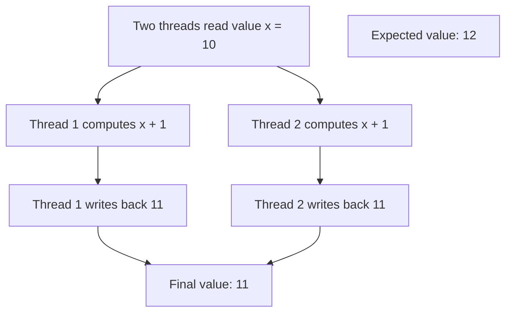
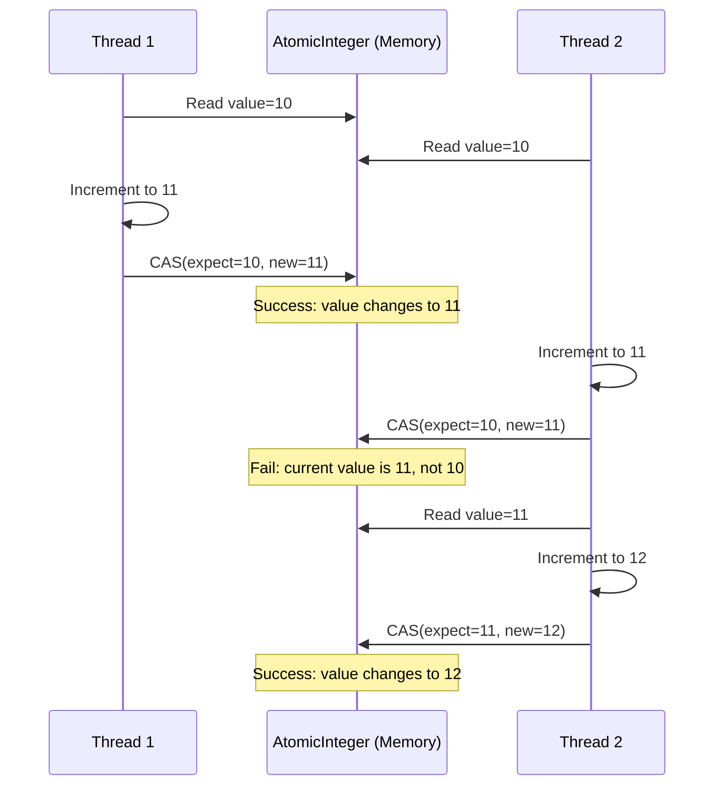

# Java Atomic Variables

## Introduction

When working with multiple threads in Java, one of the most challenging aspects is managing shared data safely. If multiple threads try to modify the same variable simultaneously, it can lead to race conditions and unpredictable results. Java's Atomic Variables provide a solution to this problem by offering thread-safe operations on single variables without using locks.

Atomic variables are part of the `java.util.concurrent.atomic` package, introduced in Java 5. They allow for lock-free, thread-safe programming on single variables, making your multithreaded code more efficient and less error-prone.

## Why Use Atomic Variables?

Before diving into atomic variables, let's understand why we need them in the first place:



In the diagram above, two threads are trying to increment the same variable concurrently. Each thread reads the original value `10`, increments it to `11`, and writes it back. The final value is `11` instead of the expected `12` because neither thread is aware of the other's operation.

This is called a race condition, and it can lead to serious bugs in your application. Atomic variables prevent such issues by ensuring that operations like read-modify-write are performed atomically (as a single, indivisible operation).

## Basic Atomic Classes

Java provides several atomic classes for different primitive types:

- `AtomicInteger`: For `int` values
- `AtomicLong`: For `long` values
- `AtomicBoolean`: For `boolean` values
- `AtomicReference<V>`: For object references

Let's start with a simple example using `AtomicInteger`:

```java
import java.util.concurrent.atomic.AtomicInteger;

public class AtomicIntegerExample {
    public static void main(String[] args) {
        // Create an AtomicInteger with initial value 0
        AtomicInteger counter = new AtomicInteger(0);
        
        // Increment by 1 and get the new value
        int newValue = counter.incrementAndGet(); // Atomic operation
        System.out.println("After incrementAndGet(): " + newValue); // Output: 1
        
        // Add a value and get the new result
        newValue = counter.addAndGet(5); // Atomic operation
        System.out.println("After addAndGet(5): " + newValue); // Output: 6
        
        // Get the current value
        int currentValue = counter.get();
        System.out.println("Current value: " + currentValue); // Output: 6
        
        // Set a new value
        counter.set(10);
        System.out.println("After set(10): " + counter.get()); // Output: 10
        
        // Compare and set: change only if the current value is the expected value
        boolean wasUpdated = counter.compareAndSet(10, 20); // Will update since current value is 10
        System.out.println("CAS success: " + wasUpdated); // Output: true
        System.out.println("New value after CAS: " + counter.get()); // Output: 20
        
        wasUpdated = counter.compareAndSet(10, 30); // Will not update since current value is not 10
        System.out.println("CAS success: " + wasUpdated); // Output: false
        System.out.println("Value unchanged: " + counter.get()); // Output: 20
    }
}
```

This example demonstrates the basic operations available on atomic variables. The key advantage is that all these operations are atomic - they happen as a single, uninterruptible unit, which prevents race conditions.

## Common Atomic Operations

Let's explore the most common operations you can perform with atomic variables:

### Get and Set Operations

- `get()`: Returns the current value
- `set(newValue)`: Sets to the given value

### Arithmetic Operations

- `incrementAndGet()`: Increments by one and returns the new value
- `getAndIncrement()`: Returns the current value and then increments
- `decrementAndGet()`: Decrements by one and returns the new value
- `getAndDecrement()`: Returns the current value and then decrements
- `addAndGet(delta)`: Adds delta and returns the new value
- `getAndAdd(delta)`: Returns the current value and then adds delta

### Compare and Set Operations

- `compareAndSet(expect, update)`: If the current value equals the expected value, updates to the new value and returns true; otherwise returns false
- `weakCompareAndSet(expect, update)`: Similar to compareAndSet but with weaker memory consistency guarantees

## Real-World Example: Thread-Safe Counter

Let's implement a thread-safe counter using `AtomicInteger` and compare it with a non-atomic counter:

```java
import java.util.concurrent.ExecutorService;
import java.util.concurrent.Executors;
import java.util.concurrent.TimeUnit;
import java.util.concurrent.atomic.AtomicInteger;

public class CounterExample {
    // Non-thread-safe counter
    static class UnsafeCounter {
        private int count = 0;
        
        public void increment() {
            count++;
        }
        
        public int getCount() {
            return count;
        }
    }
    
    // Thread-safe counter using AtomicInteger
    static class AtomicCounter {
        private AtomicInteger count = new AtomicInteger(0);
        
        public void increment() {
            count.incrementAndGet();
        }
        
        public int getCount() {
            return count.get();
        }
    }
    
    public static void main(String[] args) throws InterruptedException {
        // Create counters
        UnsafeCounter unsafeCounter = new UnsafeCounter();
        AtomicCounter atomicCounter = new AtomicCounter();
        
        // Create thread pool with 10 threads
        ExecutorService executor = Executors.newFixedThreadPool(10);
        
        // Submit 1000 increment tasks for each counter
        for (int i = 0; i < 1000; i++) {
            executor.submit(() -> {
                unsafeCounter.increment();
                atomicCounter.increment();
            });
        }
        
        // Shutdown executor and wait for all tasks to complete
        executor.shutdown();
        executor.awaitTermination(5, TimeUnit.SECONDS);
        
        // Print results
        System.out.println("Unsafe Counter: " + unsafeCounter.getCount());
        System.out.println("Atomic Counter: " + atomicCounter.getCount());
    }
}
```

**Expected Output:**
```
Unsafe Counter: some number less than 1000 (typically varies between runs)
Atomic Counter: 1000
```

The unsafe counter will likely show a value less than 1000 because of race conditions between threads. The atomic counter will consistently show 1000 because its increment operation is atomic.

## When to Use Atomic Variables

Atomic variables are ideal in these scenarios:

1. When you need simple thread-safe operations on single variables.
2. When you want to avoid the overhead of locks.
3. For counters, flags, or references that are shared among threads.
4. To implement lock-free algorithms.

## Advanced Atomic Classes

### AtomicReference

`AtomicReference` allows atomic operations on object references:

```java
import java.util.concurrent.atomic.AtomicReference;

public class AtomicReferenceExample {
    static class User {
        private final String name;
        
        public User(String name) {
            this.name = name;
        }
        
        public String getName() {
            return name;
        }
        
        @Override
        public String toString() {
            return "User[name=" + name + "]";
        }
    }
    
    public static void main(String[] args) {
        // Create an AtomicReference with an initial User
        AtomicReference<User> userRef = new AtomicReference<>(new User("Initial"));
        System.out.println("Initial User: " + userRef.get());
        
        // Update the reference atomically
        User oldUser = userRef.get();
        User newUser = new User("Updated");
        boolean updated = userRef.compareAndSet(oldUser, newUser);
        System.out.println("Update successful: " + updated);
        System.out.println("Current User: " + userRef.get());
    }
}
```

**Output:**
```
Initial User: User[name=Initial]
Update successful: true
Current User: User[name=Updated]
```

### AtomicIntegerArray, AtomicLongArray, and AtomicReferenceArray

These classes provide atomic operations on arrays:

```java
import java.util.concurrent.atomic.AtomicIntegerArray;

public class AtomicArrayExample {
    public static void main(String[] args) {
        // Create an AtomicIntegerArray with 5 elements
        int[] initialValues = {10, 20, 30, 40, 50};
        AtomicIntegerArray array = new AtomicIntegerArray(initialValues);
        
        // Getting values
        System.out.println("Initial array:");
        for (int i = 0; i < array.length(); i++) {
            System.out.print(array.get(i) + " ");
        }
        System.out.println();
        
        // Atomically increment the value at index 2
        int newValue = array.incrementAndGet(2);
        System.out.println("After incrementing index 2: " + newValue);
        
        // Atomically add 10 to the value at index 4
        array.addAndGet(4, 10);
        
        // Display the updated array
        System.out.println("Updated array:");
        for (int i = 0; i < array.length(); i++) {
            System.out.print(array.get(i) + " ");
        }
    }
}
```

**Output:**
```
Initial array:
10 20 30 40 50 
After incrementing index 2: 31
Updated array:
10 20 31 40 60 
```

## How Atomic Variables Work

Atomic variables use hardware-level atomic instructions like Compare-and-Swap (CAS) to ensure thread safety. CAS is a low-level operation that checks if the memory location holds an expected value and, if so, changes it to a new value in one uninterruptible operation.



The diagram shows how two threads safely increment the same variable using CAS operations, avoiding the race condition we saw earlier.

## Performance Considerations

While atomic variables are generally faster than using locks, they're not always the best solution:

1. **For single variables**: Atomic variables are excellent.
2. **For multiple related variables**: Consider using locks or higher-level concurrency utilities.
3. **High contention scenarios**: Under high contention (many threads trying to update the same variable), atomic variables might lead to many failed CAS operations and retries, potentially decreasing performance.

## Real-World Application: Rate Limiter

Here's an example of a simple rate limiter that uses `AtomicInteger` to limit the number of operations in a time window:

```java
import java.util.concurrent.atomic.AtomicInteger;
import java.util.concurrent.Executors;
import java.util.concurrent.ScheduledExecutorService;
import java.util.concurrent.TimeUnit;

public class SimpleRateLimiter {
    private final AtomicInteger permits;
    private final int maxPermits;
    
    public SimpleRateLimiter(int maxPermits) {
        this.maxPermits = maxPermits;
        this.permits = new AtomicInteger(maxPermits);
        
        // Schedule a task to replenish permits every second
        ScheduledExecutorService scheduler = Executors.newScheduledThreadPool(1);
        scheduler.scheduleAtFixedRate(this::replenishPermits, 1, 1, TimeUnit.SECONDS);
    }
    
    private void replenishPermits() {
        permits.set(maxPermits);
        System.out.println("Permits replenished: " + maxPermits);
    }
    
    public boolean tryAcquire() {
        int current;
        int next;
        do {
            current = permits.get();
            if (current <= 0) {
                return false; // No permits available
            }
            next = current - 1;
            // Try to decrease the permit count
        } while (!permits.compareAndSet(current, next));
        
        return true; // Successfully acquired a permit
    }
    
    public static void main(String[] args) throws InterruptedException {
        SimpleRateLimiter limiter = new SimpleRateLimiter(5);
        
        // Try to perform 10 operations
        for (int i = 1; i <= 10; i++) {
            boolean acquired = limiter.tryAcquire();
            System.out.println("Operation " + i + ": " + (acquired ? "Allowed" : "Rate limited"));
            
            Thread.sleep(200); // Wait a bit between operations
        }
    }
}
```

**Sample Output:**
```
Operation 1: Allowed
Operation 2: Allowed
Operation 3: Allowed
Operation 4: Allowed
Operation 5: Allowed
Operation 6: Rate limited
Operation 7: Rate limited
Operation 8: Rate limited
Permits replenished: 5
Operation 9: Allowed
Operation 10: Allowed
```

This example demonstrates a practical use case for atomic variables in managing resources across threads.

## Summary

Java Atomic Variables provide a powerful tool for implementing thread-safe operations on single variables without using locks. They are particularly useful for counters, flags, and simple shared state in concurrent applications.

Key benefits of atomic variables:
- Thread safety without locks
- Better performance in low-contention scenarios
- Prevention of race conditions
- Lock-free algorithms

Remember that while atomic variables are excellent for operations on single variables, they may not be the best solution for coordinating operations across multiple related variables or in high-contention environments.

## Practice Exercises

1. Create a thread-safe sequence generator using `AtomicLong`.
2. Implement a simple cache that uses `AtomicReference` for thread-safe updates.
3. Build a concurrent request counter that tracks requests per minute using atomic variables.
4. Implement a thread-safe toggle (on/off switch) using `AtomicBoolean`.
5. Create a multi-threaded application that simulates multiple users withdrawing money from a bank account, using atomic variables to ensure the balance never goes negative.

## Additional Resources

- [Java Concurrency in Practice](https://jcip.net/) - A comprehensive book on Java concurrency
- [Oracle's Documentation on Atomic Variables](https://docs.oracle.com/javase/tutorial/essential/concurrency/atomicvars.html)
- [Java API for Atomic Package](https://docs.oracle.com/javase/8/docs/api/java/util/concurrent/atomic/package-summary.html)
- [Baeldung's Guide to Atomic Variables](https://www.baeldung.com/java-atomic-variables)

By mastering atomic variables, you'll have a powerful tool in your multithreaded programming toolkit, allowing you to write safer and more efficient concurrent code.